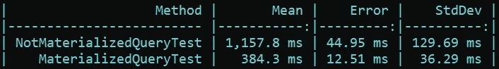
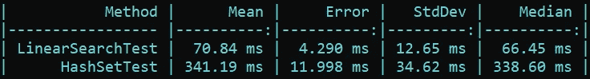
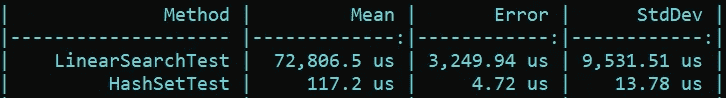
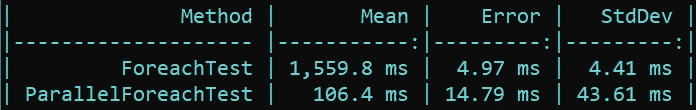
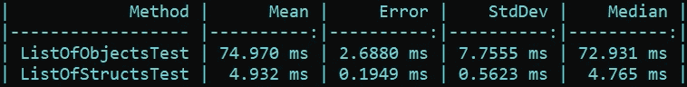
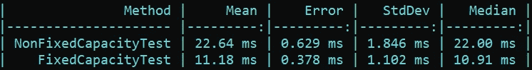

# 5 种免费提高 C#代码性能的方法

> 原文：<https://levelup.gitconnected.com/5-ways-to-improve-the-performance-of-c-code-for-free-c89188eba5da>

## 慢速代码是可选的。

照片由[转到](https://unsplash.com/@laurentmedia?utm_source=medium&utm_medium=referral)上[去飞溅](https://unsplash.com?utm_source=medium&utm_medium=referral)

软件开发是关于寻找折衷的:

*   CAP 定理——开发人员只需要从软件系统的 3 个保证中选择 2 个。
*   关系数据库模式的规范化与非规范化——开发人员在数据更新的便利性和数据检索时间之间找到了平衡。
*   开发速度与高质量编码——开发人员努力追求高质量，这是一项耗时的工作，而业务需要尽快准备好特性。

高性能的 C#代码也不是免费的。开发人员可以牺牲代码的可维护性或安全性来使代码运行得更快。但是这只适用于应用了所有性能模式和最佳实践，但是性能需要进一步提高的场景。

有许多方法可以帮助开发人员在不牺牲任何东西的情况下显著提高应用程序的性能。

🔔 [**现在就订阅**](https://esashamathews.medium.com/subscribe) **，所以大家不要错过我接下来的文章。**

# 具体化 LINQ 查询一次

当使用`IEnumerable`或`IQueryable`接口编写 LINQ 查询时，开发人员可以立即物化(调用`ToList`、`ToArray`或类似方法)或不物化查询。

物化的缺乏允许开发人员懒散地使用集合。但是有时有必要对同一个集合进行多次迭代。如果查询不是通过调用`ToList`方法实现的，那么多次迭代集合将会影响应用程序的性能。

在这个例子中，`Where`查询没有被具体化。调用`Where`方法只是返回一个实现`IEnumerable`接口的对象。只有在`foreach`循环中迭代集合时，才会调用`GetEnumerator`和`MoveNext`方法。

下面是一个定义了物化查询的例子:

以下是性能结果:

正如所料，第二个测试只通过调用`ToList`方法实现了一次查询，运行时间比第一个测试少三倍。

# 避免隐式线性搜索

线性搜索是最简单的搜索算法之一，它逐个遍历集合中的所有元素，直到找到指定的元素。

虽然开发人员通常不会显式实现线性搜索，但它仍然经常导致性能下降。

在本例中，`Any`方法使用线性搜索算法来检查指定的用户 ID 是否在集合中。

开发人员不一定需要知道他们使用的每一个的实现。重要的是要知道基本的:在。NET，`List<T>`集合基于数组。而在一个未排序的数组中求一个值的时候，它的复杂度是 O(n)。不管用哪种 LINQ 方法来寻找数组`Any, Contains or Where,`中的值，复杂度都是一样的。

解决我们特殊问题的方法是使用一种适合特定任务的数据结构。

 [## 了解你的复杂性！

### 你好。这个网页涵盖了计算机科学中常用算法的空间和时间复杂性。当…

www.bigocheatsheet.com](https://www.bigocheatsheet.com/) 

在我们的例子中，我们有总是唯一的用户标识符。它允许我们将集合转换为`HashSet<T>.`

发生了什么事？`HashSetTest`比`LinearSearchTest.`慢 5 倍，这是因为我们也在测量构建`HashSet<T>`系列的时间，对于大型布景来说，这是一项耗时的操作。

只有当开发人员计划频繁调用`Contains`方法时，他们才会从转换到`HashSet`中受益。

如果我们将集合创建从性能测试中移出，并且只测量找到元素的时间，那么结果会有很大的不同。

与在`List<T>`集合中查找值相比，在`HashSet<T>`中查找值几乎不花时间。

# 循环的并行化

通常有必要使用一个`foreach`循环遍历一个集合，并为每个条目做一些逻辑处理。

在这个例子中，迭代是在同一个线程中一个接一个地执行的，所以总的执行时间将随着集合大小线性增长。

通过开始使用框架提供给开发人员的`foreach`循环的并行版本，可以提高性能。

`Parallel.Foreach`可以像常规的`foreach`循环一样用在任何实现了`IEnumerable<T>`接口的集合上。一个`Parallel.Foreach`的实现将代替开发者做很多工作:将集合分割成块，在单独的线程中调度和执行块。

下面是并行版本的`foreach`循环与普通版本的性能比较:

如果集合很小，并且单次迭代的执行时间很快，将`foreach`切换到`Parallel.Foreach`甚至可能会使性能更差，尤其是当开发人员由于访问共享资源而使用线程同步时。

由`Parallel`类提供的功能对于**长期运行的迭代来说是一个极好的选择，这些迭代相互独立**并且不需要使用同步原语，比如并发集合。

# 结构，而不是类

开发人员可能经常需要分配一个数组或`List<T>`来在内存中存储数万个对象。这项任务可以使用类或结构来解决。

正如我们所见，`ListOfObjectTest`和`ListOfStructsTest`之间的唯一区别是第一个测试创建类的实例，而第二个测试创建结构的实例。`PointClass`的代码与`PointStruct.`的代码相同

使用结构的代码比使用类的代码运行速度快 15 倍。有这么大的时间差，因为在类的情况下，CLR 必须分配一百万个对象给托管堆，并将它们的引用存储回`List<T>`集合。在结构的情况下，将有**分配到托管堆**中的唯一对象，该托管堆是`List<T>`集合的实例。一百万个结构将被嵌入到这个集合实例中。更多信息请点击此处:

 [## 为什么 C#中 List <struct>的分配速度比 List <class>快 15 倍</class></struct>

### 在上一篇文章《免费提高 C#代码性能的 5 种方法》中，在其中一个例子中，我测量了…

levelup.gitconnected.com](/why-is-list-struct-is-15-times-faster-to-allocate-than-list-class-17f5f79889ae) 

# 指定集合的容量

下面我们来看看两种几乎相同的方法:

这两种方法完成相同的任务——使用`foreach`循环用整数填充集合。唯一的区别是在`FixedCapacityTest`方法中，构造函数被初始化为某个数字。这个简单的技巧使得`FixedCapacityTest`的运行速度是`NonFixedCapacityTest`的两倍

性能提高了一倍，因为`List<T>`的实现方式是将元素存储在一个数组中，这是一种固定大小的数据结构。当开发人员实例化`List<T>`而没有指定其容量时，会分配一个默认的容量数组。当数组已满时，会分配一个新的更大的数组，并将旧数组中的值复制到新数组中。

提前指定容量消除了旧阵列的分配、复制和垃圾收集的开销。指定集合的容量应该是开发人员的默认选择，如果他们预先知道有多少项将被添加到集合中。

容量设置不仅适用于列表集合，也适用于其他集合，如`Dictionary<TKey, TValue>, HashSet<T>`等。

# 最后的想法

在应用任何建议之前，比如从类切换到结构或者从`foreach`切换到`Parallel.ForEach,`之前，运行 profiler 以确保问题确实存在。

始终仔细分析您的具体情况，并做出对您最有利的最合适的选择。

可以考虑订阅我的电报频道 [**软件开发日报**](https://t.me/sd_daily) 从我这里获取更多内容。

## 我的其他文章:

 [## NetArchTest —在您的应用程序中实施架构和设计规则

### 通过编写单元测试。

levelup.gitconnected.com](/netarchtest-enforce-architecture-and-design-rules-in-your-application-e6c6c9f5c97e)  [## 如何专业地对 Bug 修复进行代码审查

### 审查 bug 修复时要问的几个重要问题。

levelup.gitconnected.com](/how-to-professionally-to-do-a-code-review-of-a-bug-fix-f17de72d42e0)  [## 在 C#中实现单例设计反模式的 5 种方法

### 各有利弊

levelup.gitconnected.com](/5-ways-to-implement-the-singleton-design-anti-pattern-in-c-68bb664c31f2) 

# 分级编码

感谢您成为我们社区的一员！[订阅我们的 YouTube 频道](https://www.youtube.com/channel/UC3v9kBR_ab4UHXXdknz8Fbg?sub_confirmation=1)或者加入 [**Skilled.dev 编码面试课程**](https://skilled.dev/) 。