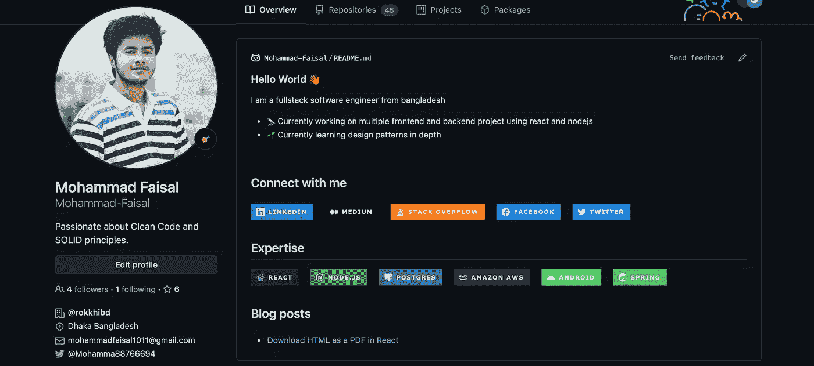

# 作为软件工程师，我希望早点做的 5 件事

> 原文：<https://levelup.gitconnected.com/5-ways-to-improve-visibility-as-software-engineer-c54cc2d8221f>

韦斯利·廷吉在 [Unsplash](https://unsplash.com/s/photos/visibility?utm_source=unsplash&utm_medium=referral&utm_content=creditCopyText) 上拍摄的照片

我们从事编程不是因为我们喜欢人:p .我们很多人(包括我)都非常内向害羞。我们经常把大部分时间花在显示器前**甚至忽略了外界的存在！**

但是你猜怎么着！没有人会在乎你有多好，直到他们知道。他们怎么会知道呢？**你得自我推销自己。**不过不用担心。

> 不做混蛋也有很多自我提升的方法！

今天，我将分享作为一名软件工程师提高知名度的 5 种方法。**这些是我个人已经开始做的事情，而且很有效！**

# 1.商务化人际关系网

LinkedIn 对你来说是一个很好的起点。我已经忽略了这个很棒的平台很长一段时间了，现在我后悔了。

鸣谢:谷歌搜索

## #设计您的个人资料

LinkedIn 是一个寻找新机会的地方。这可能是一份工作或一个伟大的新政。但是要做到这一点，你必须增加你对他人的价值。所以花些时间来设计你的个人资料。包括你所有的工作经历，并用现实生活中的例子来展示你的技能。

## #与人交流

试着和尽可能多的人联系。我在脸书有将近 6000 名粉丝。**一开始我想为什么要给不认识的人发连接请求？但是这正是 LinkedIn 的重点。**

> 你永远不知道下一个机会来自哪里

## #好处

1.  招聘人员总是在寻找有技能的人。如果你能优雅地展示你的技能，它们会影响到你。你可能再也不需要找工作了！
2.  你可以使用 LinkedIn 测试来测试你的技能，它可以帮助你进一步展示你的技能！
3.  LinkedIn Jobs 是一个寻找下一份工作的好地方。

# 2.StackOverflow

我们都使用堆栈溢出来解决日常问题。很长一段时间，我一直以为回答这些问题的人一定超级聪明！但事实证明，你有限的知识可能会对其他人有所帮助！

图片来源:谷歌搜索

所以不要回避回答 StackOverflow 上的问题。它也有一些令人敬畏的好处

1.  你会看到**不同的编码实践**
2.  做你已经做过的事情，你会得到新的想法
3.  你有机会深入了解其他人的思维过程，这将提高你的调试技能
4.  **潜在的招聘人员可能会发现，你能够回答与你领域相关的问题，这很令人着迷。**
5.  这是一个帮助他人和**展示自己技能**的绝佳机会！

# 博客

无论你是新手还是经验丰富的程序员，写博客都非常有帮助。

> 写作是暴露你的思维过程有多草率的自然方式——金顿

每当你学习新东西并试图向他人解释时，你就能找到你知识中的缺口。所以试着记录下你学到的一切。它还有一些其他的好处！

1.  你可以从像 **Medium 这样的博客平台上**赚钱**。**
2.  你的博客可以作为你的个人文档。
3.  你让别人来评判你的工作，这很棒！
4.  别人可以从你的写作中了解你的技巧。

# 开源代码库

Github 是一个很好的地方，你的个人资料可以为你服务。花点时间装饰一下。这是我的

让它与众不同。展示你的技能和联系方式。在你下一次求职面试中，肯定会有人访问你的 GitHub 档案至少一次。**让它有价值！**

# 油管（国外视频网站）

这是我没有广泛做过的地方。但是在一个视频中解释一些复杂的主题更能提高我对主题的理解！

此外，还有其他好处。如果你很优秀，你可以在这里赚很多钱！

我个人认识一些人，他们被邀请去大公司工作仅仅是因为他们的 youtube 频道。这展示了你的沟通技巧，这在这个远程工作的世界里是至关重要的！

分享你的作品可能会带来许多新的机会！我自己只在过去的 6 个月里经历过。但是那是以后的事了。

如果你能走到这一步，恭喜你！

**通过**[**LinkedIn**](https://www.linkedin.com/in/56faisal/)**或我的** [**个人网站**](https://www.mohammadfaisal.dev/) **与我取得联系。**

祝您愉快！:D