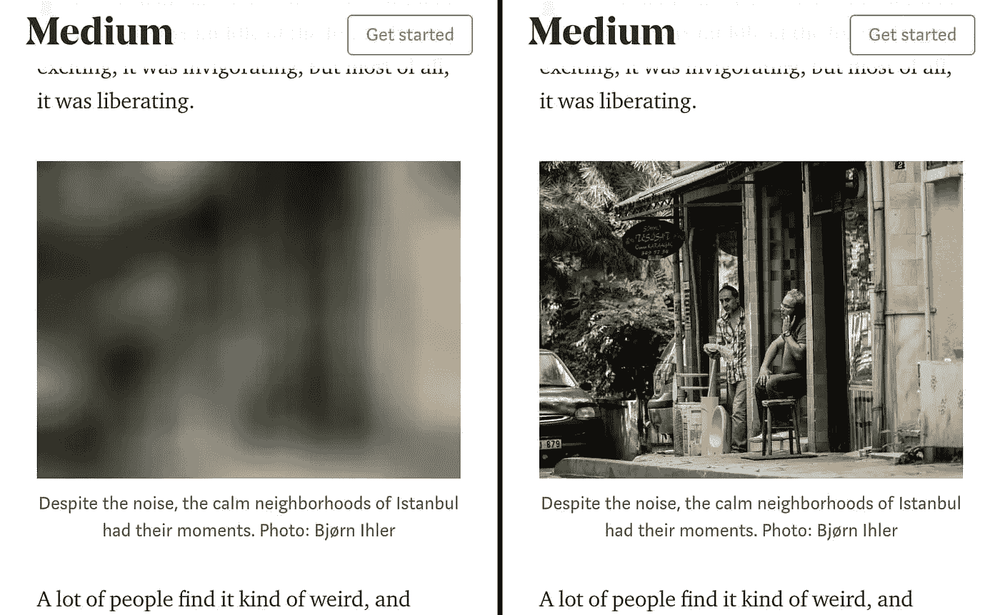

# 提高网站性能的 5 种方法

> 原文：<https://levelup.gitconnected.com/5-ways-to-improve-your-sites-performance-2b8f0fa2e70b>

## 拥有一个有效的网站需要的不仅仅是一堆社交媒体按钮。

Kolleen Gladden 在 [Unsplash](https://unsplash.com?utm_source=medium&utm_medium=referral) 上拍摄的照片

# 介绍

如果加载超过 4 秒，超过 40%的人会离开你的网站[。是啊，你网站的表现真的是 ***那个*** 重要。你网站的表现是你整体在线形象的重要组成部分。下载速度慢的网站会自动产生糟糕的用户体验，这只会对你网站的成功产生负面影响，减少你建立忠实粉丝群的机会。另外，你也会在搜索引擎中排名靠后。](https://neilpatel.com/blog/loading-time/)

幸运的是，优化你的网站的速度和性能并不困难。在这篇文章中，我列出了 5 种提高网站性能的方法。所以让我们开始吧！

# 优化:

1.  压缩您的图像
2.  使用正确的图像尺寸
3.  尽可能使用矢量
4.  惰性装载
5.  设置正确的缓存时间

# 1.压缩图像

不管你有什么样的网站，你的**图片可能会占据大部分资源**。出于这个原因，他们真的可以降低你的加载速度。幸运的是，有几个工具可以优化你的图像，使它们更小，而不会损失太多的质量。

其中一个工具是 https://squoosh.app/。这个网站是我的一个朋友推荐给我的，成为我压缩图片的 to-go 网站。

> 一个小提示:除了压缩你当前的图像格式，你还可以看看更新的格式，比如 WebP 和 JPEG XR。与旧的 JPEG 和 PNG 格式相比，这些格式具有更好的压缩和质量特性。以这些格式而不是 JPEG 或 PNG 编码图像意味着它们将加载更快，消耗更少的蜂窝数据。

# 2.使用正确的图像尺寸

降低图像加载时间的另一个非常重要的部分是以正确的大小或尺寸提供图像。对于这一部分，我们将需要调整我们的图像到所需的尺寸。假设我们想要显示一个图像滑块，它使用 700 像素乘 500 像素的图像，那么这个比例就是你向你的用户完美展示它们所需要的。不需要上传尺寸为 7000px 乘 5000px 的图片。

https://squoosh.app/网站也可以用来同时调整你的图片大小😉。

# 3.尽可能使用矢量

向量很棒，用途也很广。

**矢量图像**是从一点到另一点形成线条和形状的数学计算。如果你放大一个**矢量**图形，它看起来总是一样的。

使用矢量而不是图像的最大好处是矢量通常要小得多，想想 1 或 2 千字节而不是 1 或 2 兆字节。但是有时候，当你想要非常高细节的图形时，最好还是使用图像，因为这些图像可能不会以矢量的形式存在。

创建网站时，并不总是需要使用大尺寸的图片。有时，用向量来解释你的故事效果一样好，有时甚至更好。在我之前的一个故事中，我写下了 2021 年 7 大免费矢量资源的列表。

 [## 2021 年 7 大免费矢量资源

### 为你的项目找到完美的矢量艺术是一个挑战。这里是 2021 年前 7 大免费矢量资源。

levelup.gitconnected.com](/top-7-free-vector-resources-of-2021-3747785706b0) 

# 4.惰性装载

惰性加载是指**延迟资源的加载或初始化，直到真正需要它们的时候**来提高性能和节省系统资源。例如，如果一个网页有一个图像，用户必须向下滚动才能看到，那么您可以显示一个占位符，并且仅当用户到达该位置时才延迟加载完整的图像。

在中型平台上滚动时，您可能已经见过它。

有多种技术可以用来延迟加载图像。要了解更多信息，我非常推荐这篇关于 web.dev 的深入文章。

在接下来的故事中，我将解释如何在 MVC 应用程序中轻松地延迟加载图像。

 [## 延迟加载图像

### 这篇文章解释了延迟加载和延迟加载图像时可用的选项。

网络开发](https://web.dev/lazy-loading-images/) 

# 5.设置正确的缓存时间

根据 HTTP Archive 的数据，在排名前 30 万的网站中，用户的浏览器可以缓存[所有下载内容](http://httparchive.org/trends.php#maxage0)的近一半。它减少了用户查看图像或 Javascript 或 CSS 文件的时间。这是因为用户现在从他的系统访问文件，而不是通过网络下载。

术语生存时间(TTL)用于定义资源在下载后保持有效的时间。这个 TTL 被放置在**缓存控制**报头中。在大多数情况下，您希望将 index.html 的 Cache-Control 设置为`no-cache, must-revalidate`，这将导致总是从服务器获取 index.html，并检查新的 JavaScript 和图像资源。但是同名的图像不会经常改变(在你自己改变图像的时候要记住这一点)，所以你可以很容易地将它改变为 2 个月的缓存控制( **5，259，492 秒**)。

 [## 什么是生存时间(TTL) | TTL 最佳实践| CDN 指南| Imperva

### 生存时间(TTL)可以减少页面加载时间，并确保访问者只看到新鲜的网站内容。了解 TTL 最好…

www.imperva.com](https://www.imperva.com/learn/performance/time-to-live-ttl/) 

# 结论

你的网站可以也应该是你最大的营销和销售工具。通过遵循一些基本原则，你可以大大提高你的网站的性能。

快乐编码😊

[https://ko-fi.com/koenvanzeijl](https://ko-fi.com/koenvanzeijl)