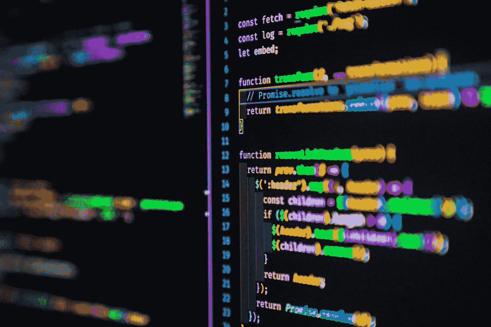

# 作为开发人员，保持代码整洁高效的 5 种方法

> 原文：<https://levelup.gitconnected.com/5-ways-to-keep-your-code-clean-and-efficient-as-a-developer-442de06ed6d2>

作为一名开发人员，保持代码整洁有序非常重要。这将有助于使您的代码更有效，更容易阅读和理解。在这篇博文中，我们将讨论保持代码整洁有序的五种方法。我们还将提供一些如何在编码时保持高效的技巧！

琼·加梅尔在 [Unsplash](https://unsplash.com/s/photos/coding?utm_source=unsplash&utm_medium=referral&utm_content=creditCopyText) 上的照片

# 评论

保持代码整洁的一个方法是使用注释。注释是一种很好的方式，可以增加代码的清晰度，并确保您和其他人能够理解您的代码在做什么。添加注释时，一定要以清晰简洁的方式添加。

# 刻痕

保持代码整洁的另一种方法是使用适当的缩进。缩进有助于提高代码的可读性和易懂性。确保在整个代码中使用一致的缩进。

# 命名规格

保持代码整洁的另一种方法是使用适当的命名约定。命名类、变量和方法时，一定要使用清晰的描述性名称。这将有助于使您的代码更具可读性，更容易理解。如果你有一个名为“fb”的类，几个月后你在复查你的代码，你会很难弄清楚“fb”是干什么的。尤其是如果你有 20，000 行代码。更好的解决方案是“页脚-底部”。

# 语言一致性

使用适当的编码约定对于保持代码整洁也很重要。编码时，请确保遵循您正在使用的编程语言所规定的约定。这将有助于使您的代码更加一致和易读。

# 分组

最后，保持你的代码组织良好是很重要的。组织代码时，一定要将相似的类和方法组合在一起。这将有助于提高代码的可读性和导航性。

通过遵循这些提示，您可以帮助保持代码的整洁、有序和高效。所以花些时间检查你的代码，确保它符合标准！你会很高兴你做到了！

你还有什么保持代码整洁高效的技巧？在下面的评论中与我分享吧！

编码快乐！:]

# 分级编码

感谢您成为我们社区的一员！升级正在改变技术招聘。 [**在最好的公司**找到你的完美工作](https://jobs.levelup.dev/talent) **。**

 [## 提升——改变招聘流程

### 🔥让软件工程师找到他们热爱的完美角色🧠寻找人才是最痛苦的部分…

作业. levelup.dev](https://jobs.levelup.dev/talent)