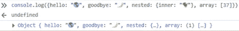
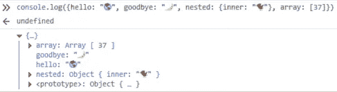
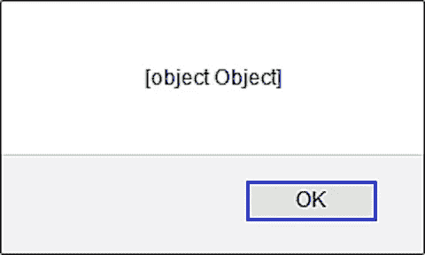

# 用 JavaScript 将对象记录到控制台的 5 种方法

> 原文：<https://levelup.gitconnected.com/5-ways-to-log-an-object-to-the-console-in-javascript-7b995c56af5a>

## 像所有 JavaScript 开发人员一样，我喜欢在编码时使用控制台来检查变量。这里有 5 种方法可以将对象的键和属性输出到控制台窗口。

迈克·迈耶斯在 [Unsplash](https://unsplash.com?utm_source=medium&utm_medium=referral) 上拍摄的照片

如果你像我一样，你会遇到试图将 JavaScript 对象或数组直接记录到控制台的问题——但是最好的方法是什么呢？

有人认为我们应该只使用`[debugger](https://developer.mozilla.org/en-US/docs/Web/JavaScript/Reference/Statements/debugger)` [语句](https://developer.mozilla.org/en-US/docs/Web/JavaScript/Reference/Statements/debugger)并在开发工具的调试器窗口中检查变量和对象。

但就我个人而言，当找出一种算法或尝试一种新的代码语法时，我喜欢在控制台中快速原型化。(告我！🙂)

下面是将 JavaScript 对象直接记录到控制台窗口的 5 种方法。

尼基塔·科斯特里金在 [Unsplash](https://unsplash.com?utm_source=medium&utm_medium=referral) 上拍摄的照片

# 方法 1 —使用`console.log(object)`

在浏览器中开发时，用一个或多个对象作为参数调用的`[console.log()](https://developer.mozilla.org/en-US/docs/Web/API/Console/log)`方法将显示一个或多个对象。

> `[Console](https://developer.mozilla.org/en-US/docs/Web/API/Console)`方法`**log()**`向 web 控制台输出一条消息。该消息可以是单个字符串(具有可选的替换值)，也可以是任何一个或多个 JavaScript 对象。— [MDN 文档](https://developer.mozilla.org/en-US/docs/Web/API/Console/log)

使用`console.log(object)`检查代码片段:

下面是这段代码的截图:

`console.log(object)`的结果

单击左侧的箭头可以进一步检查该对象的属性:

`console.log(object)`的展开结果

当然，并不是所有的 JavaScript 都是在浏览器中开发或者可以在浏览器中调试的——所以开发者可能会使用`alert()`而不是`console.log()`。

而`alert(object)`的工作方式完全不同——它显示的是一个警告，上面写着`[object Object]`:

`alert(object)`的结果

下一个讨论的方法对`console.log()`和`alert()`都有效。

你好，我是尼克🍌 on [Unsplash](https://unsplash.com?utm_source=medium&utm_medium=referral)

# 方法 2 —使用`console.log(JSON.stringify(object))`

网上讨论的一种将对象转换成 JavaScript 字符串以便检查它们的流行方法是`JSON.stringify()`方法。

> `**JSON.stringify()**`方法将 JavaScript 对象或值转换为 JSON 字符串，如果指定了 replacer 函数，则可选地替换值；如果指定了 replacer 数组，则可选地仅包括指定的属性— [MDN 文档](https://developer.mozilla.org/en-US/docs/Web/JavaScript/Reference/Global_Objects/JSON/stringify)

如果你需要用`alert()`代替`console.log()`，这非常有用。

一些有用的[提示和技巧](https://medium.com/javascript-in-plain-english/5-secret-features-of-json-stringify-c699340f9f27)是使用`,null,2`作为良好格式缩进的附加参数:`console.log(JSON.stringify(obj,null,2))`。

并且，您可以使用第二个参数`stringify`来只打印匹配这些键的属性:`console.log(JSON.stringify(obj,["key"]))`。

请注意，如果对象的`[.toJSON()](https://developer.mozilla.org/en-US/docs/Web/JavaScript/Reference/Global_Objects/Date/toJSON)` [方法](https://developer.mozilla.org/en-US/docs/Web/JavaScript/Reference/Global_Objects/Date/toJSON)存在，它将被调用。

下面是一些使用`console.log(JSON.stringify(object))`的代码示例:

这些代码示例的屏幕截图如下:

`console.log(JSON.stringify(object))`的结果

## `JSON.stringify`很棒，但不完美

小心点！`JSON.stringify(object)`只处理 JSON 兼容的数据，这意味着某些值类型可能会丢失。

具体来说，`stringify`只适用于一些原语:布尔、[数字](https://medium.com/javascript-in-plain-english/how-to-check-for-a-number-in-javascript-8d9024708153)、[字符串](https://medium.com/javascript-in-plain-english/how-to-check-for-a-string-in-javascript-a16b196915ff)和`[null](https://medium.com/javascript-in-plain-english/how-to-check-for-null-in-javascript-dffab64d8ed5)` ——但不适用于`undefined`、函数、 `[ES6 的特性](https://medium.com/coding-in-simple-english/how-to-check-for-nan-in-javascript-4294e555b447#feat=object-entries):`

`下面是最终的屏幕截图——它的工作原理与`for..in`相同:`

``

``console.log()`的结果在`for...in loop`里面`

`同样，你会想要显式地使用`[var](https://medium.com/javascript-in-plain-english/how-to-use-let-var-and-const-in-javascript-cdf42b48d70)`[关键字](https://medium.com/javascript-in-plain-english/how-to-use-let-var-and-const-in-javascript-cdf42b48d70)——或者`[let](https://medium.com/javascript-in-plain-english/how-to-use-let-var-and-const-in-javascript-cdf42b48d70)` [或者](https://medium.com/javascript-in-plain-english/how-to-use-let-var-and-const-in-javascript-cdf42b48d70)`[const](https://medium.com/javascript-in-plain-english/how-to-use-let-var-and-const-in-javascript-cdf42b48d70)` ——因为否则`var`将会被[隐式地声明在全局作用域](https://developer.mozilla.org/en-US/docs/Web/JavaScript/Reference/Statements/var#Description)中。`

`另一件要注意的事情是，`for...in`循环将遍历继承的属性(参见[MDN 文档的这一部分](https://developer.mozilla.org/en-US/docs/Web/JavaScript/Reference/Global_Objects/Object/hasOwnProperty#Iterating_over_the_properties_of_an_object)),除非您检查每个属性的`[Object.prototype.hasOwnProperty()](https://developer.mozilla.org/en-US/docs/Web/JavaScript/Reference/Global_Objects/Object/hasOwnProperty)`方法。`

`方法`[Object.entries()](https://developer.mozilla.org/en-US/docs/Web/JavaScript/Reference/Global_Objects/Object/entries)`、`[Object.keys()](https://developer.mozilla.org/en-US/docs/Web/JavaScript/Reference/Global_Objects/Object/keys)`、`[Object.values()](https://developer.mozilla.org/en-US/docs/Web/JavaScript/Reference/Global_objects/Object/values)`和`[Object.getOwnProperties()](https://developer.mozilla.org/en-US/docs/Web/JavaScript/Reference/Global_Objects/Object/getOwnPropertyNames)`不会遍历继承的属性。`

`当然，需要支持 Internet Explorer 的开发人员可以使用 Babel 作为 polyfill，而不是记忆旧的代码模式。😁`

``

`[Elias Castillo](https://unsplash.com/@eli_j?utm_source=medium&utm_medium=referral) 在 [Unsplash](https://unsplash.com?utm_source=medium&utm_medium=referral) 上拍摄的照片`

# `结论`

`每个 JavaScript 程序员都可能在某个时候使用`console.log()`向浏览器的 JavaScript 控制台输出一个对象。`

`然而，有许多其他方法可以达到同样的结果——包括`console.dir()`和我个人最喜欢的`console.table()`。`

`只要对象中的数据是 JSON 安全的，那么`console.log(JSON.stringify(obj))`方法对于将对象作为字符串记录到控制台非常有用。`

`对于复杂的对象，`Object.entries(obj)`方法是一种遍历对象的方法，可用于将对象记录到控制台。`

`当在浏览器之外开发时，您可能更喜欢使用`alert()`——在这种情况下，使用`alert()`的`alert(JSON.stringify(obj))`和`Object.entries`将是记录警报内对象内容的最佳选择。`

`无论您使用哪种方法，掌握 JavaScript 控制台都是一项有用的技能，可以加快您的开发过程。编码快乐！💻🏆🙌`

``

`尼基塔·科斯特里金在 [Unsplash](https://unsplash.com?utm_source=medium&utm_medium=referral) 上拍摄的照片`

# `进一步阅读`

*   `[Flavio Copes](https://medium.com/u/fe1c14f6cde?source=post_page-----7b995c56af5a--------------------------------) 在他的博客上回顾了几种检查物体的方法[:](https://flaviocopes.com/how-to-inspect-javascript-object/)`

` [## 如何检查一个 JavaScript 对象

### JavaScript 提供了许多检查变量内容的方法。特别是，让我们看看如何打印…

flaviocopes.com](https://flaviocopes.com/how-to-inspect-javascript-object/) 

*   [John Au-Yeung](https://medium.com/u/5253c50d76c1?source=post_page-----7b995c56af5a--------------------------------) 在《升级编码中讨论控制台调试[:](/debugging-javascript-apps-with-the-console-object-4c7ebe6810dc?source=friends_link&sk=b84762dcf782db34a77aacc51da74e5a)

 [## 使用控制台对象调试 JavaScript 应用程序

### 当我们编写 JavaScript 应用程序时，一个常见的情况是我们得到错误或者应用程序正在做我们不期望的事情…

levelup.gitconnected.com](/debugging-javascript-apps-with-the-console-object-4c7ebe6810dc) 

*   [Alligator.io](https://alligator.io/) 在他们关于主题的文章[中介绍了控制台提示和技巧:](https://alligator.io/js/console/)

 [## 看看 JavaScript 控制台 API

### 学习一些技巧和窍门，使用控制台上一些强大的方法调试 JavaScript 代码。

鳄鱼. io](https://alligator.io/js/console/) 

*   [Darryl Pargeter](https://medium.com/u/17936c7b51c4?source=post_page-----7b995c56af5a--------------------------------) 在 freeCodeCamp.org 深入讲解控制台[:](https://www.freecodecamp.org/news/how-to-get-the-most-out-of-the-javascript-console-b57ca9db3e6d/)

 [## 如何充分利用 JavaScript 控制台

### Darryl Pargeter 如何充分利用 JavaScript 控制台——最基本的调试工具之一

www.freecodecamp.org](https://www.freecodecamp.org/news/how-to-get-the-most-out-of-the-javascript-console-b57ca9db3e6d/) 

*   [Zell Liew](https://medium.com/u/7ec6bd4cf41f?source=post_page-----7b995c56af5a--------------------------------) 在他的博客上提供了多种循环 JS 对象的方法[:](https://zellwk.com/blog/looping-through-js-objects/)

 [## 在 JavaScript | Zell Liew 中遍历对象

### 有时，您可能需要在 JavaScript 中遍历对象。在 ES6 之前这样做的唯一方法是使用…

zellwk.com](https://zellwk.com/blog/looping-through-js-objects/) 

照片由 [Korie Cull](https://unsplash.com/@korie?utm_source=medium&utm_medium=referral) 在 [Unsplash](https://unsplash.com?utm_source=medium&utm_medium=referral) 上拍摄

德里克·奥斯丁博士是《职业规划:如何在 6 个月内成为一名成功的 6 位数程序员 一书的作者，该书现已在亚马逊上架。`