# 在 Microsoft Azure Cloud 上管理存储帐户的 5 种方法

> 原文：<https://levelup.gitconnected.com/5-ways-to-manage-your-storage-account-on-microsoft-azure-cloud-d5d957e5798a>


M 微软 Azure 云平台为开发者提供了多种方式来管理 Azure 上的存储账户。您可以使用名为 **Storage Explorer** 的用户友好 GUI 工具来管理您的存储帐户，您可以通过 **Azure CLI** 或 **PowerShell** 编写脚本来管理它，您可以编写代码来操作它，您可以使用名为 **AzCopy** 的命令行实用程序来将 blobs 或文件复制到存储帐户或从存储帐户复制。我将展示这些不同的方法来管理你的 Azure 存储帐户。

# 使用 Azure 存储资源管理器工具排名第一

第一种也是我认为最简单和最直观的方法是使用 **Azure Storage Explorer** 工具。您可以在您的存储帐户面板上直接访问该工具。

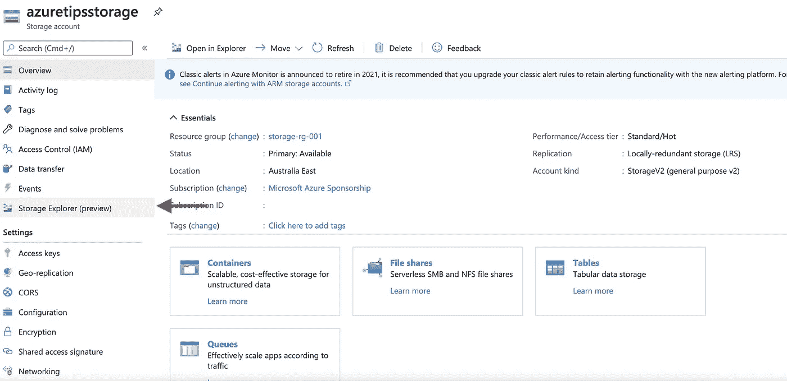

然后，您可以轻松地创建一个新容器。

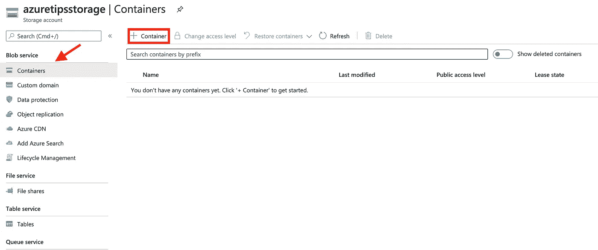

并将文件轻松上传到容器。

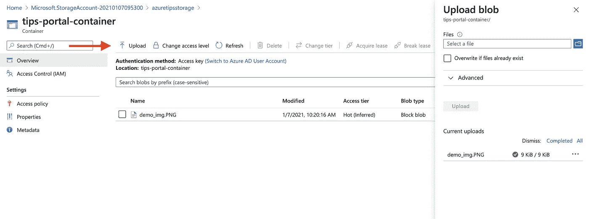

除了与 Azure portal 集成的工具，您还可以从 Azure 网站下载独立的 Azure Storage Explorer 应用程序。

[](https://azure.microsoft.com/en-us/features/storage-explorer/) [## Azure Storage Explorer -云存储管理| Microsoft Azure

### 优化您的 Azure 存储管理上传、下载和管理 Azure blobs、文件、队列和表格，以及…

azure.microsoft.com](https://azure.microsoft.com/en-us/features/storage-explorer/) 

正如你在下面的截图中看到的，独立的 Azure Storage Explorer 应用程序支持不同的操作系统，如 Windows、macOS 和 Linux。

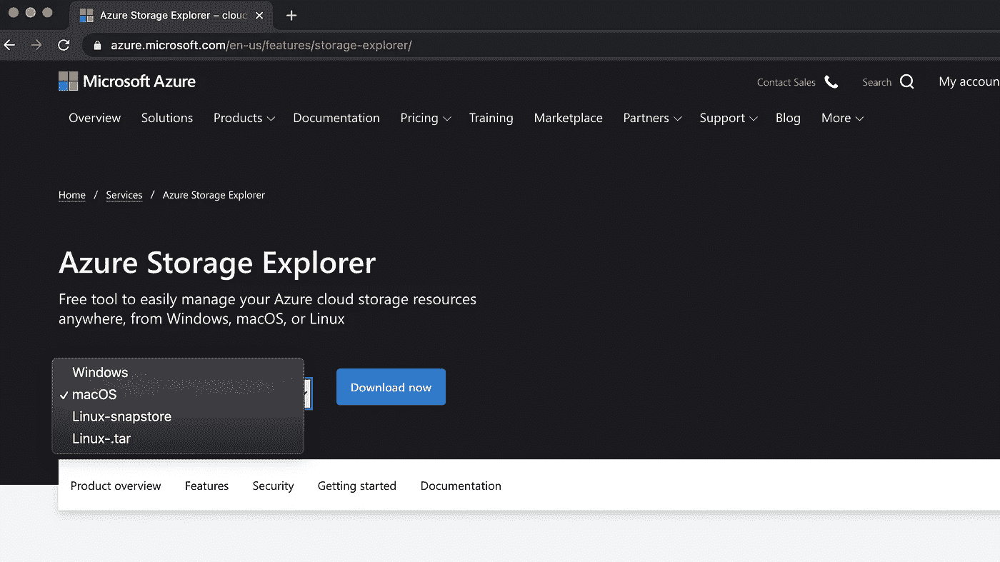

我用的是 macOS，所以下载了 macOS 版本，打开工具在 Azure cloud 上操作我的存储账号。

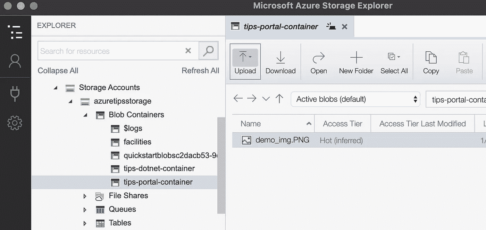

# # 2 使用 Azure CLI

第二种方式是使用 Azure CLI 工具。Azure CLI 工具可安装在 Windows、macOS 和 Linux 环境中。因为我用的是 macOS，所以我用自制软件安装了这个工具。

```
brew update && brew install azure-cli
```

如果你想知道更多关于如何安装这个工具，你可以看看这个。

[](https://docs.microsoft.com/en-us/cli/azure/install-azure-cli?WT.mc_id=DT-MVP-5001664) [## 安装 Azure CLI

### Azure CLI 可安装在 Windows、macOS 和 Linux 环境中。它也可以在 Docker 中运行…

docs.microsoft.com](https://docs.microsoft.com/en-us/cli/azure/install-azure-cli?WT.mc_id=DT-MVP-5001664) 

安装 Azure CIL 工具后，你可以在你的终端中运行`az storage`命令，你可以获得这个命令的更多细节。

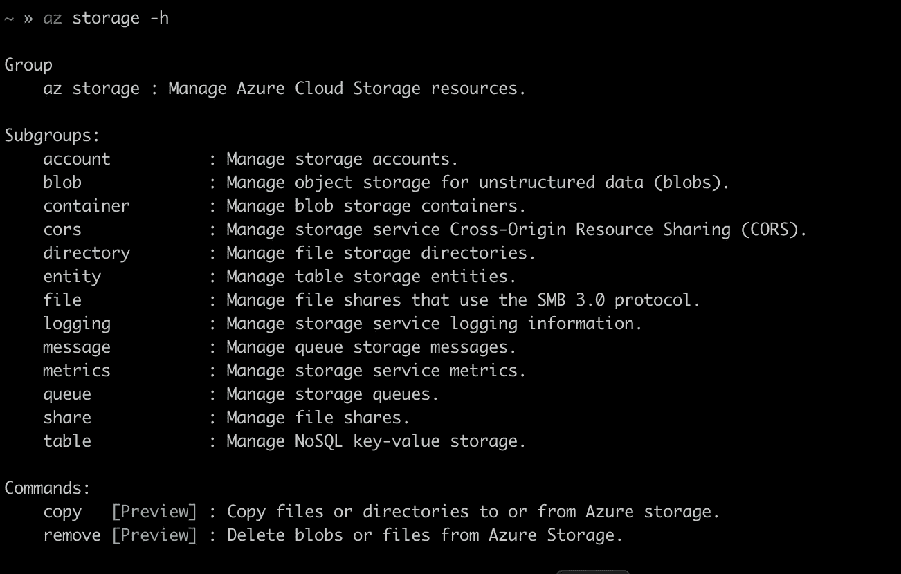

您可以管理存储帐户、存储帐户中的容器等。

例如，我们可以使用下面的命令在我们的**azuretipstorage**存储帐户中创建另一个名为 **fromazcli** 的容器。

```
az **storage container create** --account-name azuretipsstorage --name fromazcli
```

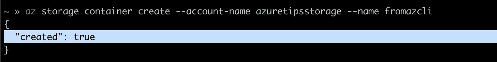

如果您想了解更多有关用于管理存储帐户的命令，可以查看一下。

 [## az 存储帐户

### 请检查存储帐户名是否有效且未被使用。az 存储帐户检查-名称-名称…

docs.microsoft.com](https://docs.microsoft.com/en-us/cli/azure/storage/account?WT.mc_id=DT-MVP-5001664&view=azure-cli-latest) 

当然，如果你更喜欢在 Azure 门户上运行这些命令，你可以打开**云外壳**，直接在 Azure 云上运行这些 Azure CLI 命令。

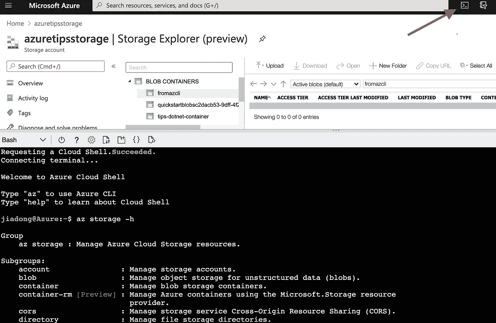

# # 3 使用 PowerShell

PowerShell 是另一个可以用来管理 Azure 上的存储帐户的工具。最初，Windows PowerShell 构建在。NET 框架，并且只能在 Windows 系统上运行。在当前版本中，PowerShell 使用。NET Core 5.0 作为运行时，运行在 Windows、macOS 和 Linux 平台上。因为同样的原因，所以我在 macOS 上通过自制安装了 PowerShell。

[](https://docs.microsoft.com/en-us/powershell/scripting/install/installing-powershell-core-on-macos?WT.mc_id=DT-MVP-5001664&view=powershell-7.1) [## 在 macOS 上安装 PowerShell-PowerShell

### PowerShell 7.0 或更高版本需要 macOS 10.13 或更高版本。所有的包都可以在我们的 GitHub 发布页面上找到。之后…

docs.microsoft.com](https://docs.microsoft.com/en-us/powershell/scripting/install/installing-powershell-core-on-macos?WT.mc_id=DT-MVP-5001664&view=powershell-7.1) 

在从 PowerShell 访问 Azure 上的存储帐户资源之前，您需要安装 **Az。存储**模块。

```
Install-Module Az.Storage
```

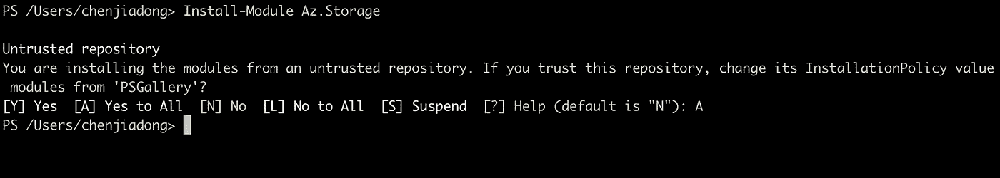

默认情况下，PowerShell gallery 没有配置为 PowerShellGet 的可信存储库，因此第一次使用 PSGallery 时，您会看到上面的提示。回答“是”或“全是”继续安装。安装完成后，您可以运行`Get-Module`来列出已安装的模块。

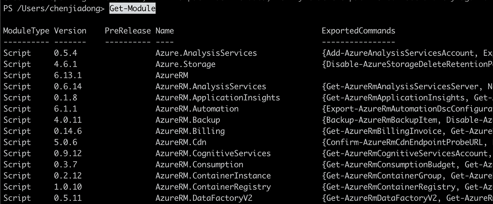

然后，您可以使用`Get-AzRmStorageContainer`来列出存储帐户中的容器。当然，你仍然可以访问 Azure 门户上的 could shell 工具来运行这些 PowerShell 命令。如果您对这些 PowerShell 命令感兴趣，您会发现下面的链接很有帮助。

[](https://docs.microsoft.com/en-us/powershell/module/az.storage/?WT.mc_id=DT-MVP-5001664&view=azps-5.5.0) [## 阿兹。存储体

### 此主题显示 Azure 存储管理 Cmdlets 的帮助主题。

docs.microsoft.com](https://docs.microsoft.com/en-us/powershell/module/az.storage/?WT.mc_id=DT-MVP-5001664&view=azps-5.5.0) 

# # 4 使用 Azure 存储客户端库

如果你更喜欢编写代码来管理你的 Azure 存储帐户，Azure 存储客户端库是你的选择。目前，有两个版本的 SDK 可用，Azure 存储客户端库 v11 是一个遗留版本，最新版本是 v12。

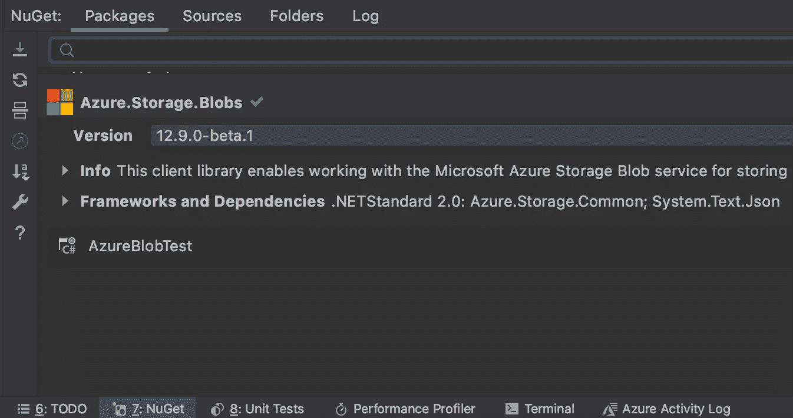

安装 SDK 相对容易，你可以在你的 IDE 中使用 NuGet 来安装它，也可以使用`dotnet add package`命令。

```
dotnet add package Azure.Storage.Blobs
```

安装 sdk 后，您可以创建容器并将文件上传到容器。正如您在下面的代码片段中看到的。

```
// Create a container.
var blobServiceClient = new BlobServiceClient(storageconnstring);

var containerClient = await blobServiceClient.CreateBlobContainerAsync(containerName);// Create a blob.
var blobClient = containerClient.GetBlobClient(filename);

using FileStream uploadFileStream = File.OpenRead(filepath);
await blobClient.UploadAsync(uploadFileStream, true);
uploadFileStream.Close();
```

# # 5 使用 **AzCopy** 工具

AzCopy 是一个命令行实用程序，可用于将 blobs 或文件复制到存储帐户或从存储帐户复制。而且这个工具支持 Windows，macOS，Linux。你可以从下面的链接下载。

[](https://docs.microsoft.com/en-us/azure/storage/common/storage-use-azcopy-v10?WT.mc_id=DT-MVP-5001664) [## 使用 AzCopy v10 将数据复制或移动到 Azure 存储

### AzCopy 是一个命令行实用程序，可用于将 blobs 或文件复制到存储帐户或从存储帐户复制。这篇文章…

docs.microsoft.com](https://docs.microsoft.com/en-us/azure/storage/common/storage-use-azcopy-v10?WT.mc_id=DT-MVP-5001664) 

下面的链接展示了如何使用 AzCopy 将文件上传到 Azure Blob 存储。

[](https://docs.microsoft.com/en-us/azure/storage/common/storage-use-azcopy-blobs-upload?WT.mc_id=DT-MVP-5001664) [## 使用 AzCopy v10 将文件上传到 Azure Blob 存储

### 您可以使用 AzCopy v10 命令行实用程序将文件和目录上传到 Blob 存储。查看…的示例

docs.microsoft.com](https://docs.microsoft.com/en-us/azure/storage/common/storage-use-azcopy-blobs-upload?WT.mc_id=DT-MVP-5001664) 

如上所述，Microsoft Azure 提供了多种方式来管理存储帐户。现在轮到你自己尝试这些方法了！

感谢您的阅读，希望对您有所帮助。

在聊天

[](https://www.linkedin.com/in/chenjd/) [## 陈家东-高级软件开发人员-X 公司| LinkedIn

### 大家好，我是陈家东陈(@chen_jd)。我是个有经验的人。NET 开发者，2015 年 10 月起成为微软 MVP。我最后一次…

www.linkedin.com](https://www.linkedin.com/in/chenjd/)