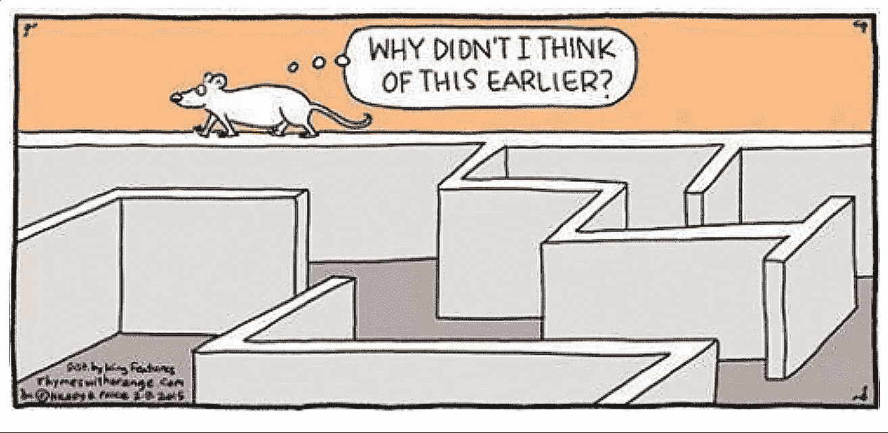

# 作为开发人员，促进“跳出框框”思维的 5 种方法

> 原文：<https://levelup.gitconnected.com/5-ways-to-promote-out-of-the-box-thinking-as-a-developer-a91ad9830b38>

## 那些不跳出框框思考的人很容易被遏制。

跳出框框思考…

保持冷静！😌

我不会问你一天遇到多少次这种被滥用的商业陈词滥调🙄，但我会为你打开一扇窗让你这么想。

[迷因](https://me.me)

创新思维意味着用一种新颖的视角和一种更具创造性的方法来解决问题。

作为一名开发人员，你知道编程不仅仅是写一堆代码。这是一项复杂的工作，需要解决问题、逻辑思维和打破常规的思维。

> 就连苹果公司的老板史蒂夫·乔布斯也说，“编程教你如何思考。”

但问题是，

作为一名问题解决者，你如何发现解决问题的独特方法？

你如何能让自己以不同于平常的方式看待事物？

在这篇文章中，我将揭示我作为一个开发者的游戏计划，它帮助我把我的想法从盒子里抽出来。

让我们粉碎它！🍾 🙌 🎉

# 1.让解决问题成为你的爱好

让我们假设你的键盘就是你的操纵杆。创建场景和解决有趣的编码问题作为一个具有挑战性的游戏。如果你没有足够的编码问题，首先创建一些来解决😉

> 我们不能用创造问题时的思维来解决问题。

除了开玩笑，不要把解决问题的能力留在办公室。让解决问题成为你的习惯会加强你的逻辑推理和技巧。

同时，这是一个有趣的练习，可以帮助你超越界限。

许多网站，如 GeeksForGeeks、LeetCode 和 HackerRank，让你敢于解决编码问题，那里有成千上万种有效的解决方案。

但是不要忘记把你的解决方案和别人的进行比较；这是你拓展视野的地方！就像在健身房做一套失败的；我的健身伙伴会知道发生了什么！💪

# 2.躺在引擎盖下👷‍♀️

www.clipartkey.com

当我们开发人员忙于创建逻辑问题的解决方案时，我们大多数人都忘记了正在发生的事情。

它创造了一个小间隙，把你限制在盒子里。通过在更深层次上理解事物来填补空白可以让你成为一个跳出框框的思考者🤓。

> "跳出框框思考能让你得到你力所不及的回报."~ Matshona Dhliwayo

从不同的角度观察事物。改变事物的方向可以从模糊的模式中显现出来。

例如，在研究 REACT 时，我深入研究了它如何在内部管理其生命周期，这后来使我能够更创新地构建我的代码，以避免不必要的呈现。

# 3.让你疯狂的想法通过头脑风暴🧠出来

让自己跳出框框思考的聪明做法总是欢迎不同的参照系。

每个人看待问题的方式不同。与你的队友讨论编码问题可以帮助你探索解决问题的更好的替代方案。

与其他开发人员一起回顾挑战可以给你新的视角来批判性地判断你的方法并开发更有效的解决方案。🤝

它可以给你的思想提供一条新的道路🚶🏿

# 4.控制你不可靠的假设🙅‍♀️

根据你的假设生活就像把你自己装进一个盒子里。

[我的屁股](https://ux.shopify.com/assumption-slam-how-not-to-make-an-a-out-of-u-and-me-2d9012c105a0)

自我封闭发展了一种狭隘的思维模式，阻止你观察超越你智力界限的事物。

**挑战他人当前做出的决定/假设——可能有充分的理由，也可能没有，或者曾经有一个不再适用的理由。**

探索约束条件，从谁受到影响的角度定义问题。经常问“为什么”,从一个新的角度接触你的产品/BAs/设计团队。

# 5)分心并不总是障碍

你工作更聪明，而不是更努力。毫无疑问，作为开发人员，我们经常过度工作，这可能会导致精疲力竭，因此，您会花费更多的时间来完成一项工作或提出一个不必要的解决方案。

稍微分散一下注意力会让你在做同样的事情时有更好的结果和更创新的想法。

*难怪我坐在马桶上比坐在办公椅上能想出更好的代码解决方案。😋*

拿一个🚶听听泰勒·斯威夫特的歌🎧，观看龙⚔️的房子，或做任何事情。但是做吧！

> "除非你做一些不同的事情，否则不可能产生卓越的业绩."——约翰·邓普顿。

# 包扎🙌🏽

[呀，真聪明](https://www.ebaumsworld.com/pictures/30-people-thinking-outside-the-box/85789527/)！

你看过 5 分钟手艺的视频吗？他们不仅思考而且生活在盒子之外；他们拥有数百万订户。

我们还没有准备好离开我们的舒适区。要跳出框框，你必须挑战自己的信念，学会以不同的方式思考。

最后，如果你厌倦了听到“跳出框框思考”😩“你必须跳出思维定势，淡化商业生活中的陈词滥调😉

**别忘了鼓掌，在 [Medium](https://medium.com/@noor882) 和 [LinkedIn](https://www.linkedin.com/in/noorahmed11/) 上关注我的**，了解我将撰写的最新文章！😊

我希望你喜欢它；看看下面我的一些热门文章。再见👋

*   [**每个开发者都应该学习的 3 种设计模式**](https://blog.bitsrc.io/3-design-patterns-every-developer-should-learn-71a51568ac9d)
*   [**幕后 JavaScript:开发者应该知道的高级概念**](https://blog.bitsrc.io/javascript-under-the-hood-advanced-concepts-developers-should-know-a89ddbb11228)
*   [**单一责任原则:编写可维护代码实用指南**](https://blog.bitsrc.io/single-responsibility-principle-practical-guide-to-writing-maintainable-code-50ec261819b7)
*   [**成功高级工程师的 6 大特征**](/6-characteristics-of-successful-senior-engineers-f84f902fa9e2)