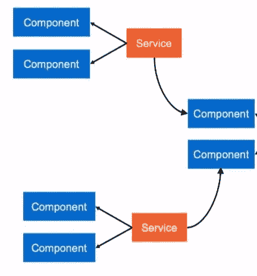

# 角度组件之间共享数据的 5 种方式

> 原文：<https://levelup.gitconnected.com/5-ways-to-share-data-between-angular-components-d656a7eb7f96>

小组件总是有利于用 Angular 管理代码。当你开始编写小组件时，你必须在组件之间共享数据。在讨论如何在组件之间共享数据之前，我们必须定义组件之间的关系。


有五种方法可以在组件之间共享数据:

*   父子组件
*   子到父组件
*   在同级组件之间共享数据
*   使用 ViewChild 属性共享数据
*   在不相关的组件之间共享数据

1.  **父到子组件:**当您在子组件中定义`@Input()`时，它将从主组件或父组件接收值。在组件之间共享数据之前，我们首先使用接口定义我们的数据模型。在这里，我们将 productID 和 productName 定义为必填字段，其余为可选字段。

现在，我们在父组件中导入产品接口。现在构建模板。这里的模板有一个产品 id 和产品名称。现在我想将产品名称共享给子组件。一旦子组件更新了产品名称，我希望数据返回到父组件。

父组件代码:

子组件代码:

现在我们在子组件中定义下面的装饰器。 ***childToMaster*** 是我们想要从父组件中共享的属性名。Input decorator 清楚地表明子组件期望从父组件获得一些值。

```
@Input(‘childToMaster’) masterName: string;
```

在父组件中，我们将设置 ***childToMaster*** 属性。

```
<app-child [childToMaster]=product.productName (childToParent)=”childToParent($event)”></app-child>
```

现在，我们将 product.productName 属性共享给子组件。一旦您开始编写 productName，它将自动共享给子组件。

2.**子到父组件:**为了从子到父共享数据，我们需要输出装饰器。在子组件中，我们必须像这样定义输出装饰器:

```
@Output() childToParent = new EventEmitter<String>();
```

现在，我们希望与父组件共享该属性。所以共享来自子组件的数据需要 ***将事件的值冒泡到父组件。我们可以基于一个触发点*** 来冒泡事件，这里我们是通过点击一个按钮来实现的。单击按钮时调用 sendToParent。

```
sendToParent(name){this.childToParent.emit(name);}
```

现在，我们必须将 childtoParent 与父组件中的子标记的属性相关联。

```
<app-child [childToMaster]=product.productName **(childToParent)=”childToParent($event)”**></app-child>
```

现在，一旦在父组件中接收到该值，您就必须设置它。

```
childToParent(name){this.product.productName=name;}
```

哇，现在我们可以看到父组件中产品名称的变化。

3.**在兄弟组件之间共享数据:**在兄弟组件之间共享数据可以通过使用点 1 和 2 来完成。首先使用 output decorator 和 EventEmitter 在 **c *子进程和*父进程**之间共享数据。一旦在 ***父组件中接收到数据，就使用输入装饰器将其共享给另一个子组件*** 。因此兄弟姐妹可以通过父组件相互交流。

4.**更强大:使用 ViewChild decorator 共享数据:** ViewChild 允许子组件 ***注入父组件。这使得 ViewChild 更加强大。*** 它允许父母控制孩子的方法和属性。但是父级可以在 view init 事件之后访问这些属性。这意味着我们必须实现 ngAfterViewInit 生命周期挂钩，以便从父组件获取属性。

```
@ViewChild(AppChildComponent) child;constructor() { }ngAfterViewInit() {this.product.productName=child.masterName; //<= This will set data}
```

这里 **masterName** 是在子组件中定义的。ViewChild 引用父组件中的子组件。并且它在父 productName 中设置子 masterName 的值。

5.**在不相关的组件之间共享数据:**当组件之间没有关系时，我们不能使用上述四种方法传递数据。当您的组件位于不同的模块中时，会发生这种情况。在其他情况下，当您拥有产品列表并单击特定产品，然后重定向到产品详细信息组件。在这些场景中，我们必须使用数据服务在组件之间共享数据。



**复杂场景——使用行为主体共享数据**

用于创建数据服务。我们必须定义行为主体。BehaviorSubject 保存当前值和上一个值。

我总是喜欢使用 BehaviorSubject，原因如下:

*   它自动 ***更新订阅*** 的 lates 值。
*   通过 ***getValue()*** 方法调用时，总是给出最后一个值。
*   不需要调用 next，只需要创建一个 set 和 get 方法来获取值。

在数据服务中，我创建了 messageSource 作为 BehaviorSubject。这接受 editDataDetails 为 any。我们可以创建 editDataDetails 作为产品界面的类型，这是一种更好的做法。创建 changeMessage 方法，该方法将设置 observables 的当前值。

```
export class SharedDataService {constructor(){}//Using anypublic editDataDetails: any = [];public subject = new Subject<any>();private messageSource = new  BehaviorSubject(this.editDataDetails);currentMessage = this.messageSource.asObservable();changeMessage(message: string) {this.messageSource.next(message)}}
```

现在我们必须为我们想要设置值的组件共享这个服务。使用 value 作为参数调用 changeMessage 方法来设置值。在我们想要接收值的组件中订阅它。一旦你订阅，你将永远得到最新的价值，没有任何代码变化。

```
//Set value in component 1
this.sharedDataService.changeMessage("message here");//Get value in component 2
selectedMessage:any;ngOnInit() {
 this.sharedDataService.currentMessage.subscribe(message => (this.selectedMessage= message)); //<= Always get current value!}
```

**奖励 1:创建获取和设置属性和行为主题:**

在上面的例子中，我们可以使用产品接口进行更多的优化，并通过下面的方法创建一个 getter 和 setter 方法。

```
import { Injectable } from '@angular/core';import { Subject, BehaviorSubject, Observable,ReplaySubject } from 'rxjs';
```

# 分级编码

感谢您成为我们社区的一员！升级正在改变技术招聘。 [**在最好的公司**找到你最理想的工作](https://jobs.levelup.dev/talent) **。**

[](https://jobs.levelup.dev/talent) [## 提升——改变招聘流程

### 🔥让软件工程师找到他们热爱的完美角色🧠寻找人才是最痛苦的部分…

作业. levelup.dev](https://jobs.levelup.dev/talent)