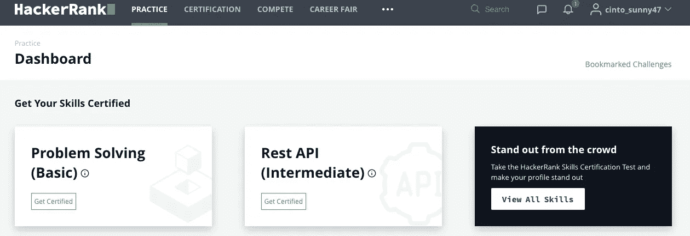

# 5 个网站来提高你的编程和算法技能

> 原文：<https://levelup.gitconnected.com/5-websites-to-enhance-your-programming-and-algorithm-skills-a71ab74ed5a8>

## 基于在软件行业 15 年的经验

照片由 [Fotis Fotopoulos](https://unsplash.com/@ffstop?utm_source=unsplash&utm_medium=referral&utm_content=creditCopyText) 在 [Unsplash](https://unsplash.com/s/photos/software?utm_source=unsplash&utm_medium=referral&utm_content=creditCopyText) 上拍摄

相信大家都能学会编码。和其他领域一样，你最需要的是努力和奉献。

在丹·布朗的《大师课》中，他解释了“*保护过程*的重要性。这意味着你需要每天专注于创造和保持实现目标的过程。如果你想成为作家，就每天起床写作。如果你想成为一名网球运动员，保护好每天打球的过程。同样，如果你想学习编程，每天都要写代码。

这里有一些我在职业生涯的不同时期用来温习技能的网站。这是我保护我的进程的方式。此外，在编程和算法方面的工作对成功面试有很大帮助。

# LeetCode

leeetcode 主页

LeetCode 非常受有志于提高软件工程技能和准备技术面试的工程师的欢迎。根据您的技能偏好，有 3 个主要级别的问题。如果你想进行一次体面的面试，标准是能够在 Leetcode 上解决简单到中等水平的问题。难的是对于谷歌或者脸书级别的面试。

这些问题是不言自明的。它测量你的性能/运行时代码，与其他代码进行比较，看你的代码运行是快还是慢，是否可以优化。有一个讨论选项卡，您可以在这里分享您的结果或张贴您的问题。

Leetcode 更适合希望通过面试的工程师，而不是计划招聘员工的公司。

## 定价

如果你想解锁像[这种](https://leetcode.com/problems/merge-intervals/solution/)的精致优质视频解决方案，你必须订阅 Leetcode premium 版本。每个视频都包括详细的概念概述和代码演练，将有效地指导您解决问题。此外，您可以访问优质内容，并利用代码编辑器本身中的断点等。

截至 2021 年 2 月，订阅计划为每月 35 美元或每年 159 美元。

# **黑客排名**

Hackerrank 仪表板

黑客排名社区是程序员最大的学习和竞赛社区之一。HackerRank for Work 是领先的端到端技术招聘平台，用于招聘工程师。这是拥有 2000 多个客户和 9100 多万个挑战的技术人员招聘的行业标准。

他们的问题按照数据结构、算法、函数式编程、普通数学以及各种语言的技能水平进行分类。

Hackerrank.com

HackerRank 也有各种各样的竞赛和一个工作板。

HackerRank 有两个主要受众。第一类是希望雇佣开发人员的公司。他们利用这个平台测试候选人的技术问题。第二类是软件工程师，他们希望通过这些技术面试提高自己的技能和实践。

## 定价

对于想学习编程和算法的用户，这个平台是免费的。HackerRank 从使用其平台评估候选人的公司那里赚钱。许多顶级公司，如 Airbnb、思科、彭博等。利用他们的平台来评估候选人。对于公司来说，[的定价](https://www.hackerrank.com/products/pricing)取决于面试是由个人还是团队等进行。

截至 2021 年 2 月，对于采访许可证，该计划是每月 25 美元。对于一个提供额外的测试访问功能和每月 30 次面试的个人平台，计划是每月 249 美元。团队和企业平台也有计划。

# 教育的

教育性的

[Educative](https://www.educative.io/) 拥有免费和付费资源，是一款软件工程面试准备工具。他们有各种深入的学习路线和课程。他们提供 7 种编程语言的入门课程，包括 Python、JavaScript、HTML 和 r。学生还可以学习机器学习、面向前端开发人员的 React 和面向程序员的 C++等主题的高级课程。

那些使用 Educative 进行面试准备的人可以深入学习编程语言以及涵盖特定主题的课程，如算法、系统设计、并发性和递归。

一些不错的课程有:

1.  [钻研系统设计面试](https://www.educative.io/collection/5668639101419520/5649050225344512?affiliate_id=5073518643380224)
2.  [寻找编码面试:编码问题的模式](https://www.educative.io/collection/5668639101419520/5671464854355968?affiliate_id=5073518643380224)
3.  [React-面向前端开发者](https://www.educative.io/path/react-front-end-developer)
4.  [探索编码面试的动态编程模式](https://javarevisited.blogspot.com/2019/12/top-5-courses-to-learn-dynamic-programming-for-interivews.html)
5.  [Java 多线程高级工程面试](https://medium.com/javarevisited/8-best-multithreading-and-concurrency-courses-for-experienced-java-developers-8acfd3b25094)
6.  Java 中的数据结构:一个访谈复习者

## 定价

您可以单独购买这些课程来准备特定的主题，也可以购买 [**教育订阅**](https://www.educative.io/subscription?affiliate_id=5073518643380224) ，如果按年计费，大约每月 17 美元，如果按月计费，则每月 59 美元，可以访问他们所有的 100 多门软件工程课程。个人推荐教育性会员，因为它既划算又是一种在平台上学习的简单方式。

# 练习

练习 10

所有技能水平的开发人员都应该使用[exercisem . io](https://exercism.io/)。作为一名新开发人员，这是我最喜欢的学习工具之一。如果其他页面是为了练习算法，那么 Exercism 是学习和提高你的编程技能的理想选择。

Exercism 上有 52 种不同的[语言曲目](https://exercism.io/tracks)供您探索和掌握。

exercism.io 上所有可用的曲目

让 Exercism.io 与众不同的一个重要因素是其由经验丰富的开发人员组成的导师网络。为了完成核心练习，导师需要检查您的解决方案的效率。因此，这不仅仅是解决每个挑战的问题，而是以一种高效的方式来解决。

## 定价

exercisem 100%免费。它完全是开源的，依赖于成千上万志愿者的贡献

# 编码游戏

codingame.com

CodinGame 与其他网站有些不同，因为你不是简单地在编辑器中解决编码挑战，而是实际上参与编写你直接在线玩的游戏的代码。尽管这个网站不同于典型的竞争性编程网站，但它在喜欢解决挑战和参加竞赛的程序员中仍然很受[欢迎](https://techcrunch.com/2015/11/11/with-codingame-learning-to-code-becomes-a-game/)。

用户可以选择 25 种以上语言中的任何一种工作，并可以参加在线竞赛获得奖励。他们的方法旨在将高级开发人员引向下一个层次。

偶尔，我喜欢参加这种解决问题的活动。

这对于有一些编码经验并希望提高技能的软件工程师来说是理想的。开发人员也可以向导师寻求帮助，以审查他们的代码并相互比较解决方案。

## 定价

CodinGame 对用户是免费的。他们只需要注册谷歌、脸书、GitHub、LinkedIn 或任何电子邮件。

# 其他值得注意的事项

虽然我在这些网站上没有亲身经历，但我听到了一些同事和朋友对它们的积极评价。如果您已经使用过它们，请让我们知道您对它们的看法。

## [TopCoder](https://www.topcoder.com/challenges/?pageIndex=1)

## [主厨](https://www.codechef.com/)

## [SPOJ](https://www.spoj.com/)

# 分级编码

感谢您成为我们社区的一员！ [**订阅我们的 YouTube 频道**](https://www.youtube.com/channel/UC3v9kBR_ab4UHXXdknz8Fbg?sub_confirmation=1) 或者加入 [**Skilled.dev 编码面试课程**](https://skilled.dev/) 。

 [## 编写面试问题+获得开发工作

### 掌握编码面试的过程

技术开发](https://skilled.dev)