# 更好编程的 50 个数学概念(第 10 部分)

> 原文：<https://levelup.gitconnected.com/50-mathematical-concepts-for-better-programming-part-10-694e5bddade8>

印度数学家斯里尼瓦瑟·拉马努金的肖像(图片来自维基百科)

# 34.指数运算

这是一种数学运算，将一个称为底数的数字`b`提升到另一个称为指数或幂的数字`n`。

*   当`b^n`中的`n`为正数时，类似于`b`的`n`因子相乘。

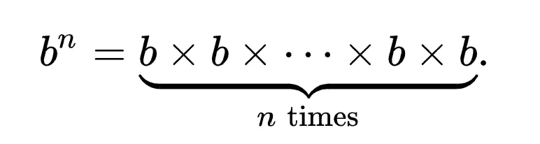

*   当`n`为`0`时，`b^n`为`1`。
*   当`n`为负时，表示反相，即`b^-n = 1 / b^n`。
*   当`n`是分数时，表示根，即 `b^¹/n = n√b`

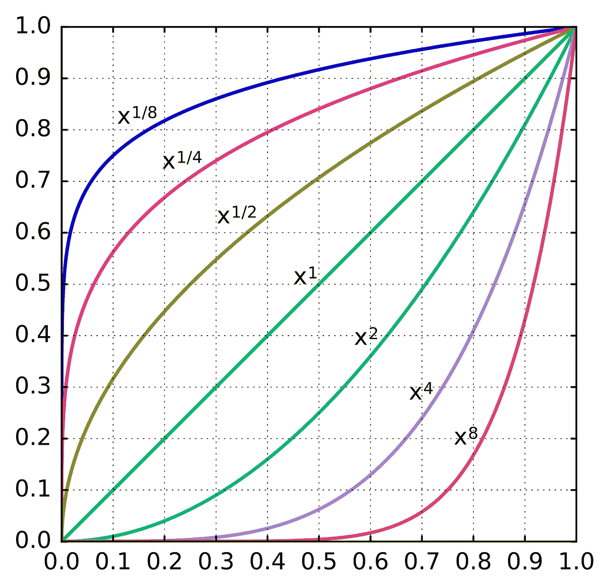

图片来自维基百科

## 指数规则

下列恒等式适用于指数运算。

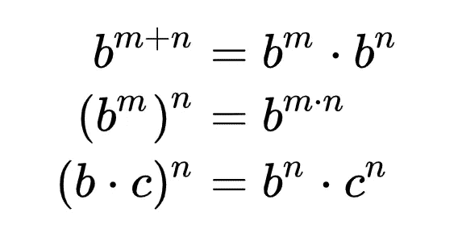

***顺便说一句*** *，如果你是 Python 或编程总体新手，可以看看我的新书《没有公牛**t 学习 Python 指南**’***下面:**

 [## 学习 Python 的无牛指南

### 你是一个正在考虑学习编程却不知道从哪里开始的人吗？我有适合你的解决方案…

bamaniaashish.gumroad.com](https://bamaniaashish.gumroad.com/l/python-book) 

# 35.对数

它是一个数的幂的**逆**运算。

举个例子，

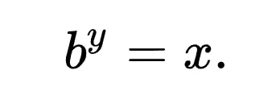

可以写成:

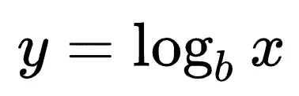

> *其中* `*log(b)*` *称为 log to base*`*b*`*。*

常用的对数基数有:

*   对数底数`10`(十进制或普通对数)
*   对数底数`e`(自然对数)
*   对数底数`2`(二进制对数)

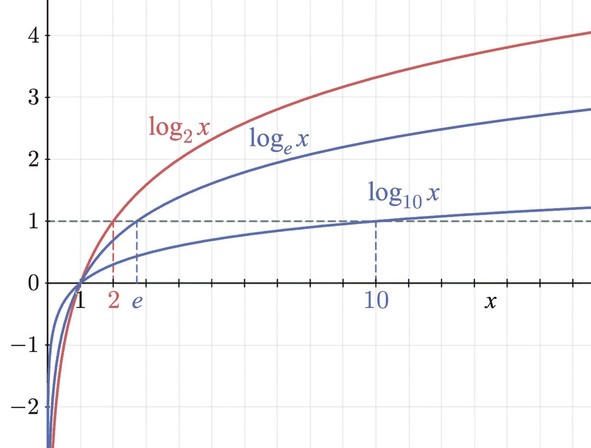

对数函数图(图片来自维基百科)

## 对数定律

对数运算遵循下述定律:

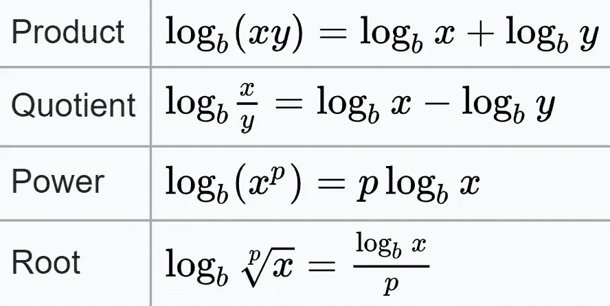

图片来自维基百科

对数的基数可以按如下方式改变:

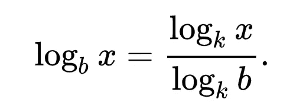

在计算机科学中，对数通常用于研究算法的性能。

举个例子，

*   [二分搜索法算法](https://en.wikipedia.org/wiki/Binary_search_algorithm)平均在`log2(*N*)`时间内对列表进行排序，其中 *N* 是列表的长度。
*   [合并排序算法](https://en.wikipedia.org/wiki/Merge_sort)在`*N* · log(*N*)`时间内对未排序的列表进行排序。

# 36.多项式方程

有以下类型的方程:

> `P = 0`

其中`P`是多项式。

多项式是由变量、它们的系数和正整数指数组成的表达式，它们通过加、减、乘和除的数学运算组合在一起。

**代数**方程是只包含一个变量的多项式方程，即它是**单变量**。

## 二次方程

它是一个一元或多元的二次多项式方程。

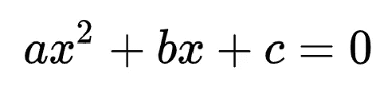

二次方程

一个二次方程最多有两个解/根，可以使用**二次公式**计算，如下所示:

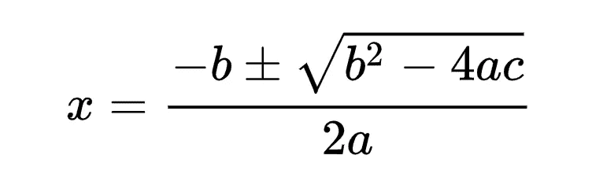

二次公式

## 三次方程

它是一个一元或多元的三次多项式方程。

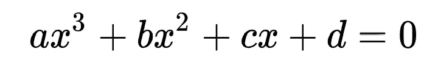

三次方程

一个三次方程的解/根可以用以下公式求出:

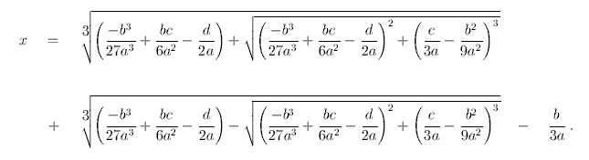

立方公式(图片来自:[https://math.vanderbilt.edu/schectex/courses/cubic/](https://math.vanderbilt.edu/schectex/courses/cubic/))

## 四次方程

它是一个一元或多元的四次方(四次)多项式方程。

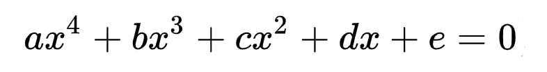

四次方程

使用**四次公式**可以找到四次方程的解/根。

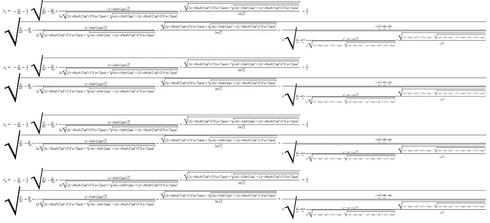

四次公式(图片来自维基百科)

## **阿贝尔-鲁芬尼定理**

这个定理表明五次或更高次的多项式方程没有解。

*看看下面这个系列的其他部分:*

 [## 更好编程的 50 个数学概念(第 1 部分)

### 让我们学习构成计算机科学基础的数学

levelup.gitconnected.com](/5-mathematical-concepts-for-better-programming-d26005932656)  [## 更好编程的 50 个数学概念(第二部分)

### 让我们学习构成计算机科学基础的数学

bamania-ashish.medium.com](https://bamania-ashish.medium.com/50-mathematical-concepts-for-better-programming-part-2-f0dc13a8c05)  [## 更好编程的 50 个数学概念(第 3 部分)

### 让我们学习构成计算机科学基础的数学

levelup.gitconnected.com](/50-mathematical-concepts-for-better-programming-part-3-ea60e4c30531)  [## 更好编程的 50 个数学概念(第 4 部分)

### 让我们学习构成计算机科学基础的数学

levelup.gitconnected.com](/50-mathematical-concepts-for-better-programming-part-4-e44e3b7f3c55)  [## 更好编程的 50 个数学概念(第 5 部分)

### 让我们学习构成计算机科学基础的数学

bamania-ashish.medium.com](https://bamania-ashish.medium.com/50-mathematical-concepts-for-better-programming-part-5-b3624c2227ad)  [## 更好编程的 50 个数学概念(第 6 部分)

### 让我们学习构成计算机科学基础的数学

bamania-ashish.medium.com](https://bamania-ashish.medium.com/50-mathematical-concepts-for-better-programming-part-6-29a04f55edec)  [## 更好编程的 50 个数学概念(第 7 部分)

### 让我们学习构成计算机科学基础的数学

bamania-ashish.medium.com](https://bamania-ashish.medium.com/50-mathematical-concepts-for-better-programming-part-7-90cf3cb3d1f2)  [## 更好编程的 50 个数学概念(第 8 部分)

### 让我们学习构成计算机科学基础的数学

bamania-ashish.medium.com](https://bamania-ashish.medium.com/50-mathematical-concepts-for-better-programming-part-8-ddc977cb4e0e)  [## 更好编程的 50 个数学概念(第 9 部分)

### 让我们来理解构成计算机科学基础的数学

bamania-ashish.medium.com](https://bamania-ashish.medium.com/50-mathematical-concepts-for-better-programming-part-9-1e2c7ff52770) 

*这就是本文的全部内容。感谢阅读！*

*如果你是 Python 或编程的新手，可以看看我的新书《Python 学习指南》******下面:*****

**** [## 学习 Python 的无牛指南

### 你是一个正在考虑学习编程却不知道从哪里开始的人吗？我有适合你的解决方案…

bamaniaashish.gumroad.com](https://bamaniaashish.gumroad.com/l/python-book)  [## 通过我的推荐链接加入 Medium——Ashish Bama nia 博士

### 阅读 Ashish Bamania 博士(以及 Medium 上成千上万的其他作家)的每一个故事。您的会员费直接…

bamania-ashish.medium.com](https://bamania-ashish.medium.com/membership)****