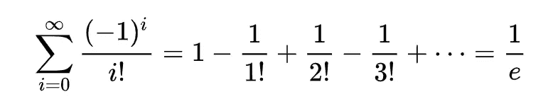

# 更好编程的 50 个数学概念(第 11 部分)

> 原文：<https://levelup.gitconnected.com/50-mathematical-concepts-for-better-programming-part-11-606debbb19fa>

照片由[艾库特·埃克](https://unsplash.com/@aykuteke?utm_source=medium&utm_medium=referral)在 [Unsplash](https://unsplash.com?utm_source=medium&utm_medium=referral) 上拍摄

# 37.无穷级数

它是无穷项的有序和，表示如下:

也可以用σ(sigma)符号表示，其中:

*   下标代表系列的下限
*   上标代表系列的上限

## 收敛级数

它是一个数列，其部分和(前 n 项之和)趋向于一个特定的数(**极限)。**

极限为 1 的收敛级数

在上面，第一个总和:

*   两个术语是:`1/2`
*   三个术语是:`3/4`
*   四个术语是:`7/8`

可以看到，这些总和正在接近`1`(即极限)。

## 发散级数

这是一个数列，它的部分和趋向于一个特定的数，它有一个极限`∞`或`-∞`。

这里，第 n 个部分和不趋向于一个有限的极限，并继续增长。

## 拉马努金的摘要

这是数学家斯里尼瓦瑟·拉马努金为发散级数赋值的一种方法。

注意，这些级数的部分和不会收敛到 Ramanujan 和(用`R`表示)。

发散级数的 Ramanujan 求和(1)

发散级数的 Ramanujan 求和(2)

发散级数的 Ramanujan 求和(3)

## 几何级数

这是一个数列，其中每个连续项都是通过将前一项乘以一个常数(称为**公比**)获得的。

公比为 1/2 的几何级数

## 调和级数

它是所有正的单位分数相加形成的无穷级数。

总是**发散**。

调和级数

有趣的是，圆周率(`*π*`)可以表示为如下的级数:

同样，`e`可以表示为:

# 38.泰勒级数

它是一个级数，可以表示在点`a`的数学函数`f(x)`，使用[多项式](https://medium.com/gitconnected/50-mathematical-concepts-for-better-programming-part-10-694e5bddade8)如下:

或者，

其中`f(n)(a)`表示在点`a`评估的`f`的第 n 个导数。

sin ( *x)* 及其在 *x* = 0 时的 **1** ， **3** ， **5** ， **7** ， **9** ， **11** ， **13** 的泰勒逼近(图片来自维基百科)

随着泰勒多项式次数的增加，它接近正确的函数。

下面提到的是泰勒级数的一个漂亮的演示和一个强烈推荐的视频。

# 39.欧拉公式

这个公式在三角学和复指数函数之间建立了联系。

欧拉公式

对于`x = π`，可以写成:

欧拉恒等式

其中:

*   `*e*`是[欧拉数](https://en.wikipedia.org/wiki/E_(mathematical_constant))
*   `*i*`是[的虚数单位](https://en.wikipedia.org/wiki/Imaginary_unit)
*   `*π*`是一个圆的周长与其直径的比值

*看看下面这个系列的其他部分:*

 [## 更好编程的 50 个数学概念(第 1 部分)

### 让我们学习构成计算机科学基础的数学

levelup.gitconnected.com](/5-mathematical-concepts-for-better-programming-d26005932656)  [## 更好编程的 50 个数学概念(第二部分)

### 让我们学习构成计算机科学基础的数学

bamania-ashish.medium.com](https://bamania-ashish.medium.com/50-mathematical-concepts-for-better-programming-part-2-f0dc13a8c05)  [## 更好编程的 50 个数学概念(第 3 部分)

### 让我们学习构成计算机科学基础的数学

levelup.gitconnected.com](/50-mathematical-concepts-for-better-programming-part-3-ea60e4c30531)  [## 更好编程的 50 个数学概念(第 4 部分)

### 让我们学习构成计算机科学基础的数学

levelup.gitconnected.com](/50-mathematical-concepts-for-better-programming-part-4-e44e3b7f3c55)  [## 更好编程的 50 个数学概念(第 5 部分)

### 让我们学习构成计算机科学基础的数学

bamania-ashish.medium.com](https://bamania-ashish.medium.com/50-mathematical-concepts-for-better-programming-part-5-b3624c2227ad)  [## 更好编程的 50 个数学概念(第 6 部分)

### 让我们学习构成计算机科学基础的数学

bamania-ashish.medium.com](https://bamania-ashish.medium.com/50-mathematical-concepts-for-better-programming-part-6-29a04f55edec)  [## 更好编程的 50 个数学概念(第 7 部分)

### 让我们学习构成计算机科学基础的数学

bamania-ashish.medium.com](https://bamania-ashish.medium.com/50-mathematical-concepts-for-better-programming-part-7-90cf3cb3d1f2)  [## 更好编程的 50 个数学概念(第 8 部分)

### 让我们学习构成计算机科学基础的数学

bamania-ashish.medium.com](https://bamania-ashish.medium.com/50-mathematical-concepts-for-better-programming-part-8-ddc977cb4e0e)  [## 更好编程的 50 个数学概念(第 9 部分)

### 让我们来理解构成计算机科学基础的数学

bamania-ashish.medium.com](https://bamania-ashish.medium.com/50-mathematical-concepts-for-better-programming-part-9-1e2c7ff52770)  [## 更好编程的 50 个数学概念(第 10 部分)

### 让我们学习构成计算机科学基础的数学

levelup.gitconnected.com](/50-mathematical-concepts-for-better-programming-part-10-694e5bddade8)  [## 更好编程的 50 个数学概念(第 12 部分)

### 让我们学习构成计算机科学基础的数学

bamania-ashish.medium.com](https://bamania-ashish.medium.com/50-mathematical-concepts-for-better-programming-part-12-5ddb98bd7398) 

*这就是本文的全部内容。感谢阅读！*

*如果你是 Python 或编程的新手，可以看看我的新书《Python 学习指南》******下面:*****

**** [## 学习 Python 的无牛指南

### 你是一个正在考虑学习编程却不知道从哪里开始的人吗？我有适合你的解决方案…

bamaniaashish.gumroad.com](https://bamaniaashish.gumroad.com/l/python-book)  [## 通过我的推荐链接加入 Medium——Ashish Bama nia 博士

### 阅读 Ashish Bamania 博士(以及 Medium 上成千上万的其他作家)的每一个故事。您的会员费直接…

bamania-ashish.medium.com](https://bamania-ashish.medium.com/membership)****