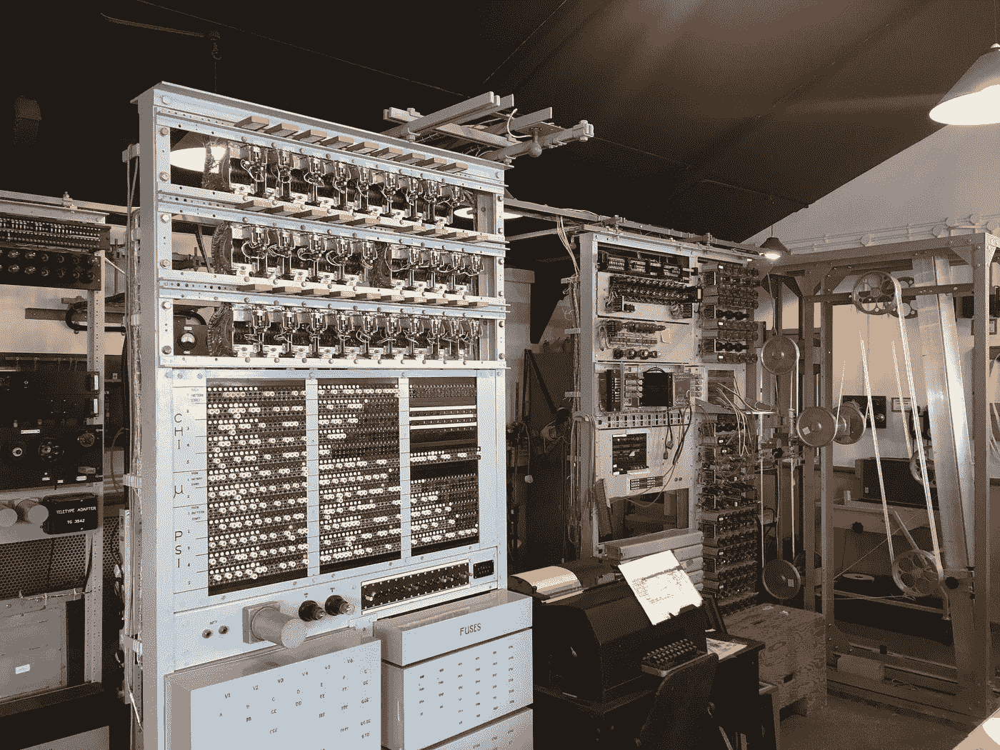
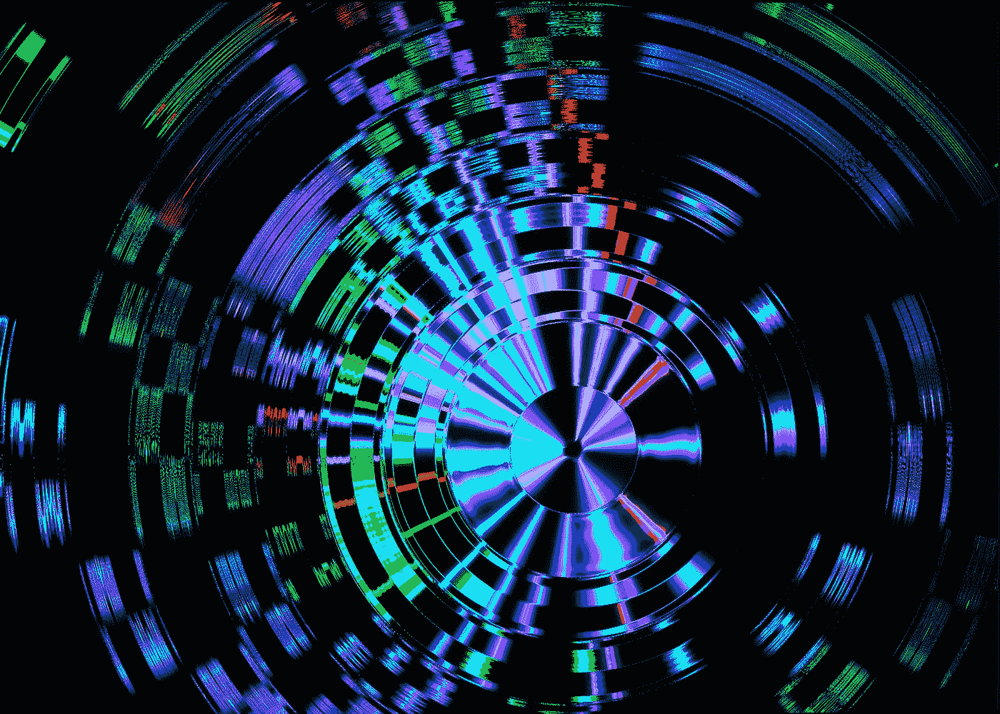
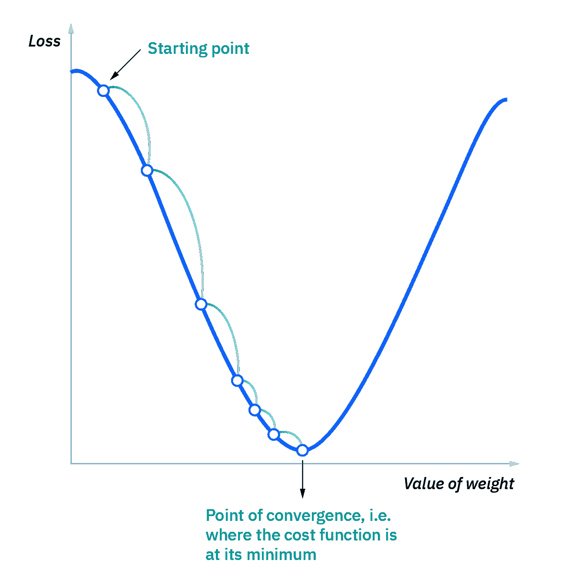

# 更好编程的 50 个数学概念(第 12 部分)

> 原文：<https://levelup.gitconnected.com/50-mathematical-concepts-for-better-programming-part-12-5ddb98bd7398>

[Farai Gandiya](https://unsplash.com/@faraixyz?utm_source=medium&utm_medium=referral) 在 [Unsplash](https://unsplash.com?utm_source=medium&utm_medium=referral) 上拍摄的照片

# 40.量子算法

经典计算机理解以二进制位形式表示的指令(`0`和`1`)。

另一方面，量子计算机根据量子位表示的指令工作。

一个量子位同时代表`0`和`1`(称为 ***叠加*** )。

量子算法是使用量子计算机(遵循[量子叠加](https://en.wikipedia.org/wiki/Quantum_superposition) & [纠缠](https://en.wikipedia.org/wiki/Quantum_entanglement)原理的机器)解决问题的有限指令序列。

照片由[飞:D](https://unsplash.com/es/@flyd2069?utm_source=medium&utm_medium=referral) 在 [Unsplash](https://unsplash.com?utm_source=medium&utm_medium=referral) 上拍摄

## 肖尔算法

它是一种量子算法，用于在多对数时间(`**O((log(N))c)** where **c** is a constant`)内寻找整数(`N`)的**质因数**。

> 请注意，没有已知的经典计算机算法可以在多项式时间内分解整数。

Shor 的算法可以破解[公钥密码](https://en.wikipedia.org/wiki/Public-key_cryptography)(例如 RSA 方案)，但如果发生这种情况，这可以由[抗量子密码技术](https://www.nist.gov/news-events/news/2022/07/nist-announces-first-four-quantum-resistant-cryptographic-algorithms)替代。

## 格罗弗算法

它是一种用于在`**O(√N)**` 时间内搜索非结构化数据的量子算法。

> 注意，经典的计算机算法通常在`O(N)`时间内执行搜索操作。

# 41.p 对 NP 问题

可以在多项式时间复杂度内 ***解决*** 的问题称为类型/类`P`或“多项式时间”的问题。

另一方面，其解决方案可以在多项式时间内 ***验证*** 的问题属于类型/类别`NP`或“非确定性多项式时间”。

这仍然是数学和计算机[科学](https://en.wikipedia.org/wiki/List_of_unsolved_problems_in_computer_science)是否`P = NP`中最大的未解决问题之一。

换句话说:

> 如果一个问题的解决方法很容易验证，那么这个问题就一定很容易解决吗？

例如，数独在`NP`(可快速检查)，但似乎不在`P`(可快速解决)。

类似地，找到区块链网络的工作证明是一个`NP`类型的问题。

如果您不熟悉工作证明的概念，请在此处查看:

 [## 应该知道的 100 个 Web-3 基本概念(第 2 部分:11–20)

### 揭开 Web-3 神秘面纱的指南

levelup.gitconnected.com](/100-essential-web-3-concepts-that-one-should-know-about-part-2-11-20-ec997ef6dffd) 

## NP 完全问题

这些问题至今没有多项式时间算法来解决，也没有证据证明没有多项式时间算法来解决它们。

有趣的是，一个`NP`-完全问题可以模拟其他所有问题，也就是说，如果任意一个`NP`-完全问题可以在多项式时间内解决，那么所有问题都可以。

证明一个问题是`NP`-完整的:

*   先证明是在`NP`，
*   然后把一个已知的`NP`-完整的问题还原给它

一些常见的`NP` -complete 问题有:

*   [布尔可满足性问题](https://en.wikipedia.org/wiki/Boolean_satisfiability_problem)
*   [背包问题](https://en.wikipedia.org/wiki/Knapsack_problem)
*   [哈密顿路径问题](https://en.wikipedia.org/wiki/Hamiltonian_path_problem)
*   [旅行推销员问题](https://en.wikipedia.org/wiki/Travelling_salesman_problem)
*   [子图同构问题](https://en.wikipedia.org/wiki/Subgraph_isomorphism_problem)
*   [子集和问题](https://en.wikipedia.org/wiki/Subset_sum_problem)
*   [小团体问题](https://en.wikipedia.org/wiki/Clique_problem)
*   [顶点覆盖问题](https://en.wikipedia.org/wiki/Vertex_cover_problem)
*   [独立设置问题](https://en.wikipedia.org/wiki/Independent_set_problem)
*   [支配集问题](https://en.wikipedia.org/wiki/Dominating_set_problem)
*   [图着色问题](https://en.wikipedia.org/wiki/Graph_coloring_problem)

照片由[андрейсизов](https://unsplash.com/@alpridephoto?utm_source=medium&utm_medium=referral)在 [Unsplash](https://unsplash.com?utm_source=medium&utm_medium=referral) 上拍摄

# 42.最佳化

这是一种寻找使数学函数的值最大化或最小化的参数的技术。

## 饮食问题

这是一个现实世界的优化问题，由乔治·斯蒂格勒提出:

> 77 种食物的最便宜组合是什么，可以满足一个中等运动量的人每天 9 种关键营养素的推荐摄入量？

这是一个可以应用[线性优化](https://en.wikipedia.org/wiki/Linear_programming)的问题。

换句话说，这个问题可以用线性函数来表示。

根据斯蒂格勒的计算，他的解决方案的年成本是`$39.93`。

## 梯度下降

下图是[梯度下降](https://www.ibm.com/topics/gradient-descent)，一种常用于训练[机器学习](https://www.ibm.com/topics/machine-learning)模型和[神经网络](https://www.ibm.com/topics/neural-networks)的优化算法。

该算法旨在最小化与机器学习模型相关联的关于其参数的损失函数，以使其更加准确。

梯度下降优化算法(来源:[https://www.ibm.com/topics/gradient-descent](https://www.ibm.com/topics/gradient-descent))

*看看下面这个系列的其他部分:*

 [## 更好编程的 50 个数学概念(第 1 部分)

### 让我们学习构成计算机科学基础的数学

levelup.gitconnected.com](/5-mathematical-concepts-for-better-programming-d26005932656)  [## 更好编程的 50 个数学概念(第二部分)

### 让我们学习构成计算机科学基础的数学

bamania-ashish.medium.com](https://bamania-ashish.medium.com/50-mathematical-concepts-for-better-programming-part-2-f0dc13a8c05)  [## 更好编程的 50 个数学概念(第 3 部分)

### 让我们学习构成计算机科学基础的数学

levelup.gitconnected.com](/50-mathematical-concepts-for-better-programming-part-3-ea60e4c30531)  [## 更好编程的 50 个数学概念(第 4 部分)

### 让我们学习构成计算机科学基础的数学

levelup.gitconnected.com](/50-mathematical-concepts-for-better-programming-part-4-e44e3b7f3c55)  [## 更好编程的 50 个数学概念(第 5 部分)

### 让我们学习构成计算机科学基础的数学

bamania-ashish.medium.com](https://bamania-ashish.medium.com/50-mathematical-concepts-for-better-programming-part-5-b3624c2227ad)  [## 更好编程的 50 个数学概念(第 6 部分)

### 让我们学习构成计算机科学基础的数学

bamania-ashish.medium.com](https://bamania-ashish.medium.com/50-mathematical-concepts-for-better-programming-part-6-29a04f55edec)  [## 更好编程的 50 个数学概念(第 7 部分)

### 让我们学习构成计算机科学基础的数学

bamania-ashish.medium.com](https://bamania-ashish.medium.com/50-mathematical-concepts-for-better-programming-part-7-90cf3cb3d1f2)  [## 更好编程的 50 个数学概念(第 8 部分)

### 让我们学习构成计算机科学基础的数学

bamania-ashish.medium.com](https://bamania-ashish.medium.com/50-mathematical-concepts-for-better-programming-part-8-ddc977cb4e0e)  [## 更好编程的 50 个数学概念(第 9 部分)

### 让我们来理解构成计算机科学基础的数学

bamania-ashish.medium.com](https://bamania-ashish.medium.com/50-mathematical-concepts-for-better-programming-part-9-1e2c7ff52770)  [## 更好编程的 50 个数学概念(第 10 部分)

### 让我们学习构成计算机科学基础的数学

levelup.gitconnected.com](/50-mathematical-concepts-for-better-programming-part-10-694e5bddade8)  [## 更好编程的 50 个数学概念(第 11 部分)

### 让我们学习构成计算机科学基础的数学

levelup.gitconnected.com](/50-mathematical-concepts-for-better-programming-part-11-606debbb19fa)  [## 更好编程的 50 个数学概念(第 13 部分)

### 让我们学习构成计算机科学基础的数学

bamania-ashish.medium.com](https://bamania-ashish.medium.com/50-mathematical-concepts-for-better-programming-part-13-ecc6484cdcdc) 

*这就是本文的全部内容。感谢阅读！*

*如果你是 Python 或编程的新手，可以看看我的新书《Python 学习指南》******下面:*****

**** [## 学习 Python 的无牛指南

### 你是一个正在考虑学习编程却不知道从哪里开始的人吗？我有适合你的解决方案…

bamaniaashish.gumroad.com](https://bamaniaashish.gumroad.com/l/python-book)  [## 通过我的推荐链接加入 Medium——Ashish Bama nia 博士

### 阅读 Ashish Bamania 博士(以及 Medium 上成千上万的其他作家)的每一个故事。您的会员费直接…

bamania-ashish.medium.com](https://bamania-ashish.medium.com/membership)****