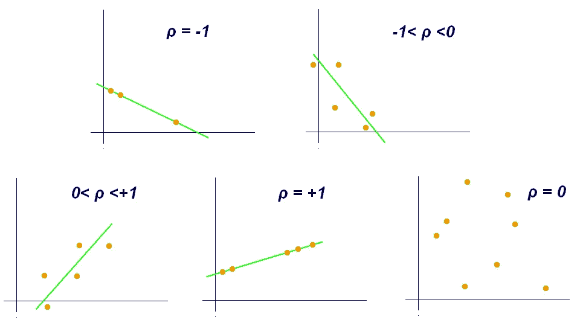
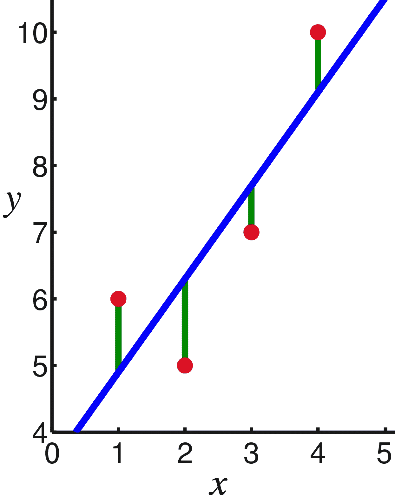
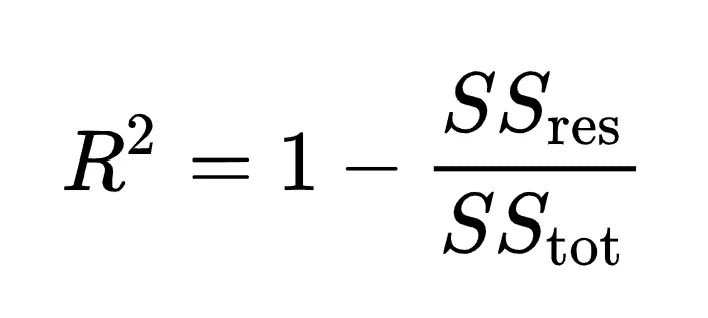
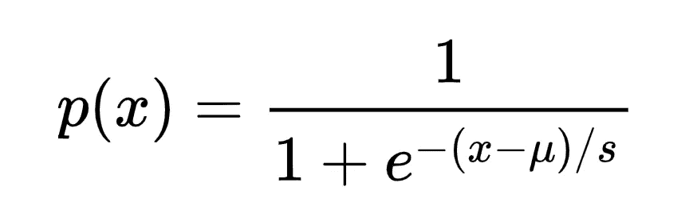
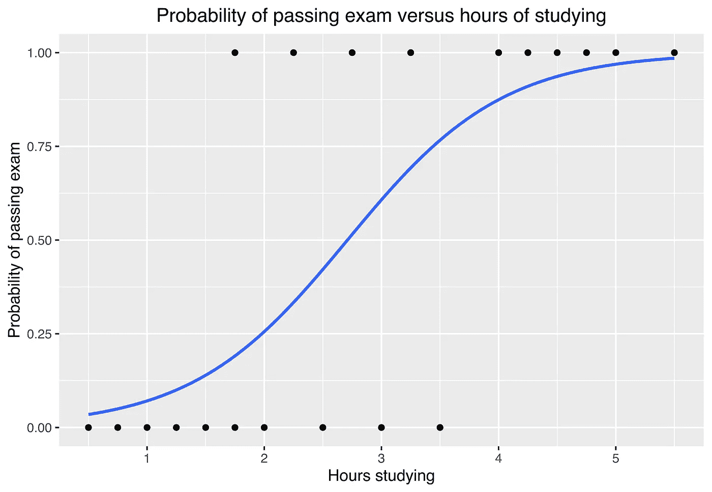

# 更好编程的 50 个数学概念(第二部分)

> 原文：<https://levelup.gitconnected.com/50-mathematical-concepts-for-better-programming-part-2-f0dc13a8c05>

照片由[丹·克里斯蒂安·pădureț](https://unsplash.com/@dancristianpaduret?utm_source=medium&utm_medium=referral)在 [Unsplash](https://unsplash.com?utm_source=medium&utm_medium=referral) 拍摄

*如果你是 Python 或编程的新手，可以看看我的新书《没有公牛**t 学习 Python 指南**’***下面:**

 [## 学习 Python 的无牛指南

### 你是一个正在考虑学习编程却不知道从哪里开始的人吗？我有适合你的解决方案…

bamaniaashish.gumroad.com](https://bamaniaashish.gumroad.com/l/python-book) 

*看看下面这个系列的前一部分:*

 [## 更好编程的 5 个数学概念

### 让我们学习构成计算机科学基础的数学

levelup.gitconnected.com](/5-mathematical-concepts-for-better-programming-d26005932656) 

# 6.相互关系

相关性是由 ***弗朗西斯·高尔顿*** 引入的一个术语，它是展示两个变量如何**彼此关联**的一个属性。

它决定了一个变量的变化如何改变另一个变量。

**皮尔逊相关系数** / **皮尔逊的 *r (ρ)*** 在从-1 到 1 的范围内测量这种相关性，其中:

*   0 —无相关性
*   -1 —反相关
*   1 —完全相关

皮尔逊系数(图片来自维基百科)

请记住:

> 相关性并不意味着因果关系。
> 
> 某一天卖出的冰淇淋数量和那天出生的孩子数量可能相关，但这并不意味着一个是另一个的原因。

# 7.回归

它是用数学方法估计因变量和一个或多个自变量之间关系的过程。

下面解释两种类型的回归模型。

# 8.线性回归

这是一种对不同变量之间的线性关系进行建模的方法。

这种关系可以是:

*   两个变量(绘制在二维平面上)或
*   多个变量(绘制在多维平面上)

两个变量之间的关系可以表示为:

> `y = m*x + c`

其中 x 是自变量，y 是因变量。

**使数据点之间的垂直距离的平方和** 最小化***的线被认为是线性回归的最佳拟合线。***

线性回归中的最佳拟合线(图片来自维基百科)

与分类相反，作为机器学习模型的线性回归可用于预测**连续变量**。

例如，估计一天中特定时间的温度(连续变量)。

## 决定系数

它是因变量中变化的比例，可以从自变量中预测出来。

r 计算如下，其中:

*   *SS(res)* 是**残差平方和**(最佳拟合线和观测值之间的距离平方和)
*   *SS(tot)* 是**总平方和**(观察值与其总体平均值之间所有平方差的总和)

计算 R 的公式

> 请注意，R 不应与皮尔逊系数的平方混淆。

R 用于衡量预测值*与观察值*的匹配程度，而不仅仅是皮尔逊系数的相关性。

要了解更多信息，请查看 Krishna Rao 的这篇文章:

 [## R 或 R——何时使用什么

### 平方皮尔逊相关系数和决定系数的图解说明

towardsdatascience.com](https://towardsdatascience.com/r%C2%B2-or-r%C2%B2-when-to-use-what-4968eee68ed3) 

r 的范围可以是任何负数到+1，其中

*   +1 表示观察值与预测值完全匹配
*   0 表示预测是随机的
*   负数表示预测比随机预测差

# 9.逻辑回归

这种方法根据给定的独立变量估计事件发生的概率(即 ***在 0 和 1*** 之间)。

作为机器学习模型的逻辑回归用于**分类**任务(与回归任务相对的**)。**

这些分类任务可以是:

*   二元(两个结果之间的分类)
*   多类(两个以上结果之间的分类)

***逻辑函数*** 编写如下，其中:

*   *μ* 是位置参数或逻辑曲线的中点( *0.5 在*下面的图中)
*   *s* 是一个[比例参数](https://en.wikipedia.org/wiki/Scale_parameter)

逻辑函数

以下逻辑图用于根据学习小时数对通过考试的概率进行分类。

逻辑回归图(图片来自维基百科)

*看看下面这个系列的其他部分:*

 [## 更好编程的 50 个数学概念(第 1 部分)

### 让我们学习构成计算机科学基础的数学

levelup.gitconnected.com](/5-mathematical-concepts-for-better-programming-d26005932656)  [## 更好编程的 50 个数学概念(第二部分)

### 让我们学习构成计算机科学基础的数学

bamania-ashish.medium.com](https://bamania-ashish.medium.com/50-mathematical-concepts-for-better-programming-part-2-f0dc13a8c05)  [## 更好编程的 50 个数学概念(第 3 部分)

### 让我们学习构成计算机科学基础的数学

levelup.gitconnected.com](/50-mathematical-concepts-for-better-programming-part-3-ea60e4c30531)  [## 更好编程的 50 个数学概念(第 4 部分)

### 让我们学习构成计算机科学基础的数学

levelup.gitconnected.com](/50-mathematical-concepts-for-better-programming-part-4-e44e3b7f3c55)  [## 更好编程的 50 个数学概念(第 5 部分)

### 让我们学习构成计算机科学基础的数学

bamania-ashish.medium.com](https://bamania-ashish.medium.com/50-mathematical-concepts-for-better-programming-part-5-b3624c2227ad)  [## 更好编程的 50 个数学概念(第 6 部分)

### 让我们学习构成计算机科学基础的数学

bamania-ashish.medium.com](https://bamania-ashish.medium.com/50-mathematical-concepts-for-better-programming-part-6-29a04f55edec)  [## 更好编程的 50 个数学概念(第 7 部分)

### 让我们学习构成计算机科学基础的数学

bamania-ashish.medium.com](https://bamania-ashish.medium.com/50-mathematical-concepts-for-better-programming-part-7-90cf3cb3d1f2)  [## 更好编程的 50 个数学概念(第 8 部分)

### 让我们学习构成计算机科学基础的数学

bamania-ashish.medium.com](https://bamania-ashish.medium.com/50-mathematical-concepts-for-better-programming-part-8-ddc977cb4e0e)  [## 更好编程的 50 个数学概念(第 9 部分)

### 让我们来理解构成计算机科学基础的数学

bamania-ashish.medium.com](https://bamania-ashish.medium.com/50-mathematical-concepts-for-better-programming-part-9-1e2c7ff52770)  [## 更好编程的 50 个数学概念(第 10 部分)

### 让我们学习构成计算机科学基础的数学

bamania-ashish.medium.com](https://bamania-ashish.medium.com/50-mathematical-concepts-for-better-programming-part-10-694e5bddade8)  [## 更好编程的 50 个数学概念(第 11 部分)

### 让我们学习构成计算机科学基础的数学

levelup.gitconnected.com](/50-mathematical-concepts-for-better-programming-part-11-606debbb19fa)  [## 更好编程的 50 个数学概念(第 12 部分)

### 让我们学习构成计算机科学基础的数学

bamania-ashish.medium.com](https://bamania-ashish.medium.com/50-mathematical-concepts-for-better-programming-part-12-5ddb98bd7398)  [## 更好编程的 50 个数学概念(第 13 部分)

### 让我们学习构成计算机科学基础的数学

bamania-ashish.medium.com](https://bamania-ashish.medium.com/50-mathematical-concepts-for-better-programming-part-13-ecc6484cdcdc) 

*感谢您阅读这篇文章！*

*如果你是 Python 或编程的新手，可以看看我的新书《Python 学习指南》******下面:*****

**** [## 学习 Python 的无牛指南

### 你是一个正在考虑学习编程却不知道从哪里开始的人吗？我有适合你的解决方案…

bamaniaashish.gumroad.com](https://bamaniaashish.gumroad.com/l/python-book)  [## 通过我的推荐链接加入 Medium——Ashish Bama nia 博士

### 阅读 Ashish Bamania 博士(以及 Medium 上成千上万的其他作家)的每一个故事。您的会员费直接…

bamania-ashish.medium.com](https://bamania-ashish.medium.com/membership)****