# 更好编程的 50 个数学概念(第 3 部分)

> 原文：<https://levelup.gitconnected.com/50-mathematical-concepts-for-better-programming-part-3-ea60e4c30531>

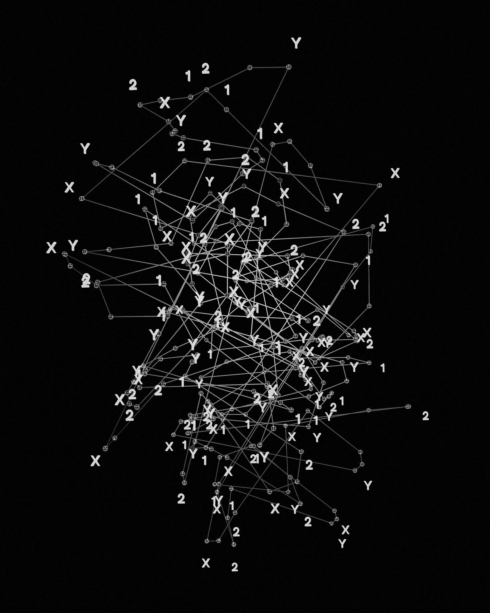

照片由[资源库](https://unsplash.com/@resourcedatabase?utm_source=medium&utm_medium=referral)在 [Unsplash](https://unsplash.com?utm_source=medium&utm_medium=referral) 上拍摄

# 10.矩阵

矩阵是数字的阵列/表格。

在代数中，它们被广泛用于以简洁的方式执行运算。

一个`m * n`矩阵有`m`行(水平)和`n`列(垂直)。

矩阵中的元素标记如下，其中对于元素`a`:

*   下标中的 ***第一个*** 号是第 ***行*** 号，
*   下标中的 ***第二个*** 号是 ***栏中的*** 号

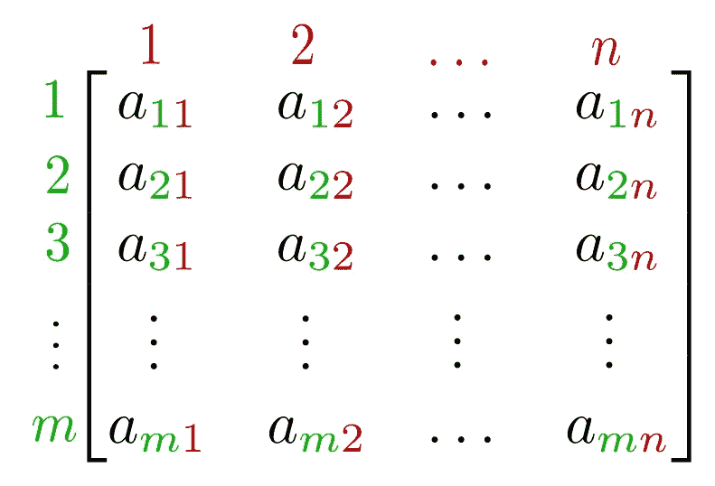

一个有(mn)个元素的 m*n 矩阵(图片来自维基百科)

# 矩阵运算

## 加法和减法

**先决条件** :
两个矩阵 ***必须*** 有 ***相同的维数*** 即有相同的行数和列数，以便它们相加或相减。

一个位置的数字可以从另一个矩阵中类似位置的元素中加减，如下所示:

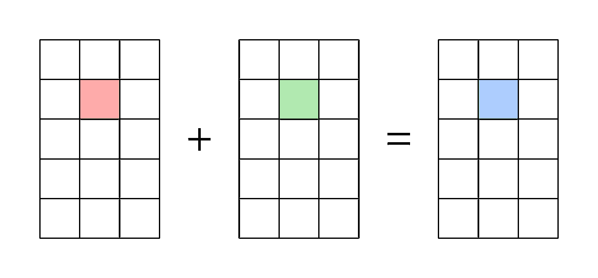

矩阵加法的图形表示(图片来自维基百科)

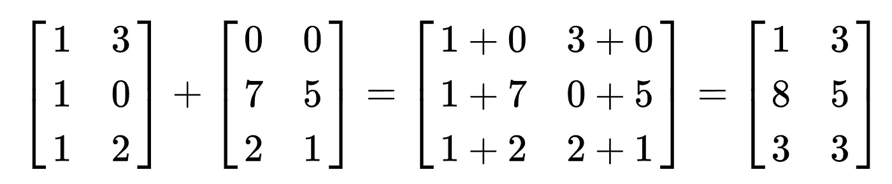

矩阵加法的数字表示(维基百科中的例子)

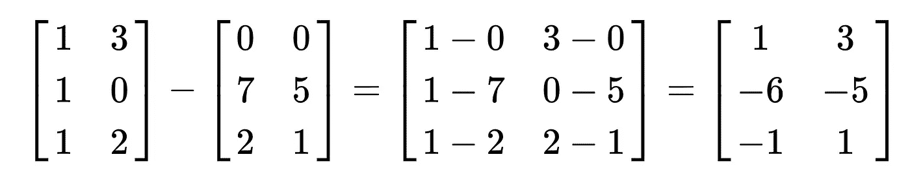

矩阵减法的数字表示(维基百科中的例子)

## 矩阵乘法

**先决条件:**
两个矩阵 A&B**只有 **A** 的 ***列*** 与 **B** 中的*行数相同时**才能相乘。*****

*****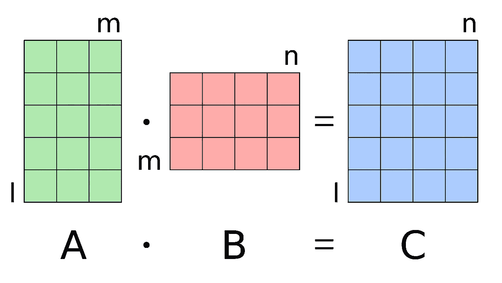*****

*****矩阵乘法中的维数(图片来自维基百科)*****

*****两个 2x2 矩阵可以相乘，如下所示:*****

*****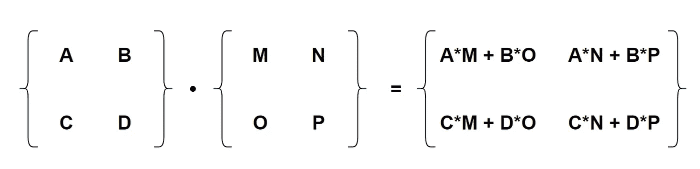*****

*****矩阵乘法的数值表示*****

## *****矩阵转置*****

*****矩阵转置将矩阵翻转到其对角线上。*****

*****该操作通过产生由 A^T.表示的另一个矩阵来切换矩阵 **A** 的行和列索引*****

*****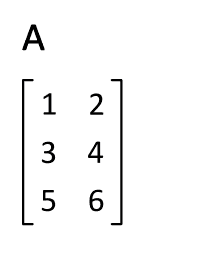*****

*****矩阵乘法的图形表示(图片来自维基百科)*****

## *****矩阵求逆*****

*****在数乘中，如果`x = 10`，那么 x 的逆(x-)即`1/x = 1/10`*****

*****因此，以下情况成立:*****

> *****`x * x^-1 = 1`*****

*****对于矩阵，矩阵的逆矩阵`A`必须满足上述条件。*****

> *****`A * A^-1 = 1`*****

*****例如，2x2 矩阵的逆矩阵可以如下所示:*****

*****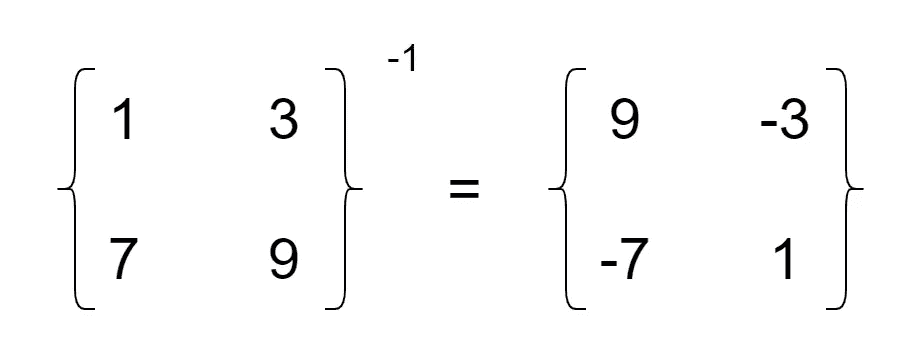*****

*****矩阵求逆的数值表示*****

*****这是因为`A`乘以它的倒数`A^-1`得出以下结果:*****

*****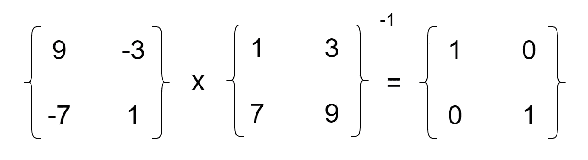*****

*****计算单位矩阵的数值表示*****

## *****单位矩阵(一)*****

*****它是 1 的对应矩阵。*****

*****大小为`n x n`方阵的单位矩阵是主对角线上有 1，其他地方有 0 的矩阵。*****

*****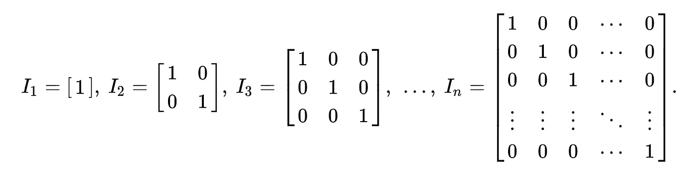*****

*****身份矩阵(图片来自维基百科)*****

## *****矩阵除法*****

*****两个矩阵`A`和`B`可以被划分如下:*****

> *****答 `/ B = A * B^-1`*****

*****请记住，只有当矩阵`B`有可能的逆时，这才会成立。*****

*****还有，*****

> *****关于数字，A `*^-1 * B*` *不等于* `*A * B^-1*` *。******

## *****矩阵属性*****

*   *****矩阵乘法是 ***非交换的********

> *****A `X B`不等于`B X A`*****

*   *****矩阵乘法相对于矩阵加法是 ***分配的********

*****对于尺寸为`*m* × *n*`的矩阵`A`和尺寸为`*n* × *p*` *的矩阵`B`:******

> *****`A(B+C) = AB + AC`(左分配性)*****

*****对于尺寸为`*n* × *p*` 的矩阵`C`和尺寸为`*p* × *q*` *的矩阵`D`:******

> *****`*(B+C)D = BD + CD*`(右分配性)*****

*   *****如果`A`是矩阵，`c`是标量，那么矩阵`cA`和`Ac`是通过将`A`的条目与`c`左右相乘得到的。*****

# *****11.向量*****

*****向量是一个一维矩阵。*****

*****可以写成一串数字。*****

*****单行的矩阵称为 ***行向量*** ( `1 x n`维)。*****

*****单列的矩阵称为 ***列向量*** ( `n x 1`维)。*****

**********

*****照片由[法里斯·穆罕默德](https://unsplash.com/@pkmfaris?utm_source=medium&utm_medium=referral)在 [Unsplash](https://unsplash.com?utm_source=medium&utm_medium=referral) 上拍摄*****

******看看下面这个系列的其他部分:******

***** [## 更好编程的 50 个数学概念(第 1 部分)

### 让我们学习构成计算机科学基础的数学

levelup.gitconnected.com](/5-mathematical-concepts-for-better-programming-d26005932656)  [## 更好编程的 50 个数学概念(第二部分)

### 让我们学习构成计算机科学基础的数学

bamania-ashish.medium.com](https://bamania-ashish.medium.com/50-mathematical-concepts-for-better-programming-part-2-f0dc13a8c05)  [## 更好编程的 50 个数学概念(第 3 部分)

### 让我们学习构成计算机科学基础的数学

levelup.gitconnected.com](/50-mathematical-concepts-for-better-programming-part-3-ea60e4c30531)  [## 更好编程的 50 个数学概念(第 4 部分)

### 让我们学习构成计算机科学基础的数学

levelup.gitconnected.com](/50-mathematical-concepts-for-better-programming-part-4-e44e3b7f3c55)  [## 更好编程的 50 个数学概念(第 5 部分)

### 让我们学习构成计算机科学基础的数学

bamania-ashish.medium.com](https://bamania-ashish.medium.com/50-mathematical-concepts-for-better-programming-part-5-b3624c2227ad)  [## 更好编程的 50 个数学概念(第 6 部分)

### 让我们学习构成计算机科学基础的数学

bamania-ashish.medium.com](https://bamania-ashish.medium.com/50-mathematical-concepts-for-better-programming-part-6-29a04f55edec)  [## 更好编程的 50 个数学概念(第 7 部分)

### 让我们学习构成计算机科学基础的数学

bamania-ashish.medium.com](https://bamania-ashish.medium.com/50-mathematical-concepts-for-better-programming-part-7-90cf3cb3d1f2)  [## 更好编程的 50 个数学概念(第 8 部分)

### 让我们学习构成计算机科学基础的数学

bamania-ashish.medium.com](https://bamania-ashish.medium.com/50-mathematical-concepts-for-better-programming-part-8-ddc977cb4e0e)  [## 更好编程的 50 个数学概念(第 9 部分)

### 让我们来理解构成计算机科学基础的数学

bamania-ashish.medium.com](https://bamania-ashish.medium.com/50-mathematical-concepts-for-better-programming-part-9-1e2c7ff52770)  [## 更好编程的 50 个数学概念(第 10 部分)

### 让我们学习构成计算机科学基础的数学

bamania-ashish.medium.com](https://bamania-ashish.medium.com/50-mathematical-concepts-for-better-programming-part-10-694e5bddade8)  [## 更好编程的 50 个数学概念(第 11 部分)

### 让我们学习构成计算机科学基础的数学

levelup.gitconnected.com](/50-mathematical-concepts-for-better-programming-part-11-606debbb19fa)  [## 更好编程的 50 个数学概念(第 12 部分)

### 让我们学习构成计算机科学基础的数学

bamania-ashish.medium.com](https://bamania-ashish.medium.com/50-mathematical-concepts-for-better-programming-part-12-5ddb98bd7398)  [## 更好编程的 50 个数学概念(第 13 部分)

### 让我们学习构成计算机科学基础的数学

bamania-ashish.medium.com](https://bamania-ashish.medium.com/50-mathematical-concepts-for-better-programming-part-13-ecc6484cdcdc) 

*感谢您阅读本文！*

*如果你是 Python 或编程的新手，可以看看我的新书《没有公牛**t 学习 Python 指南**’***》:**

 [## 学习 Python 的无牛指南

### 你是一个正在考虑学习编程却不知道从哪里开始的人吗？我有适合你的解决方案…

bamaniaashish.gumroad.com](https://bamaniaashish.gumroad.com/l/python-book)  [## 通过我的推荐链接加入 Medium——Ashish Bama nia 博士

### 阅读 Ashish Bamania 博士(以及 Medium 上成千上万的其他作家)的每一个故事。您的会员费直接…

bamania-ashish.medium.com](https://bamania-ashish.medium.com/membership)*****