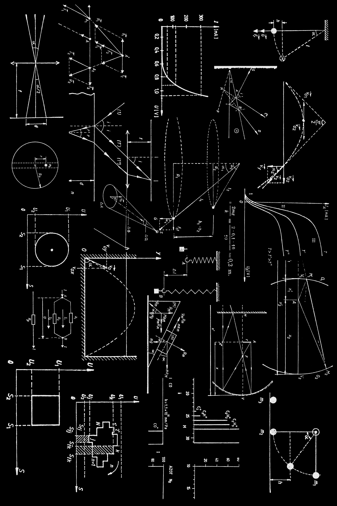
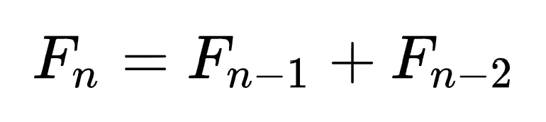
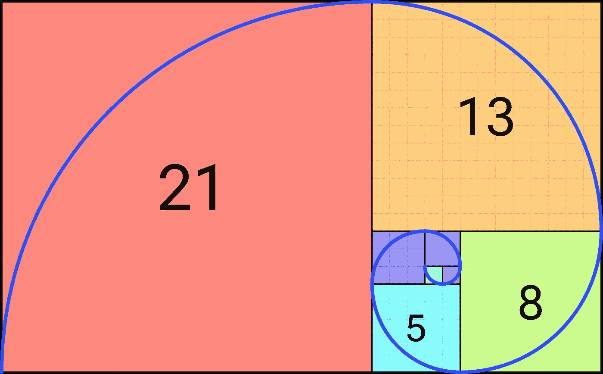
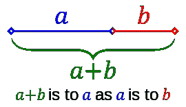
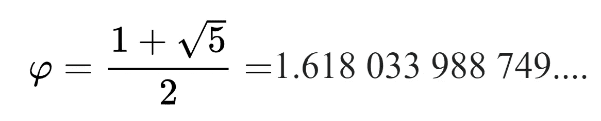
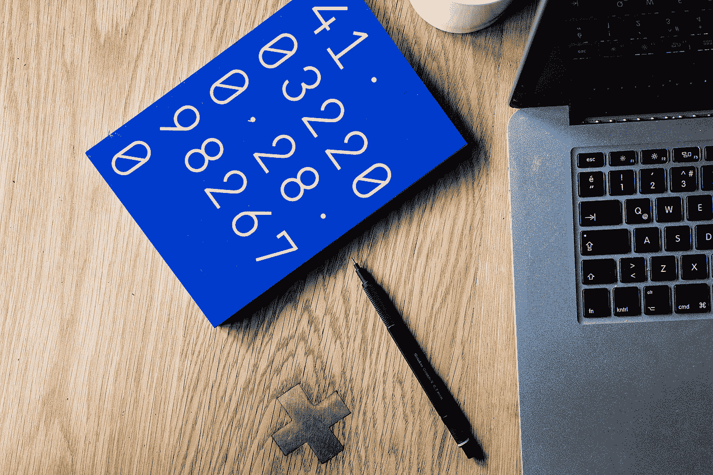
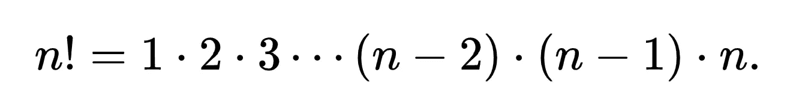
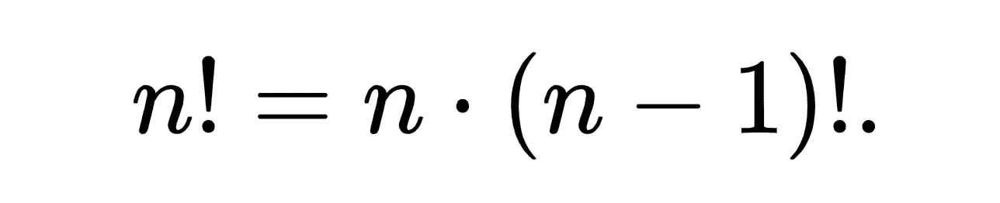
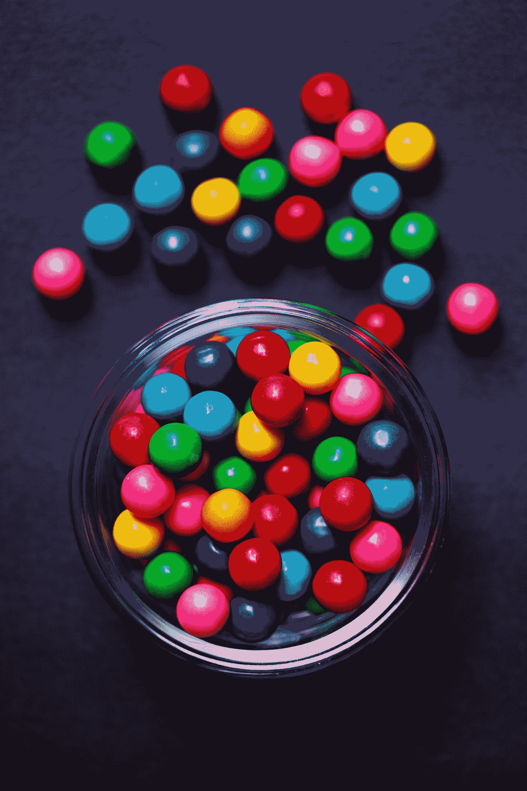

# 更好编程的 50 个数学概念(第 4 部分)

> 原文：<https://levelup.gitconnected.com/50-mathematical-concepts-for-better-programming-part-4-e44e3b7f3c55>



照片由[丹·克里斯蒂安·pădureț](https://unsplash.com/@dancristianpaduret?utm_source=medium&utm_medium=referral)在 [Unsplash](https://unsplash.com?utm_source=medium&utm_medium=referral) 拍摄

# 12.斐波那契数

Fibonacci 数最初是由 Pingala 在印度描述的。

> `1, 1, 2, 3, 5, 8, 13, 21, 34, 55, 89, ...`

它是一个整数序列，可以通过将序列中的前两个数相加得到。



第 n 个斐波那契数的计算

这个序列通常以下列形式出现在自然界中:

*   树木的分枝
*   茎上叶子的排列
*   由向日葵螺旋中的种子数量形成的螺旋数量



斐波那契螺旋

斐波那契数在计算机科学中的应用包括:

*   [斐波那契搜索](https://en.wikipedia.org/wiki/Fibonacci_search_technique)
*   [斐波那契堆](https://en.wikipedia.org/wiki/Fibonacci_heap)
*   [斐波那契立方体](https://en.wikipedia.org/wiki/Fibonacci_cube)
*   [斐波那契编码](https://en.wikipedia.org/wiki/Fibonacci_coding)

*看看我下面的一篇文章，阅读更多关于用斐波那契数列解释递归的内容:*

[](/understanding-recursion-by-dropping-it-eventually-be442c8141f2) [## 通过最终放弃递归来理解递归

### 让我们来理解递归——初级开发人员的噩梦！

levelup.gitconnected.com](/understanding-recursion-by-dropping-it-eventually-be442c8141f2) 

# 13.黄金比例( **φ)**

如果我们把一条线分成两段不同长度的线段，即`A`和`B`，这两段线段都是黄金分割比例(`φ`；phi)如果:

```
A / B = ( A + B ) / A = φ
```



黄金比例线

该方程可以重新排列成如下的二次方程:

```
φ^2 - φ - 1 = 0
```

二次方程的“正”解是:



φ值(黄金比例/平均值)

黄金分割率(`φ`)也可以通过将 ***斐波纳契数列*** 中的一个数除以 后面的 ***得到(对于大的斐波纳契数尤其如此)***

例如，两个连续的斐波纳契数`233`和`114`相除后:

> `233 / 144 = 1.618 = **φ**`

很有趣，不是吗？

# 13.超黄金比例(φ)

超黄金比例来自[纳拉亚纳的奶牛序列](https://oeis.org/A000930)(代表牛群的繁殖)

该序列类似于斐波那契序列，其获得方式如下:

`a(0) = a(1) = a(2) = 1`，此后:

> `a(n) = a(n-1) + a(n-3)`

序列中的前几个数字是:

> 1, 1, 1, 2, 3, 4, 6, 9, 13, 19, 28, 41, 60, 88, …

类似于黄金分割比，超黄金分割比可以通过将这个数列中的两个后续数相除来计算。

这个比例用 psi ( `Ψ`)来表示。

> *ψ= 1.465571231876768026…*



照片由[沃尔坎·奥尔梅斯](https://unsplash.com/@volkanolmez?utm_source=medium&utm_medium=referral)在 [Unsplash](https://unsplash.com?utm_source=medium&utm_medium=referral) 上拍摄

# 14.阶乘

一个数`n`的阶乘用`n!`来表示。

它是所有小于等于 n 的正整数的乘积。



阶乘计算



阶乘计算

> 注意阶乘的值为 0 即`**0! = 1**`

# 15.排列

它是项目以特定的*顺序排列的方式的数量。*

*   *对于给定的`n`项，有`n!`种可能的排列。*
*   *如果从总共`n`个项目中挑选`k`个项目，可能的排列是`n! / (n-k)!`。*

*例如，集合`{1, 2, 3}`有六种排列:*

*   *`(1, 2, 3)`*
*   *`(1, 3, 2)`*
*   *`(2, 1, 3)`*
*   *`(2, 3, 1)`*
*   *`(3, 1, 2)`*
*   *`(3, 2, 1)`*

**

*凯蒂·彩虹·🏳️‍的照片🌈开[退溅](https://unsplash.com?utm_source=medium&utm_medium=referral)*

# *16.组合*

*它是项目排列方式的数量 ***没有特定的顺序。****

*如果从总共`n`个项目中挑选`k`个项目，可能的组合(`C (n, k)`)为:*

> *`n! / (k! * (n-k)!)`*

*例如，从集合`{1, 2, 3}`中挑选两件物品时，有三种组合:*

*   *`(1, 2)`*
*   *`(1, 3)`*
*   *`(2, 3)`*

**看看下面这个系列的其他部分:**

*[](/5-mathematical-concepts-for-better-programming-d26005932656) [## 更好编程的 50 个数学概念(第 1 部分)

### 让我们学习构成计算机科学基础的数学

levelup.gitconnected.com](/5-mathematical-concepts-for-better-programming-d26005932656) [](https://bamania-ashish.medium.com/50-mathematical-concepts-for-better-programming-part-2-f0dc13a8c05) [## 更好编程的 50 个数学概念(第二部分)

### 让我们学习构成计算机科学基础的数学

bamania-ashish.medium.com](https://bamania-ashish.medium.com/50-mathematical-concepts-for-better-programming-part-2-f0dc13a8c05) [](/50-mathematical-concepts-for-better-programming-part-3-ea60e4c30531) [## 更好编程的 50 个数学概念(第 3 部分)

### 让我们学习构成计算机科学基础的数学

levelup.gitconnected.com](/50-mathematical-concepts-for-better-programming-part-3-ea60e4c30531) [](/50-mathematical-concepts-for-better-programming-part-4-e44e3b7f3c55) [## 更好编程的 50 个数学概念(第 4 部分)

### 让我们学习构成计算机科学基础的数学

levelup.gitconnected.com](/50-mathematical-concepts-for-better-programming-part-4-e44e3b7f3c55) [](https://bamania-ashish.medium.com/50-mathematical-concepts-for-better-programming-part-5-b3624c2227ad) [## 更好编程的 50 个数学概念(第 5 部分)

### 让我们学习构成计算机科学基础的数学

bamania-ashish.medium.com](https://bamania-ashish.medium.com/50-mathematical-concepts-for-better-programming-part-5-b3624c2227ad) [](https://bamania-ashish.medium.com/50-mathematical-concepts-for-better-programming-part-6-29a04f55edec) [## 更好编程的 50 个数学概念(第 6 部分)

### 让我们学习构成计算机科学基础的数学

bamania-ashish.medium.com](https://bamania-ashish.medium.com/50-mathematical-concepts-for-better-programming-part-6-29a04f55edec) [](https://bamania-ashish.medium.com/50-mathematical-concepts-for-better-programming-part-7-90cf3cb3d1f2) [## 更好编程的 50 个数学概念(第 7 部分)

### 让我们学习构成计算机科学基础的数学

bamania-ashish.medium.com](https://bamania-ashish.medium.com/50-mathematical-concepts-for-better-programming-part-7-90cf3cb3d1f2) [](https://bamania-ashish.medium.com/50-mathematical-concepts-for-better-programming-part-8-ddc977cb4e0e) [## 更好编程的 50 个数学概念(第 8 部分)

### 让我们学习构成计算机科学基础的数学

bamania-ashish.medium.com](https://bamania-ashish.medium.com/50-mathematical-concepts-for-better-programming-part-8-ddc977cb4e0e) [](https://bamania-ashish.medium.com/50-mathematical-concepts-for-better-programming-part-9-1e2c7ff52770) [## 更好编程的 50 个数学概念(第 9 部分)

### 让我们来理解构成计算机科学基础的数学

bamania-ashish.medium.com](https://bamania-ashish.medium.com/50-mathematical-concepts-for-better-programming-part-9-1e2c7ff52770) [](https://bamania-ashish.medium.com/50-mathematical-concepts-for-better-programming-part-10-694e5bddade8) [## 更好编程的 50 个数学概念(第 10 部分)

### 让我们学习构成计算机科学基础的数学

bamania-ashish.medium.com](https://bamania-ashish.medium.com/50-mathematical-concepts-for-better-programming-part-10-694e5bddade8) [](/50-mathematical-concepts-for-better-programming-part-11-606debbb19fa) [## 更好编程的 50 个数学概念(第 11 部分)

### 让我们学习构成计算机科学基础的数学

levelup.gitconnected.com](/50-mathematical-concepts-for-better-programming-part-11-606debbb19fa) [](https://bamania-ashish.medium.com/50-mathematical-concepts-for-better-programming-part-12-5ddb98bd7398) [## 更好编程的 50 个数学概念(第 12 部分)

### 让我们学习构成计算机科学基础的数学

bamania-ashish.medium.com](https://bamania-ashish.medium.com/50-mathematical-concepts-for-better-programming-part-12-5ddb98bd7398) [](https://bamania-ashish.medium.com/50-mathematical-concepts-for-better-programming-part-13-ecc6484cdcdc) [## 更好编程的 50 个数学概念(第 13 部分)

### 让我们学习构成计算机科学基础的数学

bamania-ashish.medium.com](https://bamania-ashish.medium.com/50-mathematical-concepts-for-better-programming-part-13-ecc6484cdcdc) [](https://bamania-ashish.medium.com/50-mathematical-concepts-for-better-programming-part-14-2e56f3c5a8ae) [## 更好编程的 50 个数学概念(第 14 部分)

### 让我们学习构成计算机科学基础的数学

bamania-ashish.medium.com](https://bamania-ashish.medium.com/50-mathematical-concepts-for-better-programming-part-14-2e56f3c5a8ae) 

*感谢您阅读本文！*

*如果你是 Python 或编程的新手，可以看看我的新书《没有公牛**t 学习 Python 指南**’***下面:**

[](https://bamaniaashish.gumroad.com/l/python-book) [## 学习 Python 的无牛指南

### 你是一个正在考虑学习编程却不知道从哪里开始的人吗？我有适合你的解决方案…

bamaniaashish.gumroad.com](https://bamaniaashish.gumroad.com/l/python-book) [](https://bamania-ashish.medium.com/membership) [## 通过我的推荐链接加入 Medium——Ashish Bama nia 博士

### 阅读 Ashish Bamania 博士(以及 Medium 上成千上万的其他作家)的每一个故事。您的会员费直接…

bamania-ashish.medium.com](https://bamania-ashish.medium.com/membership)*