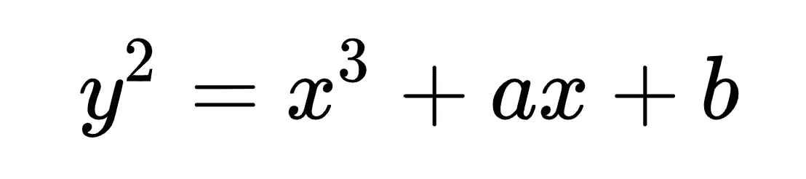
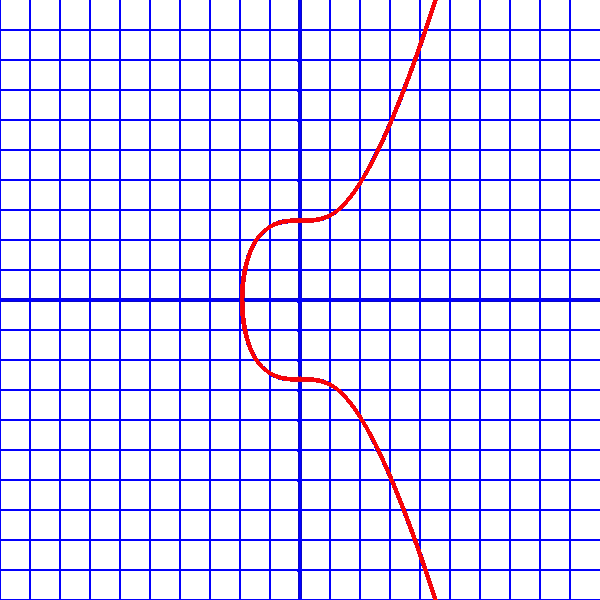

# 更好编程的 50 个数学概念(第 5 部分)

> 原文：<https://levelup.gitconnected.com/50-mathematical-concepts-for-better-programming-part-5-b3624c2227ad>


由[杰斯温·托马斯](https://unsplash.com/es/@jeswinthomas?utm_source=medium&utm_medium=referral)在 [Unsplash](https://unsplash.com?utm_source=medium&utm_medium=referral) 上拍摄的照片

# 17.模运算

模运算可以用下面的词来表示:

> 包着的

想象一个时钟。

当 12 小时时钟指针完成一周并移动到 2 时，时间仍然是 2 而不是 14。


照片由 [insung yoon](https://unsplash.com/@insungyoon?utm_source=medium&utm_medium=referral) 在 [Unsplash](https://unsplash.com?utm_source=medium&utm_medium=referral) 上拍摄

模函数在达到特定值(在时钟秒针的情况下为 60)时将计数器重置为 0。

在 Python 中，一个数的模可以如下计算。

```
print(12 % 2)

#Output: 0
```

这是 12 除以 2 后剩下的余数。

## 适合

给定两个数`a`和`b`，如果这两个数的差`k = a-b`能被另一个数`n`整除:

> `*a*` *和* `*b*` *据说是* ***全等模 n***

> **a ≡ b(模 n)**

## 应用程序

模运算用于:

*   [公钥密码](https://en.wikipedia.org/wiki/Public-key_cryptography)使用[模幂运算](https://en.wikipedia.org/wiki/Modular_exponentiation)
*   [逐位运算](https://en.wikipedia.org/wiki/Bitwise_operation)(例如[异或](https://en.wikipedia.org/wiki/XOR)对 2 位求和，模 2)
*   [国际银行账号](https://en.wikipedia.org/wiki/International_Bank_Account_Number) (IBANs)使用**模 97** 算法来发现银行账号中的用户输入错误
*   计算机代数算法(例如[多项式因式分解](https://en.wikipedia.org/wiki/Factorization_of_polynomials))


由[阿尔普·杜兰](https://unsplash.com/@alpduran?utm_source=medium&utm_medium=referral)在 [Unsplash](https://unsplash.com?utm_source=medium&utm_medium=referral) 上拍摄的照片

# 18.椭圆曲线

使用以下等式定义椭圆曲线:



椭圆曲线的方程

比特币软件中使用的一条椭圆曲线叫做 **secp256k1** 。

该曲线由下面的等式表示，其中`a = 0`和`b = 7`。

> ***y = x + 7***

当用实数作图时，这条曲线看起来如下。



secp256k1 对实数的情节(来源:[比特币维基百科](https://en.bitcoin.it/wiki/Secp256k1))

# 19.田

字段是一组数字及其两个定义的运算:

*   加法(+)和
*   乘法(⋅)

这些操作都应满足某些称为 [**的属性字段公理**](https://en.wikipedia.org/wiki/Axiom#Non-logical_axioms) *。*

*   [加法和乘法的结合律](https://en.wikipedia.org/wiki/Associativity)
*   [加法和乘法的交换性](https://en.wikipedia.org/wiki/Commutativity)
*   [加法](https://en.wikipedia.org/wiki/Additive_identity)和[乘法恒等式](https://en.wikipedia.org/wiki/Identity_element#Definitions)
*   [加法](https://en.wikipedia.org/wiki/Additive_inverse)和[乘法逆运算](https://en.wikipedia.org/wiki/Multiplicative_inverse)
*   [乘法比加法的分配性](https://en.wikipedia.org/wiki/Distributivity)

例如，可以有以下字段:

*   实数
*   复数(即实数+虚数)
*   有理数等等

> N 注意:所有这些字段都包含**无限元素**。


米克·豪普特在 [Unsplash](https://unsplash.com?utm_source=medium&utm_medium=referral) 上拍摄的照片

# 20.有限域

*   这是一个有**个有限**元素的域。
*   字段的**阶**是字段中包含的元素个数。
*   有限域的阶是一个**素数**或者一个素数的**正幂。**
*   集合中两个元素相加或相乘的结果**总是在集合**内。

为了确保上述情况，

对于具有两个元素`a`和`b`的`n`阶有限域 **F(n)** ，它们的:

*   加法被定义为`( a + b ) mod n`
*   乘法被定义为`( a * b) mod n`


由[和](https://unsplash.com/@michiru?utm_source=medium&utm_medium=referral)拍摄的照片

**F(2)** ，最小的有限域有两个元素即`**{ 0, 1 }**`。

**F(2)** 的阶是二(一个素数)。

这个字段在计算机科学中广泛使用，作为一个位的两个可能值。

椭圆曲线、有限域以及它们的模算术运算导致了**公钥加密(将在下面的文章中详细解释)。**

[](/the-mathematics-behind-bitcoin-522f72ed87b7) [## 比特币背后的数学

levelup.gitconnected.com](/the-mathematics-behind-bitcoin-522f72ed87b7) 

查看下面这个系列的其他部分

[](/5-mathematical-concepts-for-better-programming-d26005932656) [## 更好编程的 50 个数学概念(第 1 部分)

### 让我们学习构成计算机科学基础的数学

levelup.gitconnected.com](/5-mathematical-concepts-for-better-programming-d26005932656) [](/50-mathematical-concepts-for-better-programming-part-2-f0dc13a8c05) [## 更好编程的 50 个数学概念(第二部分)

### 让我们学习构成计算机科学基础的数学

levelup.gitconnected.com](/50-mathematical-concepts-for-better-programming-part-2-f0dc13a8c05) [](/50-mathematical-concepts-for-better-programming-part-3-ea60e4c30531) [## 更好编程的 50 个数学概念(第 3 部分)

### 让我们学习构成计算机科学基础的数学

levelup.gitconnected.com](/50-mathematical-concepts-for-better-programming-part-3-ea60e4c30531) [](/50-mathematical-concepts-for-better-programming-part-4-e44e3b7f3c55) [## 更好编程的 50 个数学概念(第 4 部分)

### 让我们学习构成计算机科学基础的数学

levelup.gitconnected.com](/50-mathematical-concepts-for-better-programming-part-4-e44e3b7f3c55) [](https://bamania-ashish.medium.com/50-mathematical-concepts-for-better-programming-part-6-29a04f55edec) [## 更好编程的 50 个数学概念(第 6 部分)

### 让我们学习构成计算机科学基础的数学

bamania-ashish.medium.com](https://bamania-ashish.medium.com/50-mathematical-concepts-for-better-programming-part-6-29a04f55edec) 

感谢您阅读这篇文章！

[](https://bamania-ashish.medium.com/membership) [## 通过我的推荐链接加入 Medium——Ashish Bama nia 博士

### 阅读 Ashish Bamania 博士(以及 Medium 上成千上万的其他作家)的每一个故事。您的会员费直接…

bamania-ashish.medium.com](https://bamania-ashish.medium.com/membership)