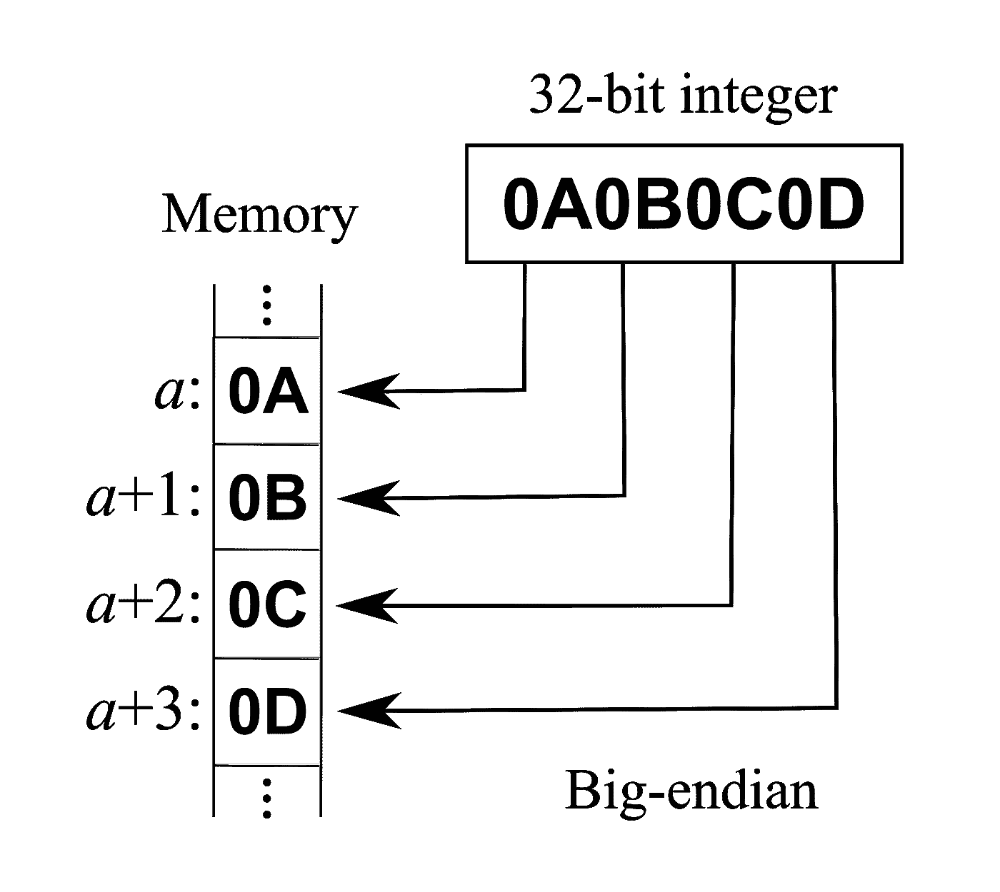
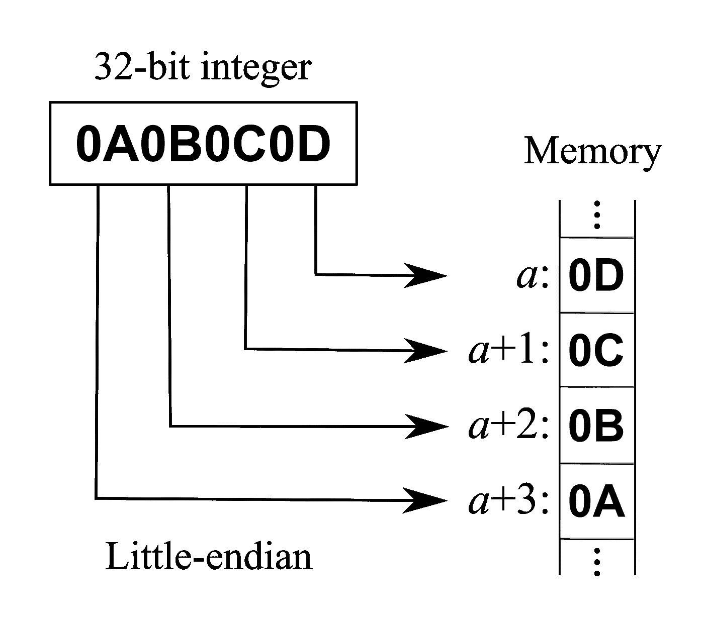

# 更好编程的 50 个数学概念(第 6 部分)

> 原文：<https://levelup.gitconnected.com/50-mathematical-concepts-for-better-programming-part-6-29a04f55edec>

克里斯·贾维斯在 [Unsplash](https://unsplash.com?utm_source=medium&utm_medium=referral) 上拍摄的照片

# 21.十进制数字

我们日常使用的数字是**小数**，也称为**基数(10)** 数字系统。

这个数字系统有介于`0`和`9`之间的数字。

## 数制

为了表示十进制系统中的一个数，我们使用基数(10)符号如下:

> *1 =* `*1*` *x 10⁰*
> 
> `*25*`*=*`*2*`*x 10+*`*5*`*x10⁰*
> 
> `*200*`*=*`*2*`*x 10+*`*0*`*x 10+*`*0*`*x10⁰*

[蒂莫·米勒](https://unsplash.com/@studioeinhalb?utm_source=medium&utm_medium=referral)在 [Unsplash](https://unsplash.com?utm_source=medium&utm_medium=referral) 上的照片

# 22.二进制数

二进制是以**为基数(2)** 的数字系统，有两种可能:`0`和`1`。

二进制是由一位叫做 [Pingala](https://en.wikipedia.org/wiki/Pingala) 的印度数学家在梵语诗歌中发展出来的。

现在，几乎所有现代计算机(除了遵循[量子位](https://en.wikipedia.org/wiki/Qubit)系统的量子计算机)都依赖于二进制位，它们代表开关的‘开’(`1`)和‘关’(`0`)状态。

## 二进制到十进制数的转换

要将十进制数转换为二进制数，我们使用如下的**基数(2)** 符号:

> `*1*` *(二进制)=*`*1*`*×2⁰=*`*1*`*(十进制)*
> 
> `*1010*` *(二进制)=*`*1*`*x2+*`*0*`*x2+*`*1*`*x2+*`*0*`*x2⁰=*`*10*`*(十进制)*

## 十进制到二进制数的转换

要将十进制数`N`转换为二进制数，步骤如下:

*   将数字`N`除以 2，并将余数存储在一个列表中。
*   继续这样做，直到你到达`0`
*   在这一点上，保留你的余数列表，这将是最终的二进制数

例如，88 可以转换为二进制，如下所示:

*   `88/2 = 44`(余数= `0`)
*   `44/2 = 22`(余数= `0`)
*   `22/2 = 11`(余数= `0`)
*   `11/2 = 5`(余数= `1`)
*   `5/2 = 2`(余数= `1`)
*   `2/2 = 1`(余数= `0`)
*   `1/2 = 0`(余数= `1`)

余数可以写成`0001101`。

为了得到结果，将最低有效位改为最高有效位，即`1011000`

## 添加

当相加二进制数时，结果是相加的两个数中最大的一个。

*   `0` + `0` = `0`
*   `1` + `0` = `1`
*   `0` + `1` = `1`

在`1` + `1`的情况下，结果是`0`，我们结转`1`。

安妮·斯普拉特在 [Unsplash](https://unsplash.com?utm_source=medium&utm_medium=referral) 上拍摄的照片

## 二进制数的 1 的补码

一个二进制数的 1 的补码是通过用 0 代替它的所有 1 来计算的，反之亦然。

比如`10101`的 1 的补码是`01010`。

> 1 的补码表示按位`NOT`逻辑运算。

## 二进制数的补码

二进制数的二进制补码通过计算一进制补码和**给定结果的最低有效位(LSB)** 加 1 来计算。

例如:

`1010`的 2s 补码为:

*   步骤 1:计算 1s 补码，即`0101`
*   第二步:LSB 加 1，即`0101` + `0001` = `0110`

> 2s 补码用来表示**有符号整数**。

## 减法

当减去两个二进制数时，以下规则适用:

*   `0`–`0`=`0`
*   `1`–`0`=`1`
*   `1`–`1`=`0`

如果`0`–`1`的情况，结果是`1`，我们从下一个更高的顺序号借用`1`。

例如:

`1111`——`1010`=`0101`

## 增加

将两个二进制数相乘时，以下规则适用:

*   `0` x `0` = `0`
*   `0` × `1` = `0`
*   `1` × `0` = `0`
*   `1` × `1` = `1`

YouTube 上有一个来自可汗学院的短视频，它比仅仅阅读更好地解释了乘法。

## 分开

仅仅通过阅读也很难理解二进制除法。

看看 YouTube 上 Neso Academy 的这个视频，它很好地解释了这个问题。

# 23.十六进制数字

有遵循**基数(16)** 数制的数。

这些由下面的集合表示:

`{0,1,2,3,4,5,6,7,8,9,A,B,C,D,E,F}`

十六进制数字是常用的:

*   来表示内存地址
*   来表示媒体访问控制(MAC)地址
*   定义颜色

## 十六进制到十进制的转换

要将十六进制数转换成十进制数，我们使用如下的**基数(16)** 符号:

> `*1*` *(十六进制)=*`*1*`*x 16⁰=*`*1*`*(十进制)*
> 
> `*1ED2*` *(十六进制)=*`*1*`*×16+*`*E*`*×16+*`*D*`*×16+*`*2*`*×16⁰=*`*7890*`*(十进制)*

## 六化学到二化学的转换

执行此操作的步骤如下:

*   将十六进制数拆分成单个值
*   将每个值转换成十进制数
*   将十进制数转换为 4 位二进制数
*   将它们结合在一起

例如，`1ED2`是二进制的是:

*   `1`->-`1`(十进制)->-`0001`(二进制)
*   `E`->-`14`(十进制)->-`1110`(二进制)
*   `D`->-`13`(十进制)->-`1101`(二进制)
*   `2`->-`2`(十进制)->-`0010`(二进制)

将它们全部组合得到结果:`0001111011010010`或`1111011010010`(去掉开头的`0` s)

简·kopřiva 在 [Unsplash](https://unsplash.com?utm_source=medium&utm_medium=referral) 上拍摄的照片

# 24.字节序

它是在计算机内存中存储数据时使用的字节顺序或序列。

## 大端系统

这里，多字节数据的**最高**有效字节存储在**最小**存储地址，最低有效字节存储在最大存储地址。

在网络上传输数据之前，数据首先被转换为 big-endian。

大端内存存储(图片来自维基百科)

## 小端系统

在该系统中，**最低**有效字节存储在**最小**内存地址，反之亦然。

基于 Intel 的处理器是小字节序的。

小端内存存储(图片来自维基百科)

注意**双端序**处理器可以运行在小端序和大端序模式下。

*看看下面这个系列的其他部分:*

 [## 更好编程的 50 个数学概念(第 1 部分)

### 让我们学习构成计算机科学基础的数学

levelup.gitconnected.com](/5-mathematical-concepts-for-better-programming-d26005932656)  [## 更好编程的 50 个数学概念(第二部分)

### 让我们学习构成计算机科学基础的数学

levelup.gitconnected.com](/50-mathematical-concepts-for-better-programming-part-2-f0dc13a8c05)  [## 更好编程的 50 个数学概念(第 3 部分)

### 让我们学习构成计算机科学基础的数学

levelup.gitconnected.com](/50-mathematical-concepts-for-better-programming-part-3-ea60e4c30531)  [## 更好编程的 50 个数学概念(第 4 部分)

### 让我们学习构成计算机科学基础的数学

levelup.gitconnected.com](/50-mathematical-concepts-for-better-programming-part-4-e44e3b7f3c55)  [## 更好编程的 50 个数学概念(第 5 部分)

### 让我们学习构成计算机科学基础的数学

levelup.gitconnected.com](/50-mathematical-concepts-for-better-programming-part-5-b3624c2227ad)  [## 更好编程的 50 个数学概念(第 7 部分)

### 让我们学习构成计算机科学基础的数学

bamania-ashish.medium.com](https://bamania-ashish.medium.com/50-mathematical-concepts-for-better-programming-part-7-90cf3cb3d1f2) 

*感谢您阅读本文！*

*如果你是 Python 或编程的新手，可以看看我的新书，书名为“* [**”《没有公牛**t 学习 Python 指南**](https://bamaniaashish.gumroad.com/l/python-book)**”***下面:*

 [## 学习 Python 的无牛指南

### 你是一个正在考虑学习编程却不知道从哪里开始的人吗？我有适合你的解决方案…

bamaniaashish.gumroad.com](https://bamaniaashish.gumroad.com/l/python-book)  [## 通过我的推荐链接加入 Medium——Ashish Bama nia 博士

### 阅读 Ashish Bamania 博士(以及 Medium 上成千上万的其他作家)的每一个故事。您的会员费直接…

bamania-ashish.medium.com](https://bamania-ashish.medium.com/membership)