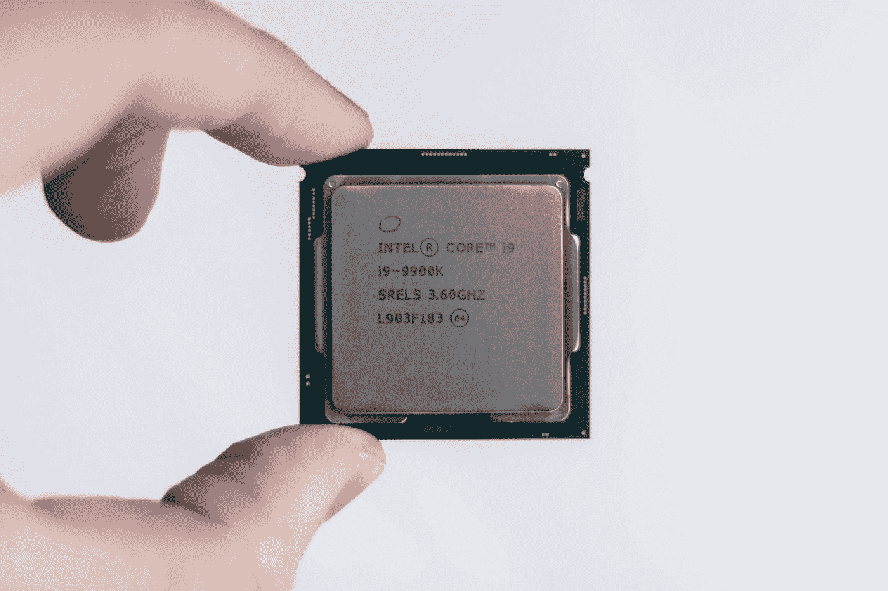

# 更好编程的 50 个数学概念(第 7 部分)

> 原文：<https://levelup.gitconnected.com/50-mathematical-concepts-for-better-programming-part-7-90cf3cb3d1f2>

[杰斯温·托马斯](https://unsplash.com/@jeswinthomas?utm_source=medium&utm_medium=referral)在 [Unsplash](https://unsplash.com?utm_source=medium&utm_medium=referral) 上拍摄的照片

# 25.布尔逻辑

由[乔治·布尔](https://en.wikipedia.org/wiki/George_Boole)开发，它是一种将布尔值(`True`和`False`)编码成变量并对其执行操作的系统化方法(就像在代数中一样)。

布尔变量可以使用**逻辑门组合。**

**逻辑门**对一个或多个二进制输入执行逻辑运算，并产生一个二进制输出。

在计算机中，逻辑门是用**二极管**和**晶体管**实现的。

这种逻辑门可以组合起来形成**逻辑电路**，用于多路复用器、寄存器、算术逻辑单元(alu)、计算机存储器和微处理器等设备。

照片由[克里斯蒂安·威迪格](https://unsplash.com/@christianw?utm_source=medium&utm_medium=referral)在 [Unsplash](https://unsplash.com?utm_source=medium&utm_medium=referral) 上拍摄

逻辑门执行的操作可以使用**真值表**进行总结。

> 真值表中的 0 *和* `*1*` *分别代表关闭和开启状态。*

常用的逻辑门如下:

## 非门/反相器

它**否定/反转**传递给它的输入。

这是一个只需要**一个输入**的门。

`NOT`逻辑运算由求反运算符(`**¬**`)表示。

不是门(图片来自维基百科)

`NOT`门真值表如下:

非门真值表

## 与门

该门执行逻辑**合取**操作。

该操作由`∧`表示。

与门(图片来自维基百科)

`AND`门真值表如下:

与门真值表

## 或门

该门执行逻辑**析取**操作。

该操作由`∨`表示。

或者 Gate 真值表(图片来自维基百科)

`OR`门真值表如下:

或门真值表

## 与非门

它是`AND`门的**补码**。

与非门(图片来自维基百科)

## 或非门

它是`OR`门的补码。

或非门(图片来自维基百科)

## 异或门

也称为**异或门**，它代表**不等函数**(如果输入不相等，输出为`True`，反之亦然)。

异或门(图片来自维基百科)

## XNOR 门

它是`XOR`门的补充。

XNOR 门(图片来自维基百科)

上述所有门的真值表可以总结为:

逻辑门的真值表(图片来自维基百科)

# 26.德摩根定律

这些以奥古斯都·德·摩根命名的法律如下:

定律一:*非* (A *和* B)与*非* A *或*T26 非 B 相同

定律二:*非* (A *或* B)与*非* A *和*T36 非 B 相同

在上述法律中，

*   `.`代表逻辑`AND`操作
*   `+`代表逻辑`OR`操作
*   overbar 代表`NOT`操作
*   `≡`表示与相同的

*考虑到集合，德摩根定律可以用文氏图表示如下:*

**

*从维恩图表示的集合看德摩根定律(图片来自维基百科)*

**看看下面这个系列的其他部分:**

* [## 更好编程的 50 个数学概念(第 1 部分)

### 让我们学习构成计算机科学基础的数学

levelup.gitconnected.com](/5-mathematical-concepts-for-better-programming-d26005932656)  [## 更好编程的 50 个数学概念(第二部分)

### 让我们学习构成计算机科学基础的数学

levelup.gitconnected.com](/50-mathematical-concepts-for-better-programming-part-2-f0dc13a8c05)  [## 更好编程的 50 个数学概念(第 3 部分)

### 让我们学习构成计算机科学基础的数学

levelup.gitconnected.com](/50-mathematical-concepts-for-better-programming-part-3-ea60e4c30531)  [## 更好编程的 50 个数学概念(第 4 部分)

### 让我们学习构成计算机科学基础的数学

levelup.gitconnected.com](/50-mathematical-concepts-for-better-programming-part-4-e44e3b7f3c55)  [## 更好编程的 50 个数学概念(第 5 部分)

### 让我们学习构成计算机科学基础的数学

levelup.gitconnected.com](/50-mathematical-concepts-for-better-programming-part-5-b3624c2227ad)  [## 更好编程的 50 个数学概念(第 6 部分)

### 让我们学习构成计算机科学基础的数学

levelup.gitconnected.com](/50-mathematical-concepts-for-better-programming-part-6-29a04f55edec)  [## 更好编程的 50 个数学概念(第 8 部分)

### 让我们学习构成计算机科学基础的数学

bamania-ashish.medium.com](https://bamania-ashish.medium.com/50-mathematical-concepts-for-better-programming-part-8-ddc977cb4e0e) 

*感谢您阅读这篇文章！*

 [## 通过我的推荐链接加入 Medium——Ashish Bama nia 博士

### 阅读 Ashish Bamania 博士(以及 Medium 上成千上万的其他作家)的每一个故事。您的会员费直接…

bamania-ashish.medium.com](https://bamania-ashish.medium.com/membership)*