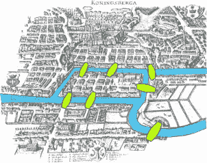
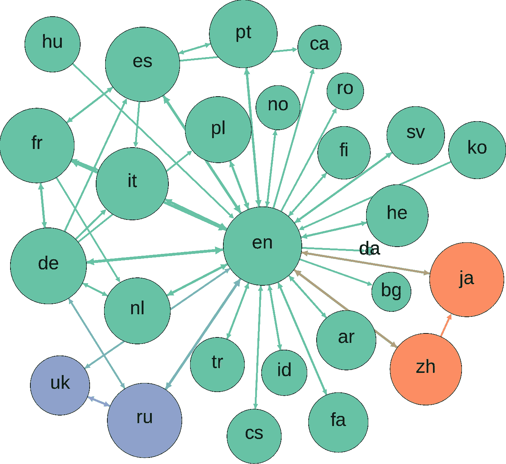
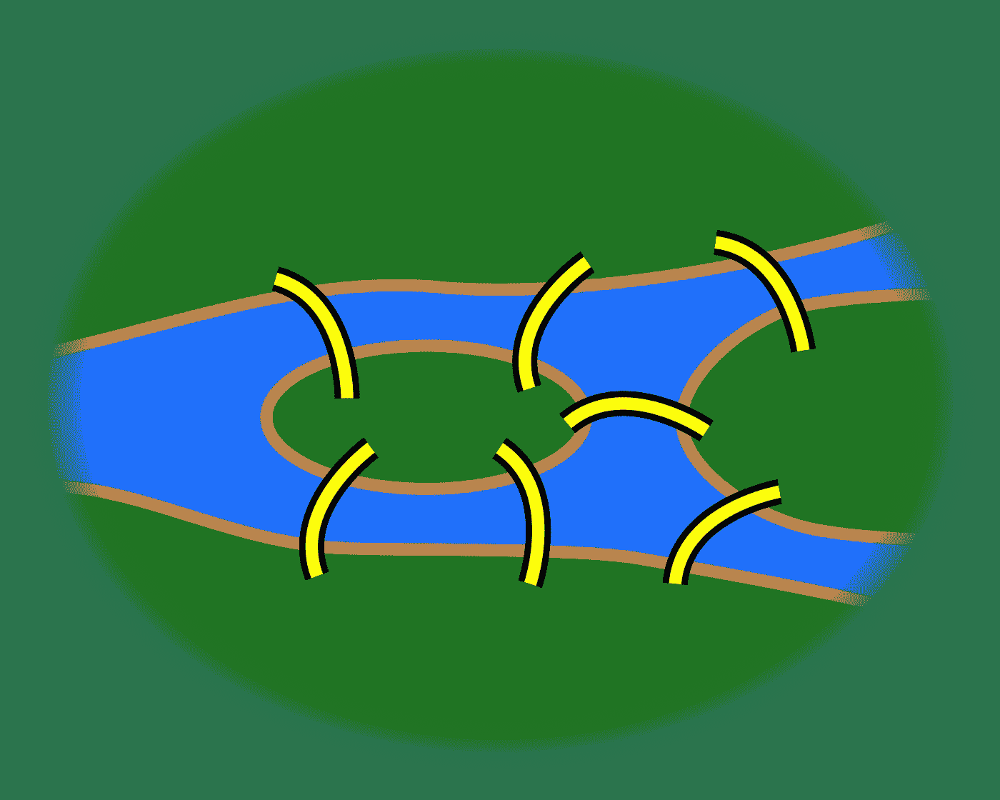
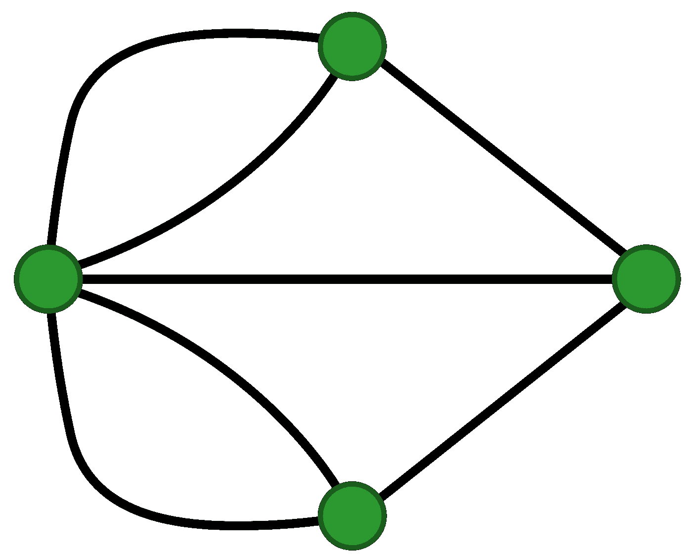
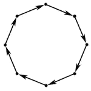

# 更好编程的 50 个数学概念(第 8 部分)

> 原文：<https://levelup.gitconnected.com/50-mathematical-concepts-for-better-programming-part-8-ddc977cb4e0e>


乔尔·菲利普在 [Unsplash](https://unsplash.com?utm_source=medium&utm_medium=referral) 上的照片

# 27.欧拉定理和图论

图论起源于 18 世纪一个有趣的故事。

柯尼斯堡是历史上普鲁士(今天的俄罗斯)的一个城市，有 7 座桥横跨普列格尔河。



柯尼斯堡地图(图片来自维基百科)

有人问:

> 绕着柯尼斯堡走一圈，穿过每座桥正好一次，可能吗？

请注意，我们到底从哪里开始并不重要。

我们将在学习一些术语后回到这个话题。

## 图表

图形是一种数学结构，包括:

*   ***顶点*** (也称*节点*或*点* ) ( **V** )连接而成
*   ***边缘*** (也叫*链接*或*线条* ) ( **E** )

它表示为:

> G = (V，E)

## 程度

一个特定顶点的边数叫做它的**度**。


一个有 6 个顶点和 7 条边的图(图片来自维基百科)

在计算机科学中，图形通常用于描述不同对象之间的关系。

举个例子，脸书作为一个图形代表了不同的人( ***顶点*** )和他们的关系( ***边)。***

同样，维基百科编辑( ***边*** )在夏季的一个月里贡献给不同的维基百科语言版本( ***顶点*** )，可以描述为如下图。



图片来自维基百科

以上面的柯尼斯堡为例，这座有河和桥的城市可以用图解法描述如下。



柯尼斯堡普雷格尔河的图解(图片来自维基百科)

[欧拉](https://en.wikipedia.org/wiki/Leonhard_Euler)首先用下图表示了上图。

他用一个顶点或节点来描述每块陆地，用一条边来描述每座桥。



柯尼斯堡 Pregel 河的图示(图片来自维基百科)

欧拉提出了一个定理:

> 如果除了最多两座桥之外，所有的点都有一个'**偶度'**，那么一座城市的桥可以恰好穿越**一次**。

查看代表柯尼斯堡的图，每个顶点都有一个奇数度，因此不可能绕着城市走一圈，穿过每座桥一次。

这个定理产生了现代图论，也就是对图的研究。

# 28.图表和类型

## 有向图

边有方向的图。

这意味着一条边只能在一个方向上横向移动。

例如，一个表示中型新闻稿及其订户的图表。

## 无向图

边没有方向的图。

这意味着一条边可以双向穿越。

例如，代表脸书上朋友之间关系的图形。

## 循环

一个圈是一个图，它的一些顶点(至少 3 个)连接成一个闭链。

## 循环图

这是一个至少有一个圈的图。



有向循环图(图片来自维基百科)

## 无圈图

这是一个没有圈的图。

## 连通图

它是一个从任意一个顶点到另一个顶点都有边的图。

它可以是:

*   **强连接**:所有顶点之间是否有双向边连接
*   **弱连接**:如果所有顶点之间没有双向连接

## 不连通图

没有连通顶点的图称为不连通图。

# 29.图横向算法

## 深度优先搜索

**深度优先搜索(DFS)** 是一种搜索图形数据结构的算法。

该算法从根节点开始，在返回起点之前尽可能地沿着每个分支进行探索。

深度优先搜索可以在 Python 中定义如下。

这里我们定义了一个`Node`类，它的构造函数定义了它的`children`(连接的**顶点**)和`name`。

`addChild`方法向节点添加新的子节点。

`depthFirstSeach`方法递归实现深度优先搜索算法。

```
class Node:
    def __init__(self, name):
        self.children = []
        self.name = name

    def addChild(self, name):
        self.children.append(Node(name))
        return self

    def depthFirstSearch(self, array):

        array.append(self.name)

        for child in self.children:
            child.depthFirstSearch(array)

        return array
```

## 广度优先搜索

**广度优先搜索** ( **BFS** )是另一种搜索图形数据结构的算法。

它从根节点开始，在移动到其他分支中的节点之前，探索当前分支中的所有节点。

下面可以使用`Node`类的`breadthFirstSearch`方法定义算法。

```
class Node:
    def __init__(self, name):
        self.children = []
        self.name = name

    def addChild(self, name):
        self.children.append(Node(name))
        return self

    def breadthFirstSearch(self, array):
        # Write your code here.
        queue = [self]

        while len(queue)> 0:
            current = queue.pop(0)
            array.append(current.name)

            for child in current.children:
                queue.append(child)

        return array
```

查看下面这个系列的其他部分

[](/5-mathematical-concepts-for-better-programming-d26005932656) [## 更好编程的 50 个数学概念(第 1 部分)

### 让我们学习构成计算机科学基础的数学

levelup.gitconnected.com](/5-mathematical-concepts-for-better-programming-d26005932656) [](/50-mathematical-concepts-for-better-programming-part-2-f0dc13a8c05) [## 更好编程的 50 个数学概念(第二部分)

### 让我们学习构成计算机科学基础的数学

levelup.gitconnected.com](/50-mathematical-concepts-for-better-programming-part-2-f0dc13a8c05) [](/50-mathematical-concepts-for-better-programming-part-3-ea60e4c30531) [## 更好编程的 50 个数学概念(第 3 部分)

### 让我们学习构成计算机科学基础的数学

levelup.gitconnected.com](/50-mathematical-concepts-for-better-programming-part-3-ea60e4c30531) [](/50-mathematical-concepts-for-better-programming-part-4-e44e3b7f3c55) [## 更好编程的 50 个数学概念(第 4 部分)

### 让我们学习构成计算机科学基础的数学

levelup.gitconnected.com](/50-mathematical-concepts-for-better-programming-part-4-e44e3b7f3c55) [](/50-mathematical-concepts-for-better-programming-part-5-b3624c2227ad) [## 更好编程的 50 个数学概念(第 5 部分)

### 让我们学习构成计算机科学基础的数学

levelup.gitconnected.com](/50-mathematical-concepts-for-better-programming-part-5-b3624c2227ad) [](/50-mathematical-concepts-for-better-programming-part-6-29a04f55edec) [## 更好编程的 50 个数学概念(第 6 部分)

### 让我们学习构成计算机科学基础的数学

levelup.gitconnected.com](/50-mathematical-concepts-for-better-programming-part-6-29a04f55edec) [](/50-mathematical-concepts-for-better-programming-part-7-90cf3cb3d1f2) [## 更好编程的 50 个数学概念(第 7 部分)

### 让我们学习构成计算机科学基础的数学

levelup.gitconnected.com](/50-mathematical-concepts-for-better-programming-part-7-90cf3cb3d1f2) [](https://bamania-ashish.medium.com/50-mathematical-concepts-for-better-programming-part-9-1e2c7ff52770) [## 更好编程的 50 个数学概念(第 9 部分)

### 让我们来理解构成计算机科学基础的数学

bamania-ashish.medium.com](https://bamania-ashish.medium.com/50-mathematical-concepts-for-better-programming-part-9-1e2c7ff52770) 

*感谢您阅读这篇文章！*

*如果你是 Python 或编程的新手，可以看看我的新书《Python 学习指南》*[](https://bamaniaashish.gumroad.com/l/python-book)*****下面:*****

****[](https://bamaniaashish.gumroad.com/l/python-book) [## 学习 Python 的无牛指南

### 你是一个正在考虑学习编程却不知道从哪里开始的人吗？我有适合你的解决方案…

bamaniaashish.gumroad.com](https://bamaniaashish.gumroad.com/l/python-book) [](https://bamania-ashish.medium.com/membership) [## 通过我的推荐链接加入 Medium-Ashish Bama nia 博士

### 阅读 Ashish Bamania 博士(以及 Medium 上成千上万的其他作家)的每一个故事。您的会员费直接…

bamania-ashish.medium.com](https://bamania-ashish.medium.com/membership)****