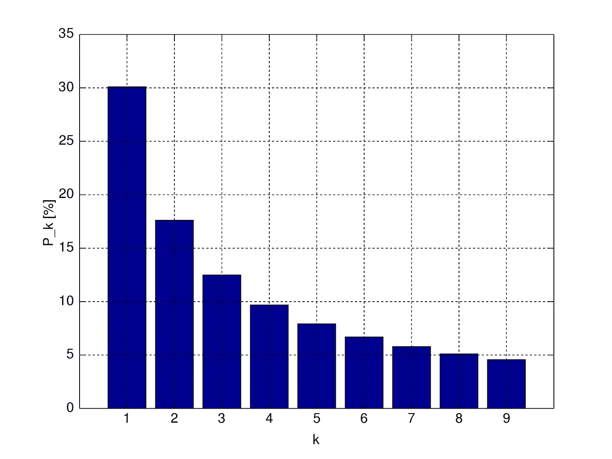
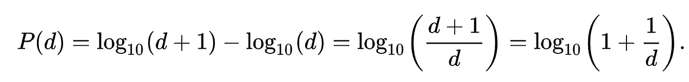
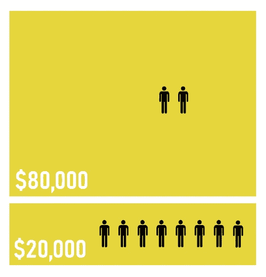
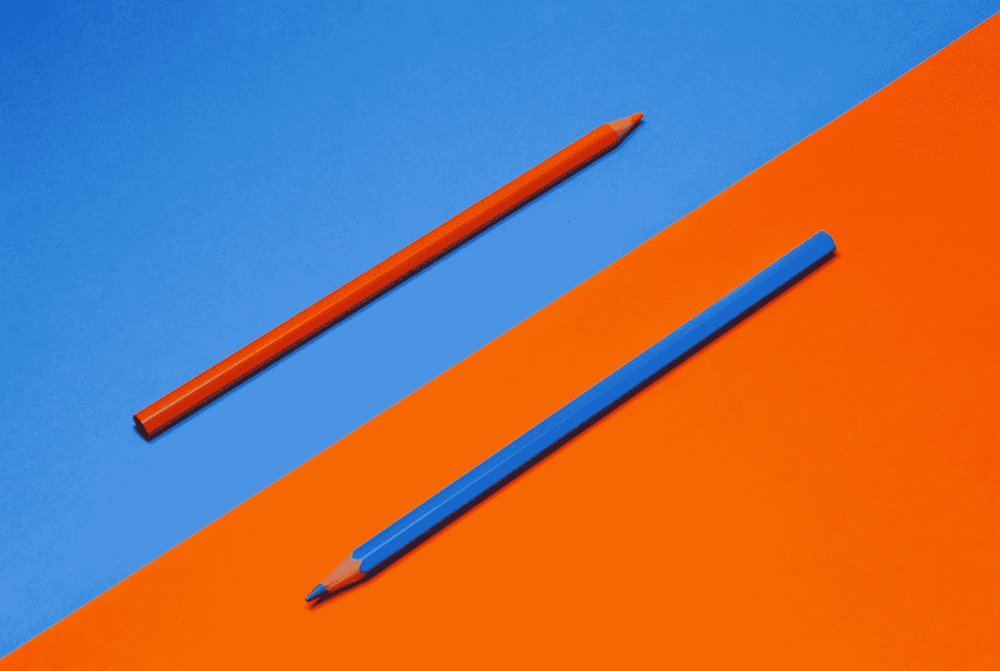

# 更好编程的 50 个数学概念(第 9 部分)

> 原文：<https://levelup.gitconnected.com/50-mathematical-concepts-for-better-programming-part-9-1e2c7ff52770>

[欧几里德](https://en.wikipedia.org/wiki/Euclid)的肖像(图片来自维基百科)

# 30.本福特定律

这是许多现实生活中的数字数据集遵循的观察结果。

在遵循规律的数据集中，前导数字更可能是小的而不是大的。

例如，数字`1`在大约 30%的时间里作为主要有效数字出现，而 9 在不到 5%的时间里作为主要有效数字出现。

本福特定律适用于数量惊人的数据集，包括:

*   股票价格
*   人口数量
*   死亡率
*   物理和数学常数等。

本福德定律:条形的高度是以该数字开头的数字的百分比(图片来自维基百科)

对于以 10 为基数表示的数字，本福德定律在数学上可以表示为:

在哪里，

*   `P(d)` =前导数字出现的概率(`d`)

该定律通常用于检测虚假/随机生成的数据集(例如，随机生成的人口数据集)，因为这些数据集不会遵循本福特定律。

# 31.齐夫定律

它表明等级-频率分布是一个**逆**关系。

应用于自然语言，它表示任何单词的**频率**与它在频率表中的**排名**成反比**。**

例如，最频繁出现的单词的出现频率大约是第二频繁出现的单词的两倍，是第三频繁出现的单词的三倍。

> 第`n`个最常见的单词将以与`1/n`成比例的概率出现。

同样，该定律也适用于其他数据集，例如:

*   数学表达式
*   音乐中音符的等级
*   收入排名
*   观看同一电视频道的人数排名

下面是一个描述齐夫定律的视频:

# 32.帕累托原则

这个原则表明，对于许多现实世界的结果，大约`80%`的结果来自`20%`的原因。

在筹集资金时，20%的捐赠者贡献了总额的 80%(图片来自维基百科)

遵循帕累托原则的观察结果可以用**帕累托分布**来表示。

 [## 帕累托分布-维基百科

### 以意大利土木工程师、经济学家和社会学家维尔弗雷多·帕累托(…

en.wikipedia.org](https://en.wikipedia.org/wiki/Pareto_distribution) 

令人惊讶的是，帕累托原则在计算机科学中也适用。

微软指出，通过修复报告最多的前 20%的错误，给定系统中 80%的相关错误和崩溃将被消除。

# 33.普莱斯定律

它指出任何给定结果的 50%是由对其有贡献的人数的平方根产生的。

例如，某一给定主题的所有出版物的 50%是由所有作者的平方根出版的。

或者，在一个有 100 名员工的公司里，10 个人将生产全部产出的 50%。

爱丽丝·山村在 [Unsplash](https://unsplash.com?utm_source=medium&utm_medium=referral) 上的照片

*看看下面这个系列的其他部分:*

 [## 更好编程的 50 个数学概念(第 1 部分)

### 让我们学习构成计算机科学基础的数学

levelup.gitconnected.com](/5-mathematical-concepts-for-better-programming-d26005932656)  [## 更好编程的 50 个数学概念(第二部分)

### 让我们学习构成计算机科学基础的数学

levelup.gitconnected.com](/50-mathematical-concepts-for-better-programming-part-2-f0dc13a8c05)  [## 更好编程的 50 个数学概念(第 3 部分)

### 让我们学习构成计算机科学基础的数学

levelup.gitconnected.com](/50-mathematical-concepts-for-better-programming-part-3-ea60e4c30531)  [## 更好编程的 50 个数学概念(第 4 部分)

### 让我们学习构成计算机科学基础的数学

levelup.gitconnected.com](/50-mathematical-concepts-for-better-programming-part-4-e44e3b7f3c55)  [## 更好编程的 50 个数学概念(第 5 部分)

### 让我们学习构成计算机科学基础的数学

levelup.gitconnected.com](/50-mathematical-concepts-for-better-programming-part-5-b3624c2227ad)  [## 更好编程的 50 个数学概念(第 6 部分)

### 让我们学习构成计算机科学基础的数学

levelup.gitconnected.com](/50-mathematical-concepts-for-better-programming-part-6-29a04f55edec)  [## 更好编程的 50 个数学概念(第 7 部分)

### 让我们学习构成计算机科学基础的数学

levelup.gitconnected.com](/50-mathematical-concepts-for-better-programming-part-7-90cf3cb3d1f2)  [## 更好编程的 50 个数学概念(第 8 部分)

### 让我们学习构成计算机科学基础的数学

levelup.gitconnected.com](/50-mathematical-concepts-for-better-programming-part-8-ddc977cb4e0e)  [## 更好编程的 50 个数学概念(第 10 部分)

### 让我们学习构成计算机科学基础的数学

bamania-ashish.medium.com](https://bamania-ashish.medium.com/50-mathematical-concepts-for-better-programming-part-10-694e5bddade8) 

*感谢您阅读本文！*

*如果你是 Python 或编程的新手，可以看看我的新书《没有公牛**t 学习 Python 指南**’***下面:**

 [## 学习 Python 的无牛指南

### 你是一个正在考虑学习编程却不知道从哪里开始的人吗？我有适合你的解决方案…

bamaniaashish.gumroad.com](https://bamaniaashish.gumroad.com/l/python-book)  [## 通过我的推荐链接加入 Medium——Ashish Bama nia 博士

### 阅读 Ashish Bamania 博士(以及 Medium 上成千上万的其他作家)的每一个故事。您的会员费直接…

bamania-ashish.medium.com](https://bamania-ashish.medium.com/membership)