# 数据科学真正需要的 50 个函数

> 原文：<https://levelup.gitconnected.com/50-numpy-functions-you-really-needed-for-data-science-fa09e8eb0cf0>

## 理解它们的意义。参数，带有工作示例


[斯科特·格雷厄姆](https://unsplash.com/@homajob?utm_source=medium&utm_medium=referral)在 [Unsplash](https://unsplash.com?utm_source=medium&utm_medium=referral) 上拍照

Numpy 代表 numerical python，是 python 中的一个库，增加了大型多维数组和矩阵的功能。它是 pydata 生态系统中所有库的构建块。对于使用 python 的数据科学家来说，Numpy 是最有用的工具之一。它可以有效地处理大规模数据。使用 NumPy 的最大原因之一是它的数组和使用数组的多个科学函数。在这篇博客中，我们将看看 NumPy 对于数据科学最重要和最有用的一些**功能。**

```
========𝗧𝗔𝗕𝗟𝗘 𝗢𝗙 𝗖𝗢𝗡𝗧𝗘𝗡𝗧========
**-** [**Array Creation Methods**](#3842) **-** [**Array Operations**](#84b9) **-** [**Replacing Values Inside Array**](#9608) **-** [**Set Operations**](#27c5) **-** [**Splitting**](#ee10) **-** [**Stacking**](#aa7c) **-** [**Comparing Two Arrays**](#ee5a) **-** [**Repeating Array Elements**](#8802) **-** [**Einstein Summation Conventions**](#0429) **-** [**Statistical Analysis**](#9976) **-** [**Array Printing Options**](#9394) **-** [**Save and Load Array Data**](#64e5)
```

# 数组创建方法

## 1.排列

它用于从头开始创建**一维或多维数组**。

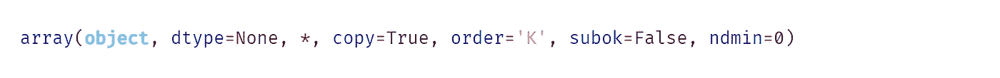

重要参数
**dtype** :结果数组所需的数据类型。
**ndim** :指定结果数组的最小维数。

```
***import numpy as np*** np.array([1,2,3,4,5])
----------------
*array([1, 2, 3, 4, 5, 6])*
```

您还可以使用此函数将系列或数据帧转换为 NumPy 数组。

```
sex = pd.Series(['Male','Male','Female'])
np.array(sex)
------------------------
*array(['Male', 'Male', 'Female'], dtype=object)*
```

## 2.林空间

创建一个在指定间隔内具有均匀间隔的**浮点数的数组。**

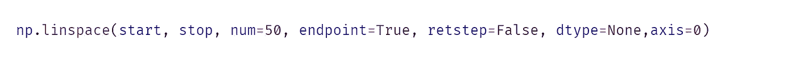

重要参数
开始:起始索引
**结束**:最后索引
**num** :要生成的样本数，默认= 50。

```
np.linspace(10,100,10)
--------------------------------
*array([ 10.,  20.,  30.,  40.,  50.,  60.,  70.,  80.,  90., 100.])*
```

## 3.阿兰格

以一定的**步长返回给定间隔内均匀分布的**整数值**。**

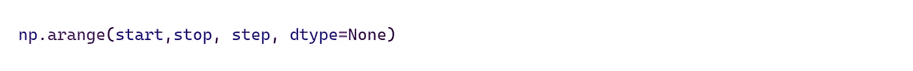

重要参数
步骤:数值之间的空间。

```
np.arange(5,10,2)
-----------------------
*array([5, 7, 9])*
```

## 4.统一样本

从下限值和上限值之间的均匀分布中生成随机样本。

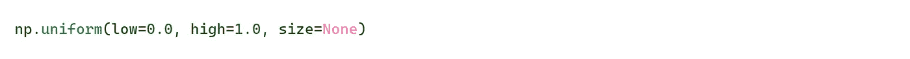

```
np.random.uniform(5,10,size = 4)
**------------**
*array([6.47445571, 5.60725873, 8.82192327, 7.47674099])* np.random.uniform(size = 5)
**------------** *array([0.83358092, 0.41776134, 0.72349553])* np.random.uniform(size = (2,3))
**------------**
*array([[0.7032511 , 0.63212039, 0.6779683 ],
       [0.81150812, 0.26845613, 0.99535264]])*
```

## 5.随机. randint

在一个范围内产生 n 个随机的**整数样本**。

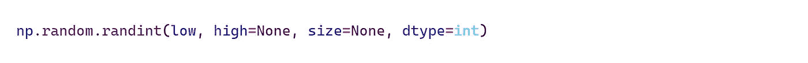

```
np.random.randint(5,10,10)
------------------------------
*array([6, 8, 9, 9, 7, 6, 9, 8, 5, 9])*
```

## 6.随机，随机

生成 n 个随机**浮点样本。**

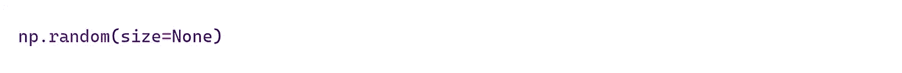

```
np.random.random(3)
---------------------------
*array([0.87656396, 0.24706716, 0.98950278])*
```

## 7.日志空间

在对数标度上生成均匀分布的数字。

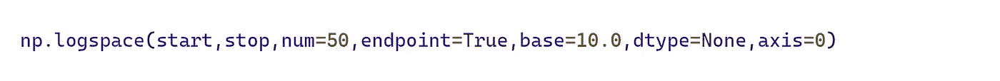

重要参数
开始:序列的开始值。
**end:** 序列的最后一个值。
**终点**:如果为真，最后一个样本将被包含在序列中。
**基数**:日志空间的基数。默认值为 10。

```
np.logspace(0,10,5,base=2)
------------------
*array([1.00000000e+00, 5.65685425e+00, 3.20000000e+01, 1.81019336e+02,1.02400000e+03])*
```

## 8.零数组

`np.zeroes`函数帮助创建一个 0 的数组。


重要参数
形状:合成数组的形状。
**dtype** :期望的结果数组的数据类型。“int”或默认“float”

```
np.zeros((2,3),dtype='int')
---------------
*array([[0, 0, 0],
       [0, 0, 0]])*np.zeros(5)
-----------------
*array([0., 0., 0., 0., 0.])*
```

## 9.一的数组

`np.ones`函数帮助创建一个 1 的数组。


```
np.ones((3,4))
------------------
*array([[1., 1., 1., 1.],
       [1., 1., 1., 1.],
       [1., 1., 1., 1.]])*
```

## 10.k 个随机值数组

创建一个**随机值**的 **n** 维数组。


重要参数
fill_value :数组内部填充的随机值。

```
np.full((2,4),fill_value=2)
--------------
array([[2, 2, 2, 2],
       [2, 2, 2, 2]])(2,4) : ꜱʜᴀᴘᴇ
```

## 11.身份

创建具有指定维度的单位矩阵。


```
np.identity(4)
----------
*array([[1., 0., 0., 0.],
       [0., 1., 0., 0.],
       [0., 0., 1., 0.],
       [0., 0., 0., 1.]])*ᴅᴇꜰᴀᴜʟᴛ ᴅᴀᴛᴀ ᴛʏᴘᴇ ɪꜱ `ꜰʟᴏᴀᴛ`
```


# 数组运算

## 12.福建话

返回数组中的最小值。


**重要参数
轴:**操作所沿的轴。
**out** :存储输出的备选数组。

```
arr = np.array([1,1,2,3,3,4,5,6,6,2])
np.min(arr)
----------------
*1*
```

## 13.最大

返回数组中的最大值。


```
np.max(arr)
------------------
6
```

## 14.独一无二的

返回一个包含所有唯一元素的数组。

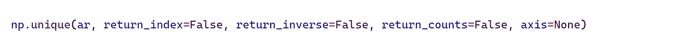

重要参数
return_index :如果为真，返回数组的索引。
**return_inverse** :如果为真，返回唯一数组的索引。
**return_counts** :如果为 True，返回数组中每个唯一元素出现的次数。
**轴**:要操作的轴。默认情况下，该数组被视为展平的。

```
np.unique(arr,return_counts=True)
---------------------
*(
 array([1, 2, 3, 4, 5, 6]),             ## Unique elements
 array([2, 2, 2, 1, 1, 2], dtype=int64) ## Count
)*
```

## 15.平均

它用于获取数组的平均值。


```
np.mean(arr,dtype='int')
-------------------------------
3
```

## 16.中位数

返回数组的中值。


```
arr = np.array([[1,2,3],[5,8,4]])
np.median(arr)
-----------------------------
*3.5*
```

## 17.数字化

返回输入数组中每个值所属的容器的索引。


重要参数
箱:箱数组。
**右**:表示区间是包含左右箱边。

```
a = np.array([-0.9, 0.5, 0.9, 1, 1.2, 1.4, 3.6, 4.7, 5.3])
bins = np.array([0,1,2,3])
np.digitize(a,bins)
-------------------------------
*array([0, 1, 1, 2, 2, 2, 4, 4, 4], dtype=int64)* Exp        Value
x < 0     :   0
0 <= x <1 :   1
1 <= x <2 :   2
2 <= x <3 :   3
3 <=x     :   4Compares -0.9 to 0, here x < 0 so Put 0 in resulting array.
Compares  0.5 to 0, here 0 <= x <1 so Put 1.
.
Compares 5.4 to 4, here 3<=x so Put 4
```

## 18.使再成形

这是 NumPy 最常用的功能之一。它返回一个数组，该数组包含具有新形状的相同数据。


```
A = np.random.randint(15,size=(4,3))
A
----------------------
array([[ 8, 14,  1],
       [ 8, 11,  4],
       [ 9,  4,  1],
       [13, 13, 11]])A.reshape(3,4)
-----------------
array([[ 8, 14,  1,  8],
       [11,  4,  9,  4],
       [ 1, 13, 13, 11]]) A.reshape(-1)  
-------------------
array([ 8, 14,  1,  8, 11,  4,  9,  4,  1, 13, 13, 11])
```

## 19.展开维度

它用于扩展数组的维度。此方法对于创建用于测试机器学习模型的样本测试数据非常有用。


```
arr = np.array(**[** 8, 14,  1,  8, 11,  4,  9,  4, 1, 13, 13, 11**]**)np.expand_dims(A,axis=0)
-------------------------
array(**[[** 8, 14,  1,  8, 11,  4,  9,  4,  1, 13, 13, 11**]]**)np.expand_dims(A,axis=1)
---------------------------
array(**[**[ 8],
       [14],
       [ 1],
       [ 8],
       [11],
       [ 4],
       [ 9],
       [ 4],
       [ 1],
       [13],
       [13],
       [11]**]**)
```

## 20.挤压

通过删除一维条目来降低数组的维数。

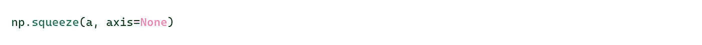

```
arr = np.array([[ 8],[14],[ 1],[ 8],[11],[ 4],[ 9],[ 4],[ 1],[13],[13],[11]])np.squeeze(arr)
---------------------------
array([ 8, 14,  1,  8, 11,  4,  9,  4,  1, 13, 13, 11])
```

## 21.非零计数

对所有非零元素进行计数，并返回它们的计数。


```
a = np.array([0,0,**1**,**1**,**1**,0])np.count_nonzero(a)
--------------------------
3
```

## 22.argwhere

查找并返回非零元素的所有索引。


```
a = np.array([0,0,**1**,**1**,**1**,0])np.argwhere(a)
---------------------
*array([[2],[3],[4]], dtype=int64)*
```

## 23.argmax & argmin

argmax 从数组中返回 max 元素的索引。它可用于在多类图像分类问题中获得高概率预测标签的索引。


```
arr = np.array([[**0.12**,**0.64**,**0.19,0.05**]])np.argmax(arr)
---------
1
```

argmin 将返回数组中最低元素的索引。

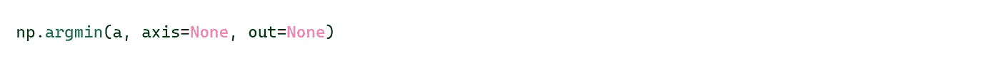

```
np.argmin(min)
------
3
```

## 24.分类

对数组进行排序并返回。


重要参数
种类:要使用的排序算法。{' **快速排序**'，'合并排序'，'堆排序'，'稳定' }

```
arr = np.array([2,3,1,7,4,5])np.sort(arr)
----------------
*array([1, 2, 3, 4, 5, 7])*
```

## 25.丙烯腈-丁二烯-苯乙烯

返回数组中元素的绝对值。当数组包含负值时，这很有用。

```
A = np.array([[1,-3,4],[-2,-4,3]])np.abs(A)
---------------
array([[1, 3, 4],
       [2, 4, 3]])
```

## 26.轮次

将浮点值舍入到指定的小数点位数。

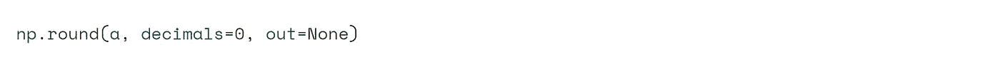

重要参数
小数:要保留的小数位数。

```
a = np.random.random(size=(3,4))
a
-----
array([[0.81695699, 0.42564822, 0.65951417, 0.2731807 ],
       [0.7017702 , 0.12535894, 0.06747666, 0.55733467],
       [0.91464488, 0.26259026, 0.88966237, 0.59253923]])np.round(a,**decimals=0**)
------------
*array([[1., 0., 1., 1.],
       [1., 1., 1., 1.],
       [0., 1., 0., 1.]])*np.round(a,**decimals=1**)
-------------
*array([[0.8, 0\. , 0.6, 0.6],
       [0.5, 0.7, 0.7, 0.8],
       [0.3, 0.9, 0.5, 0.7]])*
```

## 27.夹子

它用于将数组的值保持在一个范围内。

```
arr = np.array([0,1,-3,-4,5,6,7,2,3])**arr.clip(0,5)**
-----------------
*array([0, 1, 0, 0, 5, 5, 5, 2, 3])***arr.clip(0,3)**
------------------ *array([0, 1, 0, 0, 3, 3, 3, 2, 3])***arr.clip(3,5)**
------------------
*array([3, 3, 3, 3, 5, 5, 5, 3, 3])*
```


# 替换数组内的值

## 28.在哪里

从满足条件的数组中返回元素。


重要参数
条件:要匹配的条件。如果为真则产生`x`否则产生`y`。

```
a = np.arange(12).reshape(4,3)
a
-------
array([[ 0,  1,  2],
       [ 3,  4,  5],
       [ 6,  7,  8],
       [ 9, 10, 11]])np.where(a>5)      ## Get The Index
--------------------
(array([2, 2, 2, 3, 3, 3], dtype=int64),
 array([0, 1, 2, 0, 1, 2], dtype=int64))'''
[2][0] ᴇʟᴇᴍᴇɴᴛ (2ɴꜱ ʀᴏᴡ 0ᴛʜ ᴄᴏʟᴜᴍɴ) 6 > 5, ʀᴇᴛᴜʀɴ
[2][1] ᴇʟᴇᴍᴇɴᴛ (2ɴᴅ ʀᴏᴡ 1ꜱᴛ ᴄᴏʟᴜᴍɴ) 7 > 5, ʀᴇᴛᴜʀɴ
.
[3][2] ᴇʟᴇᴍᴇɴᴛ (3ᴅ ʀᴏᴡ 2ɴᴅ ᴄᴏʟᴜᴍɴ) 11 > 5, ʀᴇᴛᴜʀɴ''' **a[np.where(a>5)]**  ## Get Values
--------------------------
array([ 6,  7,  8,  9, 10, 11])
```

它还可用于替换熊猫数据框中的元素。

```
**np.where(*data[feature].isnull()*, 1, 0)**
'''
*Replace Null Values with 1 and other as 0* '''
```

## 28.放

用给定值替换数组中的指定元素。


重要参数
a :数组
**ind** :需要替换的索引。
**v** :要放置的值。

```
arr = np.array([1,2,3,4,5,6])
arr
--------
*array([1, 2, 3, 4, 5, 6])* np.put(arr,[1,2],[6,7])
arr
--------
*array([1, 6, 7, 4, 5, 6])*
```

## 29.复制到

将一个数组的内容复制到另一个数组中。


重要参数**dst:**值被复制到的数组。
**src** :从中复制值的数组。

```
arr1 = np.array([1,2,3])
arr2 = np.array([4,5,6])
print("Before arr1",arr1)
print("Before arr2",arr1)np.copyto(arr1,arr2)
print("After arr1",arr1)
print("After arr2",arr2)
---------------------------
*Before arr1 [1 2 3]
Before arr2 [4 5 6]**After arr1 [4 5 6]
After arr2 [4 5 6]*
```


# 集合操作

## 30.检索公共元素

`np.intersect1d`函数以排序的方式返回两个数组中的所有唯一值。

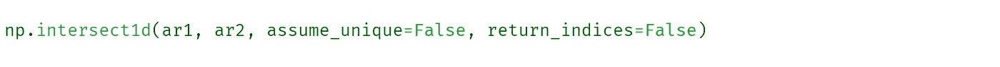

重要参数
assume_unique :如果为真，则输入数组都被认为是唯一的。
**return _ indexes**:如果为真，则返回公共元素索引。

```
ar1 = np.array([1,2,3,4,5,6])
ar2 = np.array([3,4,5,8,9,1])np.intersect1d(ar1,ar2)
---------------
*array([1, 3, 4, 5])*np.intersect1d(ar1,ar2,return_indices=True)
---------------
(array([1, 3, 4, 5]),                 ## Common Elements
 *array([0, 2, 3, 4], dtype=int64),    
 array([5, 0, 1, 2], dtype=int64))* '''
*array([0, 2, 3, 4], dtype=int64) :- Indices of common elements inside first array.
array([5, 0, 1, 2], dtype=int64)) :- Indices of common elements inside second array.* '''
```

## 31.差异

`np.setdiff1d`函数返回 arr2 中不存在的数组 1 的所有唯一元素。

```
a = np.array([1, 7, 3, 2, 4, 1])
b = np.array([9, 2, 5, 6, 7, 8])
np.setdiff1d(a, b)
---------------------
*array([1, 3, 4])*
```

## 32.从两个数组中提取唯一的元素

`setxor1d`函数将按排序顺序返回两个数组中的所有唯一值。

```
a = np.array([1, 2, 3, 4, 6])
b = np.array([1, 4, 9, 4, 36])
np.setxor1d(a,b)
--------------------
*array([ 2,  3,  6,  9, 36])*
```

## 33.联盟

`union1d`函数将两个数组合并成一个。

```
a = np.array([1, 2, 3, 4, 5])
b = np.array([1, 3, 5, 4, 36])
np.union1d(a,b)
-------------------
*array([ 1,  2,  3,  4,  5, 36])*
```

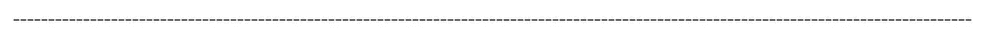

# 剧烈的

## 34.水平分裂

`hsplit`函数将数据水平分割成 n 等份。

```
A = np.array([[3,4,5,2],[6,7,2,6]])np.hsplit(A,2)    ## *splits the data into two equal parts*
---------------
[  array([[3, 4],[6, 7]]),  array([[5, 2],[2, 6]])  ]np.hsplit(A,4)    ## *splits the data into four equal parts*
-----------------
[  array([[3],[6]]),  array([[4],[7]]),
   array([[5],[2]]),  array([[2],[6]])  ]
```

## 35.竖直裂缝

`vsplit`将数据垂直分割成 n 等份。

```
A = np.array([[3,4,5,2],[6,7,2,6]])np.vsplit(A,2)
----------------
[ array([[3, 4, 5, 2]]),  array([[6, 7, 2, 6]]) ]
```


# 堆垛

## 36.水平堆叠

`hstack`将堆栈追加到另一个数组的末尾。

```
a = np.array([1,2,3,4,5])
b = np.array([1,4,9,16,25])np.hstack((a,b))
---------------------
*array([ 1,  2,  3,  4,  5,  1,  4,  9, 16, 25])*
```

## 37.垂直堆叠

将一个数组堆叠在另一个之上。

```
np.vstack((a,b))
----------------------
*array([[ 1,  2,  3,  4,  5],
       [ 1,  4,  9, 16, 25]])*
```


# 比较两个数组

## 38.allclose

`np.allclose`如果两个数组的形状相同，函数根据某个容差值*判断两个数组是否相等或近似相等。*

```
a = np.array([0.25,0.4,0.6,0.32])
b = np.array([0.26,0.3,0.7,0.32])tolerance = 0.1           ## Total Difference 
np.allclose(a,b,tolerance)
---------
Falsetolerance = 0.5
np.allclose(a,b,tolerance)
----------
True
```

## 39.等于

它比较两个数组中的每个元素，如果元素匹配则返回 True。

```
np.equal(arr1,arr2)
-------------
*array([ True,  True,  True, False,  True,  True])*
```


# 重复数组元素

## 40.重复

它用于将一个数组的元素重复 n 次。


重要参数
a :要重复的元素。
**重复**:重复元素的次数。

```
np.repeat('2017',3)
---------------------
array(['2017', '2017', '2017'], dtype='<U4')
```

让我们来看一个更实际的用例，我们有一个包含全年集装箱销售量的数据集。

```
fruits = pd.DataFrame([
    ['Mango',40],
    ['Apple',90],
    ['Banana',130]
],columns=['Product','ContainerSales'])fruits
```

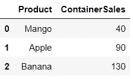

在数据集中，缺少年份列。让我们尝试使用 numpy 来添加它。

```
fruits['year'] = np.repeat(2020,fruits.shape[0])'''
Above code will repeat the year 2020 n times, where n is the length of data.
'''fruits
```

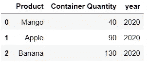

## 41.瓷砖

按照 reps 给定的次数重复 A，构建一个数组。

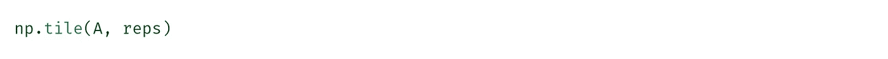

```
np.tile("Ram",5)
-------
array(['Ram', 'Ram', 'Ram', 'Ram', 'Ram'], dtype='<U3')np.tile(3,(2,3))
-------
array([[3, 3, 3],
       [3, 3, 3]])
```


# 爱因斯坦求和约定

## 42.埃因苏姆

这个函数用于计算数组上的许多多维和线性代数运算。

```
a = np.arange(1,10).reshape(3,3)
b = np.arange(21,30).reshape(3,3)▪️ᴇxᴛʀᴀᴄᴛꜱ ᴅɪᴀɢᴏɴᴀʟꜱ
**np.einsum('ii->i',a)**
------------
*array([1, 5, 9])*▪️ᴛʀᴀɴꜱᴘᴏꜱᴇ
**np.einsum('ji',a)**
------------
*array([[1, 4, 7],
       [2, 5, 8],
       [3, 6, 9]])*▪️ᴍᴀᴛʀɪx ᴍᴜʟᴛɪᴘɪᴄᴀᴛɪᴏɴ
**np.einsum('ij,jk',a,b)**
------------
*array([[150, 156, 162],
       [366, 381, 396],
       [582, 606, 630]])*▪️ ꜱᴜᴍ ᴏꜰ ᴅɪᴀɢᴏɴᴀʟ
np.einsum('ii',a)
----------
15
```


# 统计分析

## 43.柱状图

NumPy 的一个重要统计分析功能是计算一组数据的直方图值。

```
A = np.array([[3, 4, 5, 2],
              [6, 7, 2, 6]])np.histogram(A)
-------------------
*(array([2, 0, 1, 0, 1, 0, 1, 0, 2, 1], dtype=int64),
 array([2\. , 2.5, 3\. , 3.5, 4\. , 4.5, 5\. , 5.5, 6\. , 6.5, 7\. ]))*
```

## 44.百分位

它沿着指定的轴计算数据的第 q 个百分位数。

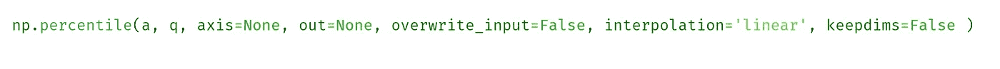

**重要参数
a:** 数组像输入。
**q** :要计算的百分位数。
**overwrite_input** :如果为真，则允许输入数组修改中间计算以节省内存。

```
a = np.array([[2, 4, 6], [4, 8, 12]])np.percentile(a, 50)
-----------
5.0np.percentile(a, 10)
------------
3.0arr = np.array([2,3,4,1,6,7])
np.percentile(a,5)
------------
2.5
```

## 45.标准偏差和方差

`std`和`var`是 NumPy 的两个函数，用于计算沿轴的标准差和方差。

```
a = np.array([[2, 4, 6], [4, 8, 12]])**----- Standard Deviation --------**np.std(a,axis=1)    ## Row Wise
--------
*array([1.63299316, 3.26598632])*np.std(a,axis=0)    ## Column Wise
--------
*array([1., 2., 3.])***----- Variance ----------**np.var(a,axis=1)
-------------------
*array([ 2.66666667, 10.66666667])*np.var(a,axis=0)
-------------------
*array([1., 4., 9.])*
```


# 阵列打印选项

## 46.显示带有两个十进制值的浮点数

```
np**.**set_printoptions**(**precision**=2**)a = np.array([12.23456,32.34535])
print(a)
------------
*array([****12.23,32.34****])*
```

## 47.将数组打印到最大

```
np**.**set_printoptions**(**threshold**=np.inf)**
```

## 48.增加一行中的元素数量

```
np**.**set_printoptions(linewidth**=**100) *## Default 75*
```


# 保存和加载数组数据

## 49.救援

`savetxt`用来保存一个文本文件里面数组的内容。

```
''' Generate array with 500 elements '''
arr = np.linspace(10,100,500).reshape(25,20) ◾ 𝗦𝗮𝘃𝗲𝘀 𝗔𝗿𝗿𝗮𝘆 𝗗𝗮𝘁𝗮 𝗜𝗻𝘀𝗶𝗱𝗲 𝗮 𝘁𝘅𝘁 𝗙𝗶𝗹𝗲
**np.savetxt('array.txt',arr)**
```

## 50.负荷

`loadtxt`用于从文本文件中加载数组的内容。它将文件名作为参数。

```
◾𝗟𝗼𝗮𝗱𝘀 𝗔𝗿𝗿𝗮𝘆 𝗗𝗮𝘁𝗮 𝗳𝗿𝗼𝗺 𝗮 𝘁𝘅𝘁 𝗙𝗶𝗹𝗲
**np.loadtxt('array.txt')** 
```


感谢你读到这里，如果你喜欢我的内容并想支持我，最好的方式是—

1.  跟我上 [*中*](http://abhayparashar31.medium.com/) 。
2.  在 [*LinkedIn*](https://www.linkedin.com/in/abhay-parashar-328488185/) 上联系我。
3.  使用[T22【我的推荐链接】T23](https://abhayparashar31.medium.com/membership)成为中等会员。你会费的一小部分会归我。
4.  订阅 [*我的邮件列表*](https://abhayparashar31.medium.com/subscribe) 永远不会错过我的一篇文章。

## 接下来推荐阅读的文章—

[](https://medium.com/pythoneers/10-useful-automation-scripts-you-need-to-try-using-python-de9c993f1f5) [## 使用 Python 需要尝试的 10 个有用的自动化脚本

### 有用的自动化脚本列表—第 3 部分

medium.com](https://medium.com/pythoneers/10-useful-automation-scripts-you-need-to-try-using-python-de9c993f1f5) [](https://medium.com/pythoneers/10-useful-python-code-snippets-for-datetime-analysis-c4553855ccfe) [## 用于日期时间分析的 10 个有用的 Python 代码片段

### 一瞥时间序列数据

medium.com](https://medium.com/pythoneers/10-useful-python-code-snippets-for-datetime-analysis-c4553855ccfe) [](https://medium.com/pythoneers/10-important-regression-questions-you-should-know-a074d49d7ada) [## 你应该知道的 10 个重要回归问题

### 通过解决这些问题来检查你的知识

medium.com](https://medium.com/pythoneers/10-important-regression-questions-you-should-know-a074d49d7ada)