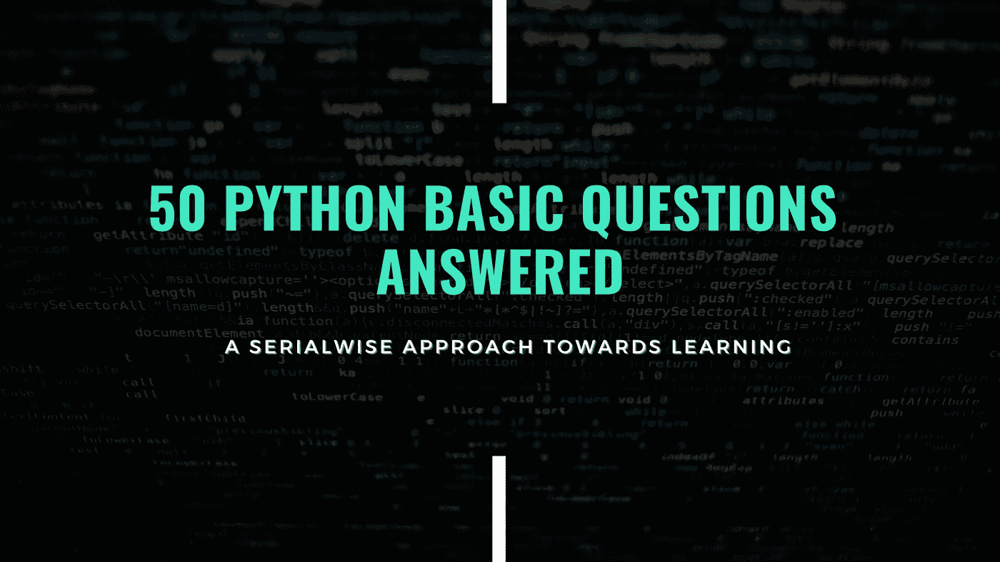
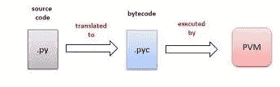

# 回答了 50 个 Python 基本问题

> 原文：<https://levelup.gitconnected.com/50-python-interview-question-and-answers-404e08bc054c>

## 一些检查你的 Python 知识的问题🤔



Python 是编程世界中使用最广泛的语言之一。它有超过 1000 万的下载量。自从它被开发出来并公开供人们使用以来，它变得越来越有名。也多用于 AI 领域。在这个博客里，我们会看到 50 个 python 面试问答。

## 1.Python 是什么，为什么这么受欢迎？

**Ans** : Python 是一种解释型、高级、通用编程语言。Python 的设计哲学强调代码的可读性，并显著地使用了重要的空白。
它很受欢迎，因为它有一个简化的语法，更加强调自然语言。

## 2.为什么 python 执行速度慢，我们如何改进？

**答**:Python 代码执行缓慢的原因是因为它是一种解释型语言。它的代码在运行时被解释，而不是被编译成本地语言。
为了提高 Python 代码的速度，我们可以使用 CPython、Numba 来代替核心 Python，或者我们也可以在代码中做一些修改。
1。减少内存占用。
2。使用内置函数和库。
3。将计算移出循环。
4。保持代码基数小。
5。避免不必要的循环

## 3.Python 有什么特点？

**答案** : 1。易码
2。自由开放的源代码语言。高级语言
4。易于调试
5。哎呀支架
6。大量标准库和第三方模块
7。可扩展特性(我们也可以用 c 和 c++写 python 代码)
8。用户友好的数据结构

## 4.Python 有哪些应用？

**答:** 1。Web 开发
2。桌面 GUI 开发
3。人工智能和机器学习
4。软件开发。商业应用开发。基于控制台的应用程序
7。软件测试。网络自动化。基于音频或视频的应用
10。图像处理应用

## 5.Python 的局限性？

**Ans** : 1。速度
2。移动开发
3。内存消耗(与其他语言相比非常高)
4。**两个版本的不兼容(2，3)** 5。运行时错误(需要更多的测试，并且只有在运行时才会出现错误)
6。简单

## 6.Python 代码是如何执行的？

首先，解释器读取 python 代码并检查任何语法或格式错误。如果发现一些错误，那么它会暂停执行。
如果没有发现错误，则解释器将 python 代码翻译成其等效形式或字节码。然后字节码被发送到 python 虚拟机(PVM)。这里再次执行 python 代码，如果发现任何错误，则停止执行，否则结果将显示在输出窗口中。



Python 代码执行

## 7.Python 中如何管理内存？

**Ans:** Python 内存由 Python 私有 headspace 管理。所有 python 对象和数据结构都位于私有堆中。私有堆的分配由 Python 内存管理器负责。Python 还有一个内置的垃圾收集器，可以回收未使用的内存并释放内存，使其可用于顶部空间。

## 8.解释 python 内置的数据结构？

**Ans:**python 中主要有四种数据结构。
**1。List:**List 是一个异构数据项的集合，从整数到字符串甚至是另一个列表。列表是可变的。列表完成了其他语言中大多数集合数据结构的工作。列表在`[ ]`括号中定义。 **Ex** : a = [1，2，3，4]

**2。集合**:集合是唯一元素的无序集合。像并集`|`、交集`&`和差集`—` 这样的集合运算可以应用于一个集合。集合是不可变的。`()`用来表示一套。
**例如:** a={1，2，3，4，}

**3。Tuple:** Python 元组的工作方式与 Python 列表完全一样，只是它们是不可变的。`()`用来定义一个元组。
**例:** a = (1，2，3，4)

4.**字典:**字典是键值对的集合。它类似于其他语言中的哈希映射。在字典中，键是唯一且不可变的对象。
**Ex:**a = { ' numbers ':[1，2，3，4]}

## 9.解释一下 python 中的//、%和* *运算符？

**Ans:**
//(地板除法)——是一个除法运算符，返回除法的整数部分。5//2=2

%(模数)-返回除法的余数。
**Ex:** 5%2=1

**(幂)-它对运算符执行指数计算。a**b 表示 a 的 b 次方
**例如:** 5**2=25，5**3 = 125

## 10.“”和“”在 python 中是否相同？

**Ans:** 没有。

## 11.python 中追加、扩展和插入的区别。举例说明？

**Ans: append:** 用于在列表末尾添加新元素。
**插入:**用于在列表中的特定位置添加一个元素。
**扩展:**通过增加一个新列表来扩展列表。

```
numbers = [1,2,3,4,5]
numbers.append(6)
print(numbers)
>[1,2,3,4,5,6]**numbers.insert(2,7)** *## insert(position,value)* print(numbers)
>[1,2,7,4,5,6]**numbers.extend([7,8,9])**
print(numbers)
>[1,2,7,4,5,6,7,8,9]numbers.append([4,5])
>[1,2,7,4,5,6,7,8,9,[4,5]]
```

## 12.作品如何破、续、传？

**Ans: break** :满足条件时，程序退出循环。
**继续**:将控制返回到循环的开始。它会导致程序跳过当前循环迭代中的所有剩余语句。
**通过:**它只是让程序通过所有剩余的语句，而不执行。

## 13.区别 python 中的 remove，del，pop？

**Ans: remove:** 删除列表中的第一个匹配值。它将值作为参数。
**del:** 使用索引删除元素。它不返回任何值。
**pop:** 它从列表中删除最上面的元素。它返回列表的顶部元素。

```
numbers = [1,2,3,4,5]
numbers.remove(5)
> [1,2,3,4]
del numbers[0]
>[2,3,4]
numbers.pop()
>4
```

## 14.什么是 switch 语句。如何用 python 创建 switch 语句？

switch 语句是一种选择控制机制，它允许根据一系列值来测试一个变量。switch 语句中的每个值称为一个案例。在 python 中，我们没有 switch 的重建函数，但是我们可以创建一个自定义的 switch 语句。

```
switcher = {
   1: "January",
   2: "February",
   3: "March",
   4: "April",
   5: "May",
   6: "June",
   7: "July",
   8: "August",
   9: "September",
   10: "October",
   11: "November",
   12: "December"
}
month = int(input())
print(switcher.get(month))> 3
march
```

## 15.举例说明 python 中的 range 函数？

**Ans: range** : range 函数返回从起点到终点的多个序列。`range(start,end)`还有一个第三参数，即用于定义范围内步长的步长。

```
for i in range(5):  ## number
    print(i)
**>** 0,1,2,3,4for i in range(1,5):  ##(start,end)
    print(i)
**>** 1,2,3,4
for i in range(0,5,2):   ## (start,end,step)
    print(i)
**>**0,2,4
```

## 16.python 中==和 is 运算符的区别？

**Ans:** `**==**` 它比较两个对象或值的相等性。`is`一个操作符用来检查两个对象是否属于同一个内存对象。

```
lst1 = [1,2,3]
lst2 = [1,2,3]lst1 == lst2
>**True**lst1 is lst2
>**False** ## They Both Belong to different memory object
```

## 17.如何改变列表的数据类型？

**Ans:** 要将一个列表的数据类型改变为元组，你可以使用`tuple()`同样用于集合`set()`

```
lst = [1,2,3,4,2]
set(lst)    ## {1,2,3,4}
tuple(lst)  ## (1,2,3,4,2)
```

## 18.python 中有哪些不同的注释方式？

**Ans:** 在 Python 中，我们可以用两种方式进行注释。
1。``` ``对于多个评论。
2。##用于单行注释。

## 19.区别在！= python 中的 and not 运算符？

**Ans:** `**!=**` 如果变量或对象的值不相等，则返回 true。另一方面`is not`用于检查两个对象是否属于同一个内存对象。

```
lst1 = [1,2,3,4]
lst2 = [1,2,3,4]**lst1 != lst2**
>False**lst1 is not lst2** >True
```

## 20.Python 有主函数吗？

**Ans:** 是的，有。每当我们运行 python 脚本时，它都会自动执行。


安东尼·加兰在 [Unsplash](https://unsplash.com?utm_source=medium&utm_medium=referral) 上拍摄的照片

## 21.什么是 lambda 函数？

**Ans:** Lambda 函数是一个没有名字的单行函数，可以有 n 个参数，但只能有 on 个表达式。它也被称为匿名函数。

```
a = lambda x,y : x+y
print(a(5,6))
**>** 11
```

## **22。iterables 和迭代器的区别？**

**Ans:****iterable**:iterable 是一个对象，可以迭代。在可迭代的情况下，整个数据一次存储在存储器中。
**迭代器**:迭代器是用来迭代一个对象的对象。它只在被调用时被初始化或存储在内存中。迭代器有`next`，使用它从对象中取出元素。

```
**### List is an iterable** lst = [1,2,3,4,5]
for i in lst:
    print(i)**### iterator** lst1 = iter(lst) next(lst1)
>1
next(lst1)
>2for i in lst1:
    print(i)
>3,4,5 
```

## 23.python 中的地图函数是什么？

**Ans:**map 函数将某个函数应用到 iterable 对象的每一项后，返回一个 map 对象。

## 24.用 python 解释 Filter？

**Ans:** 一个过滤函数，用于根据某种条件从可迭代对象中过滤出值。

```
lst = [1,2,3,4,5,6,7,8,9,10] *##iterable*
def even(num):
    if num%2==0:
        return num
list(filter(even,lst))  *## filter all even numbers*
---------------------------------------------
[2, 4, 6, 8, 10]
```

## 25.解释一下 python 中 reduce 函数的用法？

**Ans:**`reduce()`函数接受函数和序列，计算后返回单个值。

```
from functools import reduce
a = lambda x,y:x+y
print(reduce(a,[1,2,3,4]))
**>** 10
```

> PYTHON =(P)programmers(Y)earning(T)O(H)omestead(O)ur(N)oo sphere。—肖恩·麦格拉思

## 26.什么是酸洗和拆线？

**Ans:**pickle 是 python 对象层次转换成字节流的过程，unpickling 是字节流转换成对象的逆过程。

## 27.用 python 解释*args 和**kwargs？

**Ans** : `*args`在我们不确定要传递给函数的参数数量时使用。

```
def add(*num): 
    sum = 0
    for val in num:
        sum = val+sum
    print(sum)add(4,5) 
add(7,4,6)
add(10,34,23)
---------------------
9
17
57
```

`*kwargs`在我们想要将字典作为参数传递给函数时使用。

```
def intro(**data):
    print("\nData type of argument:",type(data)) for key, value in data.items():
        print("{} is {}".format(key,value))intro(name="alex",Age=22, Phone=1234567890)
intro(name="louis",Email="a@gmail.com",Country="Wakanda", Age=25)
--------------------------------------------------------------
Data type of argument: <class 'dict'>
name is alex
Age is 22
Phone is 1234567890

Data type of argument: <class 'dict'>
name is louis
Email is a@gmail.com
Country is Wakanda
Age is 25
```

## 28.解释一下 python 中 re 模块的 sub()、subn()和 split()方法？

**Ans: split()** :每当模式匹配时，该方法将分割字符串。
**sub():** 该方法用于将字符串中的某个模式替换为其他的字符串或序列。

```
import re
string = "There are two ball in the basket 101"
re.split("\W+",string)
---------------------------------------
['There', 'are', 'two', 'ball', 'in', 'the', 'basket', '101']re.sub("[^A-Za-z]"," ",string)
----------------------------------------
'There are two ball in the basket're.subn("[^A-Za-z]"," ",string)
-----------------------------------------
('There are two ball in the basket', 10)
```

## 29.python 中的生成器是什么？

**答:**生成器的定义类似于普通函数。只要需要，生成器就会使用`yield`关键字生成值。如果一个函数包含 yield 关键字，那么该函数将自动成为一个生成器。

```
## A program to demonstrate the use of
# generator object with next()# A generator function 
def Fun(): 
 yield 1
 yield 2
 yield 3# x is a generator object 
x = Fun()print(next(x))
-----------------------------
1print(next(x))
-----------------------------
2
```

## 30.如何使用索引在 python 中反转字符串？

```
**string = 'hello'
string[::-1]
>'**olleh'
```

## 31.类和对象的区别是什么？

Ans: Class: 被认为是对象蓝图的类。类中的第一个字符串称为 doc 字符串，它包含关于类的简短描述。在 python 中，使用`class`关键字创建一个类。一个类包含变量和成员组合，称为类成员。
**例如:**房子的蓝图

**对象:**对象是现实生活中的实体。在 python 中，我们可以使用`obj = CLASS_NAME()`为一个类创建一个对象，例如:`obj=num()`。使用类的对象，我们可以访问一个类的所有成员并操纵它们。

```
class Person:
``` This is a Person Class```
     age = 10   *## varable*
     def greets(self):
          print('Hello')obj = Person()  *## object* print(obj.greet)
----------------------------------------
Hello
```

## 32.python 类里自己理解的是什么？

**Ans: Self** 代表一个类的实例。通过使用 self 关键字，我们可以在 python 中访问类的属性和方法。在 python 中使用 self 是必要的，因为 python 没有用于声明变量的显式语法。

## 33.python 中的`_init_`有什么用？

**Ans:** `**__init__**` 是 python 类中的保留方法。它被称为被调用的的构造函数。每当执行代码时，都会自动调用它。它主要用于初始化类的所有变量。

## 34.用实例解释 Python 中的继承？

**Ans:** 继承允许一个类获得另一个类的所有成员和属性。继承提供了代码的可重用性，使得创建和维护应用程序变得更加容易。我们从其继承的类被称为超类，而被继承的类被称为派生类/子类。

## 35.说出 OOPS 的支柱？

**Ans:** 1。抽象
2。封装
3。传承
4。多态性

> “困难之中蕴藏着机会”——阿尔伯特·爱因斯坦

## 36.你所理解的抽象是什么？

**答:抽象**是只向外界展示一个物体的本质或必要特征，隐藏所有其他无关信息的过程。

## 37.什么是封装？

**答:封装**意味着将数据和成员函数打包成一个单元。它还实现了数据隐藏的概念。

## 38.什么是多态性？

**Ans:多态性**的意思是“多种形式”。子类可以定义自己独特的行为，并且仍然共享其父/基类的相同功能或行为。

## 39.Python 中的猴子补丁是什么？

**Ans:术语 monkey patching 指的是运行时对类或模块的动态修改。**

```
from SomeOtherProduct.SomeModule import SomeClass
def speak(self):
    return "Hello!"

SomeClass.speak = speak
```

## 40.python 支持多重继承吗？

**Ans:** 多重继承意味着，一个类可以从多个父类派生。Python 支持多重继承。

## 41.python 中的 zip 函数是用来做什么的？

**Ans:**zip 函数接受 iterables，将它们聚集在一个元组中，然后返回它。zip()函数的语法是`**zip(*iterables)**`

```
numbers = [1, 2, 3]
string = ['one', 'two', 'three'] 
result = zip(numbers,string)
print(set(result))
-------------------------------------
{(3, 'three'), (2, 'two'), (1, 'one')}
```

## 42.用 python 解释 map()？

**Ans:****map**函数返回给定函数应用于给定可迭代项(如列表、元组等)的每一项后的结果的 map 对象。我们还可以在 map()函数中同时传递多个可迭代对象。
语法:`map(fun,iter)`

```
numbers **=** (1, 2, 3, 4)
result **=** map(**lambda** x: x **+** x, numbers)
print(list(result))
```

## 43.python 中的 decorators 是什么？

**Ans: Decorator** 是 python 中一个有趣的特性。它用于向现有代码添加功能。也称为元编程，因为程序的一部分试图在编译时修改程序的另一部分。

```
def addition(func):
    def inner(a,b):
        print("numbers are",a,"and",b)
        return func(a,b)
    return inner@addition
def add(a,b):
   print(a+b)add(5,6)
---------------------------------
numbers are 5 and 6
sum: 11
```

# 编程问题

## 44.写一个程序在一个文本文件中找到最大的单词？

```
def longest_word(filename):
    with open(filename, 'r') as infile:
              words = infile.read().split()
    max_len = len(max(words, key=len))
    return [word for word in words if len(word) == max_len]print(longest_word('[test.txt](https://gist.github.com/Abhayparashar31/b2c7da66c50b0e97420e261d2eebe2ad)'))
----------------------------------------------------
['comprehensions']
```

## 45.用 Python 写一个程序，检查一个序列是不是回文。

```
a = input("Enter The sequence")
ispalindrome = a == a[::-1]
ispalindrome
**>True**
```

## 46.写一个程序打印 Fibonacci 数列的前十次出现？

```
fibo = [0,1]
[fibo.append(fibo[-2]+fibo[-1]) for i in range(8)]
fibo
**>** [0, 1, 1, 2, 3, 5, 8, 13, 21, 34]
```

## 47.写一个程序统计一个文件中的词频？

```
from collections import Counter
def word_count(fname):
        with open(fname) as f:
                return Counter(f.read().split())print(word_count("test.txt"))
```

## 48.写一个程序按给定的顺序打印所有的质数？

```
lower = int(input("Enter the lower range:"))
upper = int(input("Enter the upper range:"))
list(filter(lambda x:all(x % y != 0 for y in range(2, x)), range(lower, upper)))
-------------------------------------------------
Enter the lower range:10
Enter the upper range:50
*[11, 13, 17, 19, 23, 29, 31, 37, 41, 43, 47]*
```

## 49.写个程序检查一个数字是不是阿姆斯特朗？

```
num = int(input("Enter the number:\n"))
order = len(str(num))
sum = 0
temp = num
while temp > 0:
   digit = temp % 10
   sum += digit ** order
   temp //= 10
if num == sum:
   print(num,"is an Armstrong number")
else:
   print(num,"is not an Armstrong number")
```

## 50.用 python 写一行程序从给定的列表中取出所有的偶数和奇数？

```
a = [1,2,3,4,5,6,7,8,9,10]
odd, even = [el for el in a if el % 2==1], [el for el in a if el % 2==0]
print(odd,even)
**>** ([1, 3, 5, 7, 9], [2, 4, 6, 8, 10])
```

[***用这一套 20 个问题来测试你的编程知识。***](https://colab.research.google.com/drive/17xxrOgQlUxowiNHK4PWcG2NBkOjezNbT?usp=sharing)

> ***感谢阅读😀，跟随*** [***蟒蛇***](https://medium.com/pythoneers) ***与我取得联系***

[](https://medium.com/pythoneers/30-basic-machine-learning-questions-answered-692acd10841f) [## 回答了 30 个最常见的机器学习问题

### 检查并增加您的 ML 知识🤔

medium.com](https://medium.com/pythoneers/30-basic-machine-learning-questions-answered-692acd10841f) [](/21-python-mini-projects-with-codes-c4126e4131e4) [## 21 个带代码的 Python 迷你项目

### 学习编程语言的最好方法是用它来构建项目

levelup.gitconnected.com](/21-python-mini-projects-with-codes-c4126e4131e4)