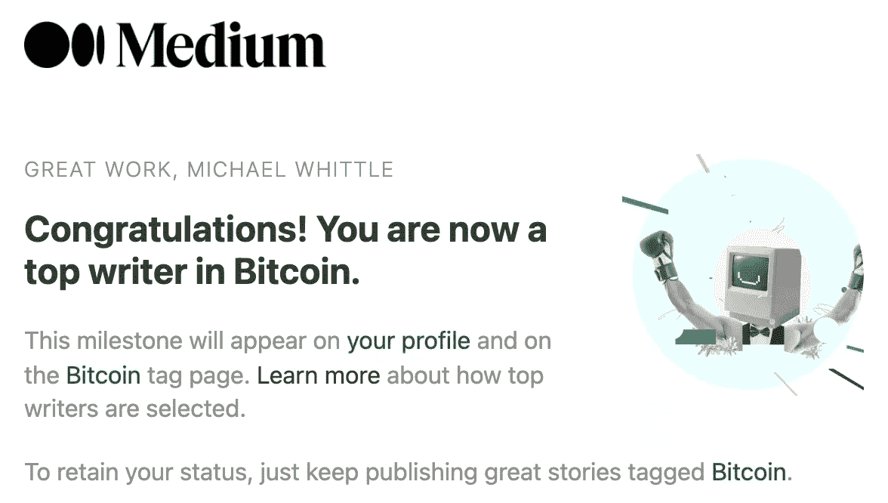
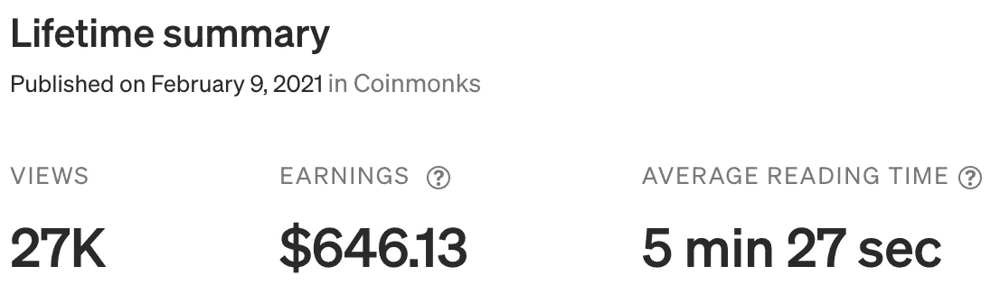
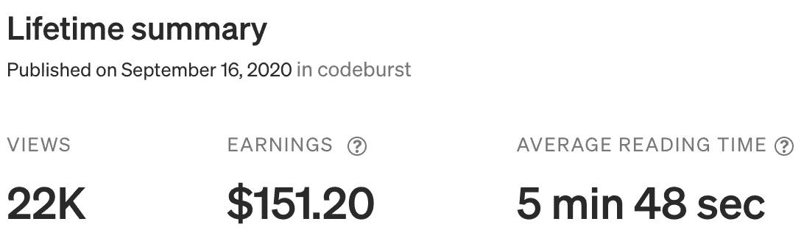
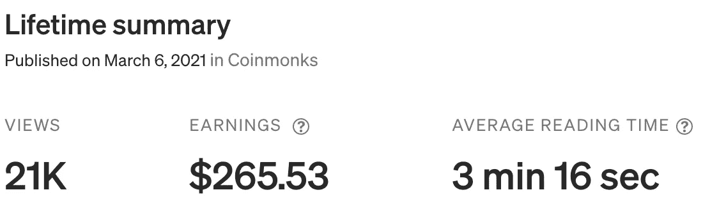

# 5295.47 美元起中号

> 原文：<https://levelup.gitconnected.com/5295-47-from-medium-6dbcd8e4ef79>

## 第一年回顾我的媒介写作之旅

马库斯·温克勒在 [Unsplash](https://unsplash.com?utm_source=medium&utm_medium=referral) 上的照片

2021 年 9 月底，我在 Medium 上写作已经一年了。我记录了自己一路走来的进步，以供那些刚刚起步并希望得到一些建议和提示的人参考。

 [## 我在 2.5 个月内发表了 50 多篇文章——这是我学到的！

### 现在开始看到一些回报…

levelup.gitconnected.com](/ive-published-over-50-articles-in-2-5-months-this-is-what-i-have-learned-e4f747e9463d)  [## 4 个月 62 篇文章…

### 正如我所承诺的，这是我上一篇文章的后续…

levelup.gitconnected.com](/62-articles-in-4-months-74b2374a4340)  [## 从 2021 年 4 月的中等价格 452.52 美元

### 我的媒介写作之旅…

levelup.gitconnected.com](/452-52-from-medium-in-april-2021-ffa35ade51a9) 

在我的第二篇文章中，我给自己设定了一些目标。平心而论，我不知道它们是否现实，但胸怀大志总是好的。

> 我的 2021 年目标…
> 
> 我不知道这有多现实，但我希望我的追随者超过 1000 人，让我的滚动 30 天浏览量在 2021 年底超过 100，000。我会随时告诉你进展情况。

我设法获得了不到**1936**的粉丝，但在 2021 年 5 月的 30 天内达到了峰值**51339**的浏览量。我目前在 30 天内平均有 30，000 次浏览。我不完全确定为什么，但似乎每一万次**都有某种阻力。我仍然一个月写 4 篇文章，我的追随者在增加，但是每月的浏览量似乎已经稳定下来了。我在第一年设法写了 101 篇文章，还不算太坏。今年我设定了一个目标，每个月至少写 4 篇文章，我一直坚持着。**

我已经意识到，我最大的追随者是我的加密相关文章，尤其是我的 PyCryptoBot 开源项目。我确信我可以在这些话题上写更多的东西来显著提高我的统计数据，但是我也喜欢写各种各样的话题。我经历了我喜欢写一个特定主题的阶段。

当 Medium 让我知道我有一段时间是比特币顶级作家的时候，我很欣慰。

作者图片

## 中等“列表”

几个月前，Medium 引入了一个非常好的列表功能，我一直用它来分组和推广我的文章。[我会在这里继续添加和分组我的文章](https://whittle.medium.com/lists)，[敬请期待](https://whittle.medium.com/subscribe)。如果你目前没有在 Medium 上关注我，请关注我。如果你现在还不是一个媒体订阅者，在这里注册是非常值得的。

**Python Crypto Bot(PyCryptoBot)**
*免费开源密码交易 Bot 项目！* [https://whittle . medium . com/list/python-crypto-bot-pycyptobot-201 aa 83271](https://whittle.medium.com/list/python-crypto-bot-pycyptobot-201a1aa83271)

**万物区块链**
*有趣的区块链概念、开发、服务* [https://whittle . medium . com/list/Everything-区块链-6e 1c 989 dafe](https://whittle.medium.com/list/everything-blockchain-6e1c989fdafe)

**大杂烩**
*我写的一堆无主题文章……*
[https://whittle.medium.com/list/a-mixed-bag-72ccd06f1ea0](https://whittle.medium.com/list/a-mixed-bag-72ccd06f1ea0)

**发现亚马逊 AWS 服务**
*通过示例了解如何使用亚马逊 AWS 服务……*
[https://whittle . medium . com/list/Discover-Amazon-AWS-Services-56e 1137 fa 8 FB](https://whittle.medium.com/list/discover-amazon-aws-services-56e1137fa8fb)

**交易中的 Python**
*交易策略及技术分析使用 Python*
[https://whittle . medium . com/list/Trading-in-Python-30453 BC 73 eed](https://whittle.medium.com/list/trading-in-python-30453bc73eed)

**Python 中的数据科学**
*数据处理、建模和可视化* [https://whittle . medium . com/list/Data-Science-in-Python-42 b42 a6 c40d 7](https://whittle.medium.com/list/data-science-in-python-42b42a6c40d7)

**道德黑客培训**
*了解你要防范的是什么很重要！* [https://whittle . medium . com/list/ethical-hacking-training-course-710769700 b83](https://whittle.medium.com/list/ethical-hacking-training-course-710769700b83)

## 我在媒体上的前 3 篇文章

第一名:
[Python 加密机器人(PyCryptoBot)](https://medium.com/coinmonks/python-crypto-bot-pycryptobot-b54f4b3dbb75)

作者图片

第二名:
[React.js API 调用 AWS Lambda，API 网关和处理 CORS](https://codeburst.io/react-js-api-calls-to-aws-lambda-api-gateway-and-dealing-with-cors-89fb897eb04d)

作者图片

第 3 名:
[PyCryptoBot 2 有什么新功能？](https://medium.com/coinmonks/whats-new-in-pycryptobot-2-a4bbb1b0c90e)

作者图片

## 概括起来

在使用 Medium 写作之前，我没有做过其他专业写作。事实上，我从未想过它会成为我如此强烈的兴趣。我真的很喜欢它，希望在 2022 年 10 月给你带来好消息。非常感谢 [Medium](https://medium.com/u/504c7870fdb6?source=post_page-----6dbcd8e4ef79--------------------------------) 为平台和激励奖金做出了巨大贡献。感谢[媒体的工作人员](https://medium.com/u/a32c340ea342?source=post_page-----6dbcd8e4ef79--------------------------------)，他们总是乐于助人，说话也很愉快。非常感谢我忠诚的 PyCryptoBot 部落，他们一直在支持我的写作！

# 迈克尔·惠特尔

*   ***如果你喜欢这个，请*** [***跟我上媒***](https://whittle.medium.com/)
*   ***有兴趣合作吗？让我们连线上***[***LinkedIn***](https://www.linkedin.com/in/miwhittle/)
*   **支持我和其他媒体作者** [**在这里报名**](https://whittle.medium.com/membership)