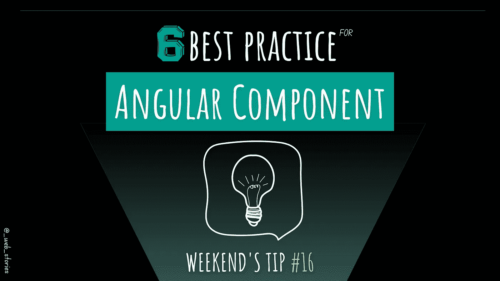
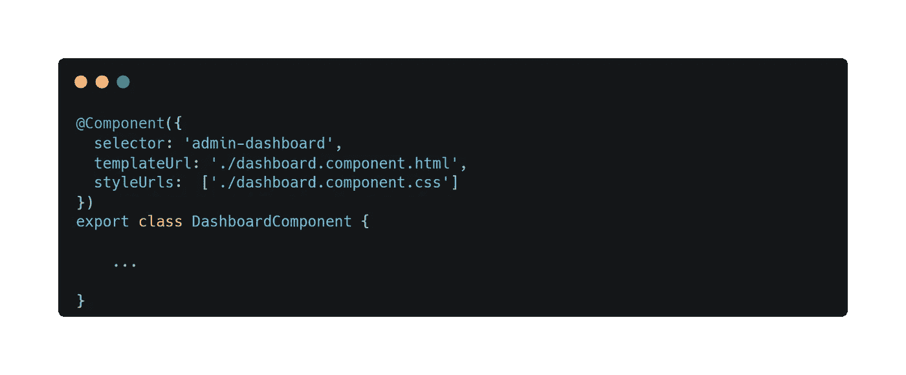
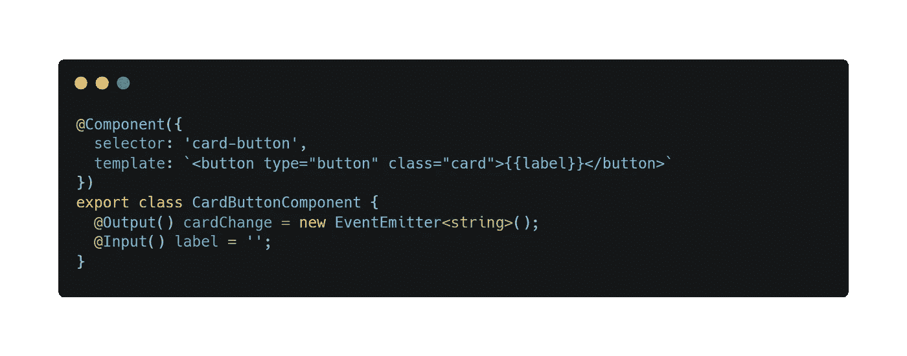

# 6 角形组件的最佳实践

> 原文：<https://levelup.gitconnected.com/6-angular-components-best-practice-40f83bf975b2>

## 创建角度组件时要考虑的最佳实践

作者:FAM

## 你好👋

本周末的提示是关于角组件的。组件是我们用来构建应用程序的小拼图。带组件:

*   我们不重复自己。一个组件可以在应用程序的多个地方使用。
*   我们有一个可维护的代码。我们可以很快发现发生了什么，哪里出了问题。
*   我们可以快速构建应用程序。

这就是为什么现在所有的前端框架和库都使用组件或函数来构建前端。

让我们来看看我在创建角度组件时记住的最佳实践:

# **# 1——何时创建组件？**

组件的主要目的是封装功能。如果该功能在应用程序中重复使用，那么你应该**创建一个组件。如果它很简单，代码不多，你可能**而不是**考虑创建一个组件。**

# #2- **前缀组件选择器:**

默认情况下，Angular CLI 生成带有`***app-***` 前缀的组件。定制组件选择器是一个很好的实践，尤其是在大型应用程序中。它帮助您避免与其他导入的模块冲突，并明确地看到组件来自哪个模块(*快速定位代码原则*)。

在小应用中，自定义一个组件前缀并不有趣。

# #3- **分离组件类、CSS 和模板:**

*   Angular style guide 建议，如果 CSS 或模板多于三行，则将 CSS 移动到样式文件，将 HTML 移动到模板文件。

# #4- **装修投入产出**:

*   使用输入和输出及其对应的装饰器:`[**@Input()**](https://angular.io/api/core/Input)`、`[**@Output()**](https://angular.io/api/core/Output)`，而不是使用`[@Component](https://angular.io/api/core/Component)`@组件中的属性

# #5- **将复杂的逻辑(单一责任原则)委托给服务。**

如果逻辑简单，就把它放在组件中。否则，将其移至服务。我更喜欢把所有的逻辑都交给服务，让组件工作要么作为获取数据并把它分发给孩子的*父/容器*，要么作为显示我们给它的内容的*虚拟组件*。

# #6- **组件成员序列**

在你的团队内部，确保你遵守一套规则来构建一个同质的应用。常见的和推荐的是:

*   第一: ***类属性*** (先公有，后私有)
*   第二:**建造师 **
*   第三:**A*ngular***hooks***(按其生命周期顺序排序)，*
*   *然后**功能**(先公有，后私有)。*

*这就是本周末的^^小贴士*

*今天就到这里，看阿雅🙋*

*如果您有任何问题或反馈，请点击评论或通过 LinkedIn 联系我— **我洗耳恭听！***

*[**想给我买杯咖啡吗？**☕️](https://www.buymeacoffee.com/fatimaamzil)*

> *让我们为 2022 年打造一个更好的‘我们’！*

> *如果你喜欢我的文章， [**订阅**](https://famzil.medium.com/subscribe) 获取我的最新。如果你自己喜欢体验媒介，可以考虑通过[**注册会员**](https://famzil.medium.com/membership) 来支持我和其他成千上万的作家。它只需要每月 5 美元，它支持我们，作家，你也有机会用你的作品赚钱。当然，你可以随时取消会员资格。通过注册[这个链接](https://famzil.medium.com/membership)，你将直接用你的一部分费用来支持我，这不会花费你更多。如果你这样做了，万分感谢！*

*让我们在 [**上**取得联系****](https://medium.com/@famzil/)**[**Linkedin**](https://www.linkedin.com/in/fatima-amzil-9031ba95/)**[**脸书**](https://www.facebook.com/The-Front-End-World)**[**insta gram**](https://www.instagram.com/the_frontend_world/)**[**YouTube**](https://www.youtube.com/channel/UCaxr-f9r6P1u7Y7SKFHi12g)**或***********

******* [## 通过我的推荐链接——FAM 加入 Medium

### 作为一个媒体会员，你的会员费的一部分会给你阅读的作家，你可以完全接触到每一个故事…

famzil.medium.com](https://famzil.medium.com/membership)*******