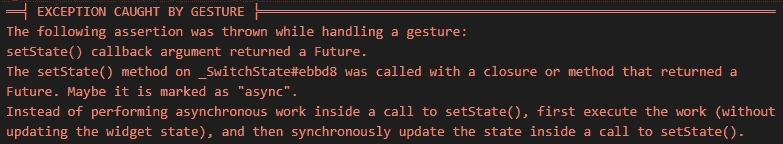

# 在 Flutter 应用程序中使用 setState 的 6 个简单技巧

> 原文：<https://levelup.gitconnected.com/6-easy-tips-when-working-with-setstate-in-a-flutter-application-3d629bc77a16>

## 不要小看它！

## setState 函数是在 Flutter 应用程序中管理状态的最基本的方法。这里有一些保持应用程序可维护性的最佳实践。


照片由[马库斯·温克勒](https://unsplash.com/@markuswinkler)在 [Unsplash](https://unsplash.com/photos/wpOa2i3MUrY) 上拍摄，作者修改

`StatefulWidget`的`setState`函数是一种管理 Flutter 应用程序状态的简单方法。但是如果你想让你的应用程序正常运行，你需要避免几个陷阱。这里有一些你应该坚持的最佳实践。

## setState 有什么用？

`setState`是 Flutter 发布当前小部件及其后代的重建版本的方法。在重建过程中，最新的变量值将用于创建用户界面。比方说，用户将开关从开切换到关。该开关有一个存储该值的后备变量，因此在更改后，它被设置为`false`。在使用新的后备字段值重建之前，交换机本身不会反映这种变化。

改变一个值
调用 setState()
用户界面被更新

## 💡技巧 1:保持你的小部件小！

`setState`触发您当前所在的小部件的重建。如果你的整个应用程序只包含一个小部件，那么这个小部件将被重新构建，这会使你的应用程序变慢。请参见以下示例:

这里我们在一个`Column`中有 5 个`SwitchListTile`小部件，它们都是同一个小部件的一部分。如果您切换任何控件，整个屏幕都会重建。`Scaffold`，`AppBar`，`Column`，...但是只需要重新构建已经改变的小部件就足够了。让我们看看下一个代码示例:

这里我们将`SwitchListTile`包装在一个`StatefulWidget`中。这些页面看起来是一样的，但是如果您单击本例中的任何开关，只有被单击的小部件会重新构建。对于这个小案例，您不会注意到任何性能增强，但是在更大的范围内，它会产生影响。

## 💡技巧 2:不要在构建方法中调用 setState

来自[颤振 API 文档](https://api.flutter.dev/flutter/widgets/State/build.html)

> *这个方法有可能在每一帧中被调用，并且* ***除了构建一个小部件*** *之外不应该有任何副作用。*

build 方法旨在构建小部件树，因此我们应该保持这种方式。不要在这里做花哨的东西，它会降低你的应用程序的速度。对 setState 的调用可能会触发额外的重建，在最坏的情况下，您可能会遇到一个[异常](https://docs.flutter.dev/testing/common-errors#setstate-called-during-build)，告诉您当前正在进行重建。

## 💡技巧 3:不要在 initState 方法中调用 setState

`initState`将在完成后触发重建，因此没有必要在这个方法中调用`setState`。此方法旨在初始化与状态相关的属性，如设置默认值或订阅流。在这里不要做别的事情！

## 💡技巧 4: setState()和 setState(…)是相等的

这样使用 setState 也没关系

```
setState((){
  _text = “Hello”;
});
```

或者像这样

```
_text = “Hello”;
setState((){});
```

结果是一样的。

## 💡提示 5: setState(…)代码必须很小

不要在 setState 中做任何大的计算，因为这会阻止你的应用程序重建屏幕。请看下面的示例代码:

```
setState(() {
  for (var i = 0; i < 10000; i++) print(i);
  _value = true;
});
```

只有在打印语句之后，小部件才会重建。在此期间，你的应用程序不会响应用户的操作，它会在之后执行这些操作。因此，如果一个用户因为没有视觉反馈而多次点击一个控件，多次重建就会堆积起来，会使应用程序速度更慢。

更好的方法是在执行长时间运行的操作时显示进度指示器，这样用户就知道有事情正在发生，他需要等待完成。

## 💡提示 6: setState(…)代码不能是异步的

运行代码时

```
setState(() async {
  await Future.delayed(const Duration(seconds: 5));
});
```

您将得到一条类似这样的异常消息:



在 setState 中使用异步代码时出现异常

在方法之外执行异步操作，然后调用它。

## 结论

我希望这些见解能帮助你更好地理解颤振中 setState 的机制。坚持这些建议，你会有更少的问题和更快的应用程序。源代码示例可以在 [GitHub](https://github.com/xeladu/flutter_set_state) 上找到。

如果你喜欢这篇文章，我会很高兴得到掌声👏(你知道可以拍几次吗？😎)另外，如果你还没有跟上我，我也很感激。

🌲 [linktr.ee](https://linktr.ee/xeladu) | ☕ [咖啡](https://www.buymeacoffee.com/xeladu) |🎁[捐赠](https://www.paypal.com/donate/?hosted_button_id=JPWK39GGPAAFQ) |💻GitHub |🔔[订阅](https://xeladu.medium.com/subscribe)

顺便说一句:如果你还没有 Medium 会员，我建议你使用我的推荐链接◀，因为它会让你访问 Medium 上的所有内容，并以一小部分费用支持我，而不需要你支付任何额外费用。谢谢大家！✨

## 相关故事

[](/how-to-add-a-google-map-to-your-flutter-app-e75a1a99a0c2) [## 如何将谷歌地图添加到你的 Flutter 应用中

### 在本文中，我们将在我们的应用程序中添加一个谷歌地图小部件，并使用定位服务来显示我们当前的…

levelup.gitconnected.com](/how-to-add-a-google-map-to-your-flutter-app-e75a1a99a0c2) [](/flutter-app-from-scratch-part-1-planned-features-app-design-app-skeleton-c87f2c21f47a) [## Flutter app 从零开始第 1 部分—规划的功能、应用设计、应用框架

### 本文涵盖了计划中的应用程序特性、环境设置以及一个新的 Flutter 应用程序的第一个应用程序框架。

levelup.gitconnected.com](/flutter-app-from-scratch-part-1-planned-features-app-design-app-skeleton-c87f2c21f47a) [](/how-to-navigate-between-pages-in-your-flutter-application-ed54558dbae4) [## 如何在你的 Flutter 应用程序中导航页面

### 在这篇文章中，我们将实现页面之间的导航逻辑，这样您就可以引导您的用户到…

levelup.gitconnected.com](/how-to-navigate-between-pages-in-your-flutter-application-ed54558dbae4)