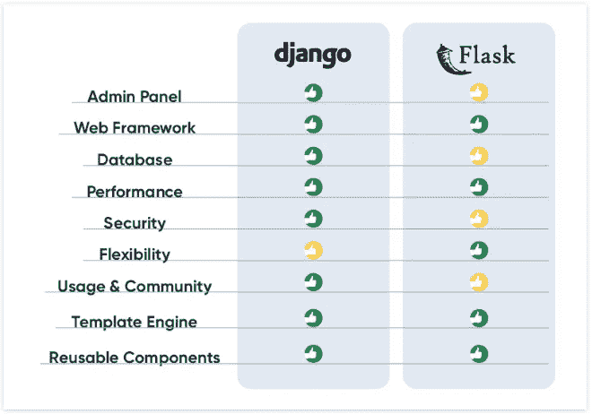
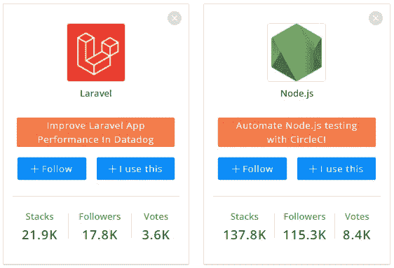
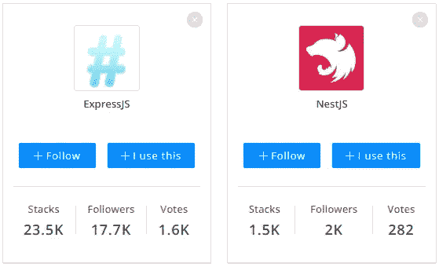

# 你不应该学习的 6 个框架(以及应该学习什么)

> 原文：<https://levelup.gitconnected.com/6-frameworks-you-should-not-learn-and-what-to-learn-instead-97329704194b>

## 这可能是浪费你的时间，你最好学最好的

马体·米罗什尼琴科的照片

你有没有学过一些东西，然后就像，哦，妈的！我希望我已经学会了这个？

这种情况大概发生在我们每个人身上。我们后悔，用逻辑安慰自己。这是人类大脑的本性。

说到框架，我们往往会犯类似的错误。

作为一名程序员，你需要用最好的工具来装备自己。在这篇文章中，我将为你提供你不应该学习的框架和应该学习的内容。我会告诉你每种情况下的原因。

# 1.反应自然

除非你是专业的 React 开发人员，否则学习 React Native 不可能给你最大的优势。

React Native 是二等的。一流的替代品是存在的。事实上，[反应过来的土著是不好的](https://www.cossacklabs.com/blog/react-native-libraries-security/)。安全问题、组件减少、脆弱的 UI、废弃的包等。

上次我检查的时候，看起来 Meta 要放弃 React Native 了。几个库没有更新。

反应当地人的条件不友好。如果他们不喜欢你，Meta 可以从你这里拿走。

作为一名开发人员，有了更坚实的框架，你会更好。它提供了丰富的小部件、接近本机的性能、更简洁的代码、友好的术语和更高的团队生产率。

## 取而代之的是学习什么——颤振

Dart 是[最被低估的编程语言](/one-of-the-most-underrated-programming-languages-i-see-no-one-using-db82f67664c8)之一。它是由 Google 创建的，用来对抗 Javascript 的弱点。他们必须做得更好，以获得竞争优势。

颤动建立在飞镖上。它的优势之一是能够构建跨平台的应用程序，提供接近本机的性能。代码可以重用来创建桌面应用程序。

颤振建筑比反应土人好。这使得它的性能更好。React Native 正试图赶上，但它的立场颤振提供更好的性能。

Flutter 有丰富的窗口小部件，由于 Skia 图形库[而更流畅更快的应用程序，减少了测试时间，更快的 MVP 发布，并提高了团队生产力。](https://skia.org/)

与 React Native 不同，Flutter 提供了跨所有平台的品牌一致性。这对品牌来说意义重大。

# 2.瓶

和 Django 一样，Flask 也是一个 python 框架。两者都是最流行的 python 框架。Flask 在某种程度上被认为是一个微框架。

它最适合于单个应用程序。另一方面，Django 适合健壮的应用程序。两者各有利弊。Django 可以说是更好的。

使用 flask，没有内置模板，缺少管理面板，维护复杂，安全性不确定，缺少强大的社区，MVP 的发布较慢，缺少内置数据库，等等。

烧瓶的优点是它的轻量级本质、灵活性和更平滑的学习曲线。不管怎样，这并不合适。如果你想学习一个框架，你最好选择一个更好的。

## 学什么呢——姜戈

Django 的一大优势是它让事情变得更容易。内置模板，管理面板，更好的安全性，大型社区，更快的 MVP 出货，内置 ORM 数据库等。

它可以构建单个应用程序项目，也可以构建多个应用程序项目。

新手可以先学习 Flask，然后再学习 Django。很少反过来。意味着姜戈是你所需要的一切。一旦你学会了，就没有必要再学烧瓶了。

[来源](https://trio.dev/blog/django-vs-flask#:~:text=As%20of%20March%202021%2C%20Django,more%20people%20are%20using%20Django.)

# 3.拉勒韦尔

Laravel 无疑是最好的 PHP 框架。除非你已经是一名非常优秀的 PHP 开发人员，否则学习 Laravel 不会让你的时间发挥最大价值。

它基于 PHP，PHP 是一种逐渐消失的语言。大多数 PHP 开发人员已经厌倦了维护工作，因为很少有项目是使用 PHP 构建的。

与其替代品相比，Laravel 的学习曲线相当陡峭。图书馆质量是一个问题。大量的库让我们很难知道哪些是可靠的，哪些是经过质量认证的。

PHP 也缺乏像 Python 或 Javascript 这样的实体语言的优势。也出现了更好的现代后端语言，如 Rust 和 Go。

## 取而代之的是学什么——Nodejs

我知道 Node.js 不是一个框架，而是一个运行时。你可以在这里添加 express.js，因为它是 Node 上的一个框架。

Node 和 Django 可以说比 Laravel 强。它们分别基于 Javascript 和 Python。

节点具有全栈的优势。使用或维护两种不同的语言没有摩擦。招聘人员也喜欢这一点，因为他们不需要为后端招聘额外的开发人员。

Node 似乎比 Laravel 提供了更好的性能。它的学习曲线很平缓，并且很容易扩展。下面是两者在 StackShare 上的对比。

图片来源: [StackShare](https://stackshare.io/stackups/laravel-vs-nodejs)

据 [Simform](https://www.simform.com/blog/laravel-vs-nodejs/) 称，当 Paypal 用 Node 替换后端代码时，他们的平均响应时间下降了 35%，每秒请求数增加了一倍。LinkedIn 在转向 Node 后也削减了服务器。

# 4.引导程序

我知道 bootstrap 不仅仅是一个 CSS 框架，还是一个 UI 工具包。无论如何，它是与 CSS 框架相比较的。

在 CSS 框架和 UI 工具包中，程序员可能会选择一个。这是有意义的，除非覆盖 CSS 会破坏框架的目的。

Bootstrap 有它的全盛时期，曾经是最受欢迎的。它的不足很快就被意识到了。

它带有一个响应式的预定义 UI 套件。开发人员被迫使用定义好的模式。这使得 bootstrap 创建的网站看起来都一样。它包含了开发者的创造力。

## 用什么代替——顺风

Tailwind 是一个 CSS 框架。它附带了预设计的小部件，支持快速 UI 开发。它非常适合从头开始建立网站。

与 Bootstrap 不同，它不包含预先设计好的明确的 UI，开发人员不必遵循任何模式。

这意味着由 Tailwind 创建的网站将会根据定制而显得独一无二。下图显示了两者的区别。

[来源](https://www.makeuseof.com/tailwind-css-vs-bootstrap-which-is-a-better-framework/)

# 5.有角的

React，Angular，Vue 都不错。假设你只能选一个，你会选哪个？

有棱角的永远不会错。与此同时，你对它更好的选择也更好。

在 Github 上，Vue 有 [195k 星](https://github.com/vuejs/vue)，React [186k 星](https://github.com/facebook/react)，Angular [80.7k 星](https://github.com/angular/angular)。

Angular 发布于 2010 年，React 发布于 2013 年，Vue 发布于 2014 年。Angular 比其他人更早被释放。从这个角度来看，你会期望它有更多的恒星，因为它更老，但事实并非如此。这表明其他两个平台已经超越了它。

与其他两种不同，Angular 适合企业解决方案。谷歌在搜索和 Youtube 这两个被认为是其旗舰项目中没有使用它。

## 取而代之学习什么——React(Next)或 Vue

我认为 React 更像是一个库，而不是一个框架。在过去的几年里，React 和 Vue 都有大幅增长。Angular 的情况并非如此，它的增长似乎已经放缓。

Vue 最后发布。它集反应和角度的最佳特性于一身。

使用 Github 之外的其他指标，React 在受欢迎程度方面领先。几个来源把它列为三者中最好的。

# 6.筑巢

Nest 是一个坚固的框架。除非你是一个优秀的 typescript 或 Angular 开发人员，否则你不应该使用它。

在 Github 上，Express 和 Nest 是最流行的 node.js 后端框架。Express 有 56.6k 颗星，第二名是 Nest 有 46.1k 颗星。

如果你愿意学习 typescript，Nest 是一个不错的选择。否则，使用 javascript 后端框架会好得多。

Angular 也是一种慢慢被诋毁的。在 [Stack Overflow 2021 调查](https://insights.stackoverflow.com/survey/2021)中，它被评为最可怕的框架。今年的调查结果尚未公布。

## 学什么呢——表达

多个来源将 Express 列为 node.js 框架的第一名。可以说是最好的。

Express 为 Node 添加了更多功能。与 Nest 不同，它使用 javascript。javascript 开发人员不必学习 typescript。学习快车很简单。

快递社区大。你可以从大型活跃社区获得支持。下面是两者在 StackShare 上的对比。

[来源](https://stackshare.io/stackups/expressjs-vs-nestjs)

一些使用 Express 的热门公司包括 PayPal、优步、IBM、Twitter 和 TrustPilot。