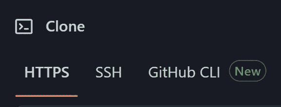

# 6 必须知道 Git/Github 的特性

> 原文：<https://levelup.gitconnected.com/6-git-features-every-programmer-should-know-9e9fd1e5b9b1>


您已经熟悉了 Git 的基础知识:推和拉、暂存和提交文件、合并和重定基础。这里有一些稍微高级一点(但是有用)的特性，我们相信每个程序员都应该知道。

## 1.创建拉取请求

您可以创建一个“拉”请求来建议对公共存储库的更新。首先，导航到存储库的 GitHub 页面，点击右上角的 fork 按钮*分叉*存储库。


> 一般来说，分叉是公共的

这将在您的个人 Github 帐户下创建一个存储库。在分叉的存储库中做出并提交了一些更改之后，返回到最初的 repo，并单击 *pull requests* 。


然后点击**新拉动请求。**


这将允许您提交新的拉取请求。

注意:如果您的分叉存储库因为新的更改被推送到原始存储库而过期，您可以使用 fetch upstream 更新您的存储库。


## 2.设置 SSH 密钥

对 Github 使用 ssh 被认为比使用 https 更安全，因为它不使用密码。您可以克隆存储库，并使用 ssh 从存储库中推送和提取。



[***本指南***](https://docs.github.com/en/authentication/connecting-to-github-with-ssh/about-ssh) 教你如何创建和使用 ssh 密钥。在生成您的公钥/私钥对并将其保存在/中之后。ssh 文件夹，运行

```
$ eval "$(ssh-agent -s)"
```

和

```
$ ssh-add ~/.ssh/your_pub_key
```

不同的主机可以有多个 ssh 密钥。您可以在中指定用于不同主机的 ssh 密钥。ssh/。配置文件。例如:

```
Host user1.github.com
    HostName github.com
    PreferredAuthentications publickey
    IdentityFile ~/.ssh/user1_rsa

Host user2.github.com
    HostName github.com
    PreferredAuthentications publickey
    IdentityFile ~/.ssh/user2_rsa
```

这将使 Git 在按到`user1.github.com`时使用你的`user1_rsa`键，在按到`user2.github.com`时使用`user2_rsa`键。

## 3.Git 子模块

当你的 Git 项目有依赖项时，Git 子模块是有用的。可以将其他 Git 项目作为子模块嵌套在一个 Git 项目中。在 Git 项目中使用以下命令添加子模块:

```
$ git submodule add https://github.com/username/project 
```

如果您正在克隆到一个使用子模块的 Git 项目中，那么您应该首先运行

```
$ git submodule init
```

然后

```
$ git submodule update
```

来检索这些子模块的数据。

## 4.添加新遥控器

如果您在 Git repo 中工作，但是想要推进到不同的 repo，您可以添加一个新的 remote(托管在互联网上的 Git repo)。要添加名为 MyRemote 的遥控器，请使用以下命令。

```
$ git remote add MyRemote git@github.com:User/Project.git
```

有时需要显式设置 url。

```
$ git remote set-url MyRemote git@github.com:User/Project.git
```

最后，要推送至新的遥控器，请使用。

```
$ git push -u MyRemote master
```

其中-u 是-set-upstream 的缩写(如果是第一次推送)。

```
$ git push -set-upstream <remote> <branch>
```

## 5.Gitignore

的。git repo 的 gitignore 文件用于告诉 git 不要跟踪哪些文件。该文件支持模式匹配。要忽略所有日志文件和/key 文件夹中的所有内容，我们可以按以下方式构造 gitignore:

```
# .gitignore file*.log
keys/*
```

像 npm 的 node_modules 这样的外部依赖项(占用大量内存)应该包含在 gitignore 中。

## 6.设置 Git 配置用户名和电子邮件

要更改与提交相关联的名称和电子邮件，我们可以这样做

```
git config user.name "new_username"
git config user.email "your_name@yahoo.com"
```

在 Github 存储库的提交历史中，它会显示与提交相关联的用户名。

感谢阅读！