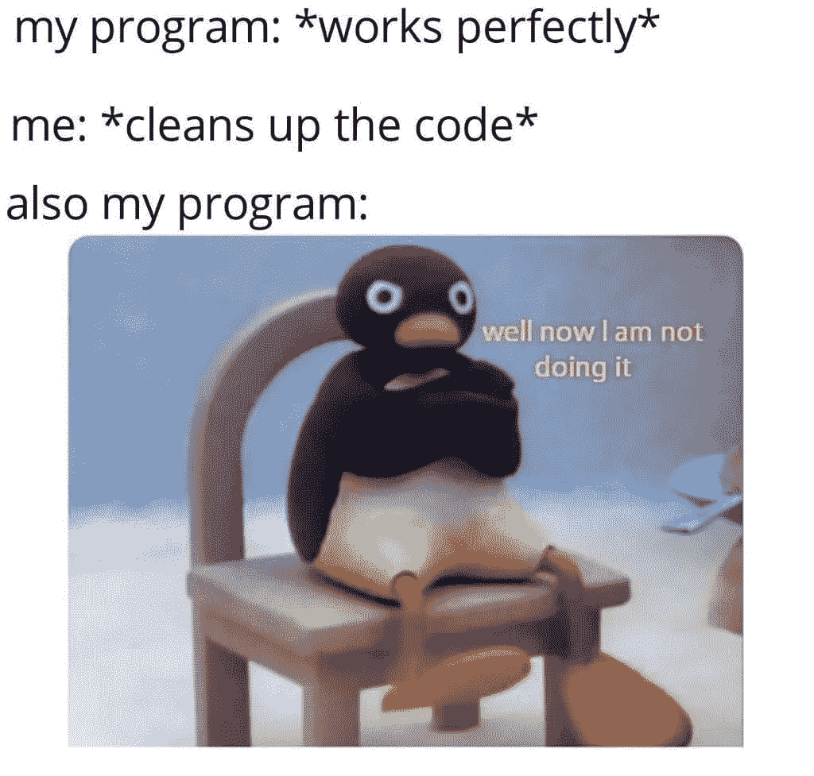
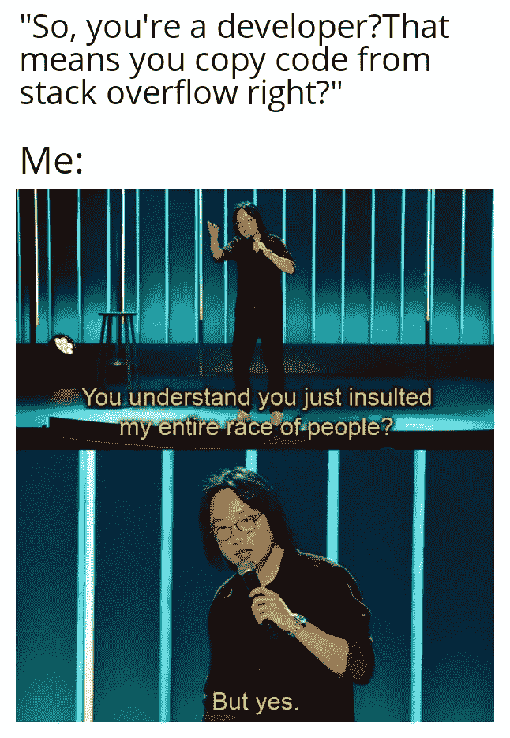
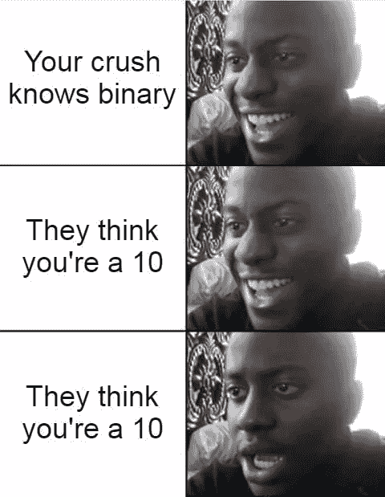
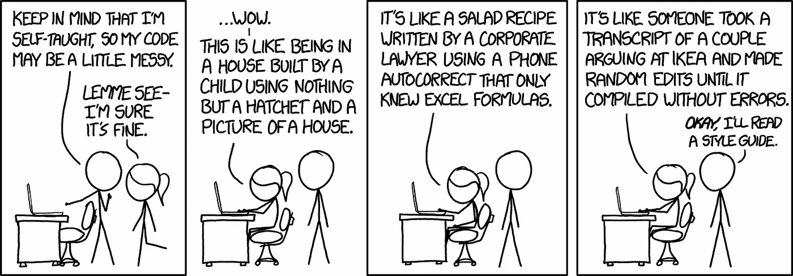
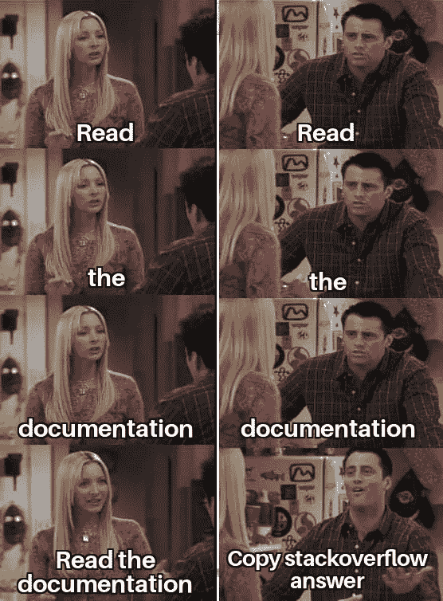
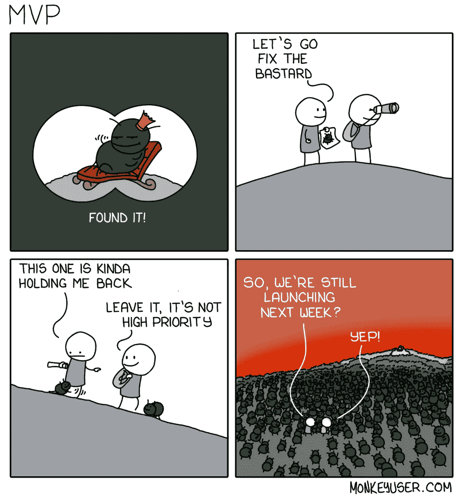

# 6 个令人捧腹的编码迷因，让你开怀大笑

> 原文：<https://levelup.gitconnected.com/6-hilarious-coding-memes-that-will-make-you-lol-d84fcf1b9222>

## 自费找乐子，太好了！

啊，编程！如果你问我，编程是最令人满意的工作之一，你想象一些东西，你可以用它制作出成品，供全世界数百万人使用。

由[泰佐斯](https://unsplash.com/@tezos?utm_source=unsplash&utm_medium=referral&utm_content=creditCopyText)在 [Unsplash](https://unsplash.com/s/photos/developer?utm_source=unsplash&utm_medium=referral&utm_content=creditCopyText) 上拍摄的照片

这个过程看起来很简单——想出一个想法，把这个想法编码，然后把它发送给全世界！很少有人知道软件开发过程中发生的搞笑事件，这个故事的目的就是要做到这一点。

我们，开发者，是特殊的一类，我们爱开玩笑，尤其是那些自费开的书呆子式的玩笑。一种防御机制，如果你愿意的话。

下面的图片来自互联网&旨在让每个人都意识到软件开发有趣的一面。

让我们开始吧。

# 但我只是补充了一些评论，你甚至不应该关心！！

我讨厌这种事情发生。每当我试图更负责任一点，并试图清理和组织我的代码，它就是拒绝工作！我应该从头开始写更干净的代码吗？不，我会花两个小时让它再次工作。

来源:互联网

# 你怎么敢？是的，但是你怎么敢？

是的，我们经常遇到堆栈溢出，可能比我们愿意承认的还要多。但是这里要注意的主要事情是，我们知道什么能让我们的代码工作，我们知道什么可以复制粘贴。那是天赋。

来源:互联网

# 短暂的幸福

谢天谢地，我老婆觉得我是个完美的 1010。😎

来源:互联网

# 最相关的代码审查迷因

当程序员坐下来做代码审查时，我们带着一个空虚的、兴奋的头脑。我们看代码就像我们有生以来第一次看代码一样。所以很明显，我们有很多“为什么”被抛出。在我们生活中的某个时刻，我们都回顾了一大段代码，只是为了在最后一行找出它为什么会这样做。啊哈！moment 对开发人员和代码审查人员来说都是令人满意的！

来源:《生活大爆炸》中的谢尔顿

## 奖金代码审查现实

如果不包含至少 1 个 xkcd，我永远也写不出有趣的编程文章。这不可能。当我们谈到代码审查的主题时，这里有另一个非常相关的代码审查情况。

来源: [xkcd](https://xkcd.com/1513/)

# 说真的，看医生！

对于开发人员来说，文档就像圣经一样！我个人喜欢在面临问题时阅读文档，因为它们不仅给了我解决问题的方法，还告诉我哪些方法行不通。然而，有时，像所有人一样，我们跳过文档，直接到 Stack Overflow 获取快速答案，只是为了让事情正常工作。

来源:《老友记》中的菲比和乔伊

# 最有价值球员

制作一个 MVP 就是在临近发布日期的时候试图创建一个特性列表(实际上你所做的只是创建一个 bug 列表)。解决几个特大的错误，然后忘掉其他的(如果有那么简单就好了)。

来源:[猴子用户](https://www.monkeyuser.com/2019/mvp/)

嘿——各位，今天就到这里吧！希望你笑得开心！❤️