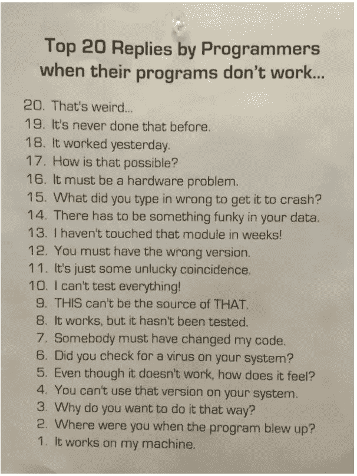

# 6 个令人捧腹的程序员/数据科学家笑话开启 2022 年

> 原文：<https://levelup.gitconnected.com/6-hilarious-programmers-data-scientists-jokes-to-kick-start-2021-187f86dd6a4c>

做好准备:这些愚蠢的老笑话会让你捧腹大笑😁

众所周知，成为一名数据科学家就等于集程序员、数据工程师和业务分析师于一身。尽管有不同的工作职责，所有的数据科学家都有一个共同点——我们编码，就像开发人员一样！

事实上，人们(利益相关者)将我们更多地与程序员联系起来，因为我们可以坐在电脑前敲键盘，神奇地解决与数据相关的问题，就像开发人员解决与编程相关的问题一样！

什么更重要？嗯，数据科学家也和开发人员一样有一种愚蠢的幽默感，作为数据科学家的生活包含有趣而真实的时刻。为了以积极的方式开始新的一年，我整理了一些我们——数据科学家/程序员——绝对能理解的双关语。尽情享受吧！

## 0。一个发现程序员的好方法？

是的，一切都从 0 开始

由作者创建

哦等等！我们可能下结论太早了？

信用:[迷因](https://me.me/i/not-you-know-youre-a-programmer-when-you-count-3-682d4edb6d0946adbb11f65ae42f76e6)

## **1。当你需要正常的工作时间时**

由[https://xkcd-excuse.com/](https://xkcd-excuse.com/)生成

事实上，我们都很清楚越来越多的证据表明身体活动的重要性，以及它如何提高生产力🤣

## **2。与堆栈溢出的复杂关系**

当程序员/数据科学家困在编码上？我们谷歌？！不完全是这样，我们实际上通过谷歌搜索开始了一个循环，直到我们找到一个堆栈溢出的解决方案，其中包含复制粘贴的代码。

信用: [iFunny](https://ifunny.co/picture/carlanotarobot-carla-notarobot-boss-where-did-you-get-this-code-QWveY34G8)

哦，是的，作为额外的一步，我们必须确保不要抄袭问题，这有时在凌晨 3 点会很难。

然而，堆栈溢出可能会失败，这种情况经常发生，

信用: [DaveshShingari](https://imgur.com/gallery/ufEv5Y1)

然后，我们需要做的就是迭代前面提到的 google → Stack Overflow 循环。

## 3.当你的代码崩溃时的第一反应

引起我们所有人的共鸣，不是吗？

贷方:[应收/应付](https://www.reddit.com/r/ProgrammerHumor/comments/kowxua/thats_why_i_use_docker/)

我发现当我们部署一个模型时，墨菲定律每次都有效。不管你编码了多少年，你的代码永远不会对偷偷摸摸的错误免疫。关键是，当同事说出来的时候，不要把它当成个人问题，也不要为自己辩护😂

这里有更多的指导方针给你，

信用:[来源](https://www.geeksaresexy.net/2014/04/14/top-20-replies-by-programmers-when-their-programs-dont-work-pict/)

好吧，如果代码在你客户的机器上崩溃了呢？答案很简单:发运您的机器！！！

## 4.无 bug 代码的秘制酱？！

说到潜入的 bug，调试就像，

信用:[模因库](https://cheezburger.com/8944133/17-coding-memes-for-the-frustrated-software-engineer)

我相信我们都有同感:在修补了第一个漏洞之后，我们最终会有更多的漏洞！那么有没有普遍适用的无 bug 代码秘方呢？

信用:【MonkeyUser.com】T4

信用:[pypi.org](https://pypi.org/project/spyder/)

我知道，我大胆地认为 Hello World 应用程序没有漏洞，这就是我使用 Spyder 的原因！！！

## 5.终极问题来了:什么是数据科学？

当谈到什么是数据科学或数据科学家是做什么的时候，每个人都有自己的定义。

致谢(从左上至右下):(1) [凿凿](https://www.chisel.ai/blog/is-ai-a-job-terminator)、(2) [链接](https://mymodernmet.com/golden-bailey-funny-dog-memes/)、(3) [信息](https://www.channelfutures.com/data-centers/365-data-centers-teams-with-dell-emc-for-enterprise-managed-solution)、(4) [链接](https://commons.wikimedia.org/wiki/File%3APure-mathematics-formulæ-blackboard.jpg)、(5) [来源](https://www.reddit.com/r/datascience/comments/eydw3m/machine_learning/)、(6)作者；由作者编译

数据科学对我来说是一个真正令人兴奋的旅程，向利益相关者提供数据驱动的见解的激动是无法形容的！

展望 2020 年，我将继续在我的博客上分享我的编程和分析知识，希望能够激励那些想要开始数据科学职业生涯的人或那些正在推进其数据科学职业生涯的人。

希望这些迷因能让你笑逐颜开！😀

***想要更多数据科学和编程技巧？使用*** [***我的链接***](https://yilistats.medium.com/membership) ***注册 Medium，获得我所有内容的全部访问权限。***

***还订阅我新创建的 YouTube 频道*** [***【数据谈吉】***](https://www.youtube.com/channel/UCbGx9Om38Ywlqi0x8RljNdw)

*想了解**更多**关于分析和编程的技巧和诀窍吗？看看我的其他博客，*

* [## 每个数据科学家都应该知道的 6 个 SQL 技巧

### 提高分析效率的 SQL 技巧

towardsdatascience.com](https://towardsdatascience.com/6-sql-tricks-every-data-scientist-should-know-f84be499aea5)  [## 地道熊猫代码的 4 个隐藏的宝石

### 分享更多熊猫提示来提高你的数据处理水平

towardsdatascience.com](https://towardsdatascience.com/4-hidden-gems-for-idiomatic-pandas-code-99c706e6ce93)*