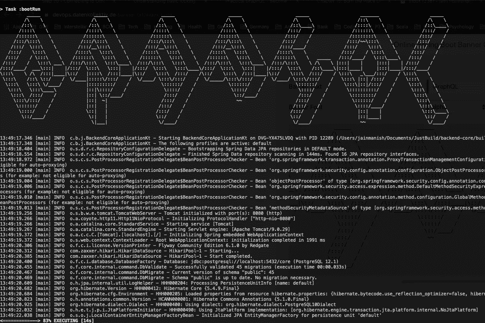

# 使用 GraphQL 个月

> 原文：<https://levelup.gitconnected.com/6-months-of-using-graphql-faa0fb68b4af>

## 在后端使用 GraphQL 做了 6 个月的项目后，我衡量了这项技术是否适合开发工作流程

我的终端的 graphql 输出

# 首先

GraphQL 是一种 API 查询语言，也是一种用现有数据完成这些查询的运行时语言。GraphQL 为 API 中的数据提供了完整且易于理解的描述，并赋予了客户要求他们所需要的一切的权利。

它是由脸书开发的，作为他们移动应用的内部解决方案，后来向社区开源。

# 好人

## 实用数据交换

使用 GraphQL，可以为客户机需要的字段定义查询，不多也不少。真的就这么简单。如果*前端*需要一个*人*的`*first name*`和`*age*`，只能请求。在响应中不会发送`*person*`的`*last name*`和`*address*`。

## 使用数据加载器减少网络调用

虽然数据加载器不是 GraphQL 库本身的一部分，但它是一个实用程序库，可以用来分离应用程序中不相关的部分，而不会牺牲批量数据加载的性能。虽然加载程序提供了一个加载单个值的 API，但是所有并发请求都将被合并并呈现给批加载函数。这允许您的应用程序在整个应用程序中安全地分发数据获取。

这方面的一个例子是从另一个名为*事务服务*的服务中获取`*person*`的`*bank details*`，而*后端*可以从*事务服务*中获取`*bank details*`，然后将结果与`*person*`的`*first name*`和`*age*`相结合，并将资源发送回来。

## 公开的数据和数据库模型之间的解耦

GraphQL 的一大优点是可以将数据库建模数据与数据向消费者公开的方式分离开来。这样，在设计我们的持久层时，我们可以专注于该层的需求，然后分别考虑向外部世界公开数据的最佳方式。这与数据加载器的使用密切相关，因为您可以在将数据发送给用户之前将数据组合在一起，为公开的数据设计模型变得非常容易。

## 忘记 API 的版本控制

API 的版本化是一个常见的问题，一般来说，通过在前面添加一个 *v2* 来添加相同 API 的新版本是相当简单的。有了 GraphQL，情况就不同了，你可以有同样的解决方案，但这不符合 GraphQL 的精神。文档清楚地指出，您应该改进您的 API，这意味着向现有端点添加更多字段不会破坏您的 API。前端仍然可以使用相同的 API 进行查询，并且如果需要的话可以请求新的字段。很简单。

当涉及到与前端团队协作时，这个特性非常有用。他们可以请求添加一个由于设计变更而需要的新字段，后端可以轻松地添加该字段，而不会干扰现有的 API。

## 独立团队

有了 GraphQL，前端和后端团队可以独立工作。有了 GraphQL 的严格类型模式，团队可以并行工作。首先，*前端团队*可以轻松地从后端生成一个模式，甚至不用看代码。生成的模式可以直接用于创建查询。其次，*前端* *团队*可以继续使用 API 的模拟版本。他们也可以用它来测试代码。这给了开发人员一个愉快的体验，而不会阻碍他们的开发工作。

照片由[佩里·格罗内](https://unsplash.com/@perrygrone?utm_source=medium&utm_medium=referral)在 [Unsplash](https://unsplash.com?utm_source=medium&utm_medium=referral) 上拍摄

# 坏事

## 不是所有的 API 都能进化

有时，业务或设计会发生一些变化，这就需要对 API 的实现进行彻底的改变。在这种情况下，您将不得不依靠旧的方法来进行版本控制。

## 不可读的代码

正如多次经历的那样，在使用数据加载器获取数据时，代码有时会分散到多个地方，这可能很难维护。

## 更长的响应时间

由于查询会不断发展并变得庞大，因此有时会影响响应时间。为了避免这种情况，请确保保持响应资源的简洁。关于指南，请看一下 [Github GraphQL API。](https://developer.github.com/v4/)

## 贮藏

缓存 API 响应的目标主要是为了更快地从将来的请求中获得响应。与 GraphQL 不同，缓存内置在 HTTP 规范中，RESTful APIs 能够利用它。如前所述，GraphQL 查询可以请求资源的任何字段，缓存本身就很困难。

# 结论

我会强烈推荐使用 GraphQL 作为 REST APIs 的替代品。GraphQL 所提供的灵活性无疑取代了它的痛点。这里提到的优点和缺点可能并不总是适用，但是值得在查看 GraphQL 时考虑它们，看看它们是否能对您的项目有所帮助。

其他你可能感兴趣的故事。

 [## GraphQL 最佳实践

### 在使用 GraphQL 6 个月之后，我分享了我对创建 graph QL 服务器的良好实践的想法

towardsdatascience.com](https://towardsdatascience.com/graphql-best-practices-3fda586538c4)  [## 不成功开发者的 5 种心态

### #3 学习只发生在工作中

levelup.gitconnected.com](/5-mindsets-of-unsuccessful-developers-5d9bd5e4f700)  [## 作为一名软件工程师，我在 5 年里学到的经验教训

### “让你到这里的东西不会让你到那里”——马歇尔·戈德史密斯

levelup.gitconnected.com](/lessons-ive-learned-in-5-years-as-a-software-engineer-ee483f12d83a)