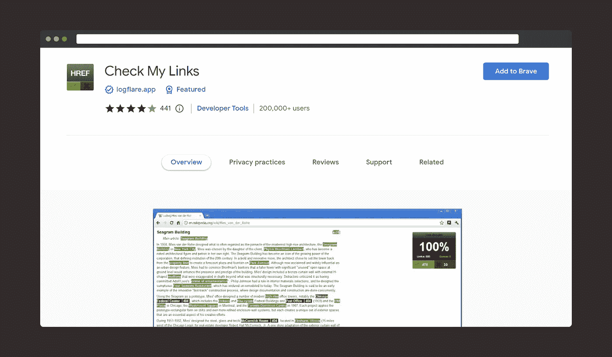
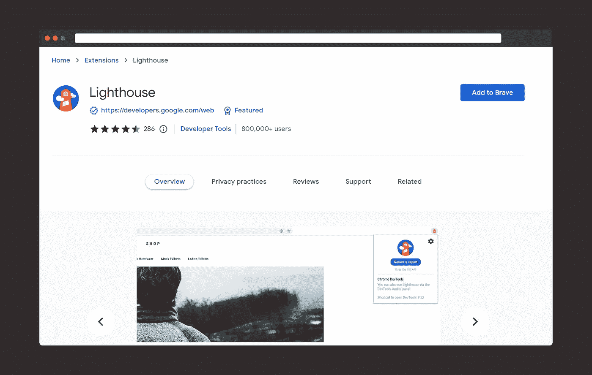
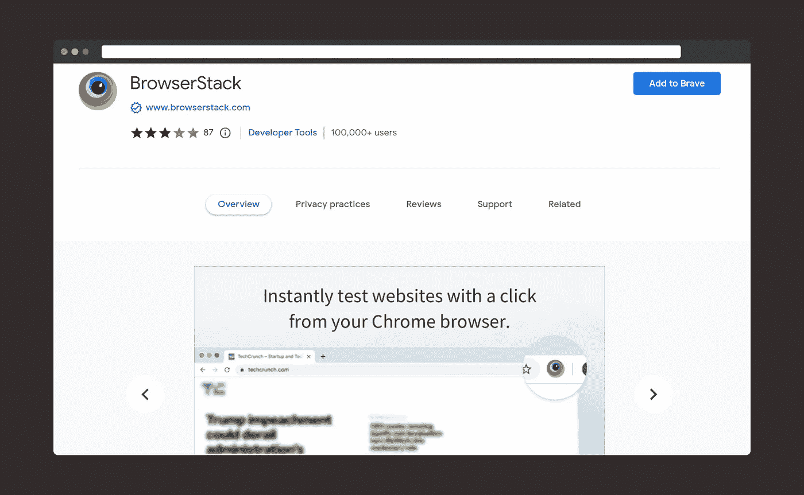
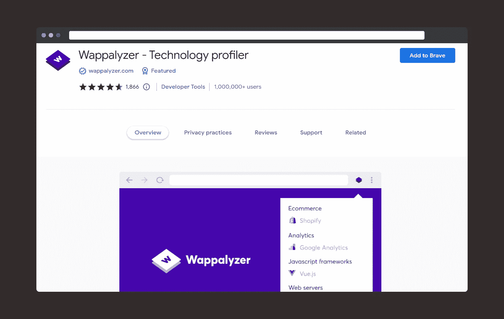
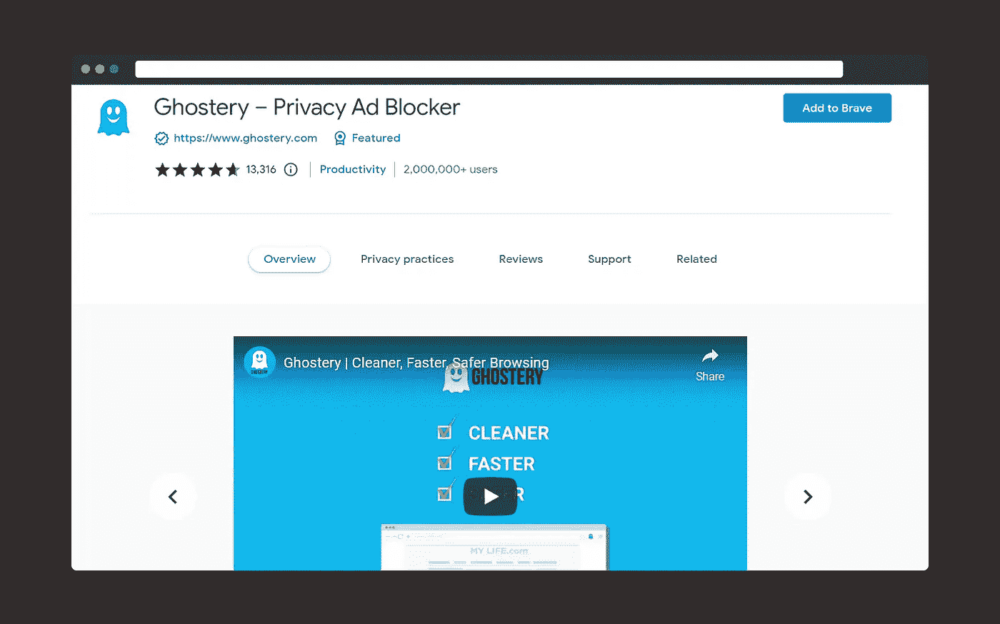
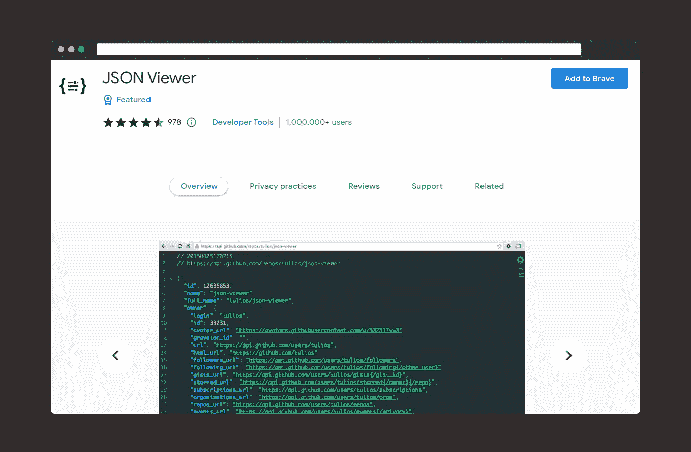

# 每个开发者都希望他们能早点知道的 6 个必备的 Chrome 扩展

> 原文：<https://levelup.gitconnected.com/6-must-have-chrome-extensions-that-every-developer-wished-they-knew-earlier-cbb5dd83f624>

## 这些扩展将促进您的发展。

Radek Grzybowski 在 [Unsplash](https://unsplash.com/s/photos/browser?utm_source=unsplash&utm_medium=referral&utm_content=creditCopyText) 上的照片

曾经有一段时间，与身在世界另一端的人交流需要几天时间。对于最新的消息，我们不得不等到第二天才等到报纸送到我们家门口。当世界被引入互联网时，一切都变了。

> “互联网曾经是关于互联网的。现在是关于一切。它会影响一切。”— Ev Williams，中型企业首席执行官

浏览器扩展就是这样一种工具，它通过向浏览器添加有价值的特性和功能来增强任务或过程。我们都一直在使用某种形状或形式的一些扩展，如 [*语法上的*](https://chrome.google.com/webstore/detail/grammarly-grammar-checker/kbfnbcaeplbcioakkpcpgfkobkghlhen?hl=en) 或 [*Todoist*](https://chrome.google.com/webstore/detail/todoist-for-chrome/jldhpllghnbhlbpcmnajkpdmadaolakh) 。

事实上，我已经[发表了一篇文章，列出了能够提高工作效率的浏览器扩展](https://medium.com/writers-blokke/6-browser-extensions-that-you-must-use-to-increase-your-productivity-e87a08b34507)。这里有一篇文章，我整理了一个 Chrome 扩展列表，我发现它对开发很有用。

# 检查我的链接

*扩展链接:* [**查看我的链接**](https://chrome.google.com/webstore/detail/check-my-links/ojkcdipcgfaekbeaelaapakgnjflfglf)

“检查我的链接”是一个有用的 Chrome 扩展，可以在网页中查找断开的链接。该扩展立即定位并验证网页上的所有链接。它只是指示哪些是真实的，哪些是无效的。只需点击一下，您就可以将所有的不良网址复制到您的剪贴板。

# 灯塔

*延伸链接:* [**灯塔**](https://chrome.google.com/webstore/detail/lighthouse/blipmdconlkpinefehnmjammfjpmpbjk)

Lighthouse 是一个开源的自动化工具，用于提高 web 应用程序的性能、质量和准确性。该扩展通过一系列测试来审核页面，然后生成关于页面执行情况的报告。然后，您可以使用失败的测试来确定您可以做些什么来增强您的应用程序。

# 浏览器堆栈

*扩展链接:* [**BrowserStack**](https://chrome.google.com/webstore/detail/browserstack/nkihdmlheodkdfojglpcjjmioefjahjb)

BrowserStack 在每个桌面或移动浏览器上实时检查网页。这个插件提供了实际的测试设备，而不是仿真器或模拟器。只需点击几下，它就能在真正的浏览器上启动新的测试会话。使用 Chrome 扩展可以轻松启动多达 12 个浏览器，在浏览器之间切换，并在整个测试过程中花费更少的时间。

## 瓦帕里斯

*扩展链接:* [**Wappalyzer**](https://chrome.google.com/webstore/detail/wappalyzer-technology-pro/gppongmhjkpfnbhagpmjfkannfbllamg)

Wappalyzer 是一个有用的插件，可以发现用于构建任何网站的所有底层技术。只需轻轻一点，您就可以找到编程语言、CMS、数据库、web 服务、内容管理、生成器、服务器软件、分析工具、电子商务平台、插件、小部件、JavaScript 框架等等。

## 幽灵

*扩展链接:* [**幽灵特工**](https://chrome.google.com/webstore/detail/ghostery-%E2%80%93-privacy-ad-blo/mlomiejdfkolichcflejclcbmpeaniij?hl=en)

Ghostery 是一个强大的插件，可以禁用所有在线广告，并终止网站上任何活跃的追踪器，从而提高性能。您可以更快地浏览，同时保持您的隐私。

## JSON 查看器

*扩展链接:* [**JSON 查看器**](https://chrome.google.com/webstore/detail/json-viewer/gbmdgpbipfallnflgajpaliibnhdgobh?hl=en&ref=hackernoon.com)

作为开发人员，处理 JSON 数据有时会很困难。JSON Viewer 扩展美化并系统化了数据结构，使其易于使用。

虽然有数百个扩展，但我经常使用上面列出的扩展。这些扩展链接可以在 Chrome 和其他基于 Chrome 的浏览器中工作。我同时使用 Chrome 和 Brave 浏览器。当然，你可能会在其他浏览器上找到相同或替代的工具，比如 Firefox、Opera 或 Safari。

如果你喜欢读这本书，那么你可能也会发现下面的故事值得你花时间去读。

 [## 7 个非凡的网站，每个开发者都希望他们能早点知道

### 一个鲜为人知的网站列表，为您的软件开发之旅提供最大价值。

levelup.gitconnected.com](/7-phenomenal-websites-that-every-developer-wish-they-knew-earlier-7cc35669859a)  [## 5 个被低估的非技术技能，每个软件开发人员都应该具备

### 了解这些基本技能会让你成为更好的软件开发人员。

medium.com](https://medium.com/codex/5-underrated-non-technical-skills-that-every-software-developer-should-have-f49abbc2f7a2) 

如果你喜欢阅读有助于你更好地学习、生活和工作的故事，可以考虑 [*成为*](https://viveknaskar.medium.com/subscribe) *的订阅者。成为会员后，你可以无限制地阅读 10000 篇故事、文章和作家。每月只要 5 美元。* [*如果你使用我的链接*](https://viveknaskar.medium.com/membership) *注册，我将获得一点佣金，帮助我写更多的文章。*