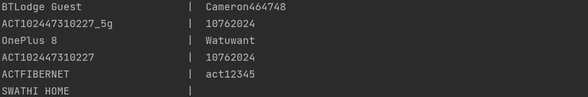
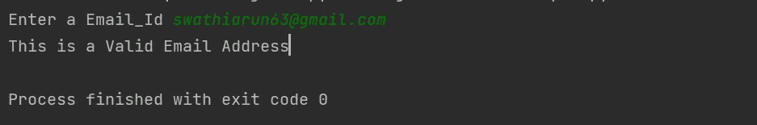

# 6 个必须尝试的 Python 程序

> 原文：<https://levelup.gitconnected.com/6-must-try-python-programs-5d92ff36e620>

## 用代码解释的有趣的 Python 程序

Christopher Gower 在 [Unsplash](https://unsplash.com?utm_source=medium&utm_medium=referral) 上拍摄的照片

Python 是一种有趣的编程语言。用一些奇妙的包和模块来尝试这些程序，以了解更多关于 Python 的知识。使用 Python 可以做很多事情。在本文中，我们试图用 Python 脚本解决自动化和一些社交媒体问题

# 1.Instagram 个人资料图片下载器:

***一个用 python 包下载 Instagram 个人资料图片的 Python 程序。***

在这个程序中，我们使用 Python 包来下载图像。我们在这个程序中使用了一个必须安装的包。要安装`pip install instaloader`应该使用语法。然后使用`import instaloader`语法导入这个包。我们使用`Instaloader()`方法加载图片，使用`download_profile()`下载图片。

**输出:**

作者照片

**注意:**您应该知道概要文件的用户名，因为它是识别概要文件的唯一值。Instagram 会在 Python 程序的源码处保存一张个人资料图片。

# 2.使用 Python 的 WIFI 密码:

***创建一个程序，打印你电脑上使用过的所有 WIFI 密码。***

这个程序是一个必须尝试的程序，打印所有的 WIFI 密码，在电脑上使用过。在这个程序中，我们尝试使用内置的`subprocess`模块来访问列表。

## 输出:

作者照片

# 3.桌面上的弹出通知:

***一个 Python 程序，在你的桌面上弹出一个通知。***

有这么多次通知不断弹出我们的桌面上有这个程序；了解它的工作原理。在这个程序中，我们使用了一个包，它可以使用`pip install win10toast`语法进行安装。然后导入该包并使用`show_toast()`在桌面上弹出通知。

## 输出:

作者照片

注意:如果您需要增加通知在桌面上显示的时间。在`show_toast(duration =5)`中使用持续时间属性。

# 4.用 Python 上传一张 Instagram 照片:

***一个使用 Python 脚本上传 Instagram 照片的程序。***

为了上传 Instagram 图片，我们使用了一个名为`instabot`的包。要安装这个包，使用`pip install instabot`语法。然后使用`import instabot`语法导入包。使用 Bot 方法，通过提供您的用户名和密码登录。之后，你可以上传带有说明的照片。

## 输出:

作者照片

# 5.脸书用 Python 登录:

***一个用 chrome 带邮箱和密码登录脸书的程序。***

我们在这个程序中使用了`selenium`和`webdriver_manager`包。首先，使用`pip install selenium`和`pip install webdriver_manager`语法安装软件包。然后导入这些包，用新的 chrome 浏览器实现自动化和脸书。

**注意:**当您执行程序时，chrome 窗口将打开，并显示输入的电子邮件和密码。

# 6.使用 Python 验证电子邮件 Id:

***验证域中是否存在 Email-id 的程序。***

在这个程序中，我们需要使用名为 verify_email 的包来验证电子邮件 id。要安装这个包，使用`pip install verify_email`语法。这个包通过 ping 域的处理程序来验证电子邮件 id，以检查它是否存在。

## 输出:

作者照片

注意:尝试用正确语法的随机 email_id 进行检查。尽管语法正确，但如果地址不在域中，它将返回 false。

这里有一个 [**链接**](https://swathiarun63.medium.com/membership) 供订阅阅读数千篇文章用的媒介。请考虑订阅，支持众多作家。

# 分级编码

感谢您成为我们社区的一员！[订阅我们的 YouTube 频道](https://www.youtube.com/channel/UC3v9kBR_ab4UHXXdknz8Fbg?sub_confirmation=1)或者加入 [**Skilled.dev 编码面试课程**](https://skilled.dev/) 。

 [## Python | Skilled.dev 中的编码面试课程

### 掌握编码面试的过程

技术开发](https://skilled.dev)