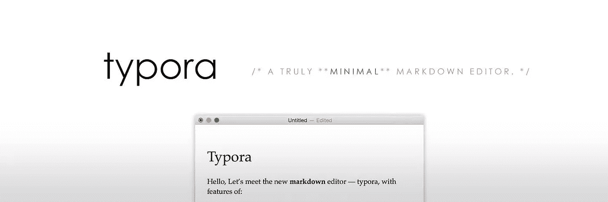
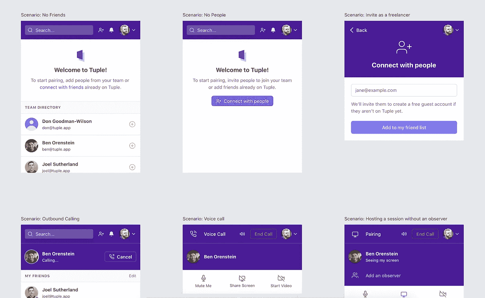
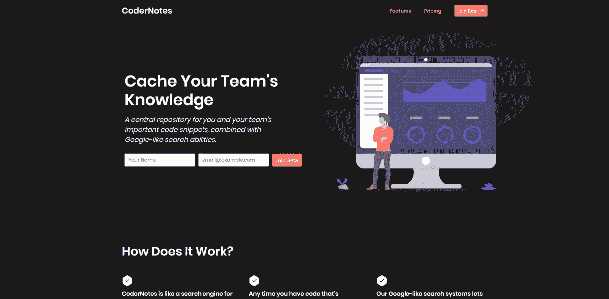
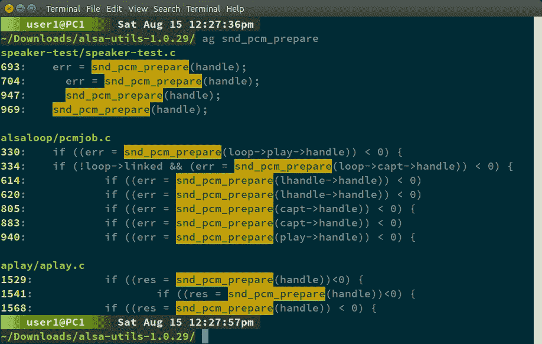
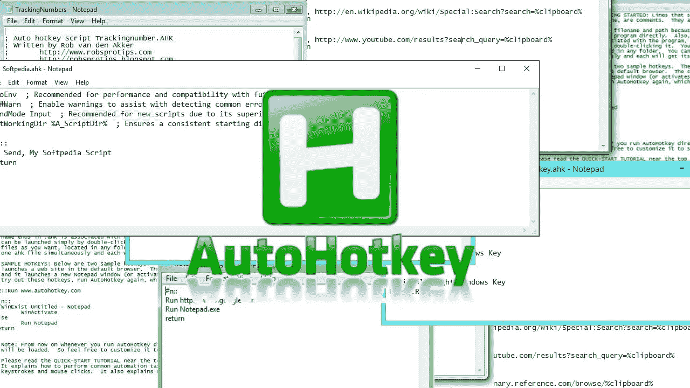
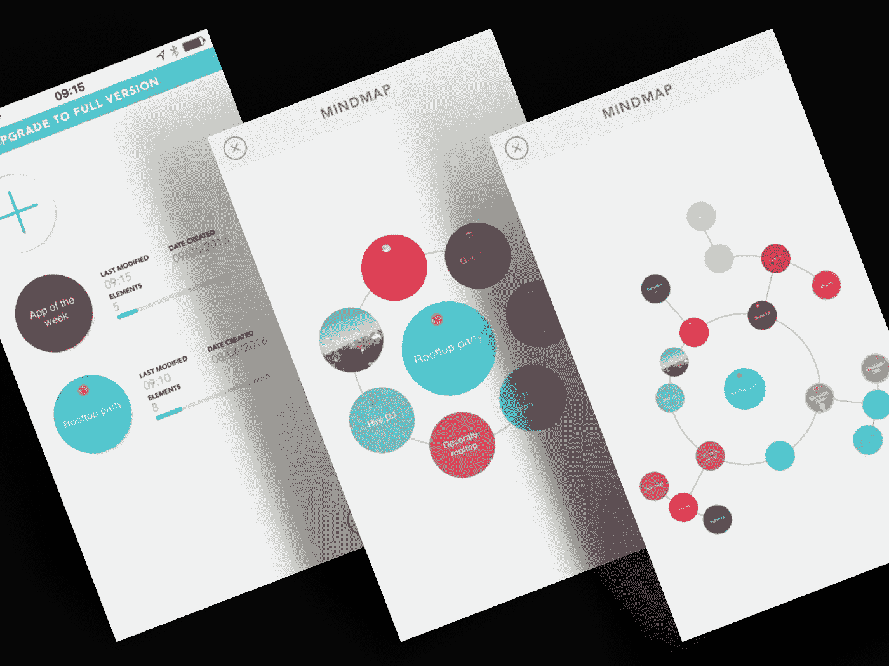

# 所有开发人员都应该尝试的 6 个生产力工具

> 原文：<https://levelup.gitconnected.com/6-productivity-tools-that-all-developers-should-try-252191e523e4>

开发人员构建企业解决方案来解决复杂的业务问题和面向客户的应用程序，以使最终用户的生活更加轻松。开发过程可能非常具有挑战性，需要大量工具来帮助解决方案架构师和开发人员。

有许多软件工具可以帮助和简化开发团队，减少他们的认知负荷。作为开发人员，这些工具可以帮助您更加专注于创建健壮的解决方案和满足最后期限。

因此，这里有一个相当罕见但非常有效的工具列表，可以帮助你改善你的交付和周转。

**Typora**

Typora 是一个最小的 WYSIWYM Markdown 编辑器。它拥有简单而美观的格式选项。有五个标准主题可用，黑暗模式是其中之一(也是我最喜欢的)。

你可以在 Typora 中添加标题、列表、代码栏、内嵌样式、数学、图像等。借助聚焦模式和打字机模式，您可以获得一个不受干扰的环境。在前一种情况下，只有你正在工作的当前行是焦点，其余的是模糊的，而在后一种情况下，当前活动的行被放置在屏幕的中央。

你可以将它与 Github、Adobe Illustrator、Google docs 和 Markdown 集成。它支持字数统计、代码块和语法高亮显示。无缝的实时预览对于评估和做出相应的更改非常方便。

你可以在所有操作系统上安装它，尽管 Mac OS 现在还处于测试阶段。

**元组**

把你的光标移到左边，更多的左边，不，不，向右移动一点点…好吧，这样不行。

在你回到这样的对话之前，我建议你尝试一下 Tuple。为什么？

因为 Tuple 有一个对焦环可以精确定位，让你的生活更轻松。然而，这不仅仅是它！您还可以通过鼠标和键盘控制无缝地控制您同事的计算机系统。它通过单击配对机制提供给合作者双方。

音频质量很棒，几乎没有滞后。此外，还有绘图选项，可让您将整个屏幕用作白板。但到目前为止，Tuple 仅限于 macOS 上的远程配对，但它确实值得一试。

此外，由于我们许多人现在在家工作，协作是必不可少的。Tuple 在这里还是挺有用的！

**代码注释**

Codernotes 结合了笔记应用程序、代码编辑器的功能，运行相同的代码，而不必切换到其他环境。

它可以让你存储代码片段，标记笔记，链接，错误的解决方案，以及任何你想记下的概念。不要担心因为记不起笔记的名称而丢失笔记，它的“类似谷歌的搜索系统”可以帮助你在短时间内找到笔记。

Codernotes 非常注重基于社区的学习，并使在开发人员的世界中分享知识变得容易。它是基于云的存储，有语法高亮选项和无限的公共注释功能。对于您的团队来说，这是一个终极的协作/学习平台，并且可以接触到全球的开发人员。

**白银搜寻者**

银搜索器是一个代码搜索工具。因为它的速度，它是开发人员最有效的生产力工具。它类似于 Ack，但提供结果的速度更快，有些人声称几乎 34 次，但陪审团仍在这一点上。

因此，您花费在数千行代码中搜索代码的时间现在可以用来做更好的事情。

您拥有 Sublime Text、Vim 和 Emacs 的编辑器集成。你可以在 Mac、Linux、Windows 和 BSD 上安装它。

**自动热键**

AutoHotKey 是一种开源的脚本语言，开发者可以创建自己的热键，让你在 Windows 中简化任何重复的操作。

作为一名开发人员，您可以根据自己的需要自由选择文件、窗口和文件夹。您的宏和自动化机制掌握在您的手中。除了鼠标和键盘的热键，你也可以为游戏杆创建快捷方式。

这种免费的脚本语言有可能节省大量的时间和精力，否则这些时间和精力会浪费在重复的任务上。您可以更快地开发原型，并利用您的经验让新开发人员更容易快速学习和适应。

**没头没脑地**

Mindly 是这个榜单中唯一一个不限于开发者的。尽管如此，它仍然有开发者应用程序。

它给你一个地方来收集、重复和组织你所有疯狂的想法。它的行星布局让你收集复杂的想法，并把它们拼凑在一起，以便你和你的团队更好地理解。

您可以附加图像、URL、使用不同的颜色主题、做笔记、以不同的格式导出(因操作系统和计划而异)，并获得可视剪贴板。

这是与您的团队就项目进行头脑风暴的理想软件，并提供了思维导图的机会。你应该试一试，看看它对你和你的团队有什么效果。

**结束语**

列出的工具专注于保持你的开发人员的生产力水平在顶峰，同时防止挫折。事实上，开发人员的生活中充满了许多未知的错误和小故障，它们会在最不方便的时候出现。希望这些工具将有助于自动化多余的任务，并让您的开发人员有一点动力和快乐。

**关于银河网络链接**

我们专注于为全球客户提供以人为中心的设计和开发服务。我们的创新理念、行业最佳实践和流程帮助我们提高用户满意度，并为客户解决复杂问题。[联系我们](https://www.galaxyweblinks.com/contactus/)免费咨询！

# 分级编码

感谢您成为我们社区的一员！ [**订阅我们的 YouTube 频道**](https://www.youtube.com/channel/UC3v9kBR_ab4UHXXdknz8Fbg?sub_confirmation=1) 或者加入 [**Skilled.dev 编码面试课程**](https://skilled.dev/) 。

 [## 编写面试问题

### 掌握编码面试的过程

技术开发](https://skilled.dev)