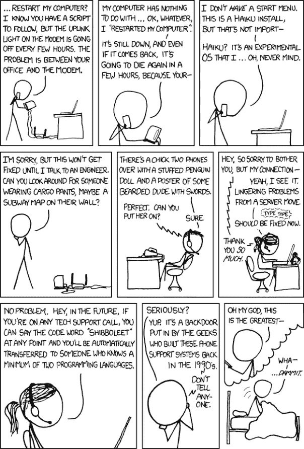
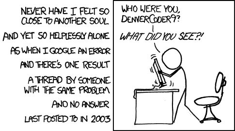
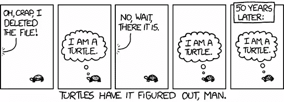
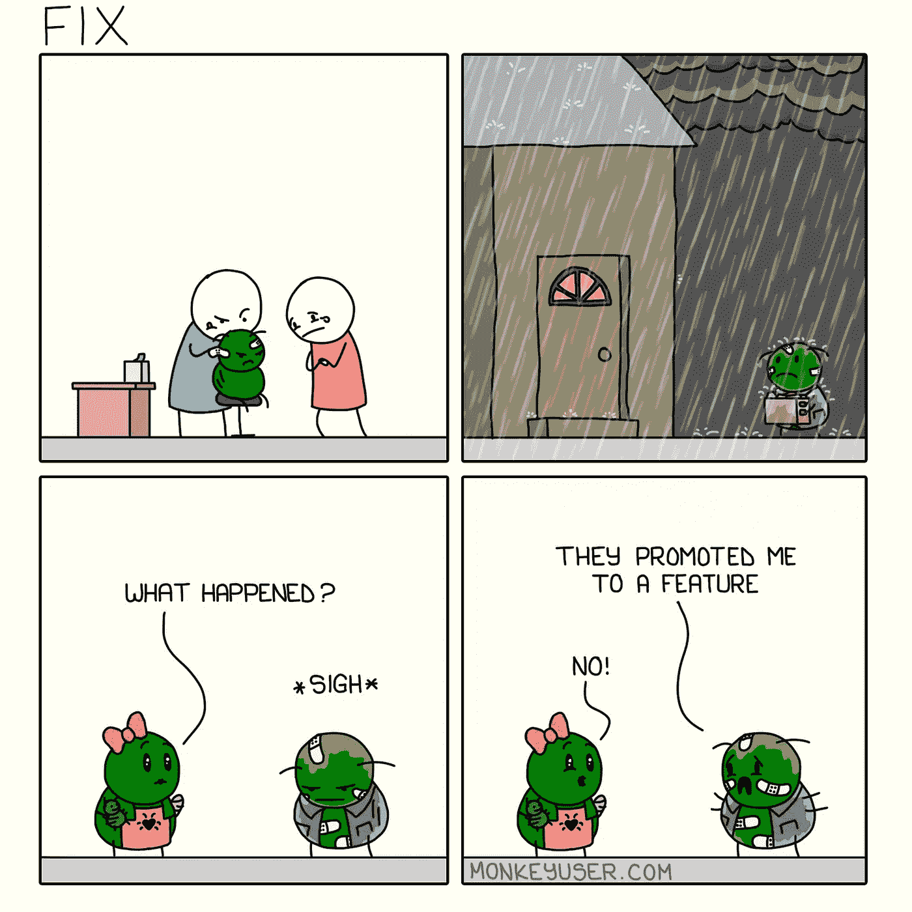

# 6 个让你捧腹大笑的编程笑话

> 原文：<https://levelup.gitconnected.com/6-programming-jokes-that-will-make-you-lol-131b8cae4dc5>

我们都喜欢以别人的代码为代价来破解的笑话。

开发人员通常都很安静内向。我们整天坐在办公桌前，拿着一堆“票”并把它们转换成代码。很奇怪，不是吗？

由 [Max Duzij](https://unsplash.com/@max_duz?utm_source=unsplash&utm_medium=referral&utm_content=creditCopyText) 在 [Unsplash](https://unsplash.com/s/photos/code?utm_source=unsplash&utm_medium=referral&utm_content=creditCopyText) 上拍摄的照片

如果你不是一个开发人员，来这里看看开发人员觉得什么好笑，你会失望的。我们不是不喜欢笑话，只是喜欢我们的笑话里有一定程度的书呆子气。

如果你是一个称职的程序员(嘿！)，你会喜欢下面这些编程笑话的。这些都是从网上搜集来的&目的是让你的一周变得稍微可以忍受一些。

**注:**互联网上很多最好的编程笑话都来自 [xkcd](https://xkcd.com/) 。这幅网络漫画是兰道尔·门罗在 2005 年创作的。漫画的标语将其描述为“浪漫、讽刺、数学和语言的网络漫画”。门罗在漫画网站上声明，漫画的名字不是首字母缩写，而是“一个没有语音发音的单词”。

让我们开始:

## 1.技术支持

对于任何开发人员来说，最糟糕的事情莫过于联系客户支持来解决网络问题。客户服务代理有时(我是礼貌的，总是阅读)无法理解重启计算机并不总是工作。嗯，我们是开发人员，了解这些事情是如何工作的，所以很多时候我们知道如何解决问题，只要你把我们和其他开发人员联系起来。

SHIBBOLEET:我打算下次打电话给任何客户支持服务时试试。我希望，有一天，它会实现。

[XKCD 806](https://xkcd.com/806/)

## 2.最有价值球员

制作一个 MVP 就是在临近发布日期的时候试图创建一个特性列表(实际上你所做的只是创建一个 bug 列表)。解决几个特大的错误，然后忘掉其他的(如果有那么简单就好了)。

[猴子用户——MVP](https://www.monkeyuser.com/2019/mvp/)

## 3.古人的智慧

我讨厌 StackOverflow 的唯一一点是那些没有答案的问题，或者那些用问题的答案来抨击这个问题有多愚蠢的人！快回答，天才！

我曾经遇到过这样的情况，我遇到了一个问题，但在网上什么也没有找到。即使是 StackOverflow 也有一个没有支持票或答案但有 6.7k 浏览量的问题。

我做了什么？我承认我尝试了整整 32 个小时，重写了我的代码。

[XKCD 979](https://xkcd.com/979/)

## 4.仍然值得

当你花了一整天的时间修复错误，并最终成功编译代码时的感觉。满足感无与伦比。

谷歌

## 5.龟

生活很简单。海龟靠思考生存&只相信一个事实，那就是它是一只海龟。人类倾向于想得太多，把事情复杂化，这就是为什么我们可能没有海龟活得长。

[XKCD 889](https://xkcd.com/889/)

## 6.释放

代码需要时间来编译和部署。在构建过程中，程序员什么也做不了。但我希望我工作时也能像这样斗剑。呈现有史以来最好最诚实的 xkcd 漫画！

[XKCD 303](https://xkcd.com/303/)

老实说，我是在代码编译和部署的时候写这篇文章的。

我现在意识到 6 个搞笑笑话中有 4 个是 xkcd。兰道尔·门罗是个天才！

## 奖金

这不是一个错误，这是一个功能:)

[猴子用户——修复](https://www.monkeyuser.com/2020/fix/)

# 分级编码

感谢您成为我们社区的一员！ [**订阅我们的 YouTube 频道**](https://www.youtube.com/channel/UC3v9kBR_ab4UHXXdknz8Fbg?sub_confirmation=1) 或者加入 [**Skilled.dev 编码面试课程**](https://skilled.dev/) 。

 [## 编写面试问题

### 掌握编码面试的过程

技术开发](https://skilled.dev)