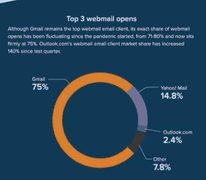
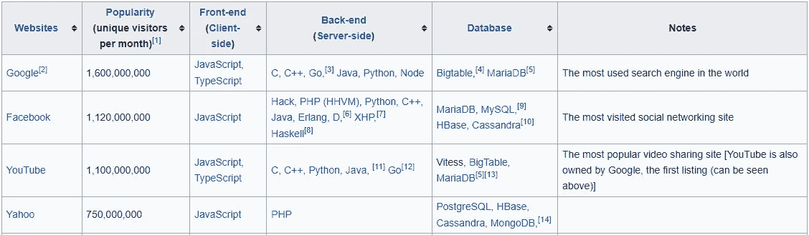

# 6 种编程语言意味着一切(和那些不意味着一切)

> 原文：<https://levelup.gitconnected.com/6-programming-languages-that-meant-everything-to-their-start-ups-2464d585871b>

## 做出正确的决定是你成功的基础

韦斯·希克斯在 [Unsplash](https://unsplash.com/s/photos/programmer?utm_source=unsplash&utm_medium=referral&utm_content=creditCopyText) 上的照片

编程语言的选择被犯罪性地低估了。我们大多把它缩小到*正确的工作的正确工具*。

不仅仅如此。语言的选择极大地影响了几个行业。积极的和消极的。在某些情况下，这似乎是导致成功或失败的最大因素。

要考虑的一些因素有用例、语言轨迹、伸缩的容易程度、性能等。以下是对他们的初创公司来说至关重要的语言。

# 1.Javascript (Gmail)

在发明之初，雅虎邮箱是排名第一的电子邮件客户端。18 年后的今天，雅虎邮箱几乎消失了。其他电子邮件供应商还在纠结刚刚发生的事情。

2021 年，Gmail 在网络上打开的电子邮件中占有 75%的份额。它拥有最高的邮件打开率。下图

[来源](https://findstack.com/gmail-statistics/#:~:text=Gmail%20owns%20around%2027.2%25%20of%20the%20market%20share%20for%20email&text=As%20of%202021%2C%2043%25%20of,website%20browser%20from%20their%20desktop.)

他们成功的最大因素之一(如果不是主要因素的话)是 Javascript 的采用。

其他的邮件只用了 HTML 和 CSS。如果他们使用 Javascript，也只是一小部分。

在 Gmail 出现之前，浏览电子邮件很难看。每次从一个点击切换到下一个点击时，浏览器都会重新加载。用户体验没有那么好。它缺乏我们今天所知道的电子邮件联系。

Gmail 的出现彻底改变了 javascript 的一切。他们不仅采用了它，还广泛使用了它。

浏览选项卡时，浏览器重新加载被消除。刷新以查看新邮件不需要重新加载。

选择使用 Javascript 使他们能够在很大程度上改善用户体验。结果被认为是新颖的，用户被吸引到更新鲜好看的界面。

# 2.PHP(脸书)

不知情的人可能认为脸书是第一个行动者。事实并非如此。彼得·泰尔认为脸书是最后一步棋。

马克·扎克伯格并不是第一个提出社交媒体想法的人。他甚至不是第二个。

其他人主持。Friendster 和 MySpace。

他做了什么不同的事？他以正确的方式做事。编程语言的选择与此有很大关系。

当脸书还是个婴儿的时候，Myspace 是一个巨大的社交媒体平台。马克·祖克伯格甚至不认为脸书会超过 MySpace。

从 [Ycombinator](https://news.ycombinator.com/item?id=14070779) 开始，Friendster 和 MySpace 都因为规模问题而失败。Friendster 没有那么大，在美国市场没有机会。另一方面，MySpace 拥有一切，但却选择了导致其灭亡的错误技术。

Friendster 创建于 2002 年，总部位于马来西亚，发展迅速。这引发了两名 e *宇宙*员工的兴趣。(一家互联网营销公司)他们决定为美国市场创造类似的东西。

他们想要快点。他们需要一种能快速完成这项工作的技术。他们选择了 Coldfusion，并在十天内开始运行。

MySpace 发展迅速，已经超越了它创建的平台。将一切都转移到好的技术上是不可行的。这将需要大量的时间和资源来整合一切。

做出了努力。MySpace 从 ColdFusion 转到了. Net，这个没多大帮助。它并不伟大，被开发者所憎恨。克里斯·德沃夫(MySpace 的两位创始人之一)将这个过程描述为*，“弗兰肯斯坦建立数据库”*

MySpace 继续因其糟糕的表现而受到批评。它很慢。管理他们的增长变成了一场危机。他们的技术债务增加了，他们的错误代码被置之不理。

微软的[堆栈](http://highscalability.com/blog/2011/3/25/did-the-microsoft-stack-kill-myspace.html)让他们失望了，被认为是脆弱的。那时，脸书正在稳步发展，没有任何问题。他们在后端语言中使用 LAMP 栈和 PHP。

该堆栈深受开发人员的喜爱。它被认为优于微软的堆栈。这使得添加实验特性变得更加容易。他们还采用开源方法，让外部开发者为他们的应用做出贡献。

# 3.目标-C(苹果)

苹果产品与竞争对手不同。他们是优越的和客观的——这与 C 有很大关系。

对 Windows 和 macOS 的面对面分析表明了为什么后者更胜一筹。IOS 也优于 Android。

如果苹果公司选择了不同的语言，这可能不会是这样的情况。

## 为什么选择目标 C

苹果自己回答了为什么选择目标 C [这里](https://developer.apple.com/library/archive/documentation/Cocoa/Conceptual/OOP_ObjC/Articles/ooWhy.html#//apple_ref/doc/uid/TP40005149-CH3-SW1)。以下是摘要。

> 选择 Objective-C 语言有多种原因。首先，它是一种面向对象的语言。封装在 Cocoa 框架中的功能只能通过面向对象的技术来实现。第二，因为 Objective-C 是标准 ANSI C 的扩展，所以现有的 C 程序可以被修改以使用软件框架，而不会丢失它们最初开发中的任何工作。因为 Objective-C 合并了 C，所以在 Objective-C 中工作时，您可以获得 C 的所有好处。您可以选择何时以面向对象的方式做某事(例如，定义一个新的类)，以及何时坚持过程化编程技术(定义一个结构和一些函数，而不是一个类)。”—苹果公司

苹果使用 Objective-C 的选择让他们与众不同。与竞争对手相比，这让他们能够创造出不那么完美的项目。

这吸引了消费者购买他们的产品。这也有助于他们超越竞争对手。

如果苹果选择了不同的编程语言，他们的产品可能会和我们今天知道的不一样。

很可能它们与市场上的其他产品相似，只是缺少区分它们的杠杆点。

# 4.二郎(Whatsapp)

Whatsapp 是一款成为明星的即时通讯应用。除了美国，它是全世界最受欢迎的消息应用。

它的哲学和杠杆点是它的简单性。Erlang 是实现这一目标的语言。

当其他聊天系统采用复杂的技术并为聊天系统增加更多功能时，Whatsapp 保持了简单。他们的目标？创建一个简单而有效的信息平台。Erlang 正好提供了这一点。

让 Erlang 脱颖而出的是它通过轻量级进程线程处理并发活动的能力及其高可用性。它擅长实时不间断应用。

其他聊天系统没有这个功能。他们的性能和用户体验不是很好。Erlang 让 WhatsApp 以轻量级社交信使的身份出现。这是他们成长的最关键因素。

# 5.Python(谷歌搜索)

与 MySpace 类似，雅虎搜索拥有一切。在某种程度上，它是世界上访问量最大的网站。它主宰了搜索。

博士生拉里·佩奇发现了一个机会。他观察到雅虎搜索有缺陷，可以用更好的算法来改进。

它是从一个研究项目开始的。在他同学谢尔盖·布林的数学专业知识的帮助下。他们用 Python 创造了一个更好的算法。当时，雅虎在后端使用 PHP。(现在仍然如此)下图。

[来源](https://en.wikipedia.org/wiki/Programming_languages_used_in_most_popular_websites)

拉里想把他的新颖算法卖给雅虎，完成他的博士学位。他的要价是 100 万美元。

雅虎拒绝了他的提议。他们认为这个算法不值那么多钱。

被拒绝后，拉里·佩奇和谢尔盖·布林决定基于该算法创办一家公司。今天的这家公司就是谷歌。

在现实世界中，该算法被证明比 Yahoos 更好。谷歌搜索结果比其他任何搜索引擎都更相关。

用户注意到了这一点，并被谷歌所吸引。雅虎无法击败这一点。他们很无知。他们的技术很差。它运行一个 PHP 后端，他们对此无能为力。他们不得不与其他搜索引擎一起努力应对所发生的事情。

20 多年后的今天，雅虎几乎不存在了。很少有人用。谷歌拥有最大的市场份额。

如果雅虎能快速适应并彻底改革其后端，用 Python 代替 PHP，也许他们会比谷歌更有优势。

# 6.Java(安卓)

与 MySpace 和雅虎相似，拥有 Symbian 的诺基亚拥有一切。1998 年，他们超越 Motorolla 成为顶级手机制造商。

在 2007 年的巅峰时期，他们拥有 51%的全球市场份额。在同年推出 iPhone 和 2008 年推出 Android 之后，这一切都改变了。

iPhone 的推出震动了整个行业。圆滑的用户界面就是一切。它优先考虑最终用户。

战场已经转移了。第二年，谷歌和 OHA 发布了安卓系统。另一方面，诺基亚对其 SymbianOS 保持保留，以维持其定位。这是一个巨大的错误。

iPhone 定价，其渗透主要是在美国市场。全球市场之战就留给了 Symbian 和 Android。十多年后，Android 成为世界上使用最多的操作系统，而 Symbian 则被弃之不用。

到底发生了什么？编程语言的选择与此有关吗？

答案是*是的*，Symbian 和 Android 都是用 C/C++创建的。这并不奇怪，因为操作系统是用这些语言创建的。

区别在于应用程序和用户界面的语言选择。Android 使用的是 Java，而 Symbian 使用的是 C++的修改版本。

这意味着 Symbian 错过了 Java 的所有好处。Java 可以在任何地方运行，它只编译一次，是可移植的，并提供接近本机的性能。

有了 C++样板文件来管理恢复模式和 Java 虚拟机，应用程序几乎可以在任何地方运行。

当时，Java 也很流行，很成熟，深受开发人员的喜爱。再看 C++，不可移植，不被开发者喜爱。

Symbian 选择为他们的 UI 和应用程序使用 C++的修改版本，这严重伤害了他们。UI 很笨重，开发人员不愿意为其开发应用程序。这意味着塞班人延缓死亡。

另一方面，Android 利用 Java 的优势蓬勃发展。用户界面很流畅，开发者被鼓励开发应用。最终，Android 成了最受欢迎的，而 Symbian 被遗忘了。