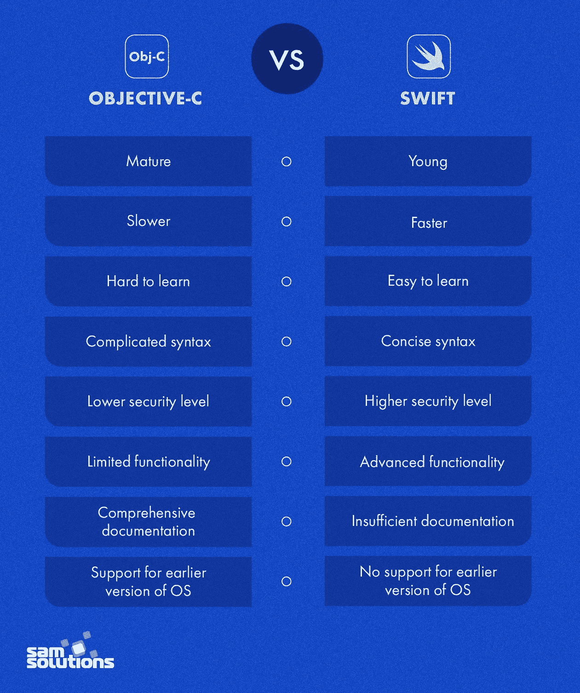
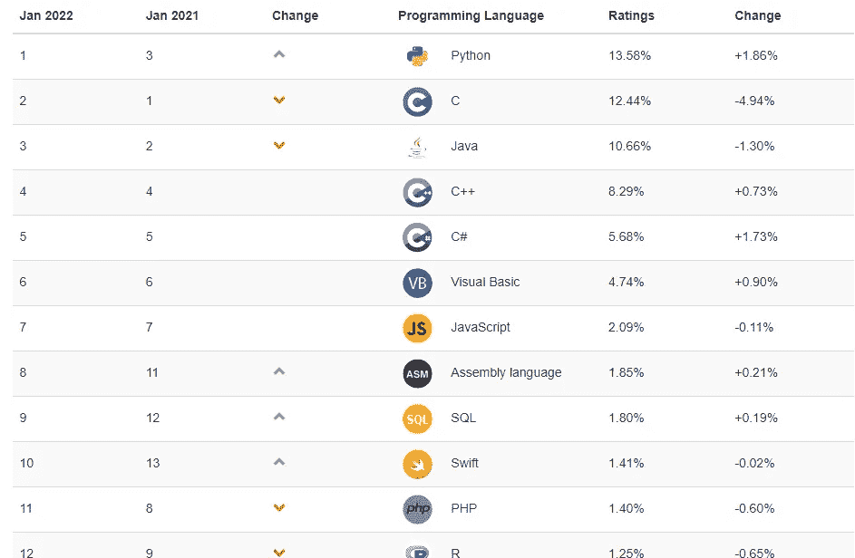
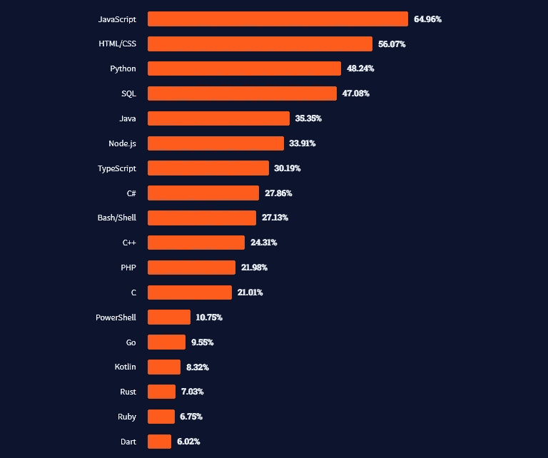
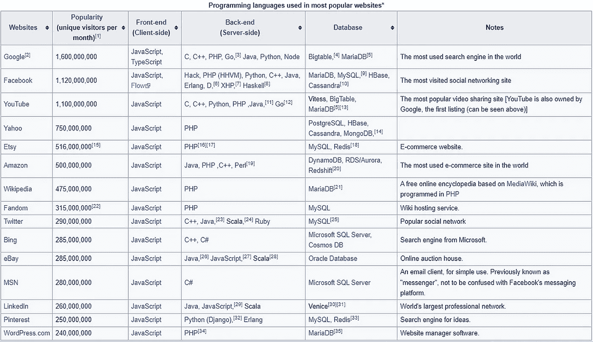
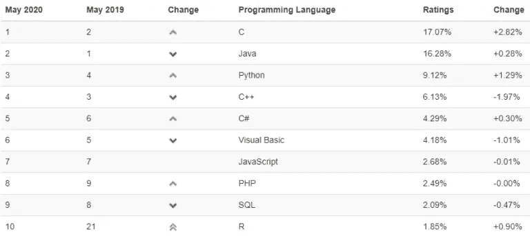

# 你不应该学习的 6 种编程语言(以及应该学习什么)

> 原文：<https://levelup.gitconnected.com/6-programming-languages-you-should-not-learn-and-what-to-learn-instead-95c0c3ff1fa1>

## 如果你没有做好，那将是浪费你的时间和精力

米哈伊尔·尼洛夫摄于[佩克斯](https://www.pexels.com/photo/man-in-black-leather-jacket-holding-black-smartphone-6963065/?utm_content=attributionCopyText&utm_medium=referral&utm_source=pexels)

学习一门新的编程语言通常是一段激动人心的旅程。无论你是一个新手还是一个经验丰富的程序员，当涉及到你所学的东西时，你总是想做出正确的决定。

学习新事物通常意味着奉献你的时间。不仅仅是你的时间，还有你的精力和整个自我。换句话说，必须做出牺牲。

在这种情况下，你必须做你的研究，并有意识地学习你想学的东西。以下是你不应该考虑学习的六种编程语言。我会告诉你每种情况下的原因。

# 1.目标-C

世界在发展，编程也是如此。大型科技公司正在投入大量资金发展编程语言。

这是通过查看当前语言的缺点并创建更高效的新语言来实现的。

这一演变的核心是 Objective-C，它是 IOS 和 macOS 中的主要语言。苹果注意到了它的缺点，并决定为未来创造类似但更好的东西。那是斯威夫特出生的时候。

Swift 于 2014 年 [WWDC](https://en.wikipedia.org/wiki/Apple_Worldwide_Developers_Conference) 创立并推出。它是模仿 Objective-C 的，是一个更好的版本。自创建以来，它已经获得了比 Objective-C 更多的关注。

苹果宣布 Swift 是 IOS 的首选语言。他们在推广它，慢慢诋毁 Objective-C。

## 取而代之的是学习什么—Swift

而不是学习 Objective-C 这种正在慢慢被诋毁的语言。你和斯威夫特在一起好多了。苹果计划让 Swift 成为他们所有产品的主要语言。

下图显示了 Swift 相对于 Objective-C 的优势。

图片来源: [SamSolutions](https://www.sam-solutions.com/blog/objective-c-vs-swift-whats-the-difference/)

# 2.Java 语言(一种计算机语言，尤用于创建网站)

根据截至 2022 年 1 月的 [TIOBE 排名](https://www.tiobe.com/tiobe-index/)，Java 位列第三大最受欢迎的语言。

图片来源: [TIOBE](https://www.tiobe.com/tiobe-index/)

当你想到学习一门新的编程语言时，成为第三个意味着什么吗？对大多数人来说，答案是*是的，在这样的排名中名列第三是不容忽视的。*

但让我们更批判地面对它。如果是几年前，答案会是肯定的，但到了 2022 年，老实说答案是否定的。Java 现在已经成了一个老太太。尽管很甜蜜，还是让我们给现在的天后们一个机会吧。他们应得的。

Java 的缺点早已众所周知。较新的编程语言已经解决了这些问题，而且效率更高。

世界上最常用的操作系统是 android，它在 Java 中也有应用。但是谷歌为了 Kotlin 抛弃了 Java。2019 年，他们宣布 Kotlin 是创建 android 应用程序的首选语言。

## 学什么呢——kot Lin 还是 Scala

Kotlin 被宣布为 2019 年 Android 应用程序的首选语言，这是一个不小的壮举。这意味着创作者对未来的语言有着巨大的计划。

你想学习一门经得起未来考验的语言，它的受欢迎程度只会在未来增加。而不是相反。

# 3.HTML 和 CSS

HTML 和 CSS 是非常流行的语言。大多数新程序员盲目地钻研这些语言。下面是 Stack Overflow 的截图，展示了这两种语言的流行程度。

图片来源:[堆栈溢出](https://insights.stackoverflow.com/survey/2021#overview)

它们仅次于 Javascript。与 Javascript 不同，这些语言只是前端。

排名第二是否意味着你应该学习这些语言？绝对不行。

大多数新程序员在他们学习的第一批语言中选择了这些语言，但最终没有获得最大的收益。这是因为他们深入其中，最终投入了大量的时间。

在选择要学习的编程语言时，要考虑的最大因素是你打算如何使用这种语言。使用是指你打算用这种语言达到什么目的，或者你掌握这种语言后的意图。

HTML 和 CSS 是前端语言。深入其中并投入大量时间并不能让你最大限度地利用时间。

这段时间可以用来学习一门语言，只要涉及到网络开发，这门语言就能更好地为你服务。一种语法也可以在后端使用的语言。一门值得深入学习的语言，它能有效地实现你想要的目的，并给你带来更多。

## 取而代之的是学习什么——Javascript

下面是一个截图，显示了流行的网站在他们的前端使用什么。当涉及到前端时，Javascript 无疑是主导力量或巨人。

图片来源:[维基百科](https://en.wikipedia.org/wiki/Programming_languages_used_in_most_popular_websites)

与直接学习 Javascript 相比，深入学习 HTML 和 CSS 对新手来说不会有太多好处。

熟悉这门语言也将允许探索这门语言的后端。

学习 HTML 和 CSS 的基础知识没有坏处。这可能对程序员有益。深入这些语言是不值得的。你更擅长 Javascript。

# 4.服务器端编程语言（Professional Hypertext Preprocessor 的缩写）

当你想到后端时，大多数新开发人员都在努力学习 PHP。当涉及到用后端构建网站时，它已经与 HTML 和 CSS 一起普及了。

PHP 是一种后端或服务器端语言。当谈到学习服务器端语言时，它是一个很好的候选对象，因为与 Java 等语言相比，它的入门门槛较低。

PHP 有其众所周知的缺点。例如，尽管任何语言都有可能进行扩展，但是 PHP 需要更多的努力来进行扩展。这是因为它是动态类型的。根据上下文的不同，同一段代码可能会有不同的行为。

它也缺乏现代服务器端编程语言的优势。另一个缺点是，当你想到开发桌面和移动应用程序时，它并不完美。

现代服务器端语言已经解决了这些缺点，并且带来了其他好处。PHP 在 2004 年还是新鲜事物，当时马克·扎克伯格用它来建设脸书。我们已经不是 2004 年了。我们应该看看其他现代语言来构建更复杂的系统。

## 取而代之学习什么——Python、Javascript 还是 Go

PHP 并不坏，只是它不是未来的语言。你更擅长现代语言。这使得事情变得更加困难，并可能使项目复杂化。

作为一名开发人员，您希望最大限度地利用和提高效率。否则，您可能会花费大部分时间来解决瓶颈问题，而现代语言可以无缝地自动解决这些问题。

花时间学习 PHP 不会给你的时间带来最大的收益。它只是一种后端语言。花时间学习一门更现代的语言，除了后端之外，你还可以用它来做其他事情，这可能会让你受益更多。

# 5.C

根据 TIOBE 指数，截至 2022 年 1 月，C 语言是第二大最受欢迎的语言。它仅次于 python。

但是这种流行意味着它对未来有好处吗？出于科学和生产的原因，也许是的。但是让我们再深入一点。

2020 年 5 月，它超越 Python 跃居第一。下面是图像。

图片来源: [TIOBE](https://www.tiobe.com/tiobe-index/) 指数 2020 年 5 月

为了确定它在未来是否值得，我们必须知道是什么导致它在 2020 年突然崛起。下面是 TIOBE CEO 对 C 蹿升到第一名的可能原因的评论。

> “Java 和 C 在 4 月份已经很接近了，但是这个月 C 又超过 Java 了。上一次 C 排名第一还是在 2015 年。我们只能猜测为什么 C 又是第一了。原因之一可能是冠状病毒。这听起来可能很傻，但是一些编程语言确实从这种情况中受益。数据科学领域的 Python 和 R 就是例子，因为每个人都在寻找病毒的解药。此外，C 和 C++等嵌入式软件语言也越来越受欢迎，因为它们被用于医疗设备的软件中。”—保罗·詹森，TIOBE 首席执行官

好吧，我明白了。c 是大多数家用设备如微波炉、冰箱等使用的语言。换句话说，随着物联网的成熟，它可能会卷土重来。

现在流行不代表以后也会流行。排除它是极其困难的。同时，它也有一些现代语言已经解决的主要缺点。

## 取而代之的是学习什么——铁锈色还是红宝石色

硬件也在变所以 C 的存在不可能完全固化。我知道它是大多数语言之母，但迟早我们可能会离开它。

C++没有解决它的问题，它只是增加了扩展。这造成了不必要的开销。特斯拉实际上更喜欢 C 而不是 C++作为他们的操作系统。

[C vs Rust](https://kornel.ski/rust-c-speed) 颇有争议。无论如何，Rust 是一种现代语言，它被设计用来解决 C/C++的瓶颈，并且如果优化的话，速度也一样快。它也有库，使它更多样化，更容易使用。

Ruby 也是一种现代语言。速度在任何地方都很重要，在初创企业的情况下，它甚至更重要。如果你想移动得更快，Ruby 是一个不错的选择。

# 6.C++

在 [TIOBE 指数](https://www.tiobe.com/tiobe-index/)上，C++被列为第四大最流行的编程语言。

好的排名不应该让任何人不经过深思熟虑就跳到这种语言上。

不像 C 语言用于小型设备、医疗设备和家用物品。C++主要用于创建基于 GUI 的应用程序。其中包括桌面应用程序、网络浏览器、游戏等。

这使得 C++更容易被抛弃，因为有更好的现代语言可以更容易和更有效地完成这项工作。

## 用什么来代替——铁锈色还是红宝石色

Rust 是 Mozilla 在厌倦了 C++的缺点后为他们的桌面应用程序开发的。

他们创造了一种语言，可以解决他们在创建桌面应用程序时所面临的问题。

自从 Rust 诞生以来，它一直在稳步发展，越来越多的程序员喜欢并采用它。本质上，它解决了 C++的缺点，是一种现代语言

C++ vs Rust 也是有争议的，但是当谈到个人语言和未来规划时，Rust 比 C++占了上风。

学习 Rust 或 Ruby 也会让你与众不同。这两种语言都是 T2 语言，竞争不激烈，但薪水却最高。从 coding 游牧民，Ruby 是收入最高的编程语言。这是从 Indeed 和 Glassdoor 获得的平均值。

另一方面，根据 [The Next Web](https://thenextweb.com/news/move-over-python-rust-highest-paid-programming-language-2021) 和 [Tech Gig](https://content.techgig.com/this-is-the-highest-paying-coding-language-and-its-not-python/articleshow/87619661.cms) 的说法，Rust 是收入最高的编程语言。这是由奥赖利技术培训机构进行的 par 研究。Rust 是开发人员中平均工资最高的语言。

# 分级编码

感谢您成为我们社区的一员！[订阅我们的 YouTube 频道](https://www.youtube.com/channel/UC3v9kBR_ab4UHXXdknz8Fbg?sub_confirmation=1)或者加入 [**Skilled.dev 编码面试课程**](https://skilled.dev/) 。

 [## 编写面试问题+获得开发工作

### 掌握编码面试的过程

技术开发](https://skilled.dev)