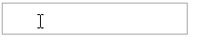

# 你应该知道的 6 个 React 库

> 原文：<https://levelup.gitconnected.com/6-react-libraries-that-you-should-know-about-a7b20a655fc6>


Emile Perron 在 [Unsplash](https://unsplash.com?utm_source=medium&utm_medium=referral) 上的照片

## 它们可能非常适合你的下一个项目

跟上所有最新的趋势和每天都在开发的新库是很困难的。React 生态系统变化很快，你可能会错过一些已经存在的优秀的库。

为了给你的下一个 React 项目一个良好的开端，我们将介绍你应该知道的六个库。希望你会发现这些你目前还不知道的库非常适合你的下一个项目。

# 1.反应数字格式

React 数字格式库允许您格式化输入或文本中的数字，这可以提升用户在您的网站上填写表单时的体验。

使用这个库可以做的事情之一是动态格式化数字输入。让我们看看这是什么样子


所有这些都包含在您的代码中，只有两行:

```
import NumberFormat from 'react-number-format'<NumberFormat thousandSeparator={true} prefix={'$'} />
```

但是您也可以使用这个库来格式化信用卡。



React 数字格式库附带了一系列选项，允许您完全自定义想要的数字输入格式。

GitHub 上有 2K 多一点的 stars，这肯定不是最受欢迎的 React 库。然而，如果你正在处理表单和数字，你真的应该看看这个库。你可以在这里找到 React 号码格式库[。](https://github.com/s-yadav/react-number-format)

# 2.反应挂钩形式

React Hook 表单库带有一个自定义的钩子，用于表单验证，没有任何麻烦。通过安装这个库，你将能够利用 *useForm* 钩子来验证你的表单。

这是 React Hook 表单的淡化版“Hello World”——归功于[文档](https://react-hook-form.com/get-started)。

```
import React from 'react'
import { useForm } from 'react-hook-form'export default function App() {
  const { register, handleSubmit, watch, errors } = useForm()
  const onSubmit = data => console.log(data) return (
    {/* "handleSubmit" will validate your inputs 
        before invoking "onSubmit" */}
    <form onSubmit={handleSubmit(onSubmit)}> {/* register your input into the hook by 
        invoking the "register" function */}
      <input name="example" ref={register} /> {/* include validation with required or 
        other standard HTML validation rules */}
      <input name="fieldRequired" ref={register({required: true})} /> {/* errors will return when field validation fails  */
      {errors.fieldRequired && <span>This field is required</span>}.

      <input type="submit" />
    </form>
  )
}
```

React Hook 表单库在 GitHub 上有超过 15K 颗星，这使它成为该列表中最受欢迎的库。你可以在这里找到 React 钩子表单库。

# 3.类名

*classnames* 库是你下一个项目中不能缺少的库之一。如果您有使用 React 的经验，您可能会遇到无法基于特定条件向元素添加类的问题。

这正是 *classnames* 库负责的事情。这个库允许您有条件地将类名连接在一起。例如，假设我们有一个 *div* ，如果还没有获取数据，我们想隐藏它。

下面的代码示例使用*类名*库，如果变量*data fracted*为 *false* ，则将类 *hide* 添加到 *div* 中。

```
import cn from 'classnames'<div className={cn({'hide': !dataFetched})}>
    // The content of the div
</div>
```

这个库在 GitHub 上有超过 13K 颗星星，可以帮助你解决一个你可能会遇到不止一次的问题。您可以在这里找到类名库[。](https://github.com/JedWatson/classnames)

# 4.反应头盔

React 头盔库是您的项目的另一个基本库。该库允许您对页面的 *head* 元素进行更改。

使用 React 头盔很简单，这使得它也适合经验不足的 React 开发人员。这个库可以用于很多不同的事情——从添加 meta 标签到你的页面，到一个 favicon 和一个标题。

让我们看看向页面添加 meta 标签和标题有多简单。

```
import React from 'react'
import { Helmet } from 'react-helmet'class Application extends React.Component {
  render () {
    return (
      <>
        <Helmet>
          <meta charSet="utf-8" />
          <title>The title of the page</title>
        </Helmet>
        <div>
          Content of the element
        </div>
      </>
    )
  }
} 
```

GitHub 上有超过 14K 的 stars，这绝对是一个受欢迎的 React 库，可能非常适合您的下一个项目。你可以在这里找到 React 头盔库[。](https://github.com/nfl/react-helmet)

# 5.反应饼干

React Cookies 库使得在 React 中访问和修改 cookie 变得很容易。让我们看看下面的例子。

```
import { useCookies } from 'react-cookie'const [cookies, setCookie, removeCookie] = useCookies(['cookie-name']);
```

cookie 对象保存所有以 cookie 的名称作为关键字设置的 cookie。 *setCookie* 和 *removeCookie* 方法允许你分别设置和删除一个 Cookie。

React Cookies 库在 GitHub 上有接近 2K 的星星，当您必须在 React 应用程序中处理 Cookies 时，它非常方便。你可以在这里找到 React Cookies 库。

# 6.反应图像

React 图像库允许您利用 *useImage* 钩子，它支持在加载图像失败时回退到备用源。useImage 挂钩是一个相当简单的挂钩，只有三个选项。

这是*使用图像*钩子的效果:

```
import React, { Suspense } from 'react'
import { useImage } from 'react-image'

function MyImageComponent() {
  const {src} = useImage({
    srcList: 'https://www.example.com/foo.jpg',
  })

  return 
}

export default function MyComponent() {
  return (
    <Suspense>
      <MyImageComponent />
    </Suspense>
  )
}
```

尽管这个库存在的时间不长，但它已经在 GitHub 上获得了近 1K 颗星。你可以在这里找到 React 图像库。