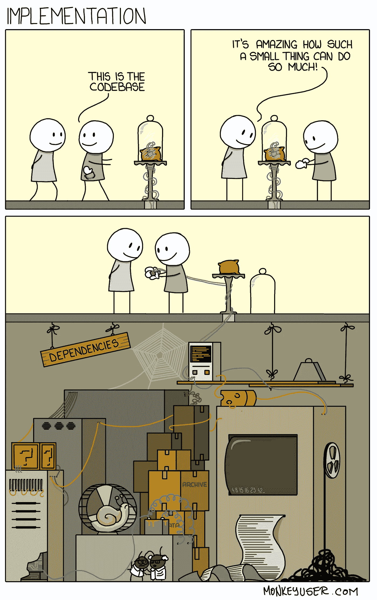
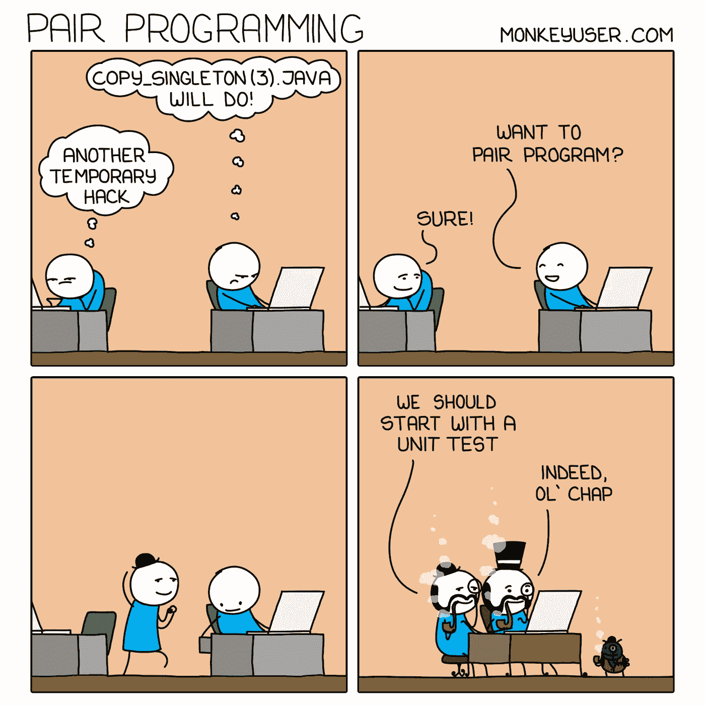
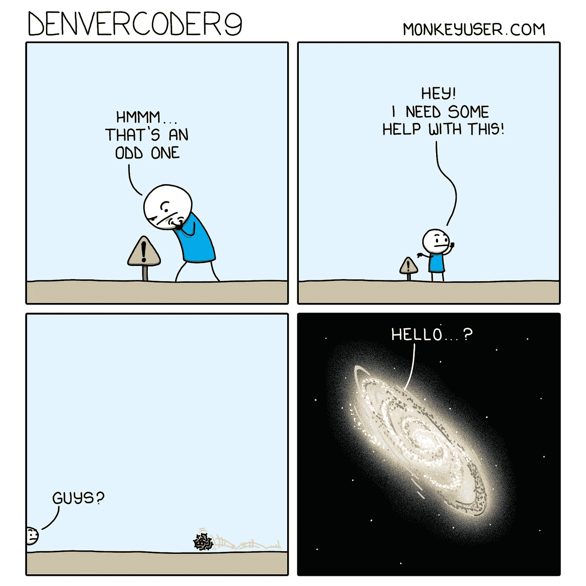
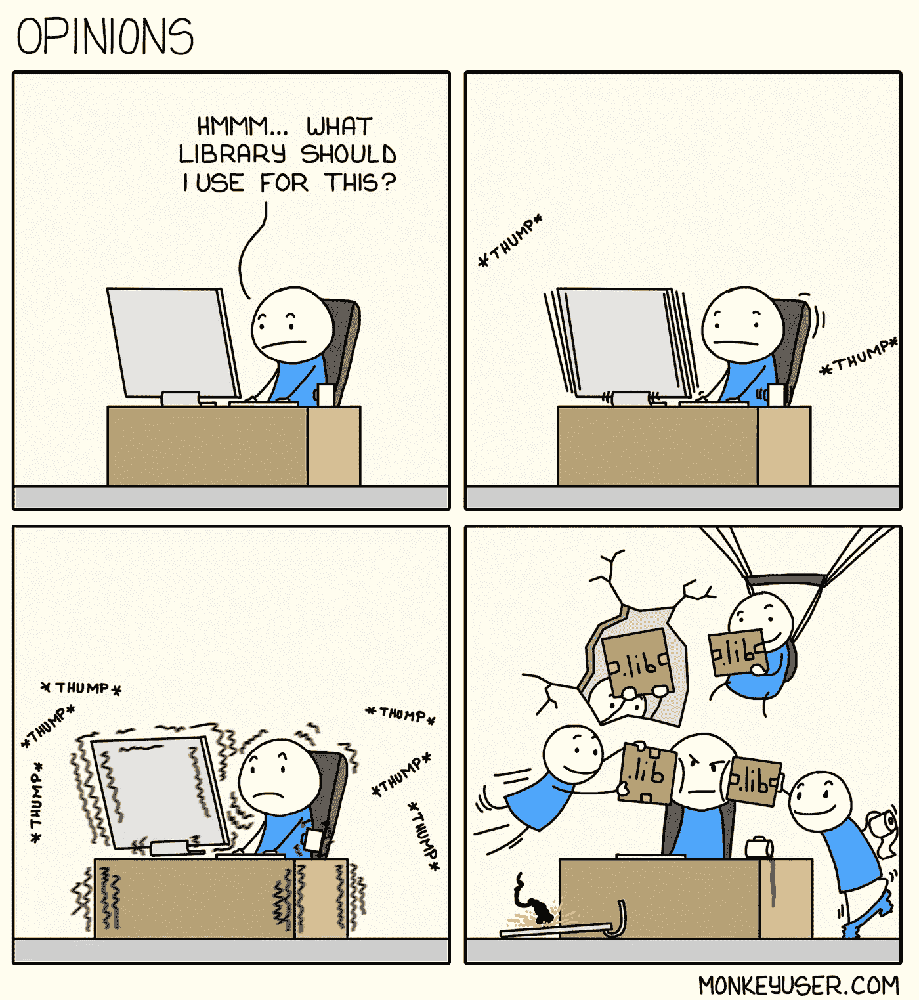
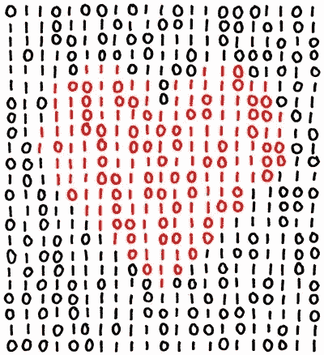

# 6 个让你捧腹大笑的有趣的程序员笑话！

> 原文：<https://levelup.gitconnected.com/6-relatable-programmer-jokes-that-will-make-you-lol-ed9b90a96355>

小心，到处都是虫子！🐛

我们都经历过。任何称职的程序员(嘿！)一生中至少经历过至少一次这样的场景。

软件程序员的生活是艰难的，要逗我们开心有点难，而我们自己的代码经常能逗我们开心。我们只是从一个问题陈述和几个流程图中构建一个产品，这导致了一些有趣的场景。

来源:照片由[杰佛森·桑多斯](https://unsplash.com/@jefflssantos?utm_source=unsplash&utm_medium=referral&utm_content=creditCopyText)在 [Unsplash](https://unsplash.com/s/photos/developer?utm_source=unsplash&utm_medium=referral&utm_content=creditCopyText) 上拍摄

我是在周一写这篇文章的，所以我希望这篇文章能让你在本周余下的时间里振作起来！我们开始吧！

## 属国

当我向一个新开发人员介绍代码库时，这一点特别有趣，展示了酷的、光滑的、组织良好的代码块，而这个可怜的人不知道当他们开始贡献自己时会有什么样的混乱等待着他们。

来源:[猴子用户](https://www.monkeyuser.com/2018/implementation/?sc=true&dir=random)

## 结对编程(或不编程)

许多开发人员发现结对编程很成功，但我个人并不热衷于结对编程。两个头脑意味着两种代码风格，两条通向同一个目的地的道路，以及如果你在某个地方搞砸了，害怕被评判。

结对编程让我思考不想要的场景，并为一个相当简单的问题设计复杂的解决方案。

来源:[猴子用户](https://www.monkeyuser.com/2020/pair-programming/?sc=true&dir=random)

## 唷！

很多时候，当我为了一个新的特性而检查一些旧代码时，我偶然发现一段写得如此糟糕的代码，以至于我想放声尖叫。

但是在我这么做之前，我有一个想法:“如果我是编写这段代码的白痴，会怎么样？”因此，在我像个傻瓜一样对着自己的代码大喊大叫之前，让我看看是否有什么人是我可以责怪的。啊`git blame`感谢存在！

戴夫在哪里？😠

来源:[猴子用户](https://www.monkeyuser.com/2018/blame/?sc=true&dir=random)

## 深入沙漠

偶尔你会遇到一个不常见的错误，没有文档记录，你别无选择，只能随机呼叫开发人员，你会发现一个没有答案的堆栈溢出线程和你有同样的问题，上次更新是在几年前。

你在这种情况下的感觉比独自留在地球上更糟糕。

来源:[猴子用户](https://www.monkeyuser.com/2021/denvercoder9/?sc=true&dir=random)

## 我应该使用哪个图书馆？

人们常说，‘*不要重新发明轮子*’这是有道理的，到目前为止，只有一种广泛使用的轮子实现。但是其他的呢？有一个库、包或 npm 模块可以帮你做到。不是一个，不是两个，而是上百个选择来完成一件事。

那么你选择哪一个呢？库应该使开发更快，对吗？但是找到合适的衣服所花的时间呢？

来源:[猴子用户](https://www.monkeyuser.com/2018/opinions/?sc=true&dir=random)

现在，对于最后一个问题，没有 xkcd 这个兰道尔·门罗的非常聪明的网络漫画，任何编程笑话/迷因的集合都是不完整的。

## 龟

就在三年前，当我不小心删除了生产中的一个表格，我的同事们都抓狂了，那是一个多么有趣的星期五晚上啊！

海龟们关心自己的事情，他们不会弄乱不该弄乱的东西，也就是说他们不会删除生产数据。也许这就是他们活得这么久的原因！

来源: [XKCD](https://xkcd.com/889/)

好了，给你，我希望这篇文章点亮你的一周，给你一点微笑。祝大家一周愉快！

来源: [XKCD](https://xkcd.com/99/)

# 分级编码

感谢您成为我们社区的一员！[订阅我们的 YouTube 频道](https://www.youtube.com/channel/UC3v9kBR_ab4UHXXdknz8Fbg?sub_confirmation=1)或者加入 [**Skilled.dev 编码面试课程**](https://skilled.dev/) 。

 [## 编写面试问题+获得开发工作

### 掌握编码面试的过程

技术开发](https://skilled.dev)