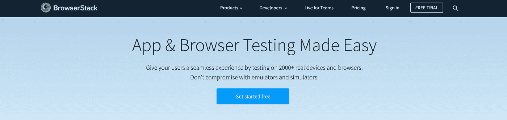
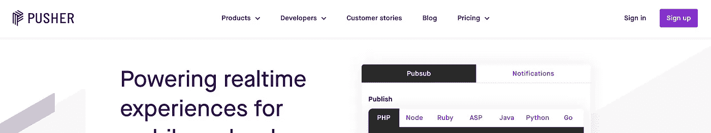

# 6 项服务可以为你的下一个项目助一臂之力

> 原文：<https://levelup.gitconnected.com/6-services-that-can-offer-a-helping-hand-for-your-next-project-5f533a3bf104>

由 [Unsplash](https://unsplash.com?utm_source=medium&utm_medium=referral) 上的[挡块](https://unsplash.com/@blocks?utm_source=medium&utm_medium=referral)拍摄

## 可能非常适合您的 web 开发项目的优秀服务

当开始一个新项目时，每个开发人员都试图让他们的生活尽可能简单。众所周知，使用正确的工具有助于实现这一目标。在使用正确的服务时也是如此。有很多服务，无论是免费的还是付费的，都在等着你的下一个 web 开发项目使用。

可用的服务数量可能相当多。这就是为什么我们会浏览一些对你的下一个 web 开发项目有用的服务，并向你伸出援助之手。

# 1.浏览器堆栈

[Browserstack 网站](https://www.browserstack.com/)

BrowserStack 是一个非常棒的工具，它基于云，允许你在 2000 多种浏览器和真实设备上跨浏览器测试你的网站。虽然 BrowserStack 附带了几个不同的产品，但我想重点介绍手动跨浏览器测试。

这使得跨浏览器测试变得轻而易举。比方说，你正在使用 iMac，想在旧版本的浏览器上查看你的网站，比如 Internet Explorer 11。在你的 iMac 上安装这个浏览器会花费你很多时间——如果你设法安装并完全运行它的话。使用 BrowserStack，您可以在一分钟内启动并运行 IE11 浏览器。

你不仅可以用 BrowserStack 测试大量的浏览器。它还允许你测试各种各样的设备——从 iPhone 6 到几个平板电脑，一直到 Galaxy S20。

BrowserStack 有一个非常有限的免费计划。最基本的订阅费用是每月 29 美元，允许你无限制地访问一个用户的跨浏览器测试。

# 2.哨兵

[哨兵网站](https://sentry.io/)

Sentry 的实时错误跟踪帮助每个开发人员诊断、修复和优化他们的代码。对于任何开发团队来说，这都是一个很好的工具，可以提供很多关于哪里出错的有价值的见解。

Sentry 有很棒的文档，可以帮助您使用许多现代编程语言和框架。Sentry 的 SDK 挂钩到您的运行时环境，并自动报告错误、异常和拒绝。

Sentry 附带了一个免费的开发者计划，该计划限制了错误和性能监控。团队计划每月花费 26 美元，其中包括用于错误报告的 5 万个月错误和用于性能监控的 10 万个月错误。

# 3.阿尔戈利亚

[Algolia 网站](https://www.algolia.com/)

如果你正在为网站上复杂的搜索功能而苦苦挣扎，你绝对应该看看 Algolia。Algolia 使搜索功能的实现变得简单且高度可定制，无需花费大量时间。它从第一次击键就立即提供相关的搜索结果。

Algolia 带有一个仪表盘，可以让你调整搜索的方式。您可以提升某些字段，同时也可以从特定查询中排除某些行。这样你就可以完全控制搜索结果如何返回给你的用户。

文档非常全面，Algolia 可以很容易地集成到几乎所有现代编程语言或框架中。

Algolia 提供为期 14 天的免费试用。标准订阅费用为每 1000 个搜索请求 1 美元。你网站上的搜索请求越多，花费就越多。

# 4.推进器

[推手网站](https://pusher.com/)

当向你的用户提供任何实时体验时，你真的应该看看 Pusher。当使用通知、聊天、位置跟踪和任何其他形式的实时数据等功能时，Pusher 可以为您的项目提供帮助。

Pusher 提供了 40 多个 SDK，这使得 Pusher API 几乎可以用于任何技术栈。除此之外，还有几个教程可以帮助您入门。您也不必担心文档，因为它们都在那里。

Pusher 有一个免费计划，允许每天 20 万条消息和 100 个并发连接。启动计划每月花费 49 美元，每天提供 100 万条消息和 500 个并发连接。

# 5.Mailgun

[Mailgun 网站](https://www.mailgun.com/)

Mailgun 是一款专为开发者打造的电子邮件服务。它带有强大的 API，使您能够毫不费力地发送、接收和跟踪电子邮件。虽然 Mailgun 允许你做的不仅仅是发送电子邮件。它还配有突发发送和电子邮件验证等产品。

除此之外，还可以对你发送的邮件进行各种分析和跟踪。像每小时的打开率和点击率这样的统计数据可以帮助你决定发送邮件的最佳时机。

像列表中的大多数服务一样，Mailgun 也有免费计划。这项免费计划包括 3 个月内每月 5000 封免费邮件。这 3 个月后，您只需为发送的内容付费。额外的电子邮件费用为每 1000 封 0.80 美元。第一个付费计划每月花费 35 美元，允许你发送 50，000 封电子邮件。

# 6.种类

[条纹网站](https://stripe.com/)

如果您必须处理任何形式的支付，无论是一次性支付还是订阅，Stripe 都是您的不二之选。人们会选择使用某个支付提供商有几个原因。易于设置，费用，卡和支付方式得到接受。条纹检查所有的箱子！

由于大量的文档，设置支付处理是轻而易举的。如果你曾经使用过任何其他支付提供商，你可能会知道这可能是一场灾难。缺少或不正确的文档、复杂的集成和不透明的费用是您可能经历过的一些事情。

Stripe 收取 1.4%的费用，外加每笔交易 0.25 美元的额外费用。这意味着你做的交易越多，你支付的就越多。另一方面，如果你没有任何交易，你也不必支付任何费用。此外，很高兴知道没有设置或每月费用。

# 包装它

在本文中，我们列举了六种服务，可以为您的下一个项目提供帮助。所有这些服务都减轻了您的负担，因为如果您必须自己实现类似的东西，将会花费更长的时间。最重要的是，实现这些服务是尽可能容易的(除了 BrowserStack，您不必实现它),所以不会花太多时间。

你认为这份清单上少了一项服务吗？请在评论中告诉我。很想听听大家的建议。

编码快乐！