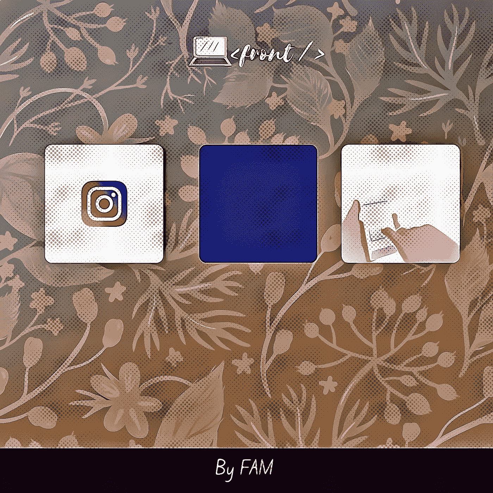
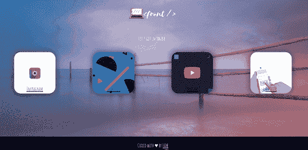
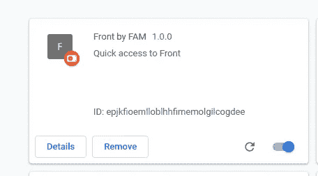
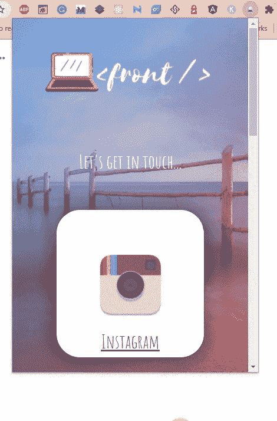

# 构建自己的 chrome 扩展并开始赚钱的 6 个步骤！

> 原文：<https://levelup.gitconnected.com/6-steps-to-build-your-own-chrome-extension-and-start-making-money-cde3b4cf0db9>

## 如何创建自己可爱的 chrome 扩展？

由 FAM 设计

我需要创建我的第一个 chrome 扩展来自动化一些我需要重复做的事情。在这篇文章中，我将分享我所学到的，我将总结你需要做什么，以便你可以快速创建自己的 chrome 扩展。直奔主题！

这是如此有趣，因为许多开发者使用这种方式通过销售 chrome 扩展在线创造收入。

准备好了，我们走！

# 步骤 1:创建目录结构

在开始编写扩展代码之前，我们需要一个文件夹来创建扩展，这个文件夹应该有一个特定的结构，这样扩展才能工作。

我们主要需要三样东西:

*   清单文件
*   一个图标
*   HTML 文件

# 步骤 2:创建清单文件

清单文件就像是 Chrome 理解和正确加载扩展所需的配置文件。

下面是一个`manifest.json`文件的例子:

您可以为服务器端任务和更多选项添加后台脚本。要了解更多，我推荐你查看这个[文档](https://developer.chrome.com/docs/webstore/get_started_simple/)。

# 第三步:建立你的扩展系统。

这是关键的一步。我们将编码你的扩展将做什么，系统！

在本文中，我选择制作一个 Chrome 扩展，让你可以快速找到我。😅

## -设计

对于这个例子，我将保持事情简单。我们需要:

*   背景
*   我的社交媒体链接的一些卡片
*   一个简单的页脚链接到我在互联网上的宇宙^^

就这样，最后我们会得到类似这样的东西:

作者:FAM

## -编码

*   一个标志和标题
*   Instagram、LinkedIn、Youtube 和 Twitter 帐户的卡片。
*   页脚

你会注意到我已经集成了一个 CSS 文件`front.css`和一个 JS 文件`front.js`。目前，我在这个例子中没有使用 JavaScript 文件，但是我添加了它来说明我们可以在 Chrome 扩展中使用 JavaScript！

前镀铬延伸件

# 步骤 4:设计扩展的样式

网络世界中的造型就像经济世界中的营销！你必须关心它，并正确地做它，这样事情才会对你的用户或客户有吸引力。

对 HTML 代码进行样式化后，下面是最终结果:

*   桌面

前镀铬延伸件

*   小屏幕版本

前镀铬延伸件

## CSS 代码:

前延伸 CSS

# 第五步:自豪地看着它在行动

最后，这是最激动人心的一步。我们将发布我们的扩展，并开始看到它的行动！

为此，我们必须:

*   ***前往 Chrome://extensions***
*   ***激活开发者模式***
*   ***点击***
*   ***选择你的项目***
*   ***恭喜恭喜！你的分机将会加载***

我可爱的分机

检查您的扩展列表，看看是否一切正常！

前延伸部分正在发挥作用

# 第六步:如果一切正常，那么自豪地向全世界公布扩展！

你已经完成了最难的部分。现在，你可以在 Chrome 商店发布你的扩展了:

*   创建项目的 zip 文件
*   创建开发人员帐户
*   上传你的物品
*   为你的物品添加资产
*   提交您的项目进行发布

点击此处了解更多详情:

 [## 在 Chrome 网络商店发布- Chrome 开发者

### 这个页面描述了你如何发布一个新的扩展或者主题(“项目”)到 Chrome 网络商店。在您发布…

developer.chrome.com](https://developer.chrome.com/docs/webstore/publish/) 

# 视频回顾？

@the_frontend_world

# 最后的想法…

许多开发者开发 Chrome 扩展，并因此获得额外收入。如果你想成为他们中的一员，你应该找到需要特定东西(通常称为利基)或需要某样东西的自动化过程(例如，[奥贝罗](https://chrome.google.com/webstore/detail/oberlo-aliexpresscom-prod/hmanipjnbjnhoicdnooapcnfonebefel?hl=en))的受众，创建扩展，并开始在 Chrome 商店上销售。

如果您对源代码感兴趣，这里有:

*   [源代码](https://github.com/famzila/front-extension)

# 资源

*   [https://giphy.com/](https://giphy.com/)
*   [https://developer . chrome . com/docs/extensions/mv3/get started/](https://developer.chrome.com/docs/extensions/mv3/getstarted/)

# 关于我？

由 FAM 设计

亲爱的读者，我希望这是明确和有用的。我希望你和你的家人无论在哪里都平安无事！坚持住。明天会更好！

**让我们在** [**上取得联系**](https://medium.com/@famzil/)**[**Linkedin**](https://www.linkedin.com/in/fatima-amzil-9031ba95/)**[**脸书**](https://www.facebook.com/The-Front-End-World)**[**insta gram**](https://www.instagram.com/the_frontend_world/)**[**Youtube**](https://www.youtube.com/channel/UCaxr-f9r6P1u7Y7SKFHi12g)**或**********

******[www.fam-front.com](http://www.fam-front.com/)******