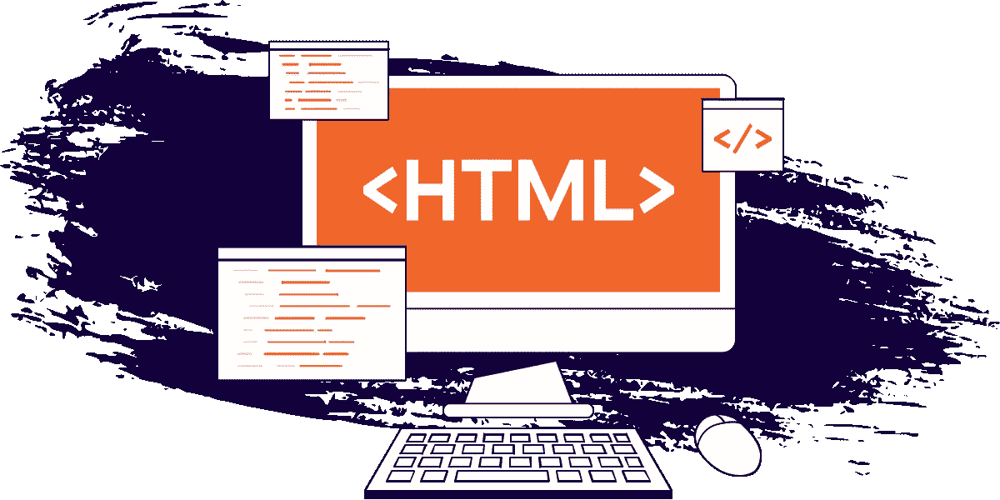
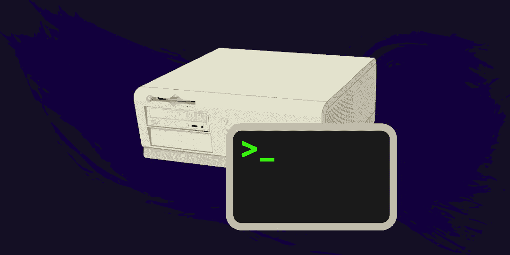
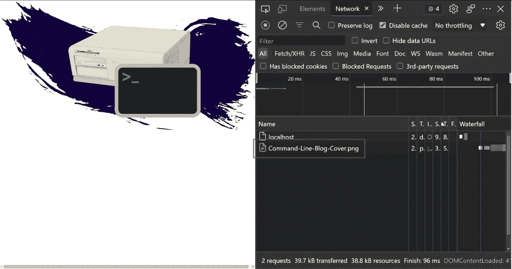
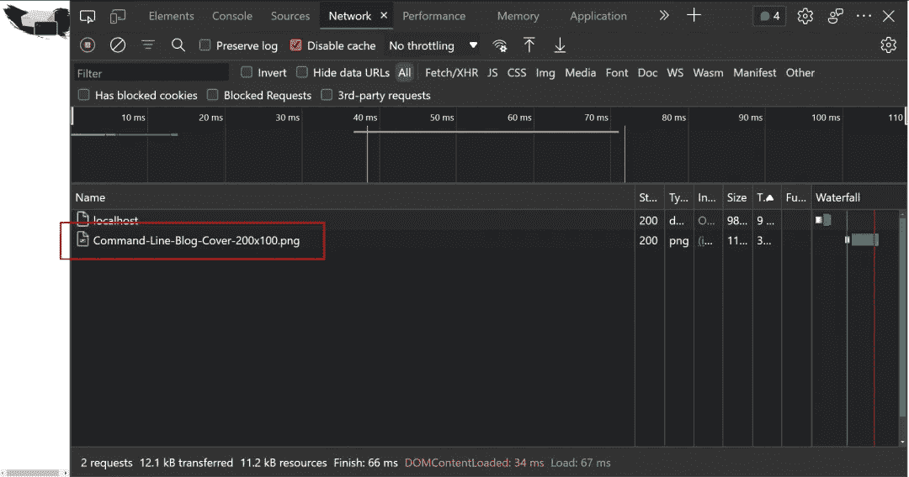
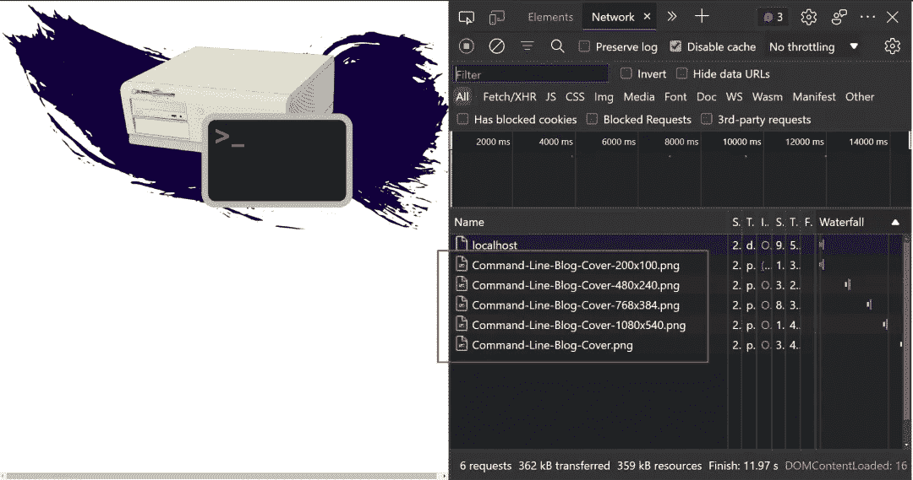
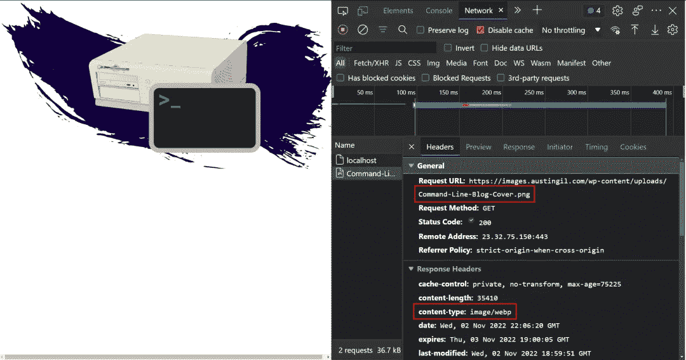
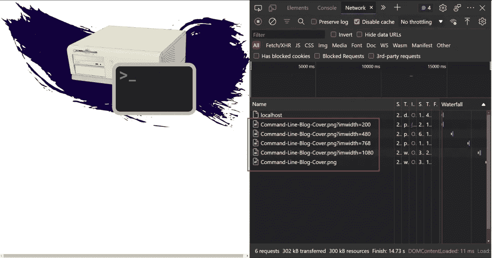
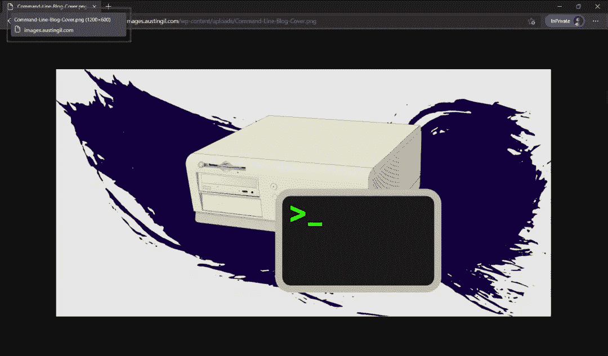
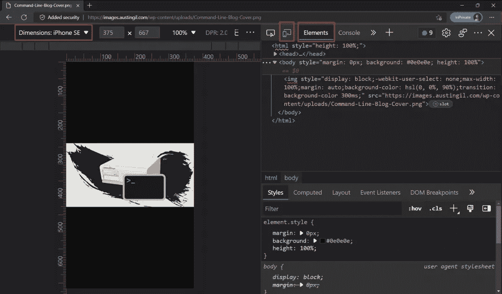
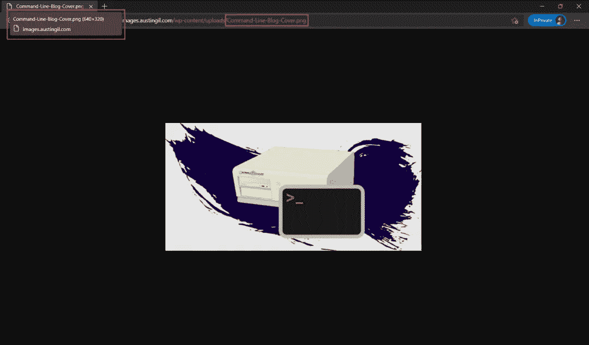

# 为用户和开发者改进 HTML 图像的 6 个步骤

> 原文：<https://levelup.gitconnected.com/6-steps-to-improve-html-images-for-users-developers-9e6025ab45b8>



TLDR:

*   `` **带刚** `src`:容易实现。良好的开发者体验。没有响应图像。没有后退的现代格式。可能使用更多带宽。最差的用户体验。
*   `` **带** `srcset` **属性**:工作中等。Ok 开发者体验。支持响应速度快、带宽低的图像。没有后退的现代格式。将潜在的节约留在桌面上。好的用户体验。
*   `<picture>` **带多个** `<source>` **和** `srcset`:支持响应式图像和带后退的现代格式。宁愿往我眼睛里喷墨西哥胡椒汁。
*   `` **带 just** `src` **带图像管理器**:易于实现，自动以最佳尺寸和格式发送图像。开发者和用户双赢！！！

让我们说，我们只有一个基本的网站，是从我的领域加载图像。我们的代码可能是这样的:

```
<!DOCTYPE html>
<html>
<body>
  
</body>
</html>
```

一个带有单个图像标签的 HTML 文档，该标签有一个`[src](https://developer.mozilla.org/en-US/docs/Web/HTML/Element/img#attr-src)`和一个`[alt](https://developer.mozilla.org/en-US/docs/Web/HTML/Element/img#attr-alt)`属性。这在技术上是可行的。它提供了预期的图像，但是这个图像有几个问题。



在大屏幕上，这个图像就可以了，但是对于使用小屏幕设备的用户来说，1200 像素宽的图像意味着他们不得不下载比他们需要的更大的图像。这可能需要更长的时间来下载，并可能花费他们的数据计划的钱。

# 步骤 1:优化和调整图像大小

这第一步是关键的一步，但也是我认为大多数人都熟悉的一步，所以我不会走得太远。

1.  你的网站上的图片应该只有他们需要的那么大。如果你的图片只有 600 像素宽，400 像素高，你就不应该让人们下载 1200x800px 像素的图片。
2.  大多数网站不需要尽可能高质量的图片。通过压缩图像，您可以删除大量不必要的数据，而不会损失质量。

Squoosh 是一个非常棒的手动应用程序。

如果图片在你的 GitHub repo 中，你也可以用 [imgbot](https://imgbot.net/) 自动完成。

# 步骤 2:创建响应图像

图像可以有一个`[srcset](https://developer.mozilla.org/en-US/docs/Web/HTML/Element/img#attr-srcset)`属性，允许我们根据某些设备特性(如设备宽度)为图像定义多个来源。

我们可以向图像标签添加一个`srcset`属性，如下所示:

```
<!DOCTYPE html>
<html>
<body>
  
</body>
</html>
```

我链接到五个不同大小的五个不同图像，并定义它们对应的视口宽度。如果我们在浏览器中打开我们的图像，视觉上没有什么变化。但是在引擎盖下有一些改进。

当我们在不同的屏幕上重新加载时，打开 devtools 网络选项卡。

在一个大屏幕上，我们会看到全尺寸的图像被下载(Command-Line-Blog-Cover.png)，就像我们以前做的那样。没什么特别的。



但是如果我们在 200 像素或更窄的屏幕上开始，我们加载 200x100 像素的图像(命令行-博客-封面-200x100.png)。



对于用户来说，这个尺寸将会更小，下载速度也会更快。

只发送较小的图像有一个问题，如果用户最初在小屏幕上加载页面，然后将浏览器的大小调整为更大，会发生什么？在大屏幕上拉伸小图像会使其像素化。

对于`srcset`属性，这种情况不会发生(假设我们提供了正确的图像)，因为当从最小屏幕调整到最大屏幕时，新的图像会根据它们的断点下载。



方便的是，同样的行为不会发生在另一个方向，大屏幕到小屏幕，因为毕竟，你可以在一个较小的屏幕上提供一个大的图像，它可以缩小而不损失质量。当屏幕变小时，你不希望下载额外的图像，因为那会使用更多的数据而没有任何额外的好处。

这确实是一种通过节省带宽和以合适的大小提供合适的图像来改善用户体验的便捷方式，但仍有改进的空间。

# 第三步:使用现代图像格式

我们正在加载的图像是一个 PNG，但是现代浏览器支持新的图像格式，比如 [WebP](https://en.wikipedia.org/wiki/WebP) 或者 [AVIF](https://en.wikipedia.org/wiki/AVIF) 。这些格式提供了更高的压缩率，而没有明显的数据丢失，这意味着我们可以在更小的文件大小中有效地提供相同的图像。

浏览器再次用 [HTML](https://developer.mozilla.org/en-US/docs/Web/HTML/Element/picture) `[<picture>](https://developer.mozilla.org/en-US/docs/Web/HTML/Element/picture)` [元素](https://developer.mozilla.org/en-US/docs/Web/HTML/Element/picture)覆盖了我们。

类似于`srcset`属性，图片元素允许我们根据设备特性定义不同的图像源。

因此，我们可以根据设备宽度或不同的像素密度提供不同的图像。但是将图片元素与`srcset`属性区分开来的一点是我们可以针对不同的 mime 类型。

让我们在示例中添加一个图片元素，如果浏览器支持的话，该元素包含 AVIF 和 WebP 格式。当然，我们也希望继续提供响应版本。

```
<!DOCTYPE html>
<html>
<body>
  **<picture>
    <source
      type="image/avif"
      srcset="
      https://austingil.com/wp-content/uploads/Command-Line-Blog-Cover.avif 1200w,
      https://austingil.com/wp-content/uploads/Command-Line-Blog-Cover-1080x540.avif 1080w,
      https://austingil.com/wp-content/uploads/Command-Line-Blog-Cover-768x384.avif 768w,
      https://austingil.com/wp-content/uploads/Command-Line-Blog-Cover-480x240.avif 480w,
      https://austingil.com/wp-content/uploads/Command-Line-Blog-Cover-200x100.avif 200w"
    >
    <source
      type="image/webp"
      srcset="
      https://austingil.com/wp-content/uploads/Command-Line-Blog-Cover.webp 1200w,
      https://austingil.com/wp-content/uploads/Command-Line-Blog-Cover-1080x540.webp 1080w,
      https://austingil.com/wp-content/uploads/Command-Line-Blog-Cover-768x384.webp 768w,
      https://austingil.com/wp-content/uploads/Command-Line-Blog-Cover-480x240.webp 480w,
      https://austingil.com/wp-content/uploads/Command-Line-Blog-Cover-200x100.webp 200w"
    >**
    
  **</picture>**
</body>
</html>
```

(我们不需要在``标签上添加`srcset`，因为这是不支持`srcset`的老浏览器的备用方案。)

好了，我们得到了一个图像，它只能以最小的尺寸给用户提供最现代的图像格式。

上面的代码不就是…好看吗…？

真的让你想添加新的图片到你的网站，对不对？

对！？！？

(ಥ◡ಥ)

天啊。不要！我们做了什么！？！？

# 第四步:开始质疑生活选择

…

（🎶你好，黑暗，我的老朋友…🎶)

…

# 第五步:简化现代图像格式

好了，现在我们已经解决了这个问题，很明显，上面的解决方案并不好。

我们需要不同版本的图像，以适应我们想要的每种格式和设备宽度。从上面的例子来看，这是同一张图片的 11 个版本(5 个 AVIF，5 个网页，1 个 PNG)。

尽管浏览器为我们提供了提供更好的图像和更好的用户体验的功能，但这是以牺牲开发者体验为代价的。

(谁愿意为此买单呢？不是我！)

我们可以在上传图像时自动生成不同的格式和大小，然后将这些细节存储在数据库中。有一些工具可以提供帮助，比如`[sharp](https://www.npmjs.com/package/sharp)`，但这仍然需要大量的工作。我很少看到人们这样做，因为要么工作量太大，要么他们根本不考虑。

我的建议是外包。

今天我将使用 [Akamai 图像和视频管理器](https://www.akamai.com/products/image-and-video-manager?utm_source=influencer&utm_medium=blog&utm_campaign=austingil)，因为这是我最熟悉的服务，尽管也有其他人做同样的工作。主要目标是为用户提供最好的图像，而不会让开发人员发疯。

我在 images.austingil.com 建立了一个图像管理器的实例。

要从我的域中添加图像，我可以在常规的图像 URL 中添加“images”前缀。于是“austing il . com/WP-content/uploads/Command-Line-Blog-cover . png”就变成了“images . austing il . com/WP-content/uploads/Command-Line-Blog-cover . png”。

没什么太有趣的。

但是让我们回到我们的代码，去掉`<picture>`元素，替换旧的 URL，看看我们能做什么:

```
<!DOCTYPE html>
<html>
<body>
  
</body>
</html>
```

与在 AVIF 和 WebP 中使用`<picture>`元素相比，我认为没有人会抱怨这一点。这肯定是少干活，但是结果呢？

如果我重新加载页面，我们可以看到同样的图像出现(“Command-Line-Blog-Cover.png”)，但是如果我们查看响应标题，事情会变得有点有趣。



虽然请求的是 PNG 图像，但响应实际上是发送一个 WebP 数据。这导致一个更小的图像尺寸，这意味着只需打开图像管理器，我已经为我的用户节省了带宽，而无需做任何事情。

# 步骤 6:简化响应图像

我们改进了格式，但是相应的图像大小呢？

我仍然将`srcset`属性设置为在小屏幕上显示小图像，在大屏幕上显示大图像。但是该系统仍然依赖于提供具有五种不同分辨率的五种不同图像。

还是很痛苦。

仅仅提供上传功能就已经是一个很大的功能了，更不用说调整大小和存储不同的图像了。幸运的是，因为我们使用了图像管理器，我们实际上可以使这个过程简单得多。

实际上，我将多次引用同一个图像，而不是使用五个不同大小的不同图像。但是我将添加一个查询字符串参数，它明确地定义了我想要的目标大小。

```
<!DOCTYPE html>
<html>
<body>
  
</body>
</html>
```

注意，现在每个图像 URL 都指向同一个“Command-Line-Blog-Cover.png”文件，但是其中一些附加了一个额外的`[imwidth](https://techdocs.akamai.com/ivm/reference/test-images-on-demand)`查询字符串。

如果我像以前一样在这个小屏幕上重新加载并调整到一个更大的屏幕，我们会看到类似的行为。不同尺寸的不同图像被加载到各自的屏幕尺寸中。



但是这里有一个很大的不同。我们不必创建、上传和管理五个不同大小的不同图像，而只需担心一个图像。通过奇异字符串参数生成不同的大小。

这比其他方式要少很多工作，特别是如果你使用基于组件的框架。

但是我们可以做更少的工作！

我们可以回到只使用图像 URL，让图像管理器为我们选择合适的大小。

为了展示它，我喜欢在一个新标签中打开图片，而不是在网站上。将鼠标悬停在浏览器选项卡上会显示图像的尺寸，1200x600px。



如果我打开我的 devtools，我可以转到 Elements 选项卡，模拟不同的设备，如 iPhone SE



当我重新加载时，有趣的事情发生了。



尽管 URL 完全相同，但我可以看到图像的大小只有一半。将鼠标悬停在选项卡上可以确认尺寸为 640x320px。

最棒的是。决定提供哪个图像的所有工作都是在我(开发人员)不做任何事情的情况下进行的。每个请求都会自动发送设备特征，Image Manager 会以一个小得多的图像进行响应。

老实说，我无法解释它是如何工作的。这太神奇了，超级酷，让我的生活更轻松，让我的用户生活得更好。

(如果你真的很好奇它是如何工作的，[在 Twitter 上联系我](https://twitter.com/heyAustinGil)，我会帮你找到答案。)

如果你是 [Akamai](https://www.akamai.com/) 的用户，并且你没有使用这个功能，你应该马上使用它！

# 可选的“我是坏蛋”步骤:自己动手！

我还想为不是 Akamai 客户的人分享一些替代方案。有两个开源项目看起来提供了相似的特性，尽管我没有亲自使用过它们。

其中一个叫做 [imgproxy](https://github.com/imgproxy/imgproxy) 。另一个叫做[拇指或者](https://github.com/thumbor/thumbor)。只要你习惯使用 Docker，它们看起来都很容易安装。

我真的很喜欢廉价而强大的 VPS，如果你想试着推出其中任何一个的实例，你可以使用这个链接获得 100 美元的信用。

[linode.com/akatube](https://www.linode.com/akatube?utm_source=austin_gil&utm_medium=blog&utm_campaign=blog-austin_gil-dev_advocate-austin_gil&utm_content=&utm_term=)

我是 DIY 方法的忠实粉丝，但我不认为它没有缺点(我的意思是，除了设置和维护)。我不确定这些服务的图片托管在哪里。如果它们和安装在同一个服务器上，那么有两个可能的问题。

1.  如果你正在生成同一张图片的多个版本，这些版本必须存在于某个地方。如果他们住在同一个 VPS 上，费用会更高。尝试为图像使用类似于[对象存储](https://www.linode.com/products/object-storage/)的东西，因为这样有更便宜的存储费用。
2.  从同一位置加载图像可能会导致延迟问题。我真的很喜欢 Image Manager 提供的 Akamai CDN 网络，因此图像总是来自离用户最近的地方。这可以大大加快下载速度。

也就是说，我认为它仍然值得一试。

如果你真的让它工作了，并且你喜欢它，请回来让我知道它进行得如何。哪些进展顺利，哪些没有成功，哪些很棒，还有哪些缺失？

# 结束语

好了，这就是我今天为你准备的。我们浏览了处理图像的不同选项及其优缺点。从只有`src`属性的``开始，添加了一个`srcset`属性，移动到有不同`<source>`标签的`<picture>`，最终全部烧毁，回到只有``属性的`src`，但是合并了图像管理器。

换句话说，这是一个非常迂回的旅程:

```
<! – BAD – >

```

对此:

```
<! – GOOD – >

```

多么虎头蛇尾。

也许可以节省时间，只需说，“改善图像的一个步骤:使用图像管理器”，但这有什么意思呢？我也喜欢探究原因。

我们甚至没有触及像[延迟加载](https://developer.mozilla.org/en-US/docs/Web/HTML/Element/Img#attr-loading)、[解码](https://developer.mozilla.org/en-US/docs/Web/HTML/Element/Img#attr-decoding)或[获取优先级](https://developer.mozilla.org/en-US/docs/Web/HTML/Element/Img#attr-fetchpriority)这样的事情，但是这些更有上下文关系和细微差别，而上面的建议几乎是全面的。

无论如何，我希望你喜欢它，我希望你实施这些解决方案中的一些，因为用现代格式发送较小的图像是一个伟大的方式，使互联网成为一个更快、更环保的地方。


非常感谢您的阅读。如果你喜欢这篇文章，请[分享它](https://twitter.com/share?via=heyAustinGil)。这是支持我的最好方式之一。你也可以[注册我的时事通讯](https://austingil.com/newsletter/)或者[在 Twitter 上关注我](https://twitter.com/heyAustinGil)如果你想知道什么时候有新文章发表。

*原载于*[](https://austingil.com/better-html-images/)**。**