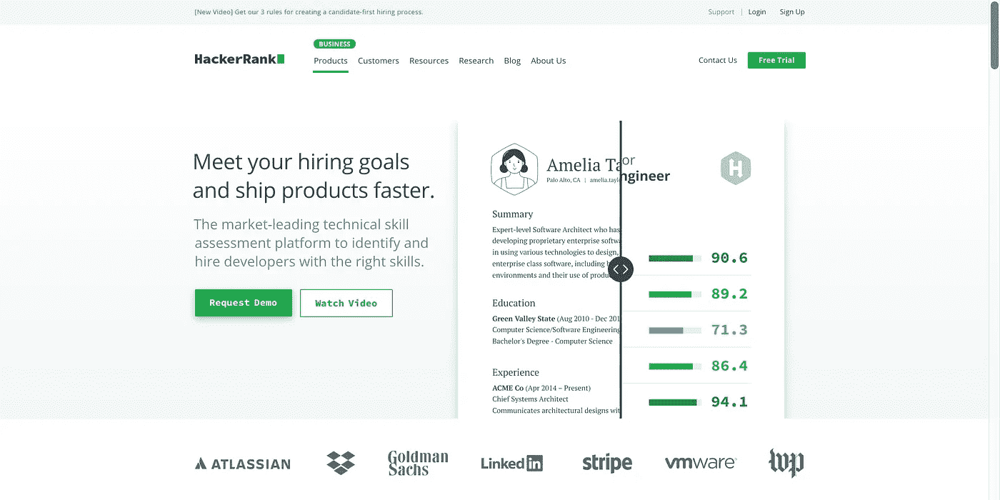
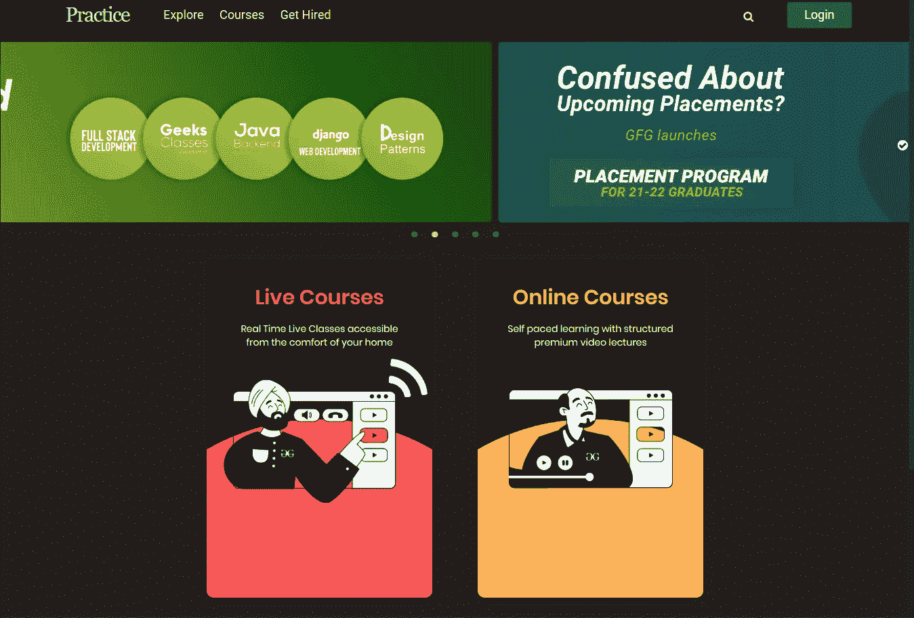
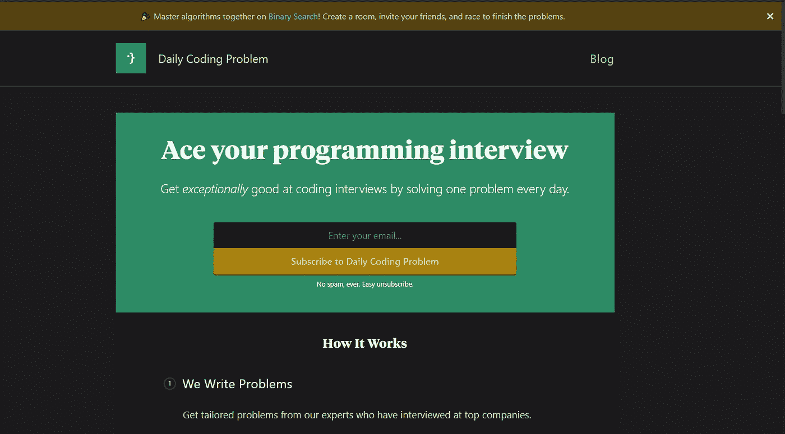
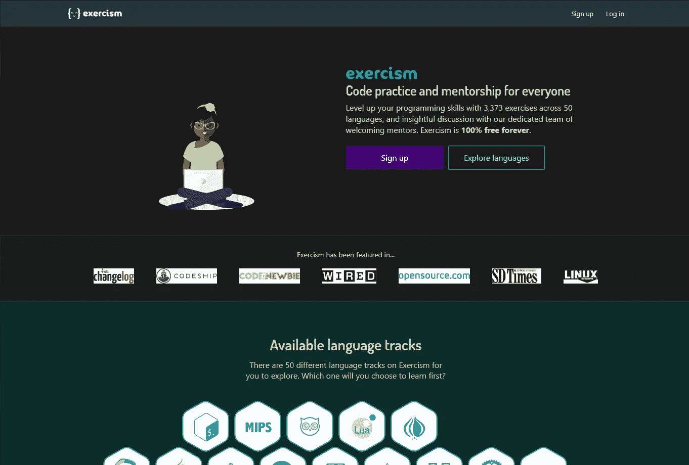

# 6 个超级酷的练习算法、学习编程的网站

> 原文：<https://levelup.gitconnected.com/6-super-cool-websites-for-practicing-algorithms-learning-programming-4cda65a64b7e>

## 你不可能在对算法一无所知的情况下通过谷歌或脸书的面试。所以为什么现在不学呢。

我是一名拥有超过 15 年经验的程序员。在我的最初几年(从高中开始)，我学习并研究了很多算法。直到毕业，我一直在学习，并对它充满热情。毕业后开始出国留学，走上了研究的道路。

但是，工作 3 年后，我更喜欢做产品/软件，而不是做研究。我转向了技术/工程而不是算法。但是，我个人认为，对于开发者来说，理解算法仍然是一件相当重要的事情。我不认为你对谷歌或脸书一无所知就能通过面试！

法比安·格罗斯在 [Unsplash](https://unsplash.com/s/photos/programming?utm_source=unsplash&utm_medium=referral&utm_content=creditCopyText) 上拍摄的照片

 [## 编写面试问题

### 一个完整的平台，在这里我会教你找到下一份工作所需的一切，以及…

技术开发](https://skilled.dev) 

# 1.黑客银行

这个网站在编程界超级有名，从初级到高级，从开发人员到招聘经理。

【hackkerrank.com 

[Hackerrank](http://hackkerrank.com) 算法很多，难度从低到高，各种算法和数据结构(甚至 SQL)。你会写代码，直接运行看看结果，或者查看讨论看看大家是怎么解决的。

在我面试的过程中，也有几家公司让我来这里做他们的测试(算法+选择题+作文)。所以，你可以来这里多做运动，慢慢习惯。

# 2.顶部代码

[https://www.topcoder.com/challenges/](https://www.topcoder.com/challenges/)

[TopCoder](https://www.topcoder.com/challenges/) 是程序员们可以直接相互竞争的第一批在线“竞技场”之一。它提供了一个算法挑战的列表，你可以用他们的代码编辑器在线完成。单轮比赛每月在特定时间举行几次，程序员们互相竞争，以最快的速度和最高的分数解决挑战。

在 TopCoder 上排名靠前的用户都是非常优秀的程序员，定期参加很多编程比赛。排名最高的人将拥有自己的博客，名为“PETR·米特里切夫的算法周刊”，他们可以在这里写关于代码竞赛、算法、数学以及任何他们喜欢的东西。

# 3.极客工作室

如果你在做一个算法时遇到了困难，在谷歌上寻找解决方案后，你可能会看到这个页面几次。

[https://practice.geeksforgeeks.org/](https://practice.geeksforgeeks.org/)

这个[geekforgeks](https://practice.geeksforgeeks.org/)**页面看起来有点……丑，习题分类不太好。但是，它有许多常见算法练习的解决方案。每个解决方案包括许多不同的方法，以及每个方法的复杂性/记忆性。读起来很有趣，也很有帮助。**

**所以，有时候可以看到这个流行算法首页的页面/解例！**

# **4.Leetcode**

**另一个流行的算法培训网站: [Leetcode](https://leetcode.com/) 。这上面的问题数量不逊于 hackerrank，主要有 3 个难度级别，分别是容易/中等/困难(一些容易的问题非常困难)。**

****

**[https://leetcode.com/](https://leetcode.com/)**

**我去参加算法面试的时候，经常被问一些容易的问题来开始，中等的来评估能力，硬的是脸书/谷歌面试。**

**这个页面也有一个很好的例子，它测量你的性能/运行时代码，与其他相比，看看你的代码运行得快还是慢，是否可以优化。**

# **日常编码问题**

**[本页](https://www.dailycodingproblem.com/)我是在看 CS Dojo 的 Youtube 频道时被介绍的——一位谷歌员工，他辞职去做 Youtube。**

****

**[https://www.dailycodingproblem.com/](https://www.dailycodingproblem.com/)**

**与其他网页不同，这个网站没有作业列表。相反，你输入你的电子邮件，每天他们会给你发 1 个算法来试试。**

**这些也是容易/中等的，被亚马逊/谷歌这样的公司用来面试候选人。如果您购买了高级包，您将获得解决方案。**

# **练习 10**

**如果其他页面是练算法的，那么 Exercism 是学习编程的一个相当不错的地方。**

****

**[https://exercism.io/](https://exercism.io/)**

**[exercisem](https://exercism.io/)上有很多练习，但这些练习不是太偏重算法，而是偏重使用编程语言:**

*   **使用 if / else，循环。**
*   **日期处理、字符串处理**
*   **方法分离，类组织**
*   **如何处理错误，编写异步代码**

**我通过这个网站了解了更多关于 Golang 和 Elixir 的信息。**

**如果你已经编程一段时间了，想学习一门新的语言，学习一种新的思维方式，就去 Exercism 吧！**

# **最后**

**在这篇文章中，我分享了 6 个超级酷的练习算法和学习编程的网站！**

**个人认为不需要学习太多，想在面试前练习就接入[熟练](https://skilled.dev) / Hackerrank / Leetcode 即可；如果您需要学习一门新语言，请选择 Exercism。**

**如果有什么有趣的算法经验，练习面试，就在评论里分享吧！谢了。**