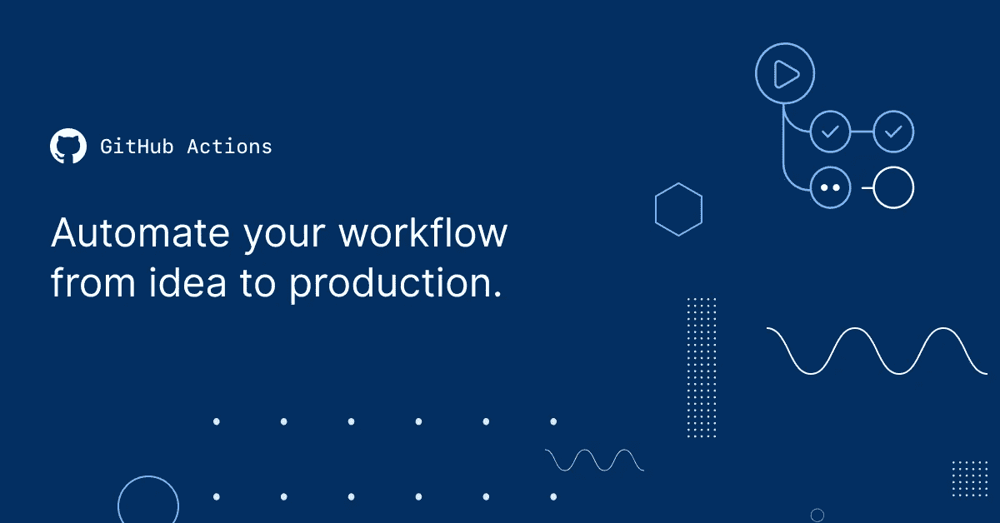
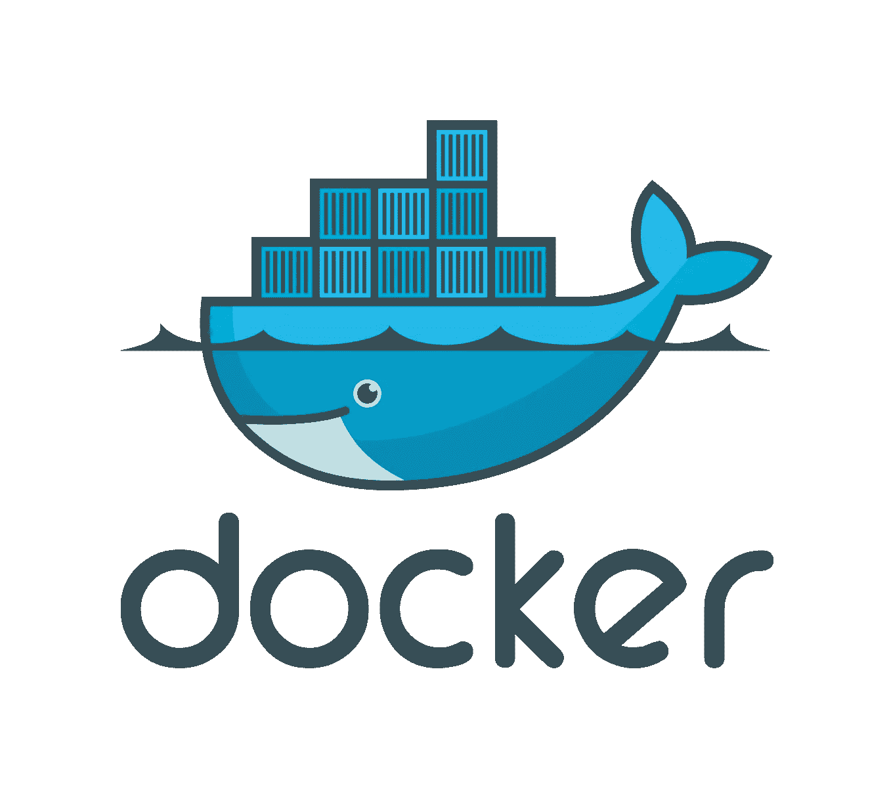

# 自学软件开发人员经常忽略的 6 项技术

> 原文：<https://levelup.gitconnected.com/6-technologies-that-self-taught-software-developers-often-ignore-3b7d3d564b19>

学习这些技术，成为更好的开发者！

当您踏上自学成为全栈软件开发人员的旅程时，有很多学习重点:

*   超文本标记语言
*   半铸钢ˌ钢性铸铁(Cast Semi-Steel)
*   java 描述语言
*   前端框架/库(如 React/ Angular)
*   后端技术(比如 Node.js / Ruby on Rails/ Django)

这可能会让你远离学习其他非常重要的技术。

这是我最初不应该忽略的 5 个重要问题。

本·怀特在 [Unsplash](https://unsplash.com?utm_source=medium&utm_medium=referral) 上的照片

# 版本控制(Git 和 Github)

**Git** 是一个免费的开源版本控制系统，用来跟踪你的文件/代码的变化。

Github 是一家为软件开发提供基于云的 Git 库的公司。

构建软件时，您将在团队中工作，并将与其他开发人员共享您的代码。为此，您将使用 Git & Github。

即使你不在科技公司工作，而是在开发开源软件，你也会经常使用 Git & Github。

照片由[穆罕默德·拉赫马尼](https://unsplash.com/@afgprogrammer?utm_source=medium&utm_medium=referral)在 [Unsplash](https://unsplash.com?utm_source=medium&utm_medium=referral) 上拍摄

# Linux 和 Bash

Linux 是一个流行的开源操作系统，Bash 是它的 shell/命令行接口。

世界上大多数服务器都运行在 Linux 上。

最流行的手机操作系统 Android 是基于 Linux 的。

学习 Linux/ Bash 给了你与这些交互的超能力。

您还能够更好地控制操作系统的命令，并且可以轻松地使用 bash 脚本实现自动化。

Gabriel Heinzer 在 [Unsplash](https://unsplash.com?utm_source=medium&utm_medium=referral) 上拍摄的照片

# 测试库/框架

编写完代码后，在将其部署到生产环境之前进行测试是非常重要的。

了解特定于您的编程语言的测试框架/库(Javascript 测试使用**‘Mocha’/‘Chai’/‘Jest’**，Python 测试使用**‘pytest’**)经常被忽略，但却是必须的！

# CI/CD 管道

CI/CD Pipeline 是一个软件开发过程，我们在其中自动化代码的开发、测试和部署。这确保了我们能够生产无错误的代码，并更快地将其推向生产。

像**GitHub Actions**/**Jenkins/circle CI**这样的构建 CI/CD 管道的学习工具将帮助你成为更好的开发者。

Github 行动横幅

# 集装箱化(Docker & Kubernetes)

## Docker 是什么？

**Docker** 是一项开发用来创建、安装和运行打包成容器的软件的技术。

当您在计算机上安装新软件时，可能会有多个相关的依赖项。

您的操作系统可能不支持该软件，或者您的计算机上可能安装了该软件的旧版本。

Docker 用容器解决了所有这些问题。

## 什么是 Kubernetes？

Kubernetes 是一个**编排工具**，帮助这些 Docker 容器彼此同步运行。

因此，为了构建可伸缩的应用程序，您必须学习 Docker & Kubernetes。

码头工人标志

# 云计算

公司自行维护服务器的日子已经一去不复返了。

如今，大多数软件都放在由云服务提供商管理的分布式系统上。

如果你想扩大你的软件应用，你必须学习云计算技术，比如亚马逊网络服务(AWS，市场领导者)，微软 Azure，或者谷歌云平台(GCP)。

[米切尔·罗](https://unsplash.com/@mitchel3uo?utm_source=medium&utm_medium=referral)在 [Unsplash](https://unsplash.com?utm_source=medium&utm_medium=referral) 上的照片

*感谢您阅读本文！*

*如果你是 Python 或编程的新手，可以看看我的新书，书名为“*[**”【The No Bulls * * t Guide To Learning Python**](https://bamaniaashish.gumroad.com/l/python-book)**”***:*

 [## 学习 Python 的无牛指南

### 你是一个正在考虑学习编程却不知道从哪里开始的人吗？我有适合你的解决方案…

bamaniaashish.gumroad.com](https://bamaniaashish.gumroad.com/l/python-book)  [## 通过我的推荐链接加入 Medium——Ashish Bama nia 博士

### 阅读 Ashish Bamania 博士(以及 Medium 上成千上万的其他作家)的每一个故事。您的会员费直接…

bamania-ashish.medium.com](https://bamania-ashish.medium.com/membership) 

# 分级编码

感谢您成为我们社区的一员！更多内容见[级编码出版物](https://levelup.gitconnected.com/)。
跟随:[推特](https://twitter.com/gitconnected)，[领英](https://www.linkedin.com/company/gitconnected)，[通迅](https://newsletter.levelup.dev/)
**升一级就是转型理工招聘**👉 [**加入我们的人才集体**](https://jobs.levelup.dev/talent/welcome?referral=true)