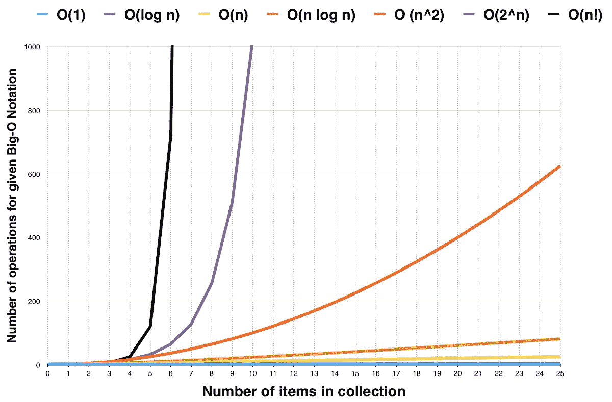

# 6 件可以将自学成才的程序员转变为专业开发人员的事情

> 原文：<https://levelup.gitconnected.com/6-things-that-can-transform-a-self-taught-programmer-to-a-professional-developer-61dc27e7fb4b>

## 从一个自学成才的程序员到一个软件开发者


照片由 [olia danilevich](https://www.pexels.com/photo/man-using-3-computers-4974914/) 拍摄

学习如何编码是一回事，成为软件开发人员是另一回事。

当你成为一名软件开发人员时，有许多事情在起作用。这不仅仅是简单地编写有效的代码。

作为一名软件开发人员，你必须很好地理解你正在创建的东西。然后找到最有效的方法来创造它。

以下六件事可以把一个自学成才的程序员变成一个专业的开发人员。

# 1.数据结构和算法

这是计算机科学课程的一部分。有些人认为这无关紧要，这并不酷。

我同意在某些情况下它缺乏直接应用，但它建立了你推理的基础。它创造了基础。

有了坚实的基础，你就能处理好扔给你的任何事情。无论是新的编程语言，还是新颖的新技术。



[来源](https://medium.com/coderbyte/a-guide-to-becoming-a-full-stack-developer-in-2017-5c3c08a1600c)

在开发软件时，你也可能不会犯错误，因为你了解算法和数据结构是如何工作的。

谷歌因问这类问题而臭名昭著。甚至前端开发人员也应该知道它们。

理解计算机科学的基础可以帮助程序员成为更好的开发人员。

作为一个自学成才的程序员，不一定非要上大学才能学会。你可以自己做。这里有一篇[的好文章，从](https://medium.com/coderbyte/how-to-get-good-at-algorithms-data-structures-d33d5163353f)开始。

# 2.一些古老的语言

我不是说要提升计算机科学学位，但是在计算机科学中，学习者学习了大量的古老语言。这是有原因的。

旧语言帮助学习者理解编程的起源，它是如何开始的，并了解编程语言如何在非常基础的水平上工作。

作为一个自学成才的程序员，这样做可以大大增强你的理解。这在当时可能没有直接影响，但几年后你就会明白为什么它如此重要。

学习一门机器语言可能相当具有挑战性，但它能让你理解计算机是如何工作的。

下面是你可以选择的低级语言。

*   咬舌
*   装配
*   C/C++
*   延长

这些语言你将很少使用，但会增进你的理解并巩固你的基础。

从列表中选择几个，你就可以开始了。如果你没有学过 Python，那么将这种语言与 Python 这样的现代语言结合起来也是有益的。

这种结合将使你全面发展并加深你的知识。以后你可以选择任何你想学的编程语言继续学习。

# 3.良好的编码实践

这里有许多干净代码的文章，但是我将提到几件事。

良好的编码实践对成为更好的开发人员大有帮助。他们能区分业余爱好者和专业人士。

干净的代码可以高效地运行。它也很简洁，让每个人的工作更容易。

## 类、函数和变量的适当命名

你应该用一种干净的方式命名，避免重复自己或重复单词。你的代码应该是干净的。

*坏例子*

```
const Shirt = {

    shirtSize: "medium",
    shirtColor: "blue",};
```

*好例子*

```
const Shirt = {

    Size: "medium",
    Color: "blue",};
```

这是一个很好的例子。其他要点包括:

*   函数应该很小，一次只做一件事。他们还应该高效地完成这项工作。
*   评论不错。(应该在必要时以正确的方式完成)
*   比起 if/else 或 switch 语句，更喜欢或使用多态性。
*   在整个项目中保持一致。
*   利用依赖注入。
*   在进行太多之前修复警告。
*   测试需要是可重复的、独立的、可读的和快速的。

使用上述方法将确保您编写干净的代码并遵循良好的编码实践。

# 4.行为和系统设计

谷歌因问这类问题而臭名昭著。他们需要一个了解行为和系统设计的开发人员。

不仅仅是谷歌，其他主要的科技公司都更喜欢有这种理解的开发者。

纯技术层面的东西不只是切割。事情如何运作以及使用的系统也很重要。

学习这些会增加你的知识，提高你在大型科技公司面试中胜出的几率。

你可以从 YouTube 上两位前谷歌软件开发人员的视频开始[。](https://youtu.be/q0KGYwNbf-0)

另一个很好的资源是优步软件工程师的 youtube 频道。他有几个关于行为和系统设计的视频。

在 Meta Seattle 工作的自学程序员 Kairsten Fay 在准备面试时分别使用了这些视频。这些视频帮助她在 Meta 找到了一份自学程序员的工作。

# 5.代码审查

作为一名专业开发人员，有一点是能够进行代码审查。并且充分地去做。

大多数自学成才的程序员很少进行代码评审。他们最终缺乏这一关键技能。

代码审查是必要且重要的。它们可以揭示程序员遗漏的隐藏细节。

它们不是针对个人的，也不是针对程序员的。相反，他们试图找出代码中不合适的地方。这是软件质量保证检查的一种形式。

它有助于发现错误，提高代码质量，并教育其他程序员关于源代码的知识。

作为一个自学成才的程序员，你需要学习如何做代码评审。如果你的雇主知道你不知道如何去做，那将是一种耻辱。

这篇[文章是一个很好的资源](https://betterprogramming.pub/how-to-review-code-in-7-steps-98298003b7ec),可以启动你的代码评审之旅。

# 6.使用遗留代码并维护代码库

许多自学成才的程序员不知道如何使用遗留代码或维护代码库。即使是大学教授的程序员对此也有问题。

另一方面，专业开发人员知道如何处理遗留代码和维护代码库。

拥有这样的技能是很重要的，而且可以走很长的路。

作为一个自学成才的程序员，你需要高于一般的 Joe，高度专业。

学习如何使用遗留代码和维护代码库将是朝着这个方向迈出的一步。