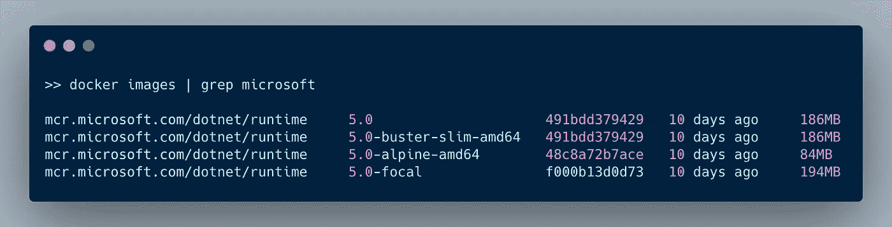
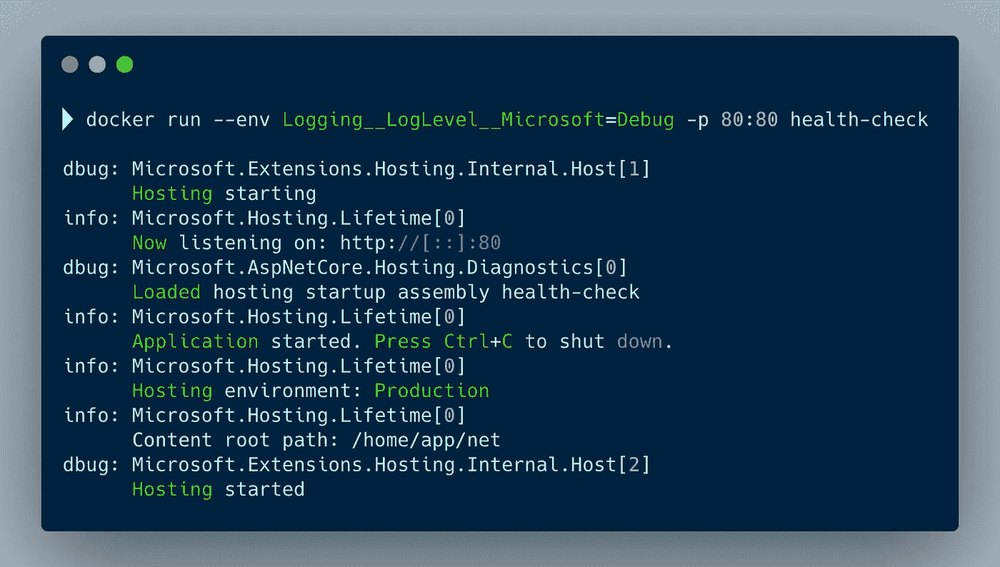

# 对微软进行分类时要知道的 6 件事。生产中的网络应用

> 原文：<https://levelup.gitconnected.com/6-things-to-know-when-dockerizing-microsoft-net-apps-in-production-45b8c27a41b0>

## 运行微软的清单。生产环境中 Docker 容器中的. NET 应用程序

照片由来自 [Pexels](https://www.pexels.com/photo/black-and-gray-mining-rig-1148820/?utm_content=attributionCopyText&utm_medium=referral&utm_source=pexels) 的 panumas nikhomkhai 拍摄

许多人喜欢我关于在 Docker 的生产环境中运行 [Node.js](https://betterprogramming.pub/docker-for-node-js-in-production-b9dc0e9e48e0) 或 [Python](https://betterprogramming.pub/6-things-to-know-when-dockerizing-python-apps-in-production-f4701b50ca46) 应用程序的文章。

除了 Node.js 和 Python，我还和 Microsoft.NET 一起工作。现在，我为 Python 和 Node.js 写的大部分东西对. NET 也是有效的，但是还是有区别的。本文描述了跑步时的关键事项。Docker 容器中的. NET 应用程序。

你可以在 GitHub 库中找到所有的例子。

# 1.选择正确的基础图像

使用最佳映像来运行您的应用程序至关重要。您应该选择具有应用程序所需的所有功能的最小图像。一个小图像通过网络从 Docker 注册表快速传输到您的 Docker 主机。所以你的容器启动更快。

与其发展形象，不如一直用[官方。NET Docker 图片](https://hub.docker.com/_/microsoft-dotnet/)。这些都是微软设计优化的。有两种类型，一种用于开发，另一种用于运行您的应用程序。我们需要后者。

如果你看 Docker hub，还有很多可能的图像。选择归结为 Windows 还是 Linux？如果可能的话，选择 Linux，因为这些图像往往较小。

我真的很喜欢阿尔卑斯山的图像。Alpine 是一个带有强化内核的最小 Linux 发行版。下面，我拉了一些 Linux 的图片。

不同的官员。微软提供的. NET Docker 图片

5.0 标签是默认图像，与基于 Debian 10 的 5.0-buster-slim-amd64 相同。5.0 焦点标签基于 Ubuntu 20.04，5.0 Alpine-amd64 图像基于 Alpine 3.13。

你看阿尔卑斯版本是最小的。

# 2.使用非根容器映像

默认情况下，您的应用程序在容器中以 root 用户身份运行。容器中的根与主机上的根不同。Docker 限制容器中的用户。但是为了减少安全攻击面，您可能希望以非特权用户的身份运行容器。

非根容器增加了一层额外的安全性，推荐用于生产环境。但是，因为他们作为非根用户运行，所以不可能执行特权任务。

一些官方图片已经创建了一个非 root 用户，但大多数时候你必须添加它。在 docker 文件中创建一个具有已知 UID 和 GID 的用户，并以这个用户的身份运行您的流程。请参见下面的示例。

用于在非根容器中运行. NET 应用程序的 Dockerfile

在第一行，我使用`mcr.microsoft.com/dotnet/runtime:5.0-alpine-amd64`作为基本图像。接下来，第 5 行的语句添加了应用程序用户和组。它将组和用户 id 设置为 1000。

第 8 行的指令为应用程序创建了目录。我将目录的新所有者设置为用户 **app** 。

通常情况下，`WORKDIR`指令设置工作目录并创建文件夹。但是，没有办法设置目录所有者。所以我手动创建文件夹并设置所有者。

我在第 12 行将用户设置为 app 用户。`USER`指令设置运行映像时的用户名(或 UID)。在下一行，我将应用程序的二进制文件复制到工作文件夹。

在最后一行，应用程序开始使用`CMD`指令。这提供了执行容器的缺省值。

# 3.开始和停止您的。网络应用

开始和停止你的。NET 应用程序中的 Docker 容器。在之前显示的 Dockerfile 文件中，我使用`CMD`指令启动应用程序。

当你开始你的。NET app 使用 exec 形式的`CMD`指令，确保可以从应用程序内部的操作系统(例如`SIGINT`和`SIGTERM`)接收信号，并处理它们以优雅地关闭应用程序。

现在不同于节点进程，默认情况下. NET 应用程序监听这些信号。它使用默认连接的 ConsoleLifetime 类。

如果你希望你的应用程序优雅地关闭，你可以处理`SIGINT`和`SIGTERM`。使用`Console.CancelKeyPress`抓住`SIGINT`，使用`*AppDomain.CurrentDomain.ProcessExit*`抓住`SIGTERM`。下面是一个例子。

处理来自操作系统的 SIGINT 和 SIGTERM 信号

# 4.健康检查

运行状况检查是一个用于确定正在运行的容器的运行状况的命令。使用 Docker 文件中的`HEALTH CHECK`命令，您可以告诉 Docker 如何测试容器，看它是否工作。

值得注意的是，`HEALTH CHECK`命令在 Kubernetes 集群中不能**而不能**工作，因为它不能处理`HEALTH CHECK`命令。

Kubernetes 使用探针来检测您的容器是否运行正常。它支持以下三种探测。

*   *活性探针*。这是为了检测应用程序进程是否崩溃。
*   *准备就绪探测器*。这是为了检测应用程序是否准备好处理请求。
*   *启动探针*。这在容器启动时使用，表示它准备好了。

无论您是创建 Docker `HEALTH CHECK`还是 Kubernetes 探测器，都使用 HTTP 端点来实现它们。如果端点返回成功状态代码，则`HEALTH CHECK`或探测成功。

我将向你展示如何实现 Docker `HEALTH CHECK`。将其更改为 Kubernetes 探头应该相对容易。

我创建了一个标准的 WEB API 项目来演示健康检查。这里可以找到[。我添加了一个新的控制器，专门用于接收健康检查请求。](https://github.com/PatrickKalkman/docker-net/blob/main/health-check/Controllers/HealthCheckController.cs)

在第 13 行，您可以看到当应用程序在`[http://localhost/healthcheck](http://localhost/healthcheck.)` [收到 GET 请求时执行的动作。您需要实现对您的应用程序健康状况的实际检查。这取决于应用程序的类型。例如，您可以对数据库执行查询并映射结果。](http://localhost/healthcheck.)

添加可以接收 HTTP 健康检查的独立控制器

有了这个控制器，我们可以将`HEALTH CHECK`命令添加到 docker 文件中。我们指定，为了执行健康检查，Docker 运行时必须执行`curl --fail [http://localhost/healthcheck](http://localhost/healthcheck.)` [。](http://localhost/healthcheck.)如果该命令返回 0 以外的退出代码，则容器不健康。

在 Dockerfile 文件中指定健康检查

相同的控制器动作可以用作在 Kubernetes 准备就绪探测中调用的 url。

# 5.从您的登录。网络应用

在 Docker 容器中运行时，从. NET 应用程序进行日志记录是很简单的。根据具体情况，记录到 stdout 或 stderr。

这背后的基本原理是让其他东西来处理日志记录。这是有意义的，因为我们在微服务架构中使用 Docker 容器，在许多服务之间分配职责。

我不会推荐用`Console.WriteLine`或者`Console.Error.WriteLine`。相反，使用内置日志提供程序的标准日志 API。请参见下面示例中的第 15 行。

使用标准日志 api 将日志添加到健康控制器

# 6.使用环境变量的配置

当你的应用程序在 Docker 容器中运行时，Docker 希望你使用环境变量来配置你的应用程序。

谢天谢地。NET 5.0 有一些很棒的默认配置选项。当你用 [dotnet new](https://docs.microsoft.com/en-us/dotnet/core/tools/dotnet-new) 或 Visual Studio 生成一个新的 ASP.NET 核心 web 应用时，它会生成以下代码。

配置 ASP.NET 核心应用程序的标准生成代码

第九行的 CreateDefaultBuilder 方法按以下顺序提供默认配置。

*   使用来自`[appsettings.json](https://docs.microsoft.com/en-us/aspnet/core/fundamentals/configuration/?view=aspnetcore-5.0#appsettingsjson)`文件的配置
*   使用来自`appsettings.[Environment.json]`文件*的配置。*
*   使用环境变量
*   使用命令行参数

在每一步中，您都可以覆盖上一步的设置。这意味着您可以通过环境否决任何设置。例如通过改变记录级别。

设置环境变量以覆盖日志记录级别

请注意，您使用级别之间的双下划线从`appsettings.json`指定层次结构。

# 结论

在这篇文章中，我描述了以下 6 点来改善运行。生产环境中 Docker 容器中的. NET 应用程序。

*   为您的容器选择正确的基础映像至关重要。您的映像越小，部署和启动的速度就越快
*   总是使用非根容器。非根容器增加了一层额外的安全性，推荐用于生产环境。
*   在应用程序中处理 SIGINT 和 SIGTERM，这样就可以优雅地关闭应用程序。
*   使用健康检查告诉 Docker 或集群管理器正在运行的容器的状态。
*   不要记录到文件或数据库。总是使用 stdout 和 stderr。使用内置日志提供程序的默认日志 API。
*   默认情况下，一个. NET 5.0 应用程序提供了很多功能来配置您的应用程序。您可以通过环境变量覆盖所有设置。

你可以在这个 Github 库中找到所有的例子。

感谢您的阅读。