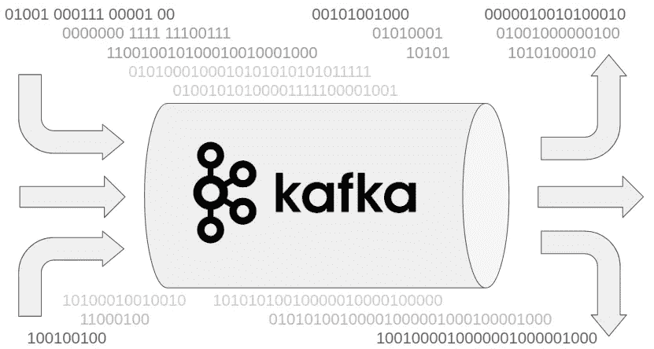

# 在系统设计面试中使用 Kafka 之前，你需要知道的 6 件事

> 原文：<https://levelup.gitconnected.com/6-things-you-need-to-know-about-kafka-before-using-it-in-a-system-design-interview-1fc31451732c>

封面图像

我经常遇到系统设计的讨论，在讨论中，人们似乎倾向于把卡夫卡作为一个魔盒，仿佛画出那个水平的圆柱体就能神奇地让问题消失。有可能。毕竟“所有财富 100 强中有 80%信任和使用卡夫卡”[1]。这是一个如此多才多艺的工具，我认为我们应该给予它信任。我个人也很喜欢。

然而，当谈到系统设计面试时，我认为我们应该做得比肤浅的点名更好。了解一个具体的产品是好的。但是要在系统设计面试中取得成功，我们需要在更抽象的层面上理解事物。通常这就是高级工程师和中级工程师的区别。我们在解决什么问题？卡夫卡是如何让我们解决的？你仍然可以提到卡夫卡。一点也没错。但是你要准备好面试官的下一个问题。他/她会戳看你是否真的理解卡夫卡体现的设计模式，以及为什么它们很适合用例。

因此，为了帮助你更好地准备，我收集了卡夫卡在系统设计面试中经常提到的 6 个场景/领域。我将一个一个地介绍它们。我们的目标不是列举所有可能的用例场景，而是通过几个典型的用例来加深理解。也建议你在阅读这篇博文之前至少听说过卡夫卡。虽然它可以作为入门，但网上还有其他更适合新手的资源。现在事不宜迟，让我们开始吧。

**1。异步处理和解耦**

Kafka 建模了一个分布式消息队列，一端是消息生产者，另一端是消息消费者。这是异步处理的一种形式。生产者不需要等待消息被消费。这是我们在系统设计面试中应该认识到的卡夫卡的第一个设计模式。在一个同步的环境中使用卡夫卡会很尴尬，因为生产者需要阻止等待消费者的反应。

从理论上讲，如果我们让生产者直接向消费者发送 RPC，并只期待 ACK 作为响应，我们可以实现同样的异步效果；或者让消费者通过生产者公开的端点直接获取。使用 kafka 的优势在于它将生产者和消费者分离开来，这样他们就可以分别开发、部署和管理。一旦商定了一个共同的消息契约，生产者将继续生成消息，并将它们发送给 Kafka。感兴趣的消费者将从卡夫卡那里获取信息。生产者和消费者不需要知道对方的地址。他们都只与一个逻辑上集中的服务——卡夫卡——对话。他们也不需要关心对方的能力。它们可以单独监控和扩展。在系统设计评审中，除了开发之外，通常还有一个加分点，那就是提出操作和维护，这是许多候选人所忽略的。

**2。持久消息存储库**

既然生产者和消费者不同步，生产者很容易创建消费者不能及时处理的大量消息。这是我们在系统设计访谈中需要为 Kafka 强调的另一个设计模式。它实际上是一个持久的缓存，缓冲未处理的消息，为我们的系统处理突发负载或消费者故障提供缓冲。Kafka 中的消息保留是可配置的，这使得它能够适应各种各样的需求。

卡夫卡的持久消息库也是高效的。它包含了一个基于日志的结构，并且只在文件末尾附加消息。如果面试官质疑它的效率，负载测试表明它可以和网络一样快[2]。此外，Kafka 为通信和存储采用了标准化的二进制消息格式，这降低了处理开销，并且通常能够使用 sendfile [3]系统调用在网络和磁盘之间直接传输字节。

基于日志的存储的一个期望的副作用是它保留了消息的顺序(参见下一节中的细则)。消费状态可以在一个简单的偏移量变量中捕获，该变量指向下一个要消费的消息。消费者在消费消息时会增加偏移量，甚至可以倒带来回放历史。这在很大程度上简化了重试逻辑，为我们在系统设计面试中回答问题提供了更高层次的原语。

**3。消息路由和负载分片**

Kafka 支持基于主题的消息路由。生产者和消费者与卡夫卡的互动都涉及特定的主题。主题对消息进行逻辑分离和分类。卡夫卡确保将正确的信息传递给订阅相应主题的消费者。在系统设计面试中，Kafka 主题可以作为一种路由机制。例如，所有用户点击活动都指向一个主题，而所有系统日志都指向另一个主题。它简化了我们的系统设计图，因为上游系统只需要与统一消息传递端点通信。Kafka 负责将消息多路传输到适当的下游系统。

Kafka 也支持主题内部的分区。生产者将消息直接发送到相应的主题分区。消息的分区由消息分区键决定。同一个主题分区中的消息被存储在一起，并且按照它们被发送的顺序存储。在任何给定时间，来自一个主题分区的消息只能由一个使用者实例使用。允许消费者实例并行消费来自多个主题分区的消息。如果一个消费者实例死亡，需要一个不同的实例来替代。这可以通过消费者团体手动或自动完成。分区的概念有效地分担了主题内的负载，因为主题内的不同分区并行操作。

主题和分区的组合也可以用作洗牌机制。这个系统设计访谈帖子[4]使用 Kafka 来组织和统计流更新。

**4。复制和弹性**

到目前为止，我们把 Kafka 称为一个集中的服务。面试官可能会问这是否会造成单点失败。并没有。但是为了很好地回答这个问题，我们需要知道卡夫卡在失败的情况下有什么保护措施来保护自己。

Kafka 的典型部署涉及多台机器。在配置中为客户端提供了多个 Kafka 服务器地址作为引导，通过引导，客户端将发现所有 Kafka 服务器。如果一个特定的服务器出现故障，客户端可以切换到另一个服务器。所有 Kafka 服务器都能够为客户端提供最新的元数据，以便客户端知道应该与哪些服务器进行对话，以实现其预期的功能和数据请求。

在内部，Kafka 使用 Zookeeper 来协调控制器的选择，并存储集群成员、访问控制和主题配置等信息。Zookeeper 本身是一个分布式系统，对部分故障具有弹性。当然，我们需要以分布式方式部署 Zookeeper。简单的单一 Zookeeper 实例设置无法承受失败。

每个主题分区都跨 Kafka 服务器复制。一台服务器将成为该主题分区的领导者。也可以同时引出其他话题分区。主题分区的所有读/写都要经过领导者。一组追随者被动地复制领导者的主题分区副本。这个主题分区的追随者可以是其他主题分区的领导者。可以将一定数量的追随者配置为在同步模式下运行，这意味着只有在所有同步追随者中安全复制时才提交消息。如果领导者失败了，一个同步跟随者会接手这个任务。

面试官可能不会要求你解释一个分布式日志复制问题的完整解决方案，因为它非常复杂，而且过于专业。但是如果你想做好充分的准备，你可以看看这个深入探讨这个领域的博客文章系列。

**5。客户端故障和消息传递语义**

系统设计面试官喜欢问失败的场景。提交消息之前或之后，生成器可能会失败。它没有办法知道，只能重试，如果消息已经提交，就会生成重复的消息。为了避免重复，生产者在发送消息时会包含一个 Kafka 分配的 ID 和一个单调递增的序列号。如果已经有来自相同生产者(由 Kafka 分配的 ID 标识)的具有相等或更高序列号的已提交消息，Kafka 拒绝该消息。显然，记录 ID 和序列号是生产者的责任。

使用者可能会在处理消息之后但在保存偏移量之前失败，在这种情况下，retry 会重新处理消息。如果它选择首先保存偏移量，它可能会在保存偏移量之后但在处理消息之前失败，在这种情况下，重试会导致跳过消息。所以看起来要么至少一次，要么最多一次。广受好评的“恰好一次”呢？事实证明，恰好一次只在非常有限的情况下是可能的，也就是说，消息处理和偏移量存储需要发生在同一个事务中。该事务可以是传统的数据库事务，它在同一提交中存储消息的输出和更新的偏移量。Kafka 在发布到多个主题时也有一个事务语义，它允许消费者在两个接收 Kafka 主题中原子地存储输出和偏移量。这篇博文[6]对 Kafka 交易是如何运作的有更详细的解释，尽管采访者不太可能会要求那些具体的细节。

**6。可扩展性特征**

另一个在系统设计访谈中常见的 Kafka 陷阱是，人们没有注意到它的可伸缩性特征。即使 Kafka 没有对主题和分区的数量进行任何硬性限制，但还是有一些内部约束。Kafka 将主题和分区信息存储在 Zookeeper 中。Zookeeper 的可用性可以通过添加更多实例来增强，但其容量受到单个节点的限制。此外，Kafka 指定一台服务器作为控制器来管理主题和分区元数据。控制器需要跟踪分区领导者，并处理领导者的更改。当控制器本身出现故障时，集群需要选举新的控制器，并将元数据管理转移给新选举的控制器。控制器角色在 Kafka 集群中至关重要。增加主题和分区的基数会导致更高的开销，这可能会使控制器不堪重负。要考虑的另一个方面是，每个分区都是一个物理文件夹，其中有多个数据文件和索引文件，用于不同的日志段。因此，在管理大量分区时也存在文件系统开销。最后，不要忘记所有的分区都是复制的，这会成倍增加开销。

几千个主题和几万个分区绝对是最大的。典型的 Kafka 范式是具有合理数量分区的更少更大的主题。因此，在系统设计面试中，每个用户一个 Kafka 主题的设计，甚至每个用户一个分区的设计，都可能会遭到反对。如果您发现自己正走向那个兔子洞，您可能想要后退一步，考虑是否像 Cassendra 这样的分布式键值存储更合适。

**参考文献**

[1]https://kafka.apache.org/

[2][https://engineering . LinkedIn . com/Kafka/benchmarking-Apache-Kafka-200 万-writes-second-three-cheap-machines](https://engineering.linkedin.com/kafka/benchmarking-apache-kafka-2-million-writes-second-three-cheap-machines)

[3][https://man7.org/linux/man-pages/man2/sendfile.2.html](https://man7.org/linux/man-pages/man2/sendfile.2.html)

[4][https://level up . git connected . com/system-design-interview-distributed-top-k-frequency-elements-in-stream-2e 92d 63d 777 e](/system-design-interview-distributed-top-k-frequent-elements-in-stream-2e92d63d777e)

[5][https://level up . git connected . com/raft-consensus-protocol-made-simpler-922 c 38675181](/raft-consensus-protocol-made-simpler-922c38675181)

[https://www.confluent.io/blog/transactions-apache-kafka/](https://www.confluent.io/blog/transactions-apache-kafka/)