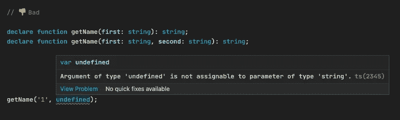

# 写更优雅的打字稿的 6 个技巧

> 原文：<https://levelup.gitconnected.com/6-tips-for-writing-more-elegant-typescript-1e705b47ccab>

## 像专家一样写出更好的打字稿代码。

作者图片

TypeScript 是一把双刃剑，在让我们的代码健壮的同时也带来了一定的学习成本。如果使用不当，就会出现意想不到的 bug。如果你也想像专业人士一样优雅地编写 TypeScript 代码，请跟随我来看看开发时的一些最佳实践！

# 1.使用 void 代替 any

一定要确定函数的返回值，不要用 any，如果想忽略返回值，最好用 **void** 代替 any。

# 2.使用字符串枚举代替数字枚举

当我们不显式地将值设置为枚举时，它们在默认情况下被设置为增量数字。所以上面的`Fruit.APPLE`、`Fruit.PINEAPPLE`和`Fruit.ORANGE`将被设置为 0、1 和 2。当我们用它们作为变量的类型时，它本身和所有的数字都可以赋给它。

与字符串枚举不同，只有它本身可以被赋给它。

所以当你在纠结用数值枚举还是字符串枚举的时候，请先用字符串枚举。因为它更容易调试，不容易出错。

# 3.正确使用类型别名和接口

类型别名几乎涵盖了接口的所有特性，但是接口总是**可扩展的**，而类型别名不是。所以你可能需要根据具体情况来选择它们。更多详情，请查看我的另一篇文章:

 [## TypeScript 4.6 中类型别名和接口之间的差异

### 类型别名和接口都很相似，那我该用哪个呢？

better 编程. pub](https://betterprogramming.pub/differences-between-type-aliases-and-interfaces-in-typescript-4-6-6489246d4e48) 

# 4.注意函数重载的顺序

不要把更一般的重载放在更具体的重载之前。这是因为 TypeScript 在解析时更喜欢第一个匹配的重载。因此，当前面的重载更通用时，后面更具体的重载将被忽略。

# 5.使用联合类型

如果同一个参数位置可以接受不同的类型，那么使用**联合类型**而不是编写不同类型的重载。因为这样更简洁，在外部函数传递参数时也最有容忍度。

# 6.使用可选参数

如果尾随参数是可选的，使用**可选参数**而不是编写不同的重载。有两个具体原因:

第一:在上面的代码中，我们期望`getName`的第二个参数是可选的。但是重载的定义函数要求我们必须传递一个字符串。并且可选参数定义的函数是正确的。

StackBlitz 默认不显示这个错误(因为“严格的空值检查”没有打开)。

第二:在上面的代码中，当把`getName`作为参数传递给`main`时，重载定义的函数会匹配第一个重载。这是因为 TypeScript 通过查看目标的任何签名是否可以用源的参数调用来解决签名兼容性问题，并允许使用无关的参数。所以 TypeScript 不会抛出导致 bug 的错误。

相反，用可选参数声明的函数会抛出错误。

*感谢阅读。如果你喜欢这样的故事，想支持我，请考虑成为* [*中等会员*](https://medium.com/@islizeqiang/membership) *。每月 5 美元，你可以无限制地访问媒体内容。如果你通过* [*我的链接*](https://medium.com/@islizeqiang/membership) *报名，我会得到一点佣金。*

你的支持对我来说非常重要——谢谢。