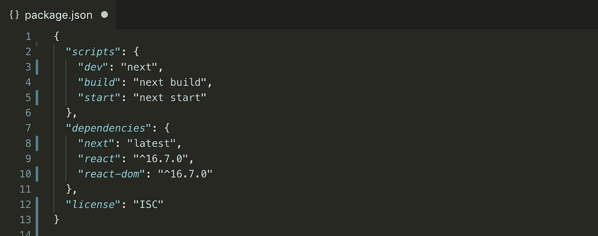

# 在下一个 web 应用程序中使用 Next.js 的技巧

> 原文：<https://levelup.gitconnected.com/6-tips-using-next-js-for-your-next-web-app-e3f056fa46>

想搭建一个高性能的 React app，Next.js 必不可少。它正被用来驱动我的一些应用程序，如数据驱动的医疗社区 [Medtally](http://medtally.com) 和香港房产自动估价工具 [True Home](https://truehome.hk) 。

在这个过程中，我学到了一些技巧，并发现了一些对初学者有用的框架“陷阱”。事不宜迟，让我们开始吧:

1.  **你需要缓存** `**getInitialProps**` **的数据，否则浏览器的后退按钮行为会中断。**

`getInitialProps`用于获取页面数据，但当用户按下浏览器上的后退按钮时也会触发。这导致浏览器滚动到您先前离开的位置，但是没有来自`getInitialProps`的远程数据需要呈现。你可以在这里阅读更多关于这个问题的信息。

要解决这个问题，您需要在获取数据后在客户端缓存数据。这里有一个快速简单的方法:

你也可以用 Redux 来做这件事。

**2。** **用 Next.js'** `**Link**` **组件代替** `**Router.push**` **这样谷歌就可以抓取你的网址**

谷歌的爬虫看不到这样写的链接:`
Go to About Page!
`

所以如果可能的话，避免用 Next 的路由器写链接。而是像这样使用 Next 的`<Link>`组件。

**3。Next.js 使用材料 UI React 比语义 UI React 效果更好**

如果你试图在[材质 UI](https://material-ui.com/) 和[语义 UI](https://react.semantic-ui.com/) React 组件库和你的 Next.js 应用之间做出选择，你应该选择材质 UI。

语义 UI 的响应组件并不是以一种与 Next.js 的服务器端呈现很好地工作的方式构建的，因为它们寻找服务器上不可用的浏览器的窗口对象。

如果一定要用语义 UI，可以按照这个 [GitHub 票](https://github.com/Semantic-Org/Semantic-UI-React/issues/3361)一起黑。

另一方面，Material UI 的响应组件只使用媒体查询，这意味着您的组件应该在服务器和客户端上以相同的方式呈现。

如果我说服了你，请前往 [Material UI 的 Next.js 示例](https://github.com/mui-org/material-ui/tree/next/examples/nextjs)开始。

**4。如果您使用** `**isomorphic-unfetch**` **来获取数据，您需要提供绝对 URL**

Next.js 创作者推荐一个名为`isomorphic-unfetch` 的库，用于数据取数。它的包比`axios`小得多，在客户端和服务器上都运行良好。

然而，`isomorphic-unfetch`需要一个绝对的 URL，否则将会失败。我假设这与您的代码可以执行的不同环境(客户机&服务器)有关。在这种情况下，相对 URL 不够明确可靠。

您可以从`getInitialProps`构建一个绝对 URL，如下所示:

**5。如果你想要最漂亮的网址，把你的网址储存在数据库里**

网址应该很漂亮，这样人们在谷歌上看到它们时就会想点击它们。

您通常希望避免 URL 中的数据库表 id 是这样的:`/post/**245**/i-love-nextjs/`。

理想情况下，你的 URL 应该是这样的:`/post/i-love-nextjs`。但是这个 URL 缺少从数据库获取数据所需的 id `245`。

要解决这个问题，您需要将 URL 存储在数据库中，如下所示:

在服务器上，当有人请求`mywebsite.com/post/i-love-nextjs`时，使用 URL 代替 post id 编写代码来获取数据。下面是一个使用 Express.js 的例子:

如果你需要一个库来将文本转换成 URL，我推荐`slugify`。

如果您有许多 URL，并且您使用的是关系数据库，那么您应该考虑为`url`列添加一个索引，这样您的查找查询会运行得更快。[参见添加 Postgres 索引的示例。](https://www.postgresql.org/docs/9.1/sql-createindex.html)

**6。CSS 在使用 Next.js 的材料 UI 时中断了生产而没有中断开发**

如果您遇到这种情况，请尝试将这一行添加到您的`getPageContext.js`文件中:

就是这样！

跟我来:[https://joelei.substack.com/](https://joelei.substack.com/)