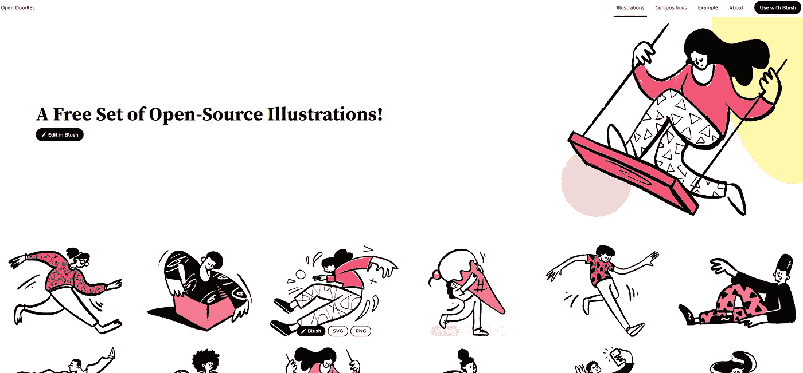
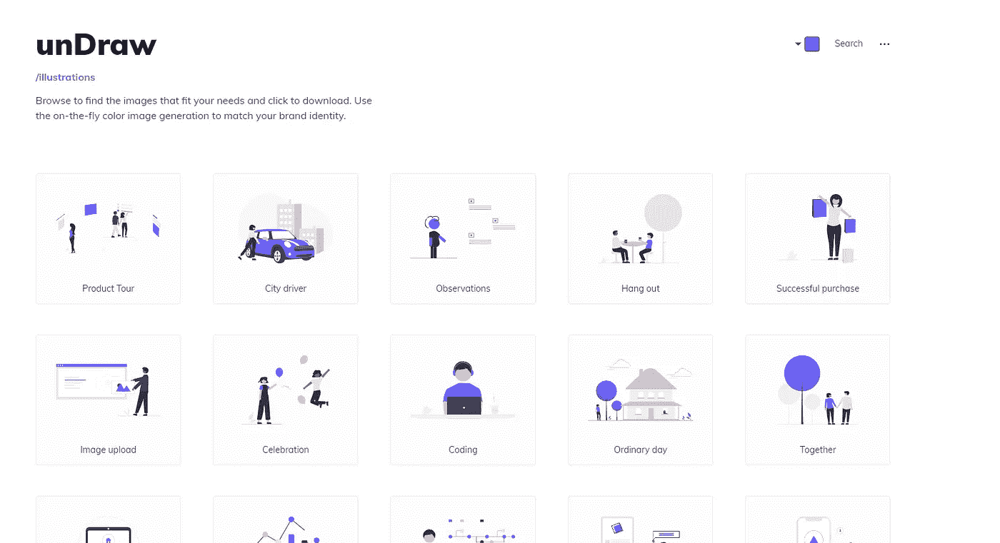
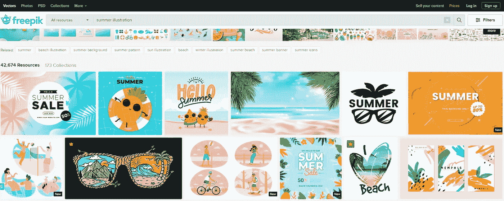
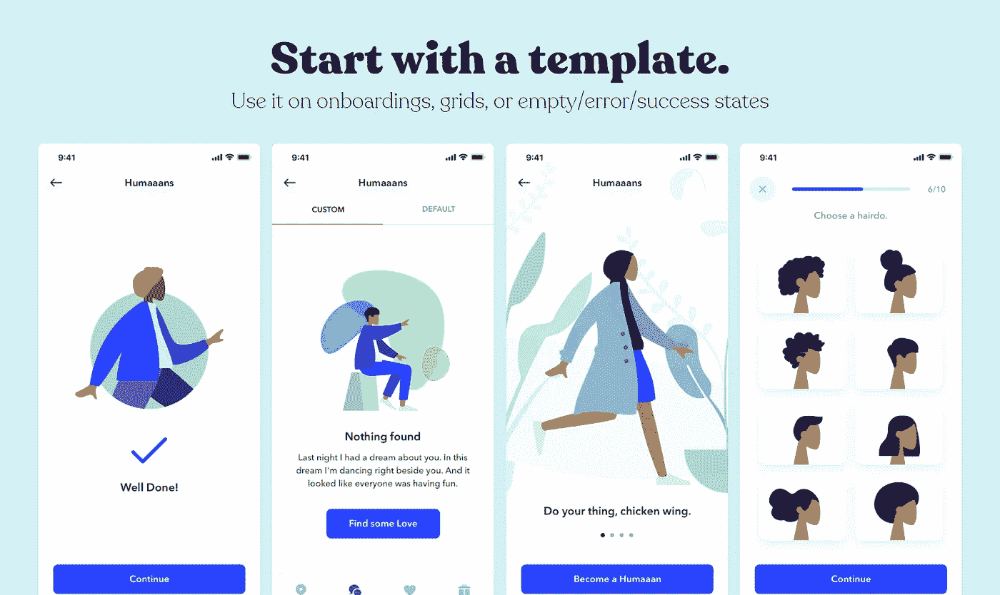
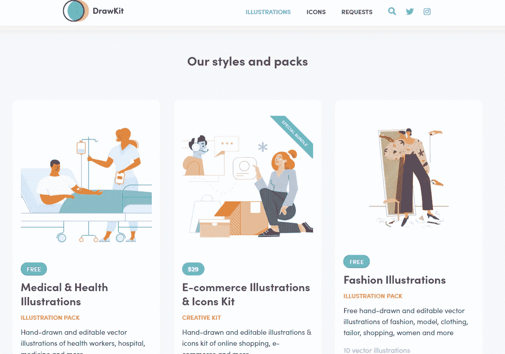
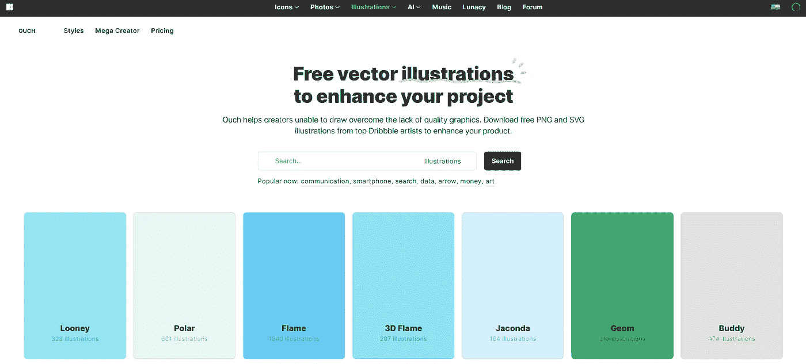
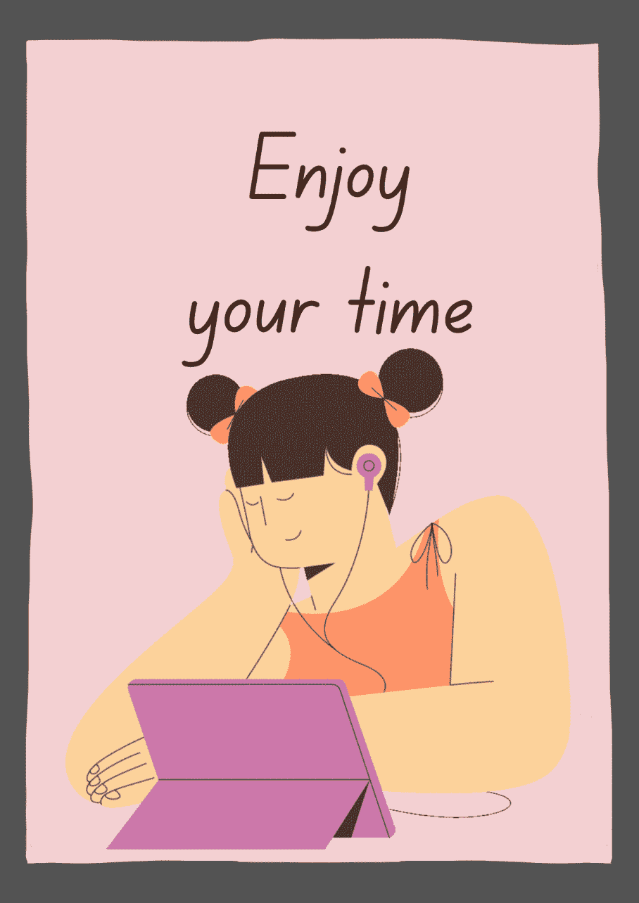
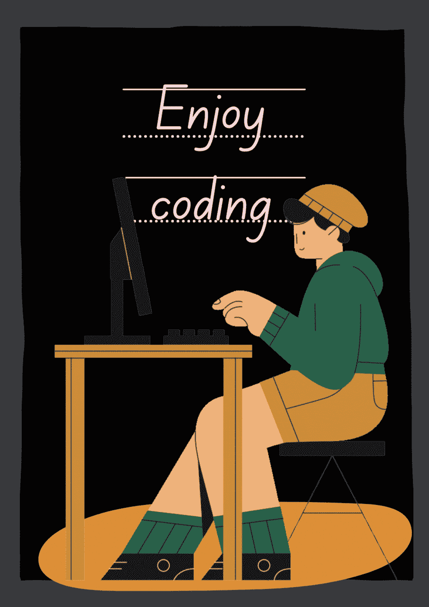
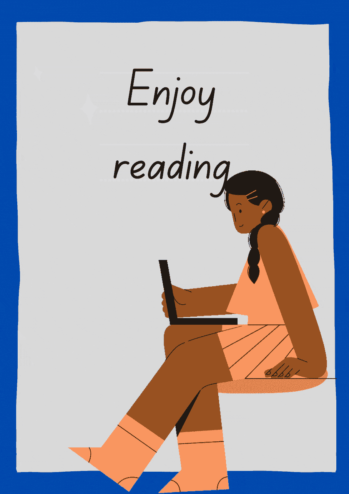

# 6 个可以找到精彩插图的地方

> 原文：<https://levelup.gitconnected.com/6-top-places-where-you-can-find-awesome-illustrations-925b47ee86b7>

## 制作你的网站、文章、演示文稿等。，通过使用美丽和高质量的插图生动

作者:FAM

# #1- Opendoodle

钢笔涂鸦是一套免费的插图，包含了开放设计的理念。您可以出于任何目的复制、编辑、重新混合、共享或重绘这些图像，而不受版权或数据库法律的限制。

*   **这里是你需要去的地方:**

 [## 开放式涂鸦——免费素描插图

### 一个供个人和商业免费使用的人物素描图片库。

www.opendoodles.com](https://www.opendoodles.com/) 

下面的美丽插图你可以免费找到。这些插图太棒了。你想找什么都可以！

打开涂鸦

# #2-未绘制

UnDraw 帮助您浏览并找到符合您需求的图像。你可以免费下载这些插图。您可以定制颜色来匹配您的品牌标识。

*   **这里是你需要去的地方:**

 [## 插图|未画

### 该设计项目为您可以想象和创造的任何想法提供了开源插图。创建漂亮的网站…

undraw.co](https://undraw.co/illustrations) 

*   **下面是插图的样子:**

拉开

# #3-免费赠送

这个网站我已经讲过了。我用它来为我的动画下载图形资源。这还不是它得到的全部。它也有美丽的插图，我用在我的演讲和网站上。

*   **这里是你需要去的地方:**

 [## 面向所有人的免费图片资源

### 数百万免费图文资源。Vectors、库存照片、PSD、图标，所有您需要的创意…

www.freepik.com](https://www.freepik.com/) 

*   **下面是插图的样子:**

弗里皮克

很美，不是吗？

# #4-人类

顾名思义，Humaaans 是一个设计库。它有美丽和令人敬畏的人类插图，可免费用于商业或个人用途。您可以自定义人像插图，如改变裤子，发型和自定义场景或背景。

*   **这里是你需要去的地方:**

 [## Humaaans: Mix-&-Match 插图库

### mix-&-将人物插图与 VIsion Studio 和 Sketch 的设计库相匹配。

www.humaaans.com](https://www.humaaans.com/) 

*   **下面是插图的样子:**

# #5-抽屉套件

Drawkit 是手绘矢量插图和图标资源。它有免费和付费的插图。好处是你可以按主题搜索，所以当我需要灵感或者不知道如何表达想法时，我会从那些天才设计师那里得到灵感！

*   **这里是你需要去的地方:**

 [## DrawKit -美丽的矢量插图

### 免费和优质的矢量 SVG 插图供您在下一个项目中使用，无需署名！向量…

www.drawkit.io](https://www.drawkit.io/) 

*   下面是插图的样子:

绘图工具包

# #6-哎哟

另一个伟大的矢量插图和高质量的图形资源。

*   **这里是你需要去的地方:**

 [## 插图剪贴画插图& PNG 和 SVG 格式的图像

### 免费下载 45 种不同风格的插图剪贴画图像和矢量插图。在 PNG 中查找图像并…

icons8.com](https://icons8.com/illustrations/style--3d-flame) 

*   **下面是插图的样子:**

哎哟

你最喜欢哪一个？对我来说，老实说，每一个都有它特别的地方。我的意思是，当我需要制作一个角色的动画时，我会在 [***Humaaans***](https://www.humaaans.com/) 上寻找，当我需要制作一个漂亮的 3D 场景时，我会去[***Ouch***](https://icons8.com/illustrations/style--3d-flame)等等。

> 那些平台的背后，都是才华横溢的设计师。特别感谢他们！

作者:FAM

亲爱的读者，我希望这是明确和有用的。我希望你和你的家人无论在哪里都安全！坚持住。明天会更好！

**让我们联系上** [**中**](https://medium.com/@famzil/)**[**Linkedin**](https://www.linkedin.com/in/fatima-amzil-9031ba95/)**[**脸书**](https://www.facebook.com/The-Front-End-World)**[**insta gram**](https://www.instagram.com/the_frontend_world/)**，或者**[**Twitter**](https://twitter.com/FatimaAMZIL9)**。********

****[www.fam-front.com](http://www.fam-front.com/)****