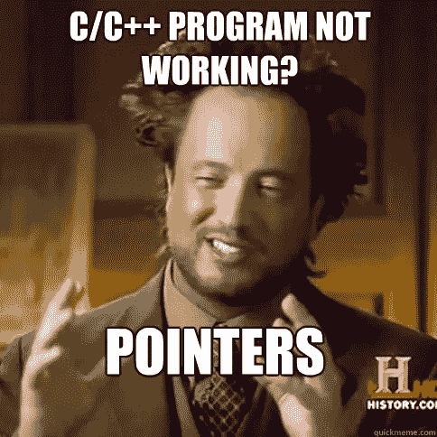
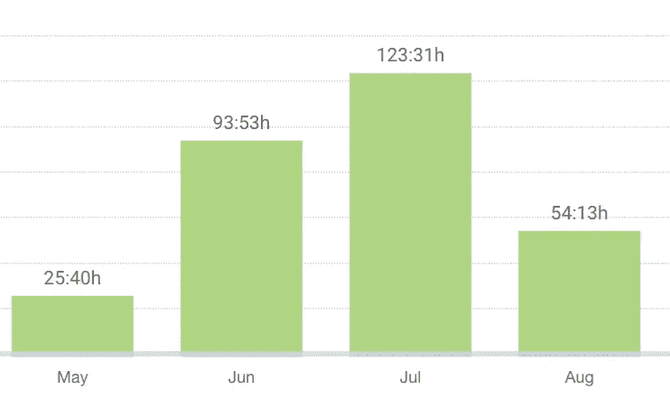
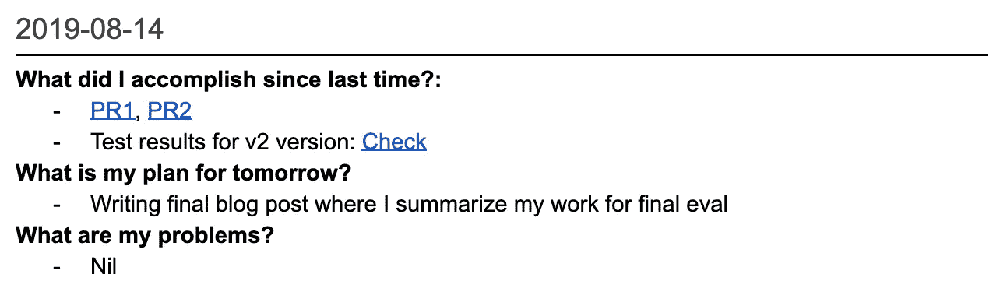

# 我从谷歌代码之夏学到的 6 件有用的事情

> 原文：<https://levelup.gitconnected.com/6-useful-things-i-learned-from-gsoc-1738c7471a90>

## 使用 GSoC 进行开源编码

Google Summer of Code (GSoC)是一个全球性项目，旨在让更多的学生开发人员参与开源软件开发。学生们在学校放假期间与一个开源组织一起工作，进行为期 3 个月的编程项目。

2019 年夏天，我花时间为“谷歌的 API 客户端工具”组织编写代码。我很幸运被我的导师 Tim Burks 和 Noah Dietz(谷歌的软件工程师)选中参与这个项目。

## 我学到的东西

**Golang 和环境:**在 GSoC 之前，我没有用 Go 写过一行代码。起初，我有点怀疑，因为它感觉像 C，我从来没有用 C 做过任何严肃的编程，但在 5 周之后，我开始喜欢上了 Go，因为一切都非常顺利。

**gRPC:** 就像围棋一样，在 GSoC 之前我不知道 gRPC[是什么，也不知道它是否存在。我猜想，我们每天 90%以上的互联网交易都是基于休息的。gRPC 是一种替代方法。它是基于 HTTP/2 的 Stubby (Google 的内部 API 调用系统)的开源版本，因此比基于 HTTP/1 的典型 REST 方法有许多优势。然而，由于 gRPC 没有被广泛使用，文档可能会很少。](https://grpc.io/)

**协议缓冲区:**协议缓冲区是 Google 的语言中立、平台中立、可扩展的机制，用于序列化结构化数据——想想 JSON，但是更小、更快、更简单。再说一次:我不知道在 GSoC 之前有这样的机制存在。协议缓冲区与 gRPC 齐头并进。这么多人的目标是被谷歌录用，却对自己使用的内部技术毫无头绪，这不是很可笑吗？我想 RPC、协议缓冲区和 Go 是你在那里工作的头几个月要学习的基础知识。

**提高了我的编码和软件架构技能:** Ok **，**这可能是最重要的一个。尽管很难衡量进展，但我确实在连接不同组件和消除整体复杂性方面变得更好了。此外，多亏了 Noah，我更加清楚 if-else 语句之外发生了什么，因为他在代码评审期间非常坚持。

时间管理:在整个三个月的项目中，我从未真正感到有压力。蒂姆和诺亚总是超级冷静。我有足够的时间写我的硕士论文，做运动，和我的朋友在奥地利享受夏天。总的来说，我每周工作 23 小时。然而，撰写项目建议书(和了解技术)的时间不包括在内。我估计每周会增加 20 小时，持续四周。

GSoC 每月花费的小时数

**特使基础知识:**在创建一个关于如何用 HTTP 代码转换和特使设置 gRPC API 的端到端[教程](https://github.com/googleapis/gnostic-grpc/tree/master/examples/end-to-end)时，我学习了[特使](https://www.envoyproxy.io/)的基础知识。它最初是由 Lyft 构建的，是一个高性能的开源服务代理，旨在与微服务一起工作。

## 挑战

我认为最困难的挑战是进入这种“自我管理状态”,在这种状态下，你对所使用的技术有足够的了解，可以提出新的任务和想法来改进项目。

有几天我开始工作，就像这样:‘好吧，我不完全确定今天要做什么。’我认为处理这种情况的最好方法是开始调查你的项目的相关方面:我开始浏览相关的 GitHub 页面，浏览我的代码并思考哪些地方可以改进，从我的导师那里查看 Twitter/GitHub，并阅读项目中使用的技术及其概念。在某个时候，你意识到你的下一个任务应该是什么，并开始实施它们。

我从来没有真正想过问我的导师:‘下一步我该做什么？’因为在我看来，一个相当不错的软件工程师会自己完成任务。然而，来自我的导师们的每一点信息对这个项目来说都是至关重要的，并且大大提高了整体质量。我们主要通过谷歌文档交流，在那里我列出了我每天的成就、明天的任务和当前的问题:

这种方法非常类似于敏捷方法的每日例会。每当蒂姆或诺亚想要增加额外的投入时，他们就会写下评论。对于 GSoC 这样的远程项目，我绝对可以推荐这种方法。

## 项目的概念

该项目的主要思想是将一个 [OpenAPI 描述](https://swagger.io/docs/specification/about/)转换成一个 [gRPC 服务](https://grpc.io/docs/guides/concepts/)的描述，该服务可以使用 [gRPC-JSON 代码转换](https://github.com/googleapis/googleapis/blob/master/google/api/http.proto)来实现该 API。

它的工作方式如下:

1.  gnostic 将一个 OpenAPI 描述(bookstore.yaml)转换成一个等价的协议缓冲区表示(bookstore.pb)。
2.  gnostic 的[表面模型](https://github.com/googleapis/gnostic/tree/master/surface)然后将协议缓冲区表示转换成插件友好的数据结构。
3.  [gnostic-grpc](http://www.github.com/googleapis/gnostic-grpc)(gnostic 的一个插件)将数据结构转换成一个[file descriptor set](https://godoc.org/github.com/golang/protobuf/protoc-gen-go/descriptor#FileDescriptorSet)(book store . descr)。FileDescriptorSet 描述了协议缓冲区定义文件(bookstore.proto)的消息和方法。
4.  为了从 FileDescriptorSet 生成最终的协议缓冲区定义文件(bookstore.proto ),使用了 jhump 的 [protoreflect](https://github.com/jhump/protoreflect) 库。

## 密码

这个项目的主要工作是 gnostic-grpc 知识库。最初的实现是在我的 GitHub 页面上的一个公共[库](https://github.com/LorenzHW/gnostic-grpc-deprecated)中完成的，直到我们将代码转移到官方的 [googleapis](http://github.com/googleapis) 组织。

用于增强表面模型的 [gnostic](http://www.github.com/googleapis/gnostic) 库的拉请求列表按时间顺序列出:

*   PR-115 (已合并)
*   PR-128 (已合并)
*   PR-130 (已合并)
*   [PR-135](https://github.com/googleapis/gnostic/pull/135) (关闭赞成 136)
*   PR-136 (已合并)
*   PR-137 (已合并)
*   [PR-145](https://github.com/googleapis/gnostic/pull/145) (合并)

对 [gnostic-go-generator](https://github.com/googleapis/gnostic-go-generator) 库的拉请求:

*   [PR-14](https://github.com/googleapis/gnostic-go-generator/pull/14) (合并)

此外，我写了一篇关于如何用 envoy 和 OpenAPI 建立 gRPC 服务的[博文](https://medium.com/@lorenzhofmann.w)。

## 最后一个音符

最后，我要感谢我的导师们。在这个项目上与你们一起工作很有趣，我很高兴 Tim 将在温哥华的[研讨会](https://sched.co/T6u9)上展示我们在 [ASC-2019 大会](https://events.linuxfoundation.org/events/asc-2019/)上的工作,“用 gRPC 实现 OpenAPI 和 GraphQL 服务”。

请随意向 gnostic-grpc 投稿。